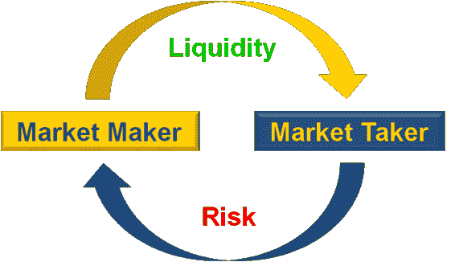
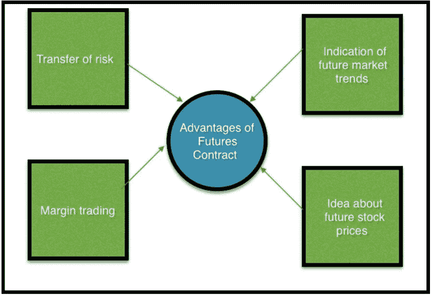
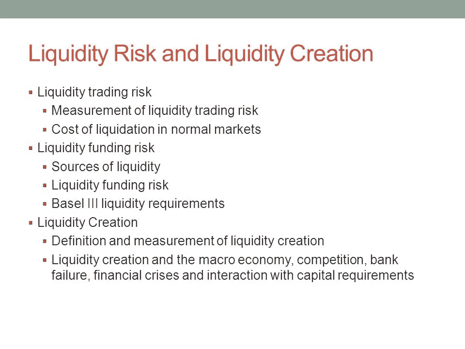

# 流动性的概念:加密货币交易所首席执行官的解释

> 原文：<https://medium.com/hackernoon/the-concept-of-liquidity-explained-by-the-ceo-of-a-cryptocurrency-exchange-2e0052b24d9d>

Source: Hackernoon

任何交易交易所最重要的特征就是流动性。没有流动性，经营一家成功的交易所就变得不可行。对于市场动荡的加密货币交易所来说尤其如此，这些交易所的交易员希望快速套现(清算)他们的头寸。

> 当新的代币出现在加密交易所时，它们通常交易量很小，这导致供需困难，从而降低了流动性。

我采访了 Digitex 期货公司首席执行官亚当·托德，了解为什么流动性如此重要，以及他即将成立的免佣金期货交易所计划如何确保交易者的流动性。

# **期货交易:快照**

Source: EduCBA

期货交易从古代[开始就存在了，可以追溯到公元前 1750 年左右。人们记录交易的方式(在泥板上)看起来和今天有些不同，但概念还是一样的。期货合同是双方在合同中规定的未来价格和日期购买或出售资产的协议。](https://en.wikipedia.org/wiki/Futures_exchange)

> 追溯到我们的祖先，你可以认为期货合约是一种美索不达米亚的“欠条”。

今天，期货交易允许交易者在特别不稳定的市场中航行，这就是为什么期货交易非常适合加密。

“期货基本上是一个解决波动性的概念，”托德解释道。

> “想想石油市场。每桶石油的价格在任何一个月都会有很大的波动。去年，油价跌至每桶 40 美元左右，今年飙升至 70 美元左右。

但对于航空公司等经常需要大量石油的公司来说，为了抵消波动性，它们会以固定价格签订期货协议。"

他继续说，“这让发行者安心地接受他的绝对最低交易价格，即使市场价值下跌，它也保护买方免受价格上涨的影响。

显然，任何期货交易所都有赢家和输家。如果你签订了一份协议，以 50 美元的固定价格出售 10，000 桶石油，而合同到期时的实际市场价格是 70 美元，那么航空公司将会胜出。

> 但是它也可以很容易地向相反的方向发展。

想想加密的未来。谁会想到比特币会在 2017 年 12 月创下近 2 万美元的历史新高，然后在今年回落到四分之一？

也许是期货交易员。如果他这样做了，即使在熊市，他现在也能赚很多钱。"

# **为什么流动性对交易所如此重要？**

Source: Donal McKillop

交易者越多，交易量就越大，交易量越大，流动性就越强。

> 如果一个交易所因为任何原因(缺乏信任、交易者信心、安全漏洞)变得缺乏流动性，它通常会很快倒闭。

这就是为什么所有交易所都必须努力确保任何时候都有充足的流动性。尤其是在有可能获得极高利润的期货交易中。

虽然“期货”这个词会让我们不由自主地想到遥远的日期，但一些交易者使用短期的激进交易策略来获利。

这种被称为“刷单”的交易方法是托德(他自己以前是场内交易者)一直认为最适合他的模式。

期货交易者实际上可以通过价格的短期上涨赚取利润。然而，这种利润往往因为佣金而被抹去。托德解释道:

“当我在 90 年代交易的时候，我快速的记录单个点的利润和损失，这样我就可以快速交易并获利。但是巨额的交易佣金对我的 PnL 产生了巨大的负面影响。有些日子，他们把盈利的日子变成亏损的日子，让我的刷单策略失效。

> 那时候，我梦想着零佣金，那时候，这真的只是梦想。"

# **零佣金将增加流动性**

根据托德的说法。免佣金交易的最大赢家将是像他一样使用激进交易策略、目标利润只有一个基点的交易者。

尽管各行各业的交易者都希望不必将一部分利润交给中央交易所。

“如果交易者知道他们可以使用刷单策略，并且不会被高额佣金打击，他们自然会涌向 Digitex 交易所，”托德自信地说。"这将创造一个高度流动的交易所."

# **一键交易**

除了零交易费，Digitex 还做了什么来保证流动性？“在期货交易中，速度就是一切，”托德说，“这就是为什么我们分配大量 ICO 资源来确保交易界面尽可能先进、易用、快速和强大。”

它有一个一键式阶梯交易界面，允许交易者进行接近实时的交易，而不是经历几个步骤或多次鼠标点击，这可能会导致他们的利润下降。

# **原生令牌**

Digitex 计划增加流动性的另一种方式是通过他们的本地 DGTX 令牌。当交易者对比特币、莱特币和以太坊期货的价格进行投机时，他们必须购买 DGTX 才能实现订单。

这为 DGTX 创造了持续的需求，并确保了流动性。这也是你可以在 Digitex Futures [白皮书](https://www.digitexfutures.com/whitepaper/Digitex-Whitepaper.v.1.1.pdf)中读到的商业模式，允许他们从交易中去除佣金。

# **自动做市商**

Digitex 还将利用自动做市商来增加流动性。这些基本上是带有编程算法的交易机器人，旨在实现盈亏平衡。来自 ICO 的 2 亿个令牌被分配给交易机器人，由它们自行决定部署，即使是在波动性很高的时候。

# **流动性是关键**

“交易所希望通过多种方式增加流动性，通常是通过提供丰富的合约类型选择或高级用户界面，”托德解释说，“Digitex 取消佣金，增加一键式交易功能和自动化做市商，这些都是为我们的客户和账户持有人提供高水平流动性的创新方式。”

> 流动性是一个成功的期货交易所最重要的组成部分之一。“没有一个流动的交易环境，”托德说，“一个交易所将无法在这个高度竞争的行业中生存。”