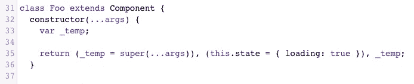

# 构造者已死，构造者万岁！

> 原文：<https://medium.com/hackernoon/the-constructor-is-dead-long-live-the-constructor-c10871bea599>

## 告别 React 组件中的中世纪类构造函数。


Photo by [Samuel Zeller](https://unsplash.com/photos/VLioQ2c-VwE?utm_source=unsplash&utm_medium=referral&utm_content=creditCopyText) on [Unsplash](https://unsplash.com/?utm_source=unsplash&utm_medium=referral&utm_content=creditCopyText)

虽然无状态功能组件(sfc)是您的武器库中的一个便利工具，但是 [ES6](https://hackernoon.com/tagged/es6) 类组件仍然是编写利用状态或生命周期挂钩的 React 组件的事实上的方法。

一个假设的 ES6 类组件可能看起来像这样(当然，没有错误检查，过于简化)。

```
class Foo extends Component {
  constructor(props) {
    super(props); 
    this.state = { loading: true };
  } async componentDidMount() {
    const data = await loadStuff();
    this.setState({ loading: false, data });
  } render() {
    const { loading, data } = this.state;
    return (
      {loading ? <Loading /> : <View {...data} />}
    );
  }
}
```

我们在`constructor`中初始化我们的`state`，在`componentDidMount`中异步加载我们的数据，并基于`loading`状态呈现我们的`View`组件。一个非常标准的模式——至少对我来说是这样，如果你一直关注我的工作的话。

# 类别属性

我们都知道`constructor`是我们初始化实例属性的地方，在本例中是`state`。如果你对自己说，“没错！”，那么你将是绝对正确的…如果不是因为即将到来的 ES.next [类属性提案](https://github.com/tc39/proposal-class-fields)，目前处于第 3 阶段。

有了它，我们现在可以直接定义类属性，就像这样。

```
class Foo extends Component {
  state = { loading: true };
  ...
}
```

[Babel](https://hackernoon.com/tagged/babel) 会把你的代码转存过来，在幕后给你加一个`constructor`。这是我们编译上面的代码片段时 Babel 的输出。



注意，Babel 实际上传递了所有的参数——不仅仅是`props`——直到`super`。它还接受`super`的返回值并将其传递回调用者。这两者可能都有点矫枉过正，但这正是它应该做的。

> 构造函数还是有的，只是你没看到而已。

# 绑定方法

我们被教导使用`constructor`的另一个原因是为了将方法绑定到`this`，就像这样。

```
class Foo extends Component {
  constructor(props) {
    super(props); 
    this.myHandler = this.myHandler.bind(this);
  } myHandler() {
    // some code here that references this
  }
  ...
}
```

有些人通过给一个类属性分配一个函数表达式来忽略这一点，但这完全是另一回事。在我的其他 ES6 React 类文章 [**中阅读更多关于使用 ES6 React 类**](/@donavon/demystifying-memory-usage-using-es6-react-classes-d9d904bc4557) 揭秘内存使用的信息。

[](/@donavon/demystifying-memory-usage-using-es6-react-classes-d9d904bc4557) [## 使用 ES6 React 类揭示内存使用

### 哪个效率更高？在构造函数中绑定，还是使用箭头函数作为类属性？

medium.com](/@donavon/demystifying-memory-usage-using-es6-react-classes-d9d904bc4557) 

让我们暂时假设你属于`bind`阵营(即使你不是，请原谅我)。我们需要绑定`constructor`，对吗？不一定。我们可以对上面的类属性做同样的事情。

```
class Foo extends Component {
  myHandler = this.myHandler.bind(this); myHandler() {
    // some code here that references this
  }
  ...
}
```

# 用道具初始化状态

当你需要从`props`中得到你的初始`state`时，比如说初始化一个默认值，该怎么办？我们肯定需要`constructor`来做这件事吧？

```
class Foo extends Component {
  constructor(props) {
    super(props); 
    this.state = {
      color: this.props.initialColor
    };
  } render() {
    const { color } = this.state;
    return (
      <div>
       {color}
      </div>
    );
  }
}
```

没有。再次，阶级属性来拯救！我们可以访问`this`和`props`。

```
class Foo extends Component {
  state = {
    color: this.props.initialColor
  };
  ...
}
```

# 数据提取

也许我们需要一个`constructor`来获取数据？几乎没有。正如我们在第一个代码示例中看到的，任何数据加载都应该在`componentDidMount`中完成。但是为什么是`componentDidMount`？我们这样做是为了在服务器上运行组件时不执行获取操作——就像在进行服务器端渲染(SSR)时一样——因为`componentDidMount`不是*在服务器端执行的。*

# 结论

我们已经看到，为了设置我们的初始`state`，我们不再需要一个`constructor`(或者任何其他实例属性)。我们也不需要它来绑定方法到`this`。从`props`开始设置初始`state`也是如此。我们绝对不会在`constructor`中获取数据。

那么为什么我们需要 React 组件中的`constructor`?

嗯……你不知道。

*【然而，如果你发现一些模糊的用例，你需要在客户端和服务器端的组件中初始化一些东西，你仍然有一个 out。总有* `*componentWillMount*` *。在内部，React 在客户端和服务器端“新建”类(调用* `*constructor*` *)之后立即调用这个钩子。】*

所以我认为对于 React 组件:构造函数死了，构造函数万岁！

# 进一步阅读

嗯，不是阅读，但是 [Kent C. Dodds](https://medium.com/u/db72389e89d8?source=post_page-----c10871bea599--------------------------------) 有一个关于类属性的[不错的视频教程](https://egghead.io/lessons/egghead-use-class-components-with-react)，你可能想读，嗯…看。

你也可以在 AmericanExpress.io 技术博客上阅读一堆基于 React 的文章(包括 React 16.7 中的一些关于钩子的文章，{…❤️}传播爱，以及 React 最佳实践)。

*我也为美国运通工程博客写稿。在*[*American express . io*](http://americanexpress.io/)*查看我的其他作品和我才华横溢的同事的作品。也可以* [*在 Twitter 上关注我*](https://twitter.com/donavon) *。*