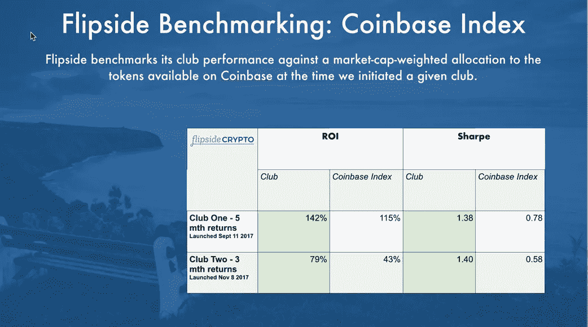

# 加密出版的难题

> 原文：<https://medium.com/hackernoon/the-conundrum-of-crypto-press-e4bd4db61de7>

几周前，我的一个朋友决定向一项公益事业捐赠比特币。他的善举最终获得了国际电视报道。

就这样，他的痛苦开始了。

首先，他的 iphone 开始变得奇怪。一系列令人困惑的通知，随后完全无法使用手机。黑客显然“移植”了他的设备。

然后是电子邮件:来自他众多 Gmail 账户的更改密码的请求。新的登录 IP 通知。他的比特币基地和 Bittrex 账户的双重认证确认。

在与时间的赛跑中，他迅速更改了所有的密码，并尽可能多地移动了他的密码。他 36 个小时没睡觉。

就在他认为自己已经挫败了攻击的时候，他收到了一封电子邮件——*，发自他自己的一个电子邮件地址*:

> “我们在你的谷歌硬盘里，可以看到你的电子表格和你的加密内容。给我们 50 BTC 或我们把它。”

欢迎来到密码世界。

Flipside Crypto 很高兴地宣布，它已经为其数据驱动的[加密货币](https://hackernoon.com/tagged/cryptocurrency)投资工具完成了一轮 340 万美元的风险投资。

True Ventures 领投这一轮，参与方包括 Chernin Group、Resolute Ventures、Boston Seed、 [Converge](https://medium.com/u/5278255f3355?source=post_page-----e4bd4db61de7--------------------------------) 和 [Founder Collective](https://medium.com/u/f49435c6fa9?source=post_page-----e4bd4db61de7--------------------------------) 。

[Adam D ' aug elli](https://medium.com/u/a105843c5d0d?source=post_page-----e4bd4db61de7--------------------------------)——True 和 crypto 爱好者、专家和学者的合伙人——将加入 Flipside Crypto 的董事会。

此外，一些额外的消息:经过 5 个月的投资，Flipside Crypto's Club One 的表现大大超过了比特币基地指数——比特币(BTC)、以太坊(ETH)、莱特币(LTC)和比特币现金(BCH)的市值加权配置——回报率为 141%，而比特币基地控股的回报率为 115%。

Flipside Crypto’s ROI and Sharpe vs. Coinbase Index

所有这些都是新闻。新闻意味着潜在的压力。媒体报道意味着你的业务的曝光和增长。

在加密的世界里——在早期——这也意味着风险增加。失去匿名的风险。盗窃风险。

这是一个进退两难的困境:迫切需要宝贵的曝光率…或者不迫切需要更多的保护。

我的简单看法是:对黑客攻击的恐惧不应该阻止你建立自己的事业。

是的，[尽你所能保护你的资产](http://avc.com/2017/06/getting-hacked-lessons-learned/)。不要偷工减料。不要马虎。

然后一切都正常了。是时候放出消息了。

# **Flipside Crypto 获得了来自 True Ventures、Chernin Group 和 Resolute 的 340 万美元风险投资**

**Flipside Crypto 的投资俱乐部大大超过比特币基地指数，该指数包括比特币和以太坊**

**马萨诸塞州波士顿——2018 年 3 月 28 日** — [Flipside Crypto](http://flipsidecrypto.com) 很高兴地宣布，它已经完成了一轮 340 万美元的风险投资，用于其数据驱动的加密货币投资工具。True Ventures 领投了这轮融资，参与方包括 Chernin Group、Resolute Ventures、Boston Seed Capital、Converge 和 Founder Collective。True Ventures 的合伙人 Adam D'Augelli 将加入 Flipside Crypto 的董事会。

Flipside Crypto 将利用这笔资金继续开发和完善其算法，该算法分析投机、开发者行为和加密货币的令牌效用。此外，这笔资金将用于进一步开发 Flipside Crypto 的加密货币管理服务套件，包括加密货币收购、数字墙和托管服务。

Flipside Crypto 首席执行官戴夫·巴尔特(Dave Balter)表示:“这轮融资将建立在我们前 6 个投资工具的巨大成果之上。“我们已经证明，我们的算法可以带来可观的投资回报，同时简化俱乐部成员购买一篮子加密货币的流程。”

在此轮融资之前，Flipside Crypto 推出了首批 6 个投资工具。这些工具于 2017 年推出，利用 Flipside 的算法来分析流动性加密货币市场，并确定 14 至 16 种加密货币的多元化篮子，包括比特币和以太坊，以及一些 altcoins 俱乐部成员可以投资的货币。

在头五个月，Flipside Crypto 的霍尔马克投资俱乐部“Club One”的表现大大超过了比特币基地指数——该指数考虑了比特币基地可用的加密货币的市值加权配置，包括比特币、以太币、莱特币和比特币现金——回报率为 141%，而比特币基地控股的回报率为 115%。纯比特币投资本可以产生 92%的回报。Flipside Crypto 于 2017 年 11 月推出的“Club Two”已经实现了 79%的回报率，而比特币基地指数的回报率为 43%，比特币的回报率为 11%——仅在成立三个月后。

“我们很高兴再次与戴夫、吉姆(迈尔斯)和埃里克(斯通)在 Flipside Crypto 上合作，”True Ventures 的合伙人亚当·德奥格利(Adam D'Augelli)说。“他们是久经考验的企业家，已经建立了行业领先的算法来分析加密货币的价值。虽然这个领域还为时过早，但我们认为 Flipside 可能会改变加密基础设施的建设和融资方式。”

Flipside Crypto 目前正在接受合格投资者对其最新投资工具的投资。

**关于 Flipside 加密**

Flipside Crypto 于 2017 年年中推出，通过开发专有数据模型来评估流动加密资产，并提供一系列与加密货币相关的投资组合。该公司为加密货币提供从算法开发到收购、数字墙和托管流程的全套服务，以及面向投资者的社区工具和投资组合仪表板。

**Flipside Crypto 的投资工具**

Flipside Crypto 的投资工具提供了一种加密货币投资的投资组合方法，为投资者提供多样化的加密货币投资组合。持有量通过专有算法来确定，这些算法评估每种加密货币的投机、开发者活动和效用。Flipside Crypto 已经完成了 6 个被动投资产品，为投资者提供了一套基于其算法的多样化加密货币。该公司将在 2018 年推出更多投资组合产品。

**关于真创投**

True Ventures 成立于 2005 年，是一家总部位于硅谷的风险投资公司，投资于早期技术初创公司。True 管理着超过 14 亿美元的资金，为当今增长最快的市场中最有才华的企业家提供种子资金和首轮融资。该公司维持一个强大的社区，支持创始人和他们的团队，帮助真正的公司实现更高水平的成功和影响。迄今为止，True 已经帮助 250 多家公司开展业务并扩大规模，在全球创造了 10，000 多个工作岗位。要了解更多信息，请访问 [True Ventures](http://www.trueventures.com) 。