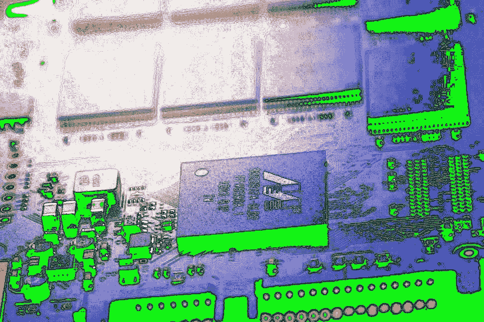

# 区块链、人工智能和大数据分析的融合

> 原文：<https://medium.com/hackernoon/the-convergence-of-blockchain-ai-and-big-data-analytics-52fdb537ea86>

> 由《编年史》(2015 年至今)的联合创始人萨姆·拉多奇亚(Sam Radocchia)撰写。[原载](https://www.quora.com/Are-strict-regulations-a-barrier-to-technology-innovation-Cant-progress-and-innovation-in-technology-and-framing-good-regulations-go-hand-in-hand/answer/Sam-Radocchia)于 [Quora](http://quora.com/?ref=hackernoon) 。

为了保证消费者的安全和公司的责任，行业法规是必要的，但遵守这些法规的成本通常非常高。

随着企业试图将产品送到消费者手中，运营效率低下的现象越来越多。

为了解决这一问题，以合规为重点的监管技术正在兴起。德勤甚至[编制了一份名单](https://www2.deloitte.com/lu/en/pages/technology/articles/regtech-companies-compliance.html)列出了准备颠覆监管格局的新“RegTech”公司。

> 那么，区块链在其中扮演什么角色呢？

到处都是。

区块链、人工智能和大数据分析的融合为管理合规成本和降低运营风险的更强大和创新的解决方案打开了大门。

为什么是现在？

## 因为消费者要求更多的透明度。

当有更好、更快的解决方案可用时，企业不希望以随意的方式花费时间和金钱来遵守法规。

*这就是这些解决方案的样子，以及总部位于区块链的 RegTech 将如何影响企业和消费者。*

# **食品和饮料**

食品和饮料行业的一个主要问题是能够追踪食品的来源。

当李斯特菌或大肠杆菌爆发时，人们急于追踪细菌的源头，以防止更多的人摄入受污染的食物。

区块链和物联网设备可以为大公司提供一种从田间到杂货店跟踪农产品的独特方式。如果垃圾箱使用物联网设备在区块链上注册，那么收获并放入垃圾箱的莴苣头就可以被跟踪。从那里，农产品移动到一个设施，在那里进行加工和包装——这些事件也可以被登记和跟踪。

一旦到达消费者手中，就会有一个可验证的监管链，可以一直追溯到源头。

如果出现问题，可以利用跟踪数据更快地进行干预。

# **药品**

制药行业是我们的团队取得最大成功的领域。

在美国，有一项法规叫做 DSCSA。在欧盟，有伪造药品指令。这两项法规都要求所有药品都有唯一的序列号标识，以防止假冒，并提高供应链的透明度。

为了满足这些规定，[我们提出了一个基于区块链的互操作解决方案](http://mediledger.com/),称为 MediLedger 项目。它使制药公司能够轻松地在区块链上注册唯一的序列号，并在药品通过供应链时对其进行跟踪。

# **化妆品和个人护理品**

化妆品行业尚未受到严格监管，但实施监管的压力越来越大。

参议员黛安娜·范斯坦(CA)和苏珊·科林斯(ME)最近提出了一项法案，要求化妆品公司确保其产品的生产、测试、包装和运输是安全的。它赋予了食品和药物管理局对这个行业的权力，就像它对食品和药物的权力一样。

但是，不仅仅是来自政府的压力在推动更多的透明度，还有来自消费者的压力。人们要求他们使用的产品中含有高质量、安全的成分。

想一想:现在你厨房里有多少产品提到公平贸易、无转基因、有机认证？你知道他们中有多少人真的是他们所声称的那样吗？

人们喜欢相信这些公司是诚实的，但他们更喜欢了解它。任何没有受到严格监管的行业都受到了抨击。

像 [BetterKinds](http://betterkinds.com/) 这样的公司正在利用区块链，通过授权人们做出更好的微观决定，从而带来更好的宏观结果，来促进有意识消费和负责任生产的日常实践。

# **贵金属和冲突矿物**

你可能听说过“血钻”

但是大量的其他矿物和金属在冲突地区被开采出来——然后被出售以加剧冲突和苦难。

令人惊讶的是，美国证券交易委员会要求公司报告他们是否使用冲突矿物。但是政府并没有因此而停止他们的业务。

另一方面，许多不使用冲突矿物或金属的公司会很乐意通过跟踪和追踪它们的生产来证明它们的真实性。这一过程很容易实施与区块链为基础的供应链系统，如我们建立在编年史。

从生菜到化妆品，RegTech 的新时代为公司提供了一种遵守法律、削减成本和最大限度地降低运营效率的无缝方式。

多亏了区块链，我们很快就会拥有更安全的产品、更透明的供应链和更顺畅的合规性。

> 由《编年史》(2015 年至今)的联合创始人萨姆·拉多奇亚(Sam Radocchia)撰写。[原载](https://www.quora.com/Are-strict-regulations-a-barrier-to-technology-innovation-Cant-progress-and-innovation-in-technology-and-framing-good-regulations-go-hand-in-hand/answer/Sam-Radocchia)于 [Quora](http://quora.com/?ref=hackernoon) 。
> 
> 更多来自 Quora 的趋势科技答案，请访问[HackerNoon.com/quora](https://hackernoon.com/quora/home)。