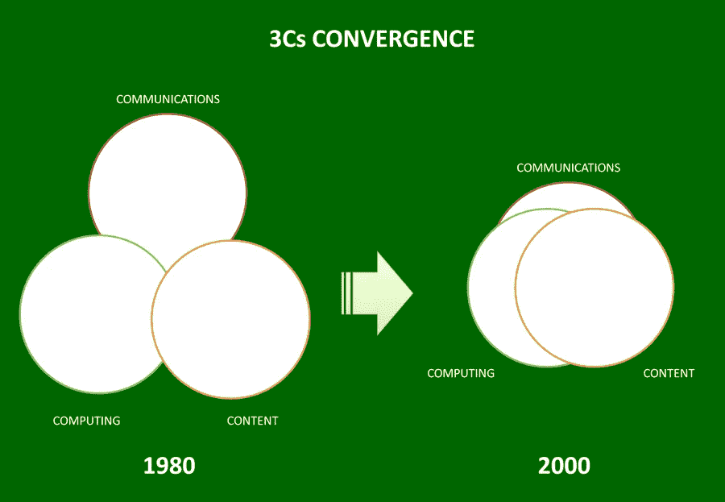
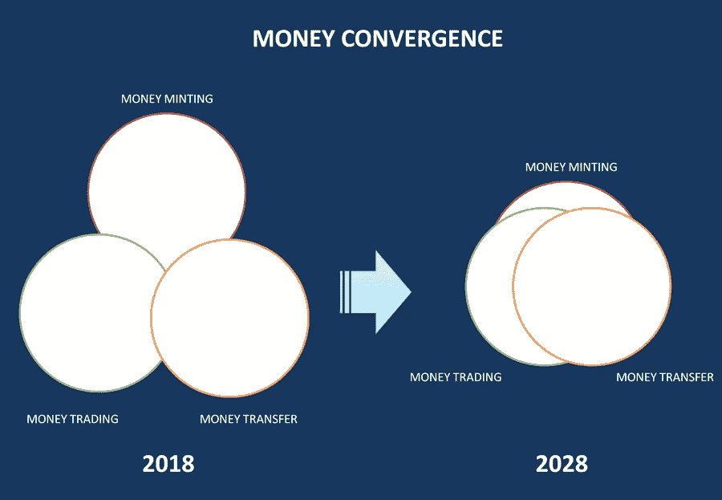

# 货币的趋同

> 原文：<https://medium.com/hackernoon/the-convergence-of-money-b22e6a1b422c>

远在 youtube、skype、twitter、博客和云计算之前。麻省理工学院(MIT)媒体实验室主任尼古拉斯·内格罗蓬特(Nicolas Negroponte)绘制了以下图表来代表计算、电信和内容行业的融合。

在八十年代后期，如果你想打电话，你必须使用固定电话或移动电话。要看视频，你需要一个视频播放器。要听音乐，你需要一个音乐播放器。要阅读报纸，你必须买一份实体报纸，要运行软件，你必须把它安装在你的电脑上。

现在显而易见的是，互联网协议使这三个行业有可能使用同一种语言。我们现在可以在互联网上打电话、看视频、听音乐、看报纸和使用软件。

融合改变了我们消费和生产这些服务的方式。视频、音乐、新闻和观点的制作变得分散化。任何人都可以在 youtube 上创作视频，在 spotify 上创作音乐，或者发表博客。

我们正处在一个新的融合的开端。“货币”创造、交易和转移的结合。T2 区块链 T3 是使这种融合成为可能的技术转变。

copyright 2018 — [www.tokenchanger.io](http://www.tokenchanger.io)

在继续之前，让我们了解一下这种融合的规模。货币创造(稳定代币)的总市场是世界上所有的货币——[、90 万亿美元](http://money.visualcapitalist.com/worlds-money-markets-one-visualization-2017)。即期外汇交易的日交易量为[1.6 万亿美元](https://en.wikipedia.org/wiki/Foreign_exchange_market)。2016 年，全球汇款价值 5750 亿美元。

已经有一个混杂的服务网预示着将要发生的事情。有 Tether 和 TrueUsd，提供银行美元支持的区块链货币。有以太三角洲和公牛队提供基于区块链的交易系统。

融合的基本条件是，货币创造、交易和转移必须是最终用户的无缝体验。这意味着这三种活动必须发生在同一个区块链上。

[Bitshares](https://bitshares.org/) 目前提供了可能的最佳融合条件。凭借其石墨烯区块链、智能硬币和分散式资产交换。像 bitspark 这样的初创公司正在增加转移组件。

使用稳定的代币(美元、欧元、日元等)进行[加密货币](https://hackernoon.com/tagged/cryptocurrency)交易将有助于融合。区块链以太坊拥有流通中数量最多的加密货币代币。

这就是为什么[代币兑换商](https://www.tokenchanger.io)押注以太坊区块链将首次大规模实现融合。令牌交换者使用以太坊作为其主要区块链。

在代币兑换平台上，任何人都可以[创造与法定货币挂钩的稳定代币](https://goo.gl/8Bxdxw)。该平台为交易代币(包括稳定代币)提供了一个点击界面。对于转账，平台为持牌金融机构实施 DApps(去中心化金融应用)。这些 DApps 用于将价值移入和移出区块链。

对最终用户来说，创造、交易和转移资金的整个过程是无缝的。在生产端，稳定令牌的铸造是分散的。