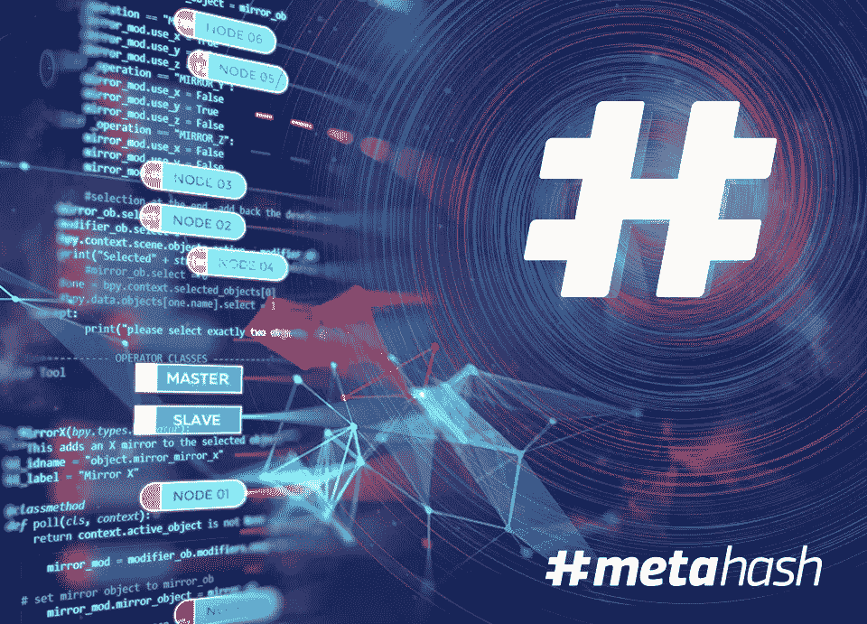

# #MetaHash 的核心

> 原文：<https://medium.com/hackernoon/the-core-of-the-metahash-673348b8031e>

节点。你以前在我们的文章、我们的网站，当然还有白皮书中见过这个词，是吗？也许你已经知道一些关于他们在# [MetaHash](https://metahash.org/?utm_source=med_eng) 项目中的角色和功能，但是今天我们想告诉你更多关于# [MetaHash](https://metahash.org/?utm_source=med_eng) 节点的具体类型，关于项目的核心。

那么，什么是“节点”呢？节点是在区块链网络上工作的计算机。每个节点都保存着提供系统工作的信息。正如你已经知道的，对于# [MetaHash](https://metahash.org/?utm_source=med_eng) 来说，存储和处理大量不同的信息是必要的。一切都必须清晰、系统、结构严谨地工作。因此，唯一、快速和安全的分散块链环境正确工作的条件是创建自动分担节点责任并确定其角色的系统。这是我们的#TraceChain AI。当一个新节点连接到网络时，系统分析和测试它的性能，并且作为这个过程的结果，它为该节点设置某种信任级别。最快最可靠的节点成为网络的核心——主节点&从节点。它们的功能非常重要:验证和同步每一个事务。从核心节点检查主节点的工作质量，并根据验证节点之间的信号分配减少主节点的工作量。如果主节点错误地处理事务，任何从节点都可以成为主节点并开始执行相应的功能。

为了提供网络的去中心化，每个进程必须被调试，每个节点必须正确地工作，并且必须确认其信任级别，并且每个节点所有者必须从#MetaHash 网络中的工作中获得适当的反馈。这就是有限数量的具有高处理能力的计算机(主&从核心节点)获得最大回报的原因。

我们邀请您加入该项目，该项目独立提供所有服务的可靠性和安全性！我们邀请您加入# [MetaHash](https://metahash.org/?utm_source=med_eng) ！

加入我们项目的讨论:
[我们的网站](https://metahash.org/?utm_source=med_eng) [电报](https://t.me/metahash_ENG?utm_source=med_eng) [推特](https://twitter.com/themetahash?utm_source=med_eng)