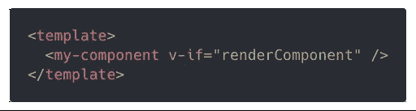
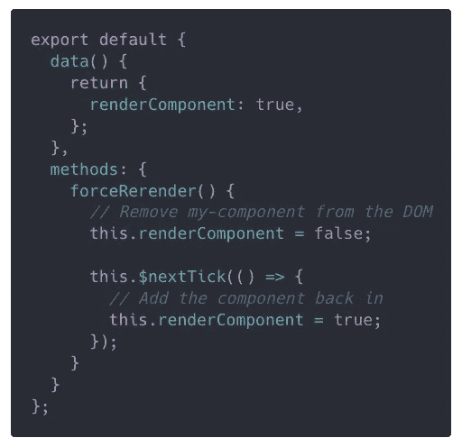
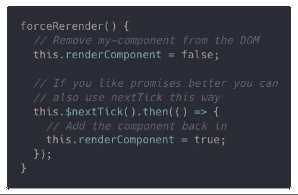
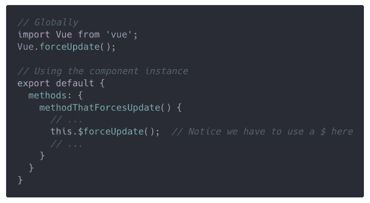
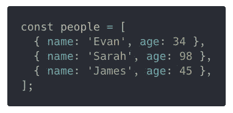
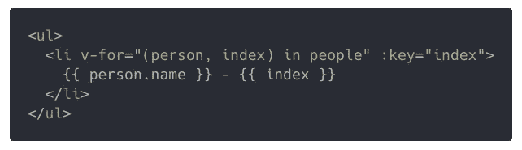
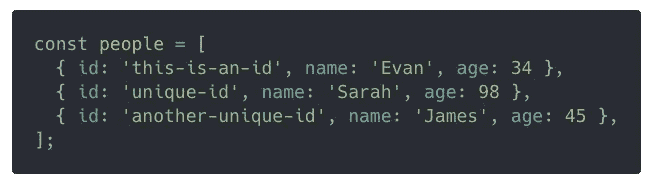
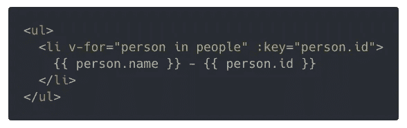
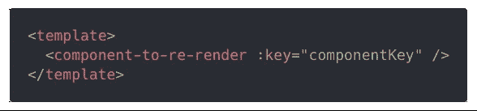
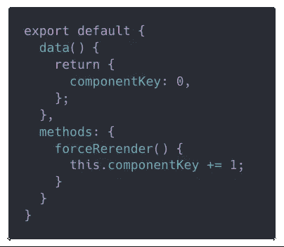

# 强制 Vue 重新渲染组件的正确方法

> 原文：<https://medium.com/hackernoon/the-correct-way-to-force-vue-to-re-render-a-component-bde2caae34ad>


“body of water under white sky” by [Clément Gerbaud](https://unsplash.com/@clement_gerbaud?utm_source=medium&utm_medium=referral) on [Unsplash](https://unsplash.com?utm_source=medium&utm_medium=referral)

有时候 Vue 的反应系统不够用，你只需要重新渲染一个组件。

或者也许你只是想吹走当前的 [DOM](https://hackernoon.com/tagged/dom) 重新开始。

那么，如何让 Vue 以正确的方式重新渲染组件**？**

**强制 Vue 重新渲染组件的最好方法是在组件上设置一个** `**:key**` **。当你需要重新渲染组件时，你只需要改变键值，Vue 就会重新渲染组件。**

这是一个非常简单的解决方案，对吗？

你会很高兴地知道还有很多其他方法可以做到这一点:

*   恐怖的方式:**重装**整页
*   可怕的方式:使用 **v-if hack**
*   更好的方法是:使用 Vue 内置的 **forceUpdate** 方法
*   最好的方法:**在你的组件上换键**

除了这里我要毁了你。

如果你需要强制重新加载或者强制更新，可能有更好的方法。

很可能你误解了下面一件棘手的事情:

1.  Vue 的**反应性**
2.  计算道具
3.  观看道具(有时)
4.  没有将`:key`属性与`v-for`一起使用

现在，有*个*有效用例用于强制更新。这些问题中的大部分都将使用本文底部的密钥更改技术来解决。

# 可怕的方法:重新加载整个页面

这是一个相当于**每次想关闭一个 app** 都要重启电脑。


我想这有时会行得通，但这是一个相当糟糕的解决方案。

关于这一点真的没什么可说的了。不要这样做。

让我们寻找更好的方法。

# 可怕的方式:v-if 黑客

Vue 附带了`v-if` [指令](https://hackernoon.com/tagged/directive)，只有当它为真时才会渲染组件。如果为 false，组件将根本不存在于 DOM 中。

下面是我们如何设置`v-if`黑客工作。

在您的`template`中，您将添加`v-if`指令:



在您的`script`中，您将添加这个使用`nextTick`的方法:



事情是这样的:

1.  最初`renderComponent`被设置为`true`，因此`my-component`被渲染
2.  当我们调用`forceRerender`时，我们立即将`renderComponent`设置为`false`
3.  我们停止渲染`my-component`,因为`v-if`指令现在计算为`false`
4.  在下一个滴答`renderComponent`被设置回`true`
5.  现在`v-if`指令的计算结果是`true`，所以我们再次开始渲染`my-component`

要理解这是如何工作的，有两件事很重要。

首先，我们必须等到下一个滴答，否则我们将看不到任何变化。

在 Vue 中，一个 tick 是一个 DOM 更新周期。Vue 将收集同一节拍内的所有更新，在节拍结束时，它将根据这些更新更新呈现到 DOM 中的内容。如果我们不等到下一个滴答，我们对`renderComponent`的更新将会自动取消，什么都不会改变。

第二，当我们第二次渲染时，Vue 将创建一个全新的组件。Vue 会毁掉第一个，创造一个新的。这意味着我们的新`my-component`将正常地经历它的所有生命周期— `created`、`mounted`等等。

顺便说一下，如果你喜欢，你可以把 `*nextTick*` *和承诺一起使用:*



尽管如此，这并不是一个很好的解决方案。我称之为黑客，因为我们在围绕 Vue 希望我们做的事情进行黑客攻击。

所以，相反，**让我们做 Vue 想让我们做的事情**！

# 更好的方法是:您可以使用 forceUpdate

这是解决这个问题的两个最好的方法之一，两个都是 Vue 官方支持的**。**

通常，Vue 会通过更新视图来对依赖关系的变化做出反应。然而，当您调用`forceUpdate`时，您可以强制更新发生，即使没有任何依赖关系实际上已经改变。

这里是大多数人用这种方法犯**最大错误**的地方。


如果 Vue 在事情发生变化时自动更新，**为什么我们需要强制更新**？

原因是有时 Vue 的反应性系统会令人困惑，我们*认为*Vue 会对某个属性或变量的变化做出反应，但实际上并没有。也有某些情况下 [Vue 的反应系统根本检测不到任何变化](https://vuejs.org/v2/guide/list.html#Caveats)。

所以就像最后的方法一样，如果你需要这个来重新渲染你的组件，**可能有一个更好的方法**。

有两种不同的方法可以调用`forceUpdate`，在组件实例本身和全局上:



**重要提示**:这不会更新您拥有的任何计算属性。调用`forceUpdate`只会让[强制视图重新渲染](https://github.com/vuejs/vue/issues/7395#issuecomment-355721554)。

# 最好的方法:更换密钥

在许多情况下，您会有重新渲染组件的合理需求。

为了正确地做到这一点，我们将提供一个`key`属性，这样 Vue 就知道一个特定的组件被绑定到一个特定的数据上。如果键保持不变，它不会改变组件，但是如果键改变了，Vue 知道应该**去掉旧的组件，创建一个新的**。

正是我们需要的！


但是首先我们需要走一个很短的弯路来理解为什么我们在 Vue 中使用 T3。

# 为什么我们需要在 Vue 中使用 key？

一旦你理解了这一点，你就向理解如何以正确的方式强制重新渲染迈出了一小步。

假设您正在渲染具有以下一项或多项内容的组件列表:

*   这是自己的**地方州**
*   某种类型的**初始化过程**，通常在`created`或`mounted`钩子中
*   通过 jQuery 或普通 API 的非反应式 DOM 操作

如果您对列表进行排序，或者以任何其他方式更新它，您将需要重新呈现列表的一部分。但是你不会想要重新呈现列表中的所有内容，只呈现已经改变的内容。

为了帮助 Vue 跟踪什么已经改变，什么没有改变，我们提供了一个`key`属性。**使用数组的索引在这里没有帮助**，因为索引并不与我们列表中的特定对象相关联。

以下是我们的示例列表:



如果我们使用索引来呈现它，我们将得到这个:



它显示:

```
Evan - 0
Sarah - 1
James - 2
```

如果我们除掉莎拉，我们会得到:

```
Evan - 0
James - 1
```

与詹姆斯相关联的索引被改变，即使詹姆斯仍然是詹姆斯。詹姆斯将被重新渲染，即使我们不希望他这样。

所以在这里**我们想要使用某种唯一的 id** ，然而我们最终生成了它。



在我们从列表中删除 Sarah 之前，Vue 删除了 Sarah 和 James 的组件，然后为 James 创建了一个新组件。现在，Vue 知道它可以为 Evan 和 James 保留这两个组件，它所要做的就是删除 Sarah 的。

如果我们将一个人添加到列表中，它也知道它可以保留所有现有的组件，它只需要创建一个新的组件并将其插入正确的位置。这真的很有用，当我们有**更复杂的组件，它们有自己的状态，有初始化逻辑，或者做任何类型的 DOM 操作**时，这给了我们很大的帮助。

也许那段弯路并不短。但是有必要解释一下 Vue 中的按键是如何工作的。

不管怎样，让我们继续使用强制重新渲染的最佳方法吧！

# 更改键以强制重新呈现组件

最后，这里有一个**最好的方法**(在我看来)来强迫 Vue 重新渲染一个组件。

您采用这种将键分配给子组件的策略，但是每当您想要重新呈现组件时，您只需更新键。

下面是一个非常基本的方法:



每次调用`forceRerender`时，我们的属性`componentKey`都会改变。当这种情况发生时，Vue 将知道它必须销毁组件并创建一个新的组件。

您得到的是一个子组件，它将重新初始化自己并“重置”它的状态。

一个简单而优雅的方法来解决我们的问题！


请记住，如果你发现自己需要强迫 Vue 重新渲染一个组件，也许你做的不是最好的方法。

然而，如果你确实需要重新渲染某些东西，选择**键改变**方法而不是其他任何方法。

*我的文章一出来就在*[*michaelnthiessen.com*](http://michaelnthiessen.com)*看看吧！几个星期后，我把它们重新贴在这里。*

*原载于 michaelnthiessen.com*[](http://michaelnthiessen.com/force-re-render/)**。**