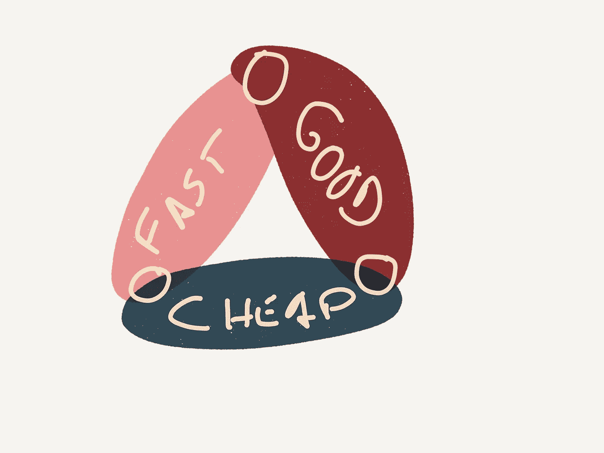
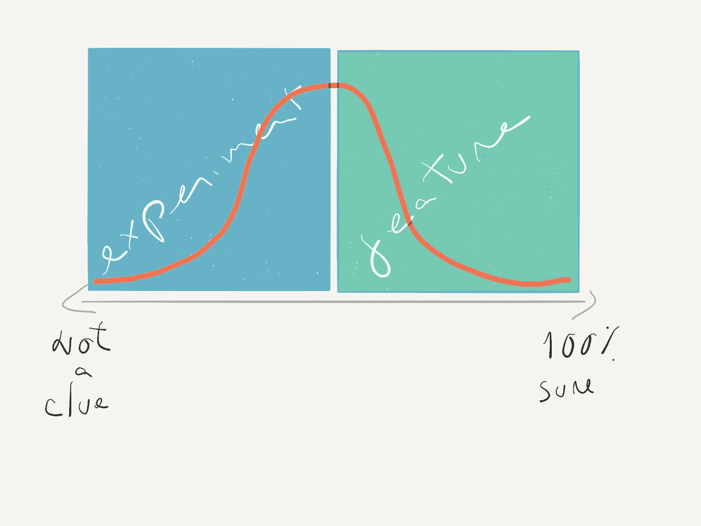
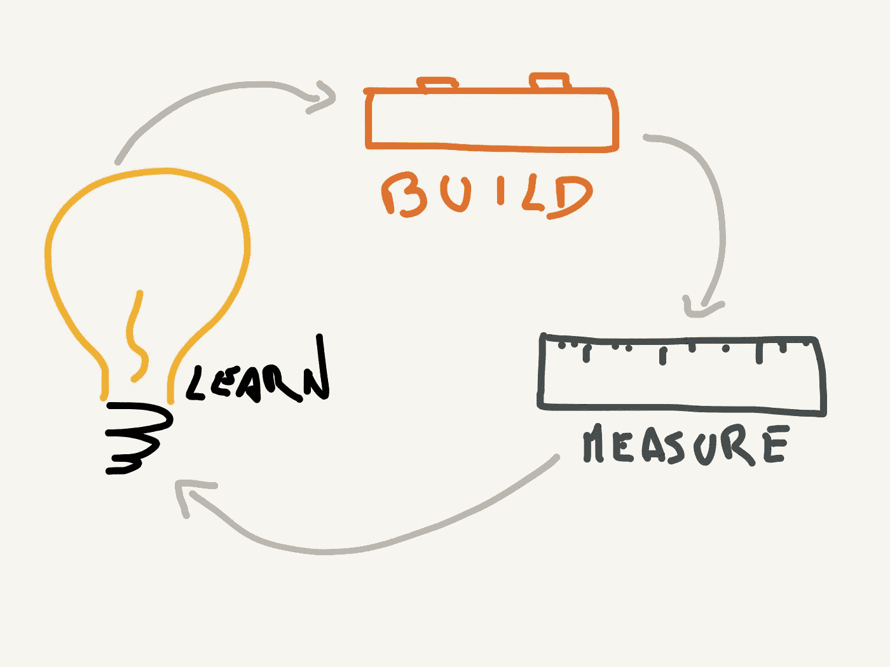
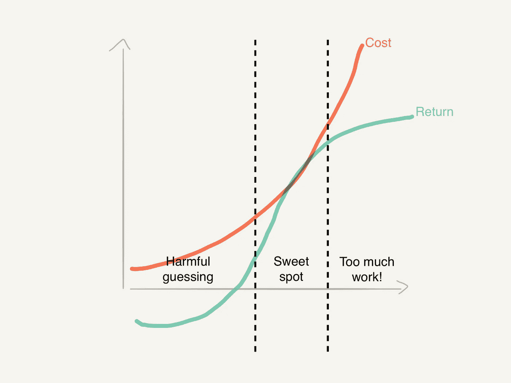

# 可预测性的成本——当我们总是迟到或出错时，运输伟大的产品。

> 原文：<https://medium.com/hackernoon/the-cost-of-predictability-why-youre-always-late-or-wrong-or-both-66fbe73aa6d7>

人类想把东西分门别类。那样生活会更轻松。在工作中，特别是对于软件组织，计划通常意味着把你的工作放在一个盒子里:它是项目工作流还是实验工作流？是工程还是产品？是日期驱动还是结果驱动？

有类别是很好的，因为它们让每个人都可以快速掌握一件给定作品的基本特征，而不必过于关注细节。系统 1 思维将会成功。例如，我们知道，要使某样东西成为一个特性，它需要一组要求。一个日期驱动的计划，需求加上截止日期。结果驱动的流通常是日期灵活的，但是假设一个静态的目标。

不管你如何分类，你都在减少问题的维度，让它看起来可以理解，可以实现，雄心勃勃但又现实。让我们看一些例子。

# 你必须做出选择！

项目管理三连胜/三重约束，以其独特的方式是错误的，在很长一段时间里为任何构建产品或服务的人提供了最佳的简化。它将交付归结为质量、成本和时间维度，并建立了一个三取二的规则:如果大幅增加成本是一个选项，你只能拥有又快又好。

There is never a way to intersect all 3, so you need to choose which dimension to trade-off. In this model you can choose the level of 2 of the dimensions, but the other will necessarily have to vary to make it happen.

有些人在此基础上增加了[范围](https://www.projectsmart.co.uk/understanding-the-project-management-triple-constraint.php)，使其成为四维空间。其他人仍然试图在时间、风险、成本、资源、质量和范围上掷骰子，掷出一个更复杂(因此不那么吸引人和受欢迎)的骰子。

无论你在函数中加入多少变量，迟早你都会把世界分成不同的类别，然后在它们之间建立严格的界限，而不是假设事物是连续存在的。用固定长度的时间盒来构建功能的季度路线图比不断地列出他们的变化成本、功能集、质量保证过程、营销分析和外部风险监控可能如何影响他们的交付更容易。

例如，一个常见的分裂是在特征和实验之间。如果一个任意的阈值*预期结果风险*被越过，组织将不再称之为实验，而开始称之为特性。在特性世界中，范围变成了一个很大程度上固定的应该被估计的维度，因为有一组功能性和非功能性需求来定义它。这反过来允许工程师估计其复杂性，然后允许经理使用一个他们可以衡量自己的时间界限。按时交付特性及其全部需求意味着成功。

In the real world, if we monitor our expected-outcomes against the results we produced, we’ll see more of a bell curve. 100% accuracy or inaccuracy in our predictions will be outliers.

相比之下，如果组织将这项工作视为一项实验，一种测试假设的方法，他们会将范围视为一个要最小化的变量，时间会“越快越好”，因此估计会保持在非常高的水平，只是精确到足以确定实验在给定预期 ROI 的情况下是否值得。

实验也将它视为变量:预期投资回报率。鉴于特性意味着需要来构建**，实验质疑这样做是否值得。他们使用最小可行产品和迭代的语言来评估因果关系，以便快速而有目的地了解客户。**

Build-Measure-Learn cycles were popularised by the Lean Startup as the way to achieve validated learning about customers.

有多种方法可以降低你决策的风险，做出更好的预测，将它们建立在从过去的现实或案例中提取的信息的基础上，[应用归纳理论从自下而上的观察中进行归纳](https://en.wikipedia.org/wiki/Inductive_reasoning)。

相比之下，自上而下的战略在高熵、低信息量的情况下，如互联网经济公司，仍然是假设演绎。我们设计一个理论，然后试图用观察来证明它。我们经常称之为策略或目标设定，但却无法使其变得可证伪，以至于一次负面的[事件就可能使其无效。](https://en.wikipedia.org/wiki/Falsifiability)

因为自上而下的策略通常是演绎的，并且理论被假定是正确的，高管们会要求团队在他们的估计中要精确。**如果一项战略行动的预期投资回报率被认为是一个低风险变量，那么自然重要的是团队能够多快、多可靠地执行其从属功能。**

当然，问题是情况往往并非如此。经典的创新者困境意味着良好的代理管理决策最终会导致公司的灭亡，因为它缺乏应对不断变化的市场环境的能力。领导者/现任者的创新速度被它的创业竞争对手超过了。这里的管理问题是，由于旨在解决不同类型问题的具体化/僵化的业务照常流程，公司没有组织和激励来应对最终将摧毁它们的**类型**的变化。

敏捷宣言的签署者当然很清楚这一点，像 Spotify、T2、亚马逊、T4、网飞和其他公司都在创建高才能、高度自治的小团队，他们可以大规模解决问题，即使他们不得不在内部与其他公司竞争。

但是这对传统组织中的团队意味着什么呢？这意味着团队将被激励去解决可预测性——他们能多快、多可靠地实现高管的愿景——而不是为了学习和发展以保持领先。

当然，陷阱在于，在动态环境中，完全的可预测性不仅是不可能的，而且成本高昂，还可能适得其反。假设是，可预测的回报遵循 S 曲线，而其成本呈指数增长。众所周知，人类也不擅长预测事物。

ROI Chart for estimates. Y axis is resources, X axis is degree of predictability. Complete guessing, while cheap, can be harmful: E.g. agreeing to a date then failing it, can cost an organisation a lot of money. The problem of course is that trying to be extremely precise predictable can be extremely costly and offer next to zero net benefits, given the opportunity costs it entails. You need to get it “just right”.

然后是二阶效应。对时间表过早的承诺总是涉及到做一些假设。创建过程中固有的变量将被大大简化:技术复杂性、对客户需求的深刻理解、清晰的范围、对业务影响的正确衡量、正确的技能组合和工具，等等。

随着你对一个问题的熟悉，你可以获得的解决程度类似于[海岸线悖论](https://en.wikipedia.org/wiki/Coastline_paradox)问题。海岸线没有明确的长度，因为任何项目都没有固定的范围/时间/成本/质量。因为我们正在解决的问题在复杂性上通常是分形的，只有通过更深入地了解它的每一个潜在变量，我们才能理解如何获取它的预期回报。

Will we measure the coastline in kilometers, meters, nanometers or using the Planck length?

将这些视为**常数，而非需要管理的变量**(如[管理的混乱](https://www.sciencedirect.com/science/article/pii/0160791X85900296))，将对创造力、灵活性和个人应对变化的能力产生影响，从而产生积极的结果。如果我们相信获取知识是一种市场优势，这种优势将逐渐产生竞争优势，例如通过数据[网络](https://hackernoon.com/tagged/network)效应，那么必然会得出这样的结论:我们应该致力于最大化我们的学习速度，而不是可预测的。观察、定位、决定、行动。

# **那么，如果不是为了可预测的交付，我们如何衡量自己和我们的团队呢？我们对什么负责？**

简单回答:客户价值。通过任何代理/领先指标衡量，您可以可靠地发现，这些指标预测了长期客户满意度、业务可行性、任务完成情况、摩擦消除情况、价值主张粘性。

给予团队自主权和一个可以自下而上经常挑战的目标，这不仅是拥有快乐、敬业的员工的关键，也是有效产品组织的基本特征。

即使面对对日期敏感的计划(想想苹果管理 iPhone 的发布，索尼发布新的 Playstation，监管合规的最后期限，初创公司的跑道结束)，诀窍也不是满足于只要求以任意的质量阈值可预测地交付一组固定的需求。取而代之的是，让你的团队有预算去发现、交付和优化**正确的范围、正确的质量水平、正确的风险量、适当的成本，以实现最大可能的影响**。将团队的成功作为他们的业务影响来衡量。让他们提出新问题，发现新的意义和使命。

创建一个负责任的流程，在这个流程中，你反复询问他们正在解决什么问题，他们如何知道这是正确的问题，以及他们是否知道他们已经解决了这个问题。

尽管一些团队使用 Scrum 来实现这一点(假设:90%以上的团队只使用 Scrum 来迭代地交付他们的瀑布)，其他团队选择 [6 周开发周期](https://m.signalvnoise.com/how-we-set-up-our-work-cbce3d3d9cae)，一些团队使用创新会计，其他团队仍然利用更长的周期时间，并在每个周期结束时进行停止/开始/继续分析(再想想 Spotify 的 DIBB 框架)。

简而言之，这意味着通过基于证据的过程来激励解决问题，给予团队学习、适应甚至伪造他们当前问题陈述的自主权。

对于管理自己命运的团队来说，很快就会变得很明显，发现成功异常值的最佳方式是在他们信息很少时降低他们下注的风险，并在他们开始学习并有知情的先验知识时慢慢转向更贝叶斯的过程。他们将开始明白他们应该去哪里，并更好地预测他们的微观权衡的投资回报率。随着时间的推移，他们还需要评估他们在发展 s 曲线中的位置，以及进一步提取是否只会提供递减的回报，以便他们可以将这一点反馈给组织。

Getting to an outcome is messy and you need to fail a lot of times to learn about what works.

如果我们承认我们创造的类别是天生人为的，惊人的结果不是线性过程的结果，我们将更好地为成功做准备。如果目标是最大化对我们企业的影响(希望在这个过程中对社会的影响)，我们将需要拥抱不确定性的技术。混乱让人不舒服。建立正确的文化并在其中工作也是如此。但是我们还有其他选择吗？