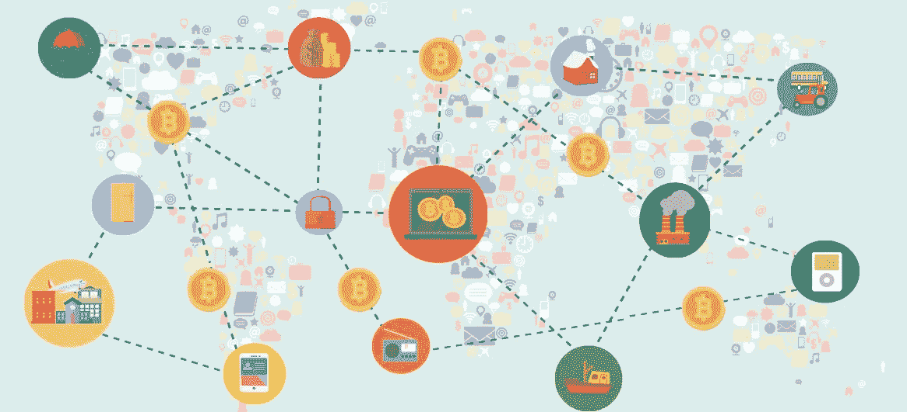
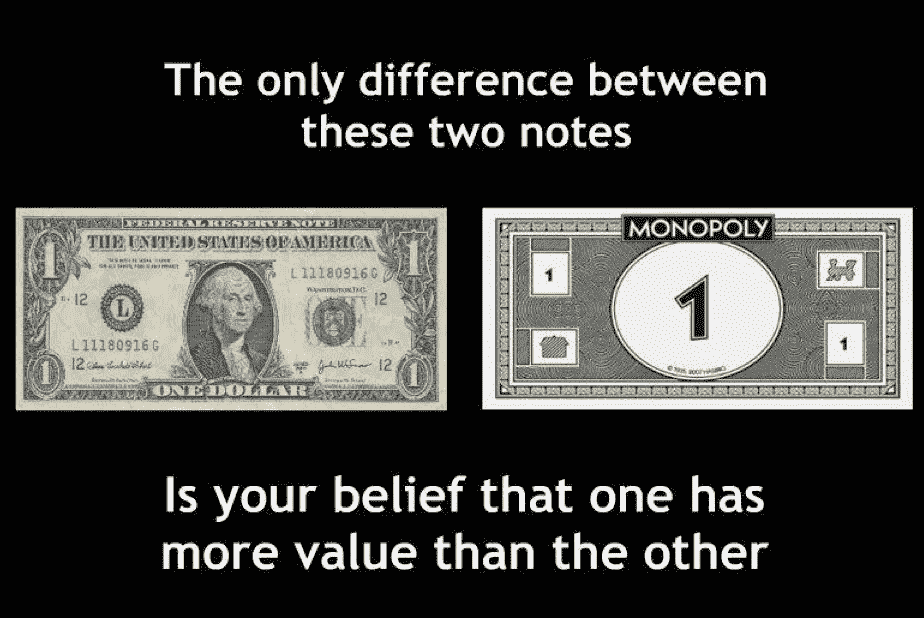
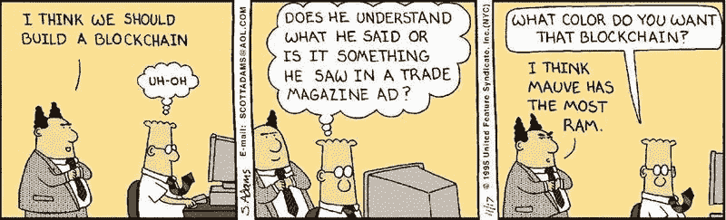
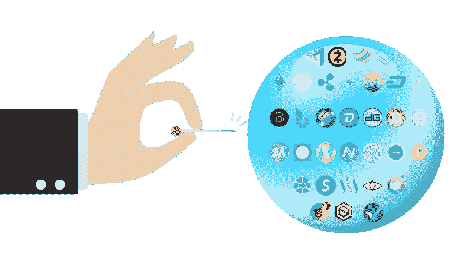
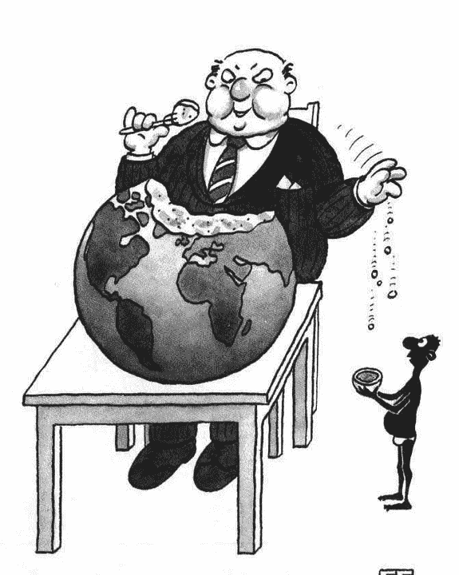
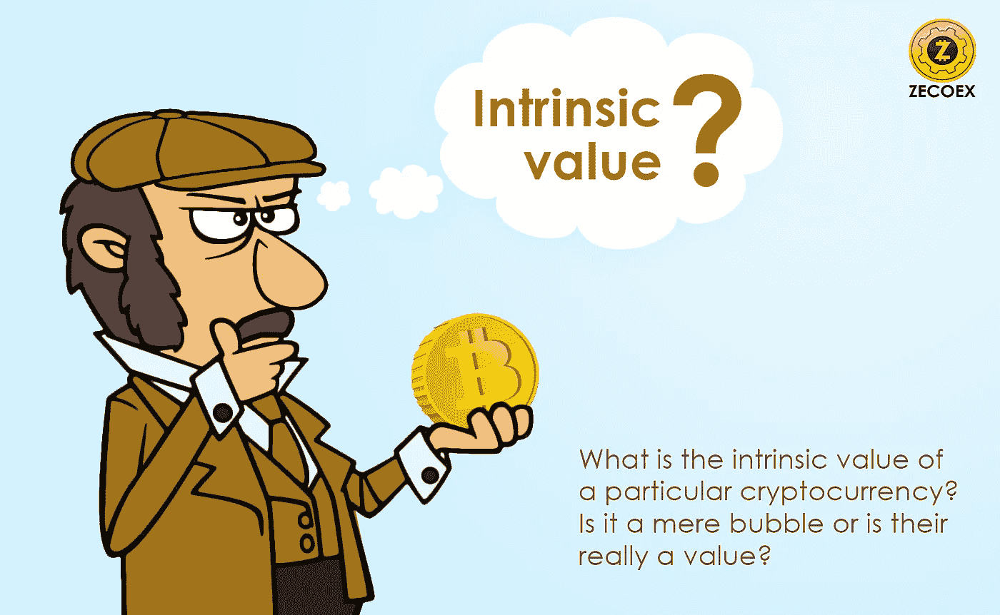
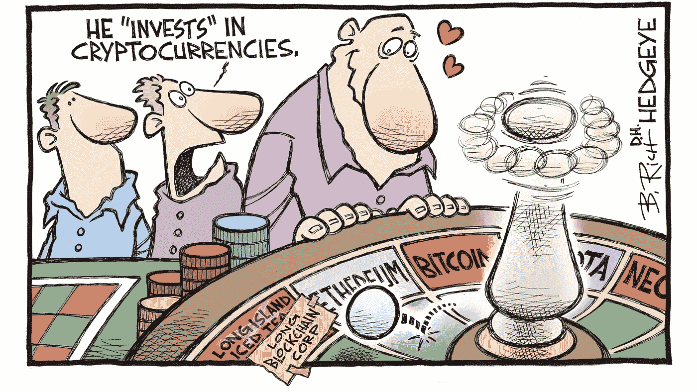

# 加密的“泡泡”。狗屎硬币和媒体如何破坏这场美丽的革命。

> 原文：<https://medium.com/hackernoon/the-crypto-bubble-how-shitcoins-and-media-could-spoil-this-beautiful-revolution-ed48682eee09>

## 附加—比特币到底是怎么产生的？

就其本身而言，区块链的发展很可能是本世纪的*发明 la amaze* 。

它不仅奇妙。但区块链看起来有望成为银行、物流、网络安全等领域的主要底层技术。

在区块链之上，开发者和新兴的初创企业创造了自己的代币，这种公司独有的*货币*为硬币带来了价值。毕竟，它们不是基于 21 世纪最重要的里程碑**区块链**吗？

嗯，他们是。但是就像英语中的*发明 la amaze*&*wondrful*没有意义一样，仅仅基于区块链的随机代币/硬币不一定要保值或者成为下一个比特币。

我爸爸在幼儿园时告诉我——“*这不仅仅是使用字母表，而是你如何使用它，从而赋予你的话语意义和价值。*

我猜我爸的教导可以适用于区块链和比特币的世界， *Shitcoins* 。

A global Blockchain village.

这个世界上交换最多的两样东西，就是智慧和价值。智慧是通过观察和学习获得的。你也可以**交流**你的智慧，但是对方可能不会以类似的方式，或者你想要的方式来对待它。因此，智慧的交流是不一致的。这取决于另一个人对它的看法。

但是价值是可以学习和交换的。美妙的是，它在另一个人手里的价值是完全一样的。价值统一交换。而这种理解导致**金钱是*价值*的交换，而不是智慧。**

(来自 r/iamverysmart 的人会评论说，一辆法拉利对亿万富翁来说还不如一个穷光蛋值钱。没错。你也许应该读《世界主义者》而不是《哈克农》。我说的是无形价值。不是你闪亮的特斯拉或最新款的耐克鞋。)

这些年来，政府从支付盐开始，你认为薪水这个词是从哪里来的？到物物交换系统，到交换石头和鹅卵石，到黄金，最后是平面纸。也就是现代货币。最终，出现了信用卡和借记卡，以及电子货币的出现。

这里有一个小问题。为了向紫苏女士支付高质量的苏格兰棉毛衣，西班牙的某人不得不信任一家银行，这是一家由政府控制的中央集权机构，它根据向持票人支付等值货币的承诺发行法定货币。

**一个承诺？！**

政府团体可以创造他们自己的类似法定货币的货币，称为“共同信用体系”。然而，菲亚特的严格定义可能不包括这样的系统。然而，关键的一点是，记账单位是公开的，并且是**信息性的(即非有形的),与特定商品或服务的固定数量没有直接关联。**

如果政府借了太多钱，负债累累怎么办(这听起来有没有人耳熟？)并且最终意识到它无法支付。

**简单。他们印更多的钱。**

随着这种货币进入流通，你会有更多的美元、欧元等货币。追求等量的商品和服务。简单的经济理论告诉我们，这种情况将导致更高的价格，也称为通货膨胀。

请记住，一种货币不是由任何内在因素支撑的。所以，价值基本上是政府告诉你是什么就是什么。显然，法定货币的价值也是由货币市场上的交易者的操纵决定的，至少是宽松的。

Controversial Post.

然后在 2008 年，一个或几个叫中本聪的人走了出来，创造了比特币。一种分散的、有限供应的、全球可转移的货币形式。

那么比特币是什么？

简而言之，一个利用总分类账的数字文件叫做**区块链**，列出了该网络中曾经发生的每一笔交易。

完全透明并可供公众查看。

比特币是被称为**加密货币**的日益增长的货币类别的第一个例子，在这种货币类别中，开源软件解决复杂的数学计算，以挖掘更多的比特币。

没有人“铸造”这种货币，他们使用硬件和电力来解决加密算法，以获得一个价值单位的表示**，通常称为“硬币”。**

现在你知道菲亚特是什么了。你也知道比特币是什么。你也知道媒体在给你灌输关于“数字货币”的谎言。见鬼，世界上大部分的钱都是以数字形式持有的。哦，还有，你所相信的媒体是被当权者控制的。*贪婪*掌权的人。

比特币的秘密武器是其共识机制，允许人们就交易的规范顺序达成一致，从而通过结合密码学和基于博弈论的经济激励来防止重复消费和欺诈——所有这些都不需要第三方或中间人，如银行。即使参与者彼此不信任，他们也可以依靠他们通过软件的交易之舞创建的共享账本。你不需要小偷中的荣誉——你只需要一个区块链。

**目前没有一个术语比它更被炒作，也没有一个术语比它更为人所知。**

Dilbert says it best.

*那么问题出在哪里呢？所有这些似乎都是革命性的，改变了整个世界。“加密的问题”是什么？*

我敢打赌，70%的比特币专家都无法正确解释区块链。YouTube 和 Instagram 的名人，报纸，媒体，都他妈的给了错误的信息，散布谣言，甚至是普通大众，没有自己做研究，选择彻底拒绝一项技术。

先生，问题是，核心技术**(区块链)**和它的真正目的是**没有被使用，误用，或在一般市场上以同名使用。**

# 另类硬币和狗屎硬币

大量的金钱吸引人们。即使很多钱也会吸引贪婪、诡计多端的人。

BTC 的迅速崛起已经螺旋上升到 1500 种其他加密货币，还有更多甚至没有上市，每一种都由聪明的团队领导，他们承诺解决全球问题。普通大众站在下面，高高举起他们的空碗。希望能赶上下一波大浪去骑，赚个盆满钵满，早点退休。

起初是一场大胆的运动，现在充斥着快速致富的 ICO、不可靠的密码、伊恩·巴里纳(Ian Balina)和约翰·迈克菲(John McAfee)等假权威人物，以及自称为“投资者”的大学新生。

数以千计的初创企业推出了自己的代币/硬币，**声称**在区块链运作，**声称**解决全球问题，**承诺**在未来 4-5 年内做一些事情。

## 就像一张爬满臭虫的床垫一样，初创企业 alt 币现在也在争夺注意力。

我认为他们经营的是金字塔计划的商业模式，但这是一个更形象的说法。

少数几个好的(设计为通过一些采用和交易持续)有开发者、认真的投资者，并且几乎每个参与这个级别的人都有成为其中一部分的长期承诺。比特币当然是最棒的。还有 **Monero，以太坊，NEO，QTUM，**之类的。

另一个群体，也是大多数人所在的群体，是一大堆出售的梦想，过度承诺的期望，以及如果购买了特定的代币就能快速致富的想法。大多是投机投资。大多数利益相关者是公关公司、营销团队、“有影响力的人”(我讨厌他们)，以及过于热情的 Reddit trolls。除了一小部分，大多数不在前 20 名的硬币都是这一组的一部分，这使得今天超过 90%的密码交易。

购买代币/硬币的热潮似乎已经达到顶点，但就像每一次研究不足的购买一样，愚蠢助长了疯狂的热潮。

***“等等你不是写了一本用 crypto 赚钱的指南吗？”***

好吧，如果你进入了严肃的加密交易，这些都不重要。银行很肤浅，我也是，还有我认识的所有交易者。情绪在市场中没有一席之地。最优秀的交易者会利用市场赚钱，而不是在一个硬币/股票/股票/商品上感情用事。

对于短线交易来说，最重要的是一个好的公关团队，以及对大众共识的持续评估。这意味着，如果你看到某个特定硬币的所有网络论坛、子话题和媒体新闻，你可能会乘风破浪，获利，然后转向下一个这样的硬币。

典型的交易者行为。

***《该死的银行家》***

在 2008 年比特币开发多年后，加密货币似乎与一个统一而清晰的愿景保持一致——开发并提供一种在点对点水平上运行的现金技术替代品，消除腐败的银行和金融系统的信任(通过去中心化)，并建立一个运行上述系统的“信任”生态系统。

在我看来，不知名的比特币开发者希望利用社区的力量来推动对他们愿景的认识和采纳，从而创新和推进这一观点。

我不认为他们想成为最好的，甚至努力成为最好的，否则我们会看到 BTC 的创造者的脸贴在你知道的每一面墙上。

他们只是告诉你这是可能的，也是必须的。

最初，社区充满活力，高度关注硬币背后的技术，即他们相信加密货币可以做什么，以及个人如何真正发挥作用。

事实上，一个早期的采用者创造了“Dogecoin”，这是互联网上最受欢迎的迷因硬币，从来没有被认真对待过。但创始人创建它的原因与互联网告诉你的完全不同——那就是提高对区块链和加密的认识，并利用社区的力量来推动创新。

是的，Dogecoin 不仅仅是一枚迷因币。

Dogecoin 取得了前所未有的成功。在接下来的几年里，社区将它作为一种容易接近的“有趣”的加密货币来推动对这一想法的认识，从而吸引了最优秀的人才在幕后从事加密工作。年复一年，开发人员合作创造更好、更快、更安全的加密货币，并寻找可以使用区块链的其他领域。政府对这一举措很感兴趣，监管市场，并鼓励公众购买和使用少量加密货币。Dogecoin 推动了前所未有的意识，被全世界的开发者奉为终结普通人问题的护身符。

好结局，对吧？

但是，事实并非如此。

随着关于 crypto 的消息传开，这个术语吸引了许多快速致富的人，“到月球上去”，“当兰博”的人。骗子之类的也包括在内。愚蠢的钱流入愚蠢的硬币。每天都有一家新公司在它的白皮书上涂上闪亮的字眼，剩下的就靠炒作了。很少有人使用加密货币来嗅到机会，然后出售他们的成功故事。这就像往鲨鱼缸里扔血一样。鲨鱼并不聪明。他们*非常非常贪婪*。

几年后，市场发生了变化。

维塔利科·布特林，你可能知道他是以太坊的**创造者，他发现了一种全新的使用区块链的方式。虽然直到现在这个术语还被用于转账，以太坊展示了一个你可以转账的过程，嗯，*几乎可以转账任何东西*。他还允许其他开发者在以太坊网络上构建 dApps，或*分散应用*，以进一步构建一个有意义的、有凝聚力的**增值生态系统。****

与此同时，人们对比特币的信心动摇了:**黑客和诈骗主宰了新闻周期**，商家的采用率未能以预期的速度增长。尽管发生了这些事件，巨额风险资本继续涌入新的加密货币公司，这些公司仅由充斥着流行词汇的网站支持，并且缺乏任何可辨别的商业模式。

不幸的是，以太坊的引入也意味着 1000 种不同的方式(*读取代币*)让快速致富的人可以染指。蛇油开发商 T21 现在可以用 1000 种不同的方式赚钱。

你可以看到早期的加密市场仅限于作为现金的替代品。只有这么多基于现金的硬币可以出现。

以太坊。事情变得非常简单。非常简单。你所要做的就是创造一个没人理解的 B 计划，加入一些让人犯错误的流行词，然后把它塞给毫无戒心的人，*天真的人。*

**

*Replace Earth with SHITCOINS.*

*在两年多的时间里，这个空间主要被那些想要一夜暴富的机会主义者所掌控。这样的人越多，底层技术的发展就越慢。我们现在面临的技术问题从**到**那段时间就已经存在了，只有很少的开发人员致力于解决这些问题。*

> *在接下来的两年里，我从远处监视着这个空间。我注意到的是，从开发驱动这些网络的核心技术，转移到大量生产闪亮的新项目，尽可能地在“区块链”强行推销。*

*—杰克逊·帕尔默，Dogecoin 的创造者。*

## ***一个穷人的加密狂潮***

*金融市场上有一句流行的谚语，大意是“当你的出租车司机告诉你买股票时，你知道是时候卖出了。”基本上，当一个(大概)没有什么股市经验的陌生人给你提示时，这表明这个市场太受欢迎了。*

*仅在 Vitalik 的创意产品以太坊引入技术以创建*智能合约生态系统*的几年后，我们才开始看到加密货币市场的新趋势。*

*也许没有什么比 ICO 更时尚、更疯狂了。*

*ICO，或称**首次硬币发行，**是一种承诺，出售给小鱼，让它们参与硬币的首次销售，甚至是在硬币上市之前。*

*2017 年，数千家羽翼未丰的公司集体融资超过 10 亿美元(**有一家 ICO 融资 7 亿美元！！！**)。前提很简单——你找到一家目前提供“预售”或 ICO 的公司。作为虚拟“代币”的交换，你将 BTC 或瑞士联邦理工学院发送到提供的钱包地址，几天后他们会释放代币。一旦硬币在交易所上市，买家会立即交易，通常会获得巨额利润。*

*结果是，大量新的、愚蠢的资金由希望轻松赚钱的人流入市场。*

*本质上，为了实现一个 ICO，一家初创公司凭空创造出大量某种全新的 altcoin*并将其中许多卖给投机者。**

**在细节上有很多变化，包括创始人保留了多少替代硬币，以及 ICO 之后剩余的多余硬币可以做什么。**

**然后，这家初创公司可能会使用他们从出售他们刚刚印刷的假垄断资金中获得的真钱来启动一项与区块链相关的业务(当然，除非他们是彻头彻尾的骗子，但很多人都是)。**

**然后神奇的事情发生了，每个在 ICO 买了 altcoins 的人都卖掉它们来赚钱。究竟是什么神奇的事情赋予了这些毫无价值的小东西，这取决于创业公司的商业模式——但投资者*没有*得到的一件事是公司的所有权。**

**至少你可以用真正的大富翁的钱玩大富翁。然而，由于 ICO 产生的硬币，甚至很少有投机市场，因为有太多的 ICO 和太多的新替代硬币。**

**想在公园广场建酒店吗？你运气不好。如果有纸的话，所有的新硬币都不如印刷它的纸值钱，但现在没有了。**

****欢迎来到疯狂神奇的互联网货币世界。****

**更糟糕的是，公司请来了社交媒体名人作为**【顾问】**，在幕后与他们签订了六位数的交易，然后这个人开始在他的社交媒体渠道上为硬币做广告。天真的公众一丝不苟地遵循并跳入这个建议。由于市场处于上升趋势，硬币确实升值并给许多人带来利润，这助长了疯狂的热潮，并使影响者看起来像一个帮助他们赚钱的秘密神(**Ian Balina I am looking you**)。一个月又一个月，上帝不停地在桌子下签合同，赚他的钱，公司卖代币，赚他们的钱，而买家把这些都吃光，然后再卖掉赚他们的钱。**

**赢赢对大家都好吗？**

> **如果宇宙给你容易、快速的钱。它会很快很容易地收回。而这一次，连本带利。**

**——多年前的我对自己。**

**许多替代比特币的疯狂估值是市场狂热的结果，市场狂热导致缺乏经验的投资者心血来潮购买低价资产，**希望**他们将跟随比特币的飞速发展轨迹。**

**这种**非理性的热情**，加上大型参与者操纵着基本上不受监管的市场，导致了几乎所有加密资产每周*的涨跌周期。***

**即使是 Reddit 社区，其创建的目的是讨论硬币技术，PoW 的，并保持对程序的检查，现在也沦落到非常可悲，可耻的美元价格固定和过度热情的硬币价格投机的状态。**

**很高兴看到主流对加密货币的兴奋，但对价格和“快速致富”潜力的持续关注分散了比特币等项目的崇高目标。更重要的是，底层技术仍然面临着需要解决的与扩展相关的技术挑战。**

**事实证明，如果我们选择使用比特币网络汇款，成本会很高。使用网络的平均费用是 4 美元，比上个月**的 50 美元要低得多**。与此同时，一个标榜自己为“全球牙科行业的区块链解决方案”的令牌**刚刚超过 10 亿美元的市值**。**

**这里有些不对劲。**

**受 FOMO 驱动的业余投资者正争先恐后地投资下一个“区块链 for*x*”ICO，希望获得 1000%的回报，希望像他们最喜欢的 YouTube 或 Instagram 明星一样成为密码富翁。与此同时，据报道，商家对比特币的采用正降至多年来的最低水平。最近，像微软和视频游戏市场 Steam 这样的主要玩家从他们的在线商店中移除了用比特币支付的选项。**

**讽刺的是，比特币是在“反建制”的前提下推出的。记住这一点，我们越来越多地看到机构投资者、华尔街银行和交易员将资金投入该行业，甚至推出了**比特币期货(**基本上是押注比特币的价格会上涨还是下跌)。**

**这就引出了一个问题。腐败的金融系统不应该被排除在外吗？**

**鉴于**巨大的价格上涨和媒体炒作**，有一种趋势认为 2017 年是加密货币迄今为止最好的一年，但我认为恰恰相反。在许多方面，2017 年标志着加密货币不再是技术创新的点对点现金，而是本质上成为一个新的、不受监管的廉价股票市场。**

***这一切都是由于 FOMO 和投资者的贪婪，他们对自己真正购买的东西一无所知。***

****

**2017 年是**也是**年，比特币最初试图拆除的机构已经开始利用比特币获利。**

***“加密货币的游戏结束了？”***

**没人能预测或断定加密货币的最终结局。很难预测当前的加密泡沫会膨胀到什么程度，或者什么时候会破裂(不是如果破裂)。*一个泡沫？*是的，一个泡沫。随着市场上大量垃圾硬币的出现，而对底层技术却无所作为，这个市场的大部分将会崩溃。许多硬币将会破产。他们中的许多人将会归零。**

> **我脑海中最迫切的问题是:一旦加密货币价格泡沫破裂，并伴随着所有的炒作，社区是否能够再次恢复建设真正的创新技术所需的能量？**

**在过去的一年里，我们看到所有加密货币资产的总市值膨胀到超过 8000 亿美元，主要是因为投机交易。每天，似乎都有关于 20 岁的**通过比特币成为百万富翁**的新鲜新闻。**

**以 Dogecoin 为例，一个由意识转变而来的 memecoin，自 2014 年以来一直没有软件更新，去年 12 月市值超过 20 亿美元。**

***天哪。***

**在一个竞争激烈的领域，客户要求更快的交易和更低的成本，制造最好的区块链捕鼠器的回报可能是巨大的——错过的惩罚，是相应的痛苦。**

****因为最终，让客户和合作伙伴满意才是最重要的。没有让你，普通人，新手投资者开心。****

# **所有这些贪婪和天真正是造成“泡沫”的原因。**

## **奥特币泡沫。**

**不可否认的事实是，在另类硬币上赚钱是可能的。但那只是赌博。创造新另类硬币的人和建造赌场的人处于同样的地位。这是一个企业，但这是娱乐部门，而不是像一些人试图假装的那样，属于“实体经济”或“金融”部门。**

**很少有加密货币实际上是非常严重的，这些是没有人真正谈论的。**

**听说过奥米塞戈吗？哈肯？Achain？本体？**

**好吧。Telcoin 呢？QTUM？数据？假人？Factom？**

**这些背后的团队正在研究一些真正好的技术，签署真正好的合作伙伴关系，在电信方面，试图做出巨大的社会贡献。**

****

**抛开所有受到的批评不谈，比特币是为数不多的真正重要的加密货币之一。它并不完美，但攻击比特币非常困难，所以价值数百万美元的交易可以在几个小时内得到确认。**

**我不知道其他流行的替代硬币是否也是如此。**

**许多无用的代用币在 ICOs 期间白白聚集了大量金钱，大量的泵和转储**才是真正的问题**。它们肯定会在一两年内引发一场巨大的隐性“抑郁症”。**

**在你误会我之前。我不想吓走任何人。我非常相信区块链和密码，如果你已经到达这里，我会说:**欢迎来到一个发展中的建筑的底层！****

**我的问题是，我想让你注意的是，大多数领先的“替代硬币”实际上甚至没有试图成为“硬币”本身。**

**他们是总部设在区块链的企业，为企业家探索令人兴奋的新蓝海。**

**你在纳斯达克看到多少企业？**

**他们中有人声称他们是唯一需要存在的企业吗？**

**恭喜，你刚刚回答了。**

****

**迟早会有很多带着狗屎硬币的狗屎公司破产。不要成为被夹在垃圾堆中，最终得到一袋数字花生的人。**

**做好你的研究，做正确的事情，**投资**具有真实使用案例和真正价值的正确技术。**

****不是一个过分美化的狗屎秀。****

**我知道你可能会感到沮丧，如果你是第一次加密投资者，不知道下一步该做什么。**

**别担心，我已经为你写下了不迷路的指南。免费的成本，没有附属链接，没有任何形式的营销。**

## **干杯，感谢您的阅读。**

**对于你进入加密市场的第一步的最终资源，加上你的第一笔投资，如何投资，以及投资什么的指南，请查看我的指南**

** [## 如何通过交易和投资加密货币赚钱？

### 比特币！莱特币！以太坊！—激动！不知所措！还有什么不可以。

medium.com](/@shauryamalwa/how-to-almost-make-millions-by-trading-cryptocurrency-2f7bd5c1cedd) 

这些步骤让我在几个月内从 1000 美元变成了 30000 美元。

让它变大的唯一方法是自己学习如何抓鳟鱼。另一边见。干杯！

****************************************************************

鼓掌 1 次或 50 次。它帮助我获得曝光率。谢谢大家！

_

阐述我多年来的想法，并超级热衷于写区块链、交易、加密货币和生活。

我的目标是以一种精致、易懂的方式将加密货币带给大众。复杂无助于任何人，有偏见的媒体也是如此。

是的，我认为这个系统是一个巨大的谎言，是时候改变它了。

_

#longlivecrypto。

*****************************************************************