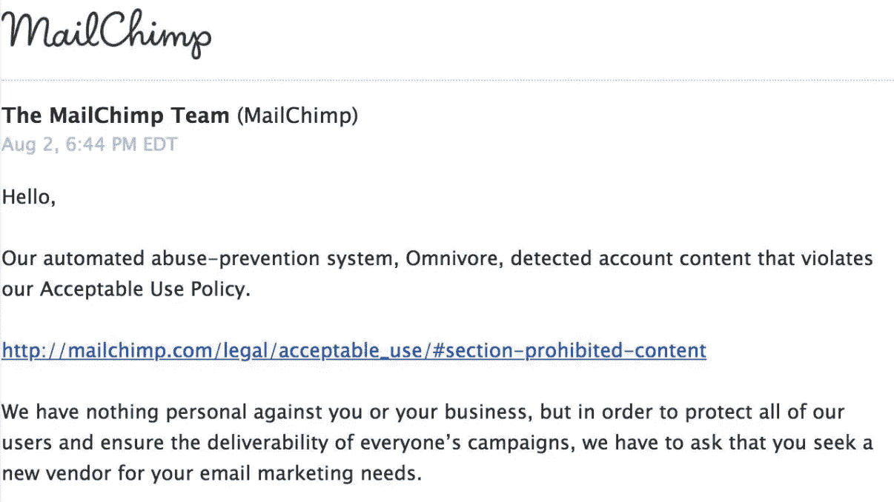
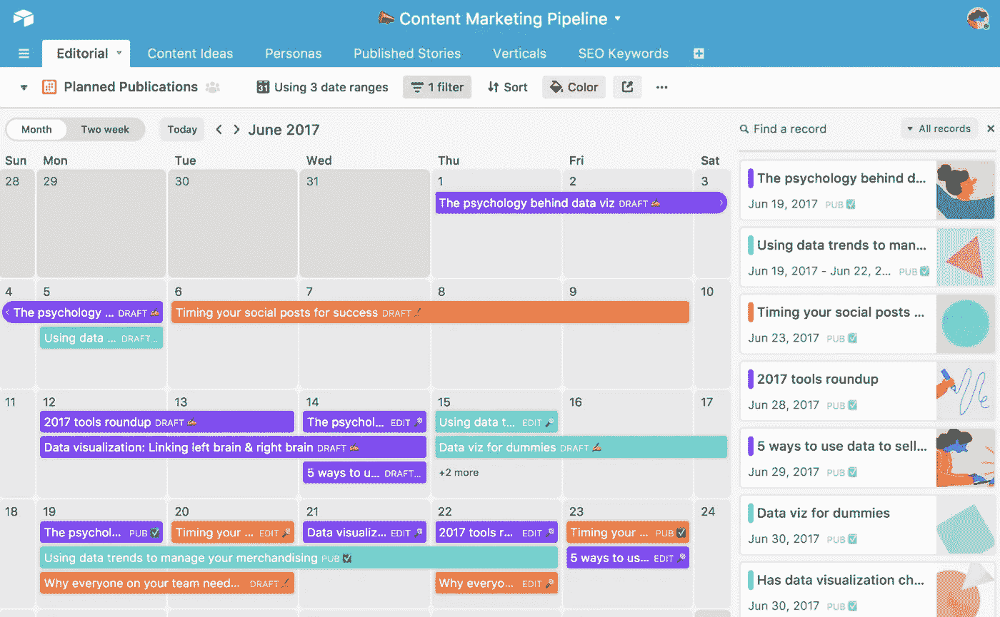

# 加密营销堆栈

> 原文：<https://medium.com/hackernoon/the-crypto-marketing-stack-2a0d4898c41c>

## 早期客户获取和增长的基本工具和资源

在 [crypto](https://hackernoon.com/tagged/crypto) 的 rowth marketing 是你可以用合适的工具来设计和简化的东西。但是市场上有这么多优秀的工具，为您的产品选择正确的组合可能是一项艰巨而昂贵的任务。为了有所帮助，我整理了一份有效工具的清单，这些工具是我个人在[区块链](https://hackernoon.com/tagged/blockchain)领域与各种客户打交道时使用过的。这还远远不是一个完整的列表，随着时间的推移，我会添加更多的内容。如果你有任何建议或认为我遗漏了什么，请随时给我发[消息](https://www.linkedin.com/in/alextopchishvili/)或在下面留下评论。

# 1.电子邮件营销

[**GetResponse**](https://www.getresponse.com/) ，因为它们巨大的邮件送达率，容易构建，又因为 [**Mailchimp**](https://mailchimp.com/) 禁止加密🙅🏻‍

# 2.内容营销管理

[**Airtable**](https://airtable.com/) ，因为它让管理多个作者和一个复杂的内容日历简单得可笑。

Crypto 苦于缺乏理解和基础知识。克服这一点的唯一方法是通过大量投资，用优秀的内容来教育大众。当前的区块链和加密初创公司有机会通过以易于理解的方式介绍事实和原理来塑造认知和对话过程，同时产生品牌资产和意识。Airtable 让这个过程变得简单了一些。

# 3.社区管理

[**电报**](https://telegram.org/) ，因为拥有一个成员众多的活跃社区，预示着成功、可信、社会证明。Telegram 的端到端加密愿景自然吸引了注重隐私、怀疑权威的加密迷。秘密的日内交易者聚集在一起分享分析，掌握市场动态(并通过无休止的互相攻击来发泄情绪)。

[**Discord**](https://discordapp.com/) 是另一款源于游戏世界的聊天应用，已经被加密世界大量采用。这两种互联网亚文化有许多共同之处——它们都受益于便捷的实时交流、锐利的交互性和流畅的用户界面。

# 4.客户关系管理

[**HubSpot**](https://www.hubspot.com/products/crm) ，因为他们的免费产品拥有你所期望的核心 CRM 所拥有的所有核心特性，而没有 Salesforce 或 Zoho 的复杂性和实现。与销售前景的实时聊天以及与 gmail 的集成大大增强了您的销售团队的能力并跟踪您的销售线索，而简单直观的界面使采用变得容易。

# 5.沟通与协作

[**懈怠**](https://slack.com/) ，因为没有人有更好的**搜索**、**文件共享**，以及**分组**功能。根据我的经验，他们的产品可以缓解压力，提高工作效率，并大幅减少电子邮件的使用。

在**远程团队**(在 crypto/区块链世界中很常见)工作时，我发现 Slack 的核心特性让建立团队文化和社区意识变得更加容易。

# 6。交通分析

[**Google Analytics**](https://gsuite.google.com/)，用于跨渠道追踪**流量**、**采集**，以及**转化**。虽然有一点学习曲线，但 GA 非常适合监控付费媒体活动，了解受众的年龄、性别、兴趣、设备和位置，以及了解推动流量和转化的流量来源和内容类型。

# 7.产品分析

[**Heap**](https://heapanalytics.com/) ，因为它惊人的**漏斗分析工具**，也因为它比 Google Analytics 需要更少的定制工作和维护。Heap 从 web 和移动设备上捕获所有客户行为数据，并为您提供易于使用的工具，使数据分析**变得轻松**。

# 8.博客

[**中**](/) 和 [**LinkedIn**](https://www.linkedin.com/) ，因为它们快速、干净，与**内置受众**接口。在两个平台上发布相同的内容(Medium posts + LinkedIn 允许长篇文章)是在区块链/crypto 人群中获得动力和增加受众的好方法。

******* *如果您的内容被高度策划的媒体出版物(如 Hacker Noon)采用，将获得额外的积分(和分销)。*

# 9.社交媒体管理

[**Hootsuite**](https://hootsuite.com/) ，因为我还没有见过一款**免费的** **产品**用于管理多个社交媒体账户和安排帖子，价值更高。

如果你能负担得起每月 79 美元的费用， [**CoSchedule**](https://coschedule.com/) 是另一个很棒的工具，它有更干净的界面和更强大的社交媒体集成、自动化和分析。

# 10.项目管理

[**Trello**](https://trello.com/)**毫无疑问是我最喜欢的项目管理工具。第一印象看起来极其基础，设计极简。然而它的核心特性和功能——包括待办事项列表、文件附件、管理控件、自定义白板背景、拖放功能——使它成为小型项目和复杂项目的完美工具。**

**在与外部机构/自由职业者合作时，我也广泛使用了 [**Basecamp**](https://basecamp.com/) 。尽管 Basecamp 的功能与时俱进，但它是一个很好的 PM 工具，是许多营销和设计供应商的首选工具。**

# **11.客户支持**

**[**对讲机**](https://www.intercom.com/) ，立刻求助台，实时聊天，营销自动化，以及客户数据库。Intercom 允许公司根据某些触发的行为向用户发送应用内消息，发送推送通知，记录新票证，以及创建登录页面。它是在漏斗的所有阶段向用户提供一流客户服务的终极工具。**

# **12.论坛**

**自称为“互联网首页”的 Reddit 是一个在线留言板和社区，拥有相当年轻和精通技术的用户群，使其成为推广加密产品的理想场所。从主持关于你的项目的 AMA(问我任何问题)和创建你自己的子 Reddit 到运行广告活动和开始在流行频道如[r/以太坊](https://www.reddit.com/r/ethereum/)或[r/比特币](https://www.reddit.com/r/Bitcoin/)上讨论，如果使用得当，Reddit 可能是你见过的最好的流量来源之一。**

**同样，这远不是一个完整的列表，随着时间的推移，我会添加它。与此同时，如果你想谈论增长营销和密码，请在 LinkedIn 上给我发一条消息。**

**干杯，**

**亚历克斯**