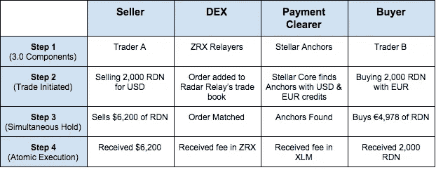

# 密码市场的交换问题

> 原文：<https://medium.com/hackernoon/the-crypto-markets-exchange-problem-cbde960d2e11>

# WTH 正在进行密码交换？

密码交易市场的现状是非常不幸的。许多例子都存在，比如日本的 Coincheck 通过[黑客](http://www.abc.net.au/news/2018-02-16/victims-of-cryptocurrency-hack-sue-coincheck/9452560)或比特币基地的系统[故障](https://www.extremetech.com/internet/264035-coinbase-bug-accidentally-drains-users-bank-accounts)意外清算客户的银行账户，损失了超过 5 亿美元的客户资金。

对于我们这些已经在加密领域工作了一段时间的人来说，这些头条新闻并不令人惊讶。长期解决方案可能在于新兴协议的互操作性。但首先，让我解释一下我们将如何从 0 到 100。

# **1.0:集中交易所**

据信，几乎 99%的加密交易量都是通过比特币基地、币安、北海巨妖、Gemini 等集中交易所进行的。这种资产集中化(交易所监管交易中的资产)为黑客创造了一个主要目标。此外，这些交易所相对年轻且缺乏经验，导致了一些服务问题，如冻结取款、黑客攻击、对客户反应迟钝以及交易透明度有限。

# **为什么还有人在用 1.0s？**

1.  ***法定进出匝道:***1.0 通常由地方政府监管，允许交易者连接其银行账户，即交易进出法定货币。大部分交易量仍然是基于法币对，例如 BTC/美元或 BTC/欧元。
2.  ***可接受的用户体验:*** 1.0 的用户体验更加友好，少了一些科技的枷锁，更符合当下消费者的期待。

# **2.0:分散式交易所(dex)**

加密生态系统已经注意到了 1.0s 的缺点，因此匆忙通过分散的解决方案来解决它们。在撰写本文时，存在超过 53 个 DEX 项目。与 1.0s 相比，2.0s 提供的竞争优势是，分散式协议允许更高的安全性、隐私性和透明度以及更低的费用。

主要缺点是可伸缩性、用户体验、初始流动性和固定集成。我们认为前三个问题迟早会得到解决，但菲亚特的整合可能更难实现。这种限制给长期采用带来了巨大的障碍。

# **为什么菲亚特整合如此重要？**

随着更多的“快速追随者”和“主流”消费者开始进入加密市场，对菲亚特集成的需求可能会在短期内增长。上述消费者通常对技术不太了解，而且更厌恶风险。此外，世界上的大部分商品、服务和账单仍然必须以当地法定货币支付。例如，你不能用 XMR 支付电费。

菲亚特上/下坡道对加密生态系统至关重要，因此 0x 的首席执行官威尔·沃伦(Will Warren)设想，由于这一功能，集中式交易所在可预见的未来将在市场中发挥关键作用。

# **2.5:混血儿(CEX +德克斯)**

一个令人兴奋的进入该领域的是混合交易所，如[莱格拉斯交易所](https://legolas.exchange/)。这些混合产品利用了 1.0 和 2.0 交易所的最佳功能，如菲亚特集成、分散式安全、可靠的用户体验、透明性和最大限度地减少前期运营。2.5s 的演变将会非常有趣。

# **3.0: DEXs 与菲亚特整合**

DEX 采用的圣杯在于菲亚特整合。然而，这种观念与区块链精神的分散化咒语相反；尤其是涉及到商业银行的时候。幸运的是，各种区块链项目的兴起提供了一个机会来挑选一些可以解决这个问题的功能。

# **3.0 框架**

3.0 框架通过区块链与交易的互操作性实现了去中心化的菲亚特集成，交易来源于[链外](https://en.bitcoin.it/wiki/Off-Chain_Transactions)并通过以太坊智能合约在链上自动执行[。早期，大多数](https://en.wikipedia.org/wiki/Atomic_swap)[锚](https://www.stellar.org/how-it-works/stellar-basics/explainers/)可能是金融机构，但是随着点对点流动性的增长，这个症结应该被消除。

# **结论**

dex 的短期未来可能主要取决于生态系统在坚持分散化的同时创造性地整合菲亚特上/下匝道的能力。这在技术上可能是不可能的，在这种情况下我预计 2.5s 会赢。但是，我认为现在数出 3.0 还为时过早。

***警告:*** 我不是区块链工程师，也不是冒充的。我很乐意听到你对 3.0 框架的想法、评论或项目。

— — —

**来源:**

 [## 2018 年分散交易所状况

### VariabL CCO Nathan Sexer 对当前的 DEX 技术进行了详尽的研究，并展望了(不久的)未来…

media.consensys.net](https://media.consensys.net/state-of-decentralized-exchanges-2018-276dad340c79)  [## 比特币基地 Bug 意外榨干用户银行账户- ExtremeTech

### 该网站可以从本页的链接中赚取会员佣金。使用条款。对于加密货币的大多数用户来说…

www.extremetech.com](https://www.extremetech.com/internet/264035-coinbase-bug-accidentally-drains-users-bank-accounts)  [## 加密货币黑客的受害者起诉 Coincheck 盗窃 6.5 亿美元

### 更新于 2018 年 2 月 16 日 12:50:12 世界上最大的加密货币黑客之一的受害者正在起诉 Coincheck，即…

www.abc.net.au](http://www.abc.net.au/news/2018-02-16/victims-of-cryptocurrency-hack-sue-coincheck/9452560) 

**免责声明:**本文作者和 Pugilist Ventures 都不提供投资、财务或法律建议。提供的内容仅供参考，不应被解释为任何投资机会的任何类型的投资邀约。