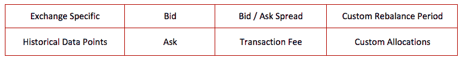

# 加密投资组合再平衡回溯测试工具

> 原文：<https://medium.com/hackernoon/the-crypto-portfolio-rebalancing-backtest-tool-66563cf2f18b>

几周前，我们决定是时候改进我们的加密回溯测试功能集了。事实证明，我们之前的实现对于世界各地成千上万想要分析其再平衡策略的人来说是有价值的。然而，我们的历史数据中有需要改进的空白。

我们首先联系了几家数据服务提供商，寻找历史交易数据。我们很快发现了在确定一个合理的数据集来构建我们的高级回溯测试工具方面的挑战。最终，我们决定使用 CoinAPI 作为我们的主要数据合作伙伴。

我们的团队一直在从 CoinAPI 和其他来源收集数据，为我们的回溯测试工具构建一个全面的数据集。这确保了我们的模拟将使用每个交易所的实际市场数据来计算再平衡策略的影响。

Shrimpy 的回溯测试工具目前包含以下组件:

Backtest Data Components

# 回溯测试工具

## 基本回溯测试演示

基本回溯测试工具是了解投资组合再平衡的重要性和影响的简单有效的方法。只需选择要回溯测试的资产，并查看投资组合再平衡和持有之间的绩效差异。

查看下面的回溯测试工具演示:

 [## Shrimpy 的表现超过 holding 27%！

### 看看你的加密组合在 Shrimpy 上表现如何

www.shrimpy.io](https://www.shrimpy.io/backtest) 

## 高级回溯测试工具

如果您喜欢基本回溯测试工具，请升级到 Shrimpy 的高级服务，以解锁其他回溯测试工具功能，包括:

*   自定义时间范围
*   可调交易费
*   复杂分配分布
*   附加回溯测试设置和选项

除了访问我们的 Premium Backtest 工具，您还可以成为我们社交项目的成员，在这里您可以与其他 Shrimpy 用户互动，了解更多关于加密货币的信息，甚至与社区的其他人分享您自己的投资组合策略！

Shrimpy Premium 每月仅需 8.99 美元— [在此注册](https://www.shrimpy.io/)。

# 即将推出的产品功能

Shrimpy 将继续为我们的产品构建和添加新功能，以改善回溯测试体验。随着越来越多的资金和投资流入加密货币领域，机构需要访问更多的数据，因此我们正在确保我们有办法提供这些数据。

## 改进的 Exchange 支持

虽然回溯测试工具的初始版本仅包含来自 Bittrex 的数据，但 Shrimpy 将继续整合来自其他交易所的数据，以全面了解全球加密货币市场。

## 交叉交换再平衡

Shrimpy 目前正致力于为多个交易所之间的再平衡提供支持，这允许在特定时间执行最佳汇率。

# 摘要

虽然加密货币可能是一种新的资产类别，但基本的投资理念和策略并没有改变。Shrimpy 的使命是为寻求构建简单而有效的投资组合策略的个人和机构提供一套强大的专用工具和服务。

敬请关注我们在官方 [Twitter](https://twitter.com/ShrimpyApp) 和[脸书](https://www.facebook.com/ShrimpyApp)页面上的更新。

来加入我们活跃的社区和聊天频道[电报](https://t.me/ShrimpyGroup) & [不和](https://discord.gg/gXyy95y)。

*虾队*

*最初发布于*[*blog . shrimpy . io*](https://blog.shrimpy.io/blog/the-crypto-portfolio-rebalancing-backtest-tool)*。*