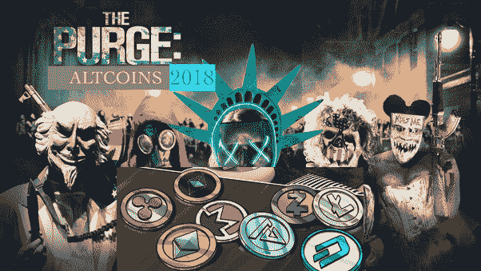

# 我们会看到排名前 100 的加密货币遭到加密清洗吗？

> 原文：<https://medium.com/hackernoon/the-crypto-purge-is-coming-do-you-hold-the-good-or-the-bad-apples-163c511665d6>

就像在每一次牛市中，大多数 altcoins 都会随着下一次牛市而死亡，可能会有 75%左右像在上一次牛市中，前 100 名中有 75%的人死亡并陷入默默无闻。[历史快照—2016 年 5 月 22 日| CoinMarketCap](https://coinmarketcap.com/historical/20160522/)

我们来看看前 100 名，看看哪些会消失。

第一，所有骗局币。

1.  Hshare
2.  真理博物馆
3.  赢币，因为这是个骗局
4.  比特币黄金，因为这是个骗局
5.  比特币钻石，因为这是骗局

这些硬币都停止了交流，而且它们一开始也没提供多少东西。

然后，所有的弱势硬币都会跟随

1.  莱特币
2.  Dogecoin

然后，极有可能所有的极度集中的硬币都会随之而来。他们的一个共同点是，他们有非常花哨的品牌和市场，因为他们是由商人经营的，他们非常了解欺骗人们，但他们根本不在乎权力下放。

所有这些项目都提供了如此花哨的功能和合作关系，但这些都无关紧要，因为如果他们的架构如此集中，网络的安全性就非常容易受到攻击。

1.  EOS，因为它们是许可的和不可信的，因此是集中的
2.  恒星，因为他们是许可的和不可信的，因此集中
3.  NEO，因为他们是许可的，不可信的，因此是集中的
4.  Lisk，因为它是允许的和不可信的
5.  方舟，因为它是允许的和不可信的
6.  TRON，因为它们只是非常粗略，而且还集中在 PoS 上
7.  Tezos，因为尽管它们具有良好的分散性，但它们的可伸缩性非常低(300TPS ),而且距离生产就绪的可伸缩性解决方案还有数年时间
8.  Bitshares，因为它是丹·拉里默的一个老项目，现在已经不怎么受欢迎了
9.  本体，因为它是许可的和不可信的
10.  图标，因为它非常集中
11.  边缘，因为这是一个没有隐私的隐私币
12.  人口众多，因为他们的用例非常狭窄

然后，可能所有的普通硬币都会跟随，只是没有独特的区别，或者由于缺乏良好的营销团队，它们很难被采用。

1.  Monero，因为隐私硬币是有用的，但隐私是一个很容易复制的特征
2.  ZCash，因为隐私币是有用的，但隐私是一个很容易复制的特征
3.  等等，因为他们和以太坊太相似了，但社区却小了 10 倍
4.  QTUM，因为尽管比特币上的智能合约很有用，但它们似乎无法真正利用它们的潜力
5.  OmiseGo，因为虽然它很有用，但没有足够的独特性来区分众多的竞争对手
6.  因为它们已经存在了很长时间，但是仍然很少被采用
7.  字节币，因为它们已经存在很长时间了，但是仍然很少被采用
8.  Digibyte，因为它们已经存在很长时间了，但是仍然很少被采用

最有机会存活的是

1.  比特币，因为它仍然太大而不能倒
2.  比特币现金，因为它仍然太大而不能倒
3.  XRP，因为他们太大太失败了，尽管不可信
4.  以太坊，因为它仍然太大而不能倒，而且有一些很好的东西，比如卡斯帕，雷电，等离子，碎片
5.  Elastos，因为它可能是所有 2000 种加密货币中最好的
6.  Cardano，因为它是一个非常好的平台，尽管它在某种程度上是集中在股权池中的
7.  IOTA，因为它是所有 2000 种加密货币中仅次于 Elastos 的最佳平台
8.  BNB，因为它属于币安，最大的密码交易所
9.  因为他们可能有最好的营销和公关团队
10.  ZRX，因为有用
11.  事实上，因为他们有一个有趣的比特币 ng 实现，这可能会让他们很快成为继 Elastos 和 IOTA 之后的第一名
12.  BAT，因为他们是 5 个月后拥有 500 万月活跃用户的最有牵引力的 token
13.  Siacoin，因为他们有很好的技术，尽管他们有许多竞争对手，如 Maidsafe、Storj、Gbyte、IOTA 和 Sky
14.  制造者，因为稳定的硬币是有用的
15.  纳米，因为它几乎和 IOTA 一样好
16.  假人，因为他们有很好的技术，尽管他们有很好的竞争对手
17.  奥格，因为它有一个有趣的赌博用例，而且它已经在网上下了价值 100 万美元的赌注，所以肯定有这个需求

从#50 到#100，我只认为那些会在清洗中幸存

1.  全息链，因为它可能是所有 2000 种加密货币中仅次于 Elastos 和 Nano 的最佳平台
2.  Nexo，因为对密码贷款有巨大的需求
3.  DigixDAO，因为需要一个去中心化的稳定币
4.  库币股份，因为收费代币有用
5.  霍比代币，因为费代币很有用
6.  Maidsafecoin，因为它可能比 siacoin 有更好的技术
7.  游乐场，因为他们在赌场方面做得很好
8.  PowerLedger，因为能源可能是区块链的最佳用例

其余的基础薄弱，仍然缺乏牵引力。如果你不能得到别人的关注，你就会被清除。

**结论**

查看前 100 名，正好有 75 枚硬币的基本面相当弱，很有可能被清除。这并不意味着在接下来的几年里它们将会完全消失。他们可以宣布惊人的技术，或者意识到他们应该停止被许可和不信任，但这也可能是不太可能的。