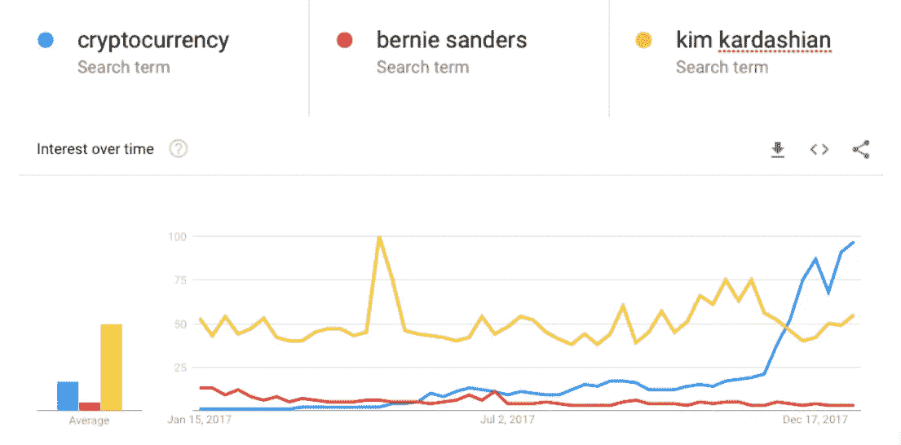
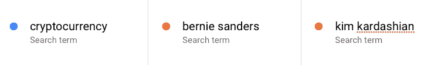
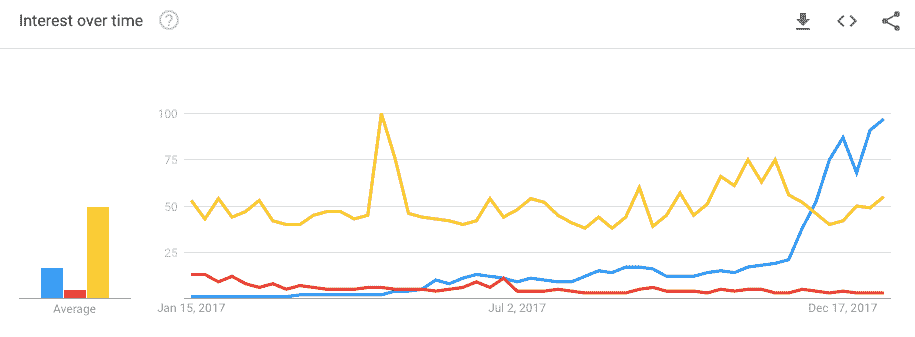
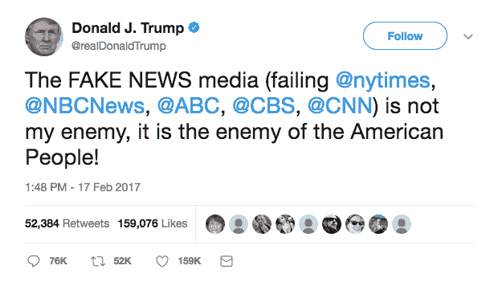

# 加密资产公关问题

> 原文：<https://medium.com/hackernoon/the-cryptoasset-pr-problem-3d550245af48>

*对加密空间中公共关系的看法*

公关是一门神秘而古老的艺术。政治顾问、间谍头子、八卦专栏作家、历史学家、朝臣、中间人、广告人、政客——塑造观点，将现实的某些观点投射到其他人的眼球上。它既难以捉摸，又——如果运用得当——冷酷无情。

2017 年，“加密货币”成为整个互联网上最常搜索的术语之一。这一趋势背后的基本原理可以用三个简单的词来推测:*快速致富*。每当这种主张主导全球意识时，公共关系方面就变得不可思议地支离破碎，很难驾驭。

对于一个 ICO 来说，有两种媒体渠道值得思考，主流媒体和区块链的特定媒体。对于不熟悉或不属于加密社区的人来说，区块链媒体有一个完全不同的世界，这可能会让他们感到惊讶。

对于一家试图推广其代币产品的公司来说，加密媒体实际上是一个比传统媒体更重要的领域——或者至少在 ICO 行业的早期是如此。这可能会改变。

区块链媒体对代币购买者有说服力，因为它声称知道自己在说什么。对于加密帐篷内的人来说，在大多数情况下，主流媒体对这项技术的核心概念知之甚少，也不是特别可信。

不过，这里有一个矛盾:随着越来越多的新代币买家进入区块链市场，传统媒体的力量变得越来越有说服力。

**假新闻问题**

2017 年，媒体结构发生了巨大的调整。这种情况已经持续了多年，但 2017 年终于看到断层线朝着相反的方向撕裂。这次地震的焦点是美国总统。发生转变的是一个被脸书和谷歌攫取广告收入而分裂和掏空的媒体格局。“另类新闻”(alt news)涌入这个空洞的地方——小型媒体机构有着独特的议程、不透明的资金，有时还有有趣的技术杠杆。

出人意料的是，传统媒体变成了假新闻媒体，至少在美国，对于广大公众来说，另类媒体成了可信的媒体。

定义“假新闻媒体”是一个令人生畏的命题，超出了本文的范围(或耐心)。但是，如果我们用一种更传统的观点来看待事物，将假新闻定义为付费的新闻，因此是广告性的而不是社论性的，那么大部分区块链媒体都是假新闻媒体。大部分不是。对于不经意的观察者来说，辨别这两者几乎是不可能的。

大多数区块链媒体都是付费内容。在传统的公关游戏中，好的公关公司追求并了解记者。他们的成功是通过将有趣的人介绍给有趣的媒体联系人(并经常使每个人对另一个人都感兴趣)并弥合两者之间的差距而产生的。当你讨好的媒体肆无忌惮地为其服务寻求报酬时，这种中介角色就变得更难扮演了。

如果认为这种付费机会没有《时代》那么古老，那就太天真了。但是，在这个“帮我挠挠背”的世界里，恩惠、礼物和额外的广告支出被渲染成“有机”的覆盖面，现在已经被一个更加公开的财务账本所取代。

从这个角度来看，区块链媒体是后真相时代的纯粹产物。新闻业的旧理想——也许总是理想而不是现实——正在冲击最赚钱的新行业之一的岩石，打破了公众的想象，[加密货币](https://hackernoon.com/tagged/cryptocurrency)。在区块链，有效的公关需要接受付费媒体，同时积极寻求传统媒体的机会。

ico 规避预算不足的一个流行策略是通过奖金活动，其中该项目利用早期提供的代币奖励社区建设活动，本质上是用未来的代币而不是现金产生付费媒体参与。但是这种策略严重依赖于项目的质量和传递信息的难易程度。

**故事问题**

寻找引人入胜的故事很有挑战性。尽管那些生活被埋没在这个项目中的人们做出了保证，但转化成一个真正有趣的故事供大众消费有时是复杂的。许多引人入胜的区块链项目很难传达给注意力持续时间短的非专业观众。叙事、故事、信息——这是项目需要回顾和理解的第一步。第二步是高度有针对性地将信息投射到可能对其感兴趣的各种出版物的 laps 或收件箱中。然后共同支付或激励其在区块链空间的广泛传播。

随着 2018 年的发展，2017 年适用的规则几乎肯定会被搁置，至少部分被搁置。叙事想象力、灵活性和雄厚的财力可能是成功产生强大公关影响力的关键。虽然区块链媒体可能是一个新事物，但它所应用的经验已经过时了。金钱是伟大的，故事更伟大，真理是两者的某种功能。