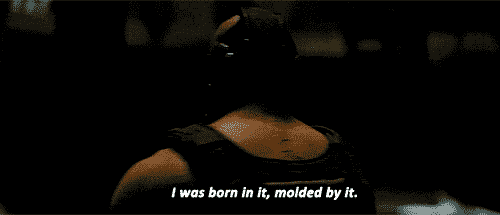
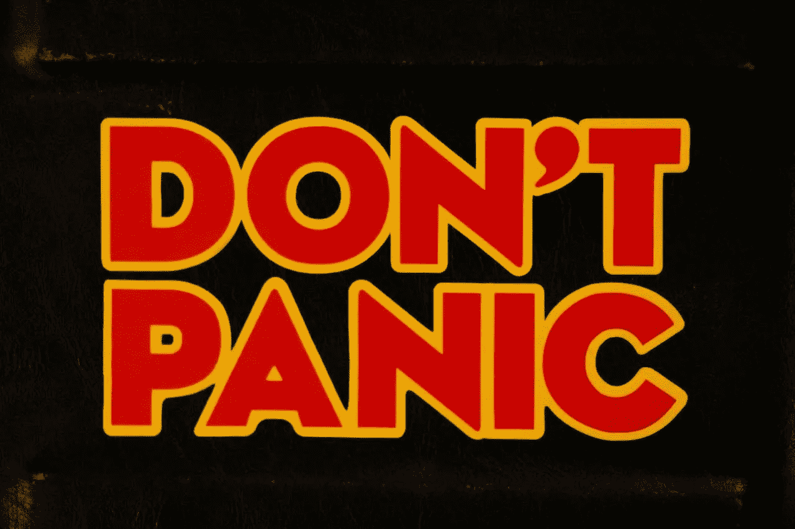
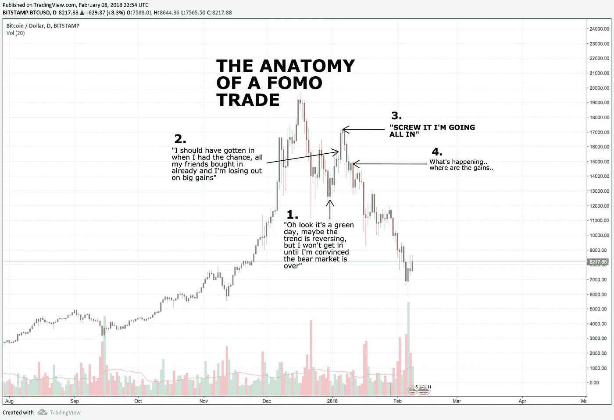
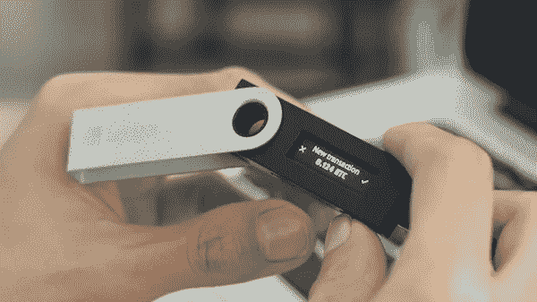

# 十大密码戒律

> 原文：<https://medium.com/hackernoon/the-cryptocurrency-commandments-part-1-investment-best-practices-4ba185258511>

## 过去一年我学到的昂贵的教训。

## 2017 年过半，我开始了我的加密货币之旅。

我不经常谈论我是什么时候开始的，因为我们处在一个根据人们看图表的天数来衡量他们价值的时代。

哪个是*可笑的*。

不要误解我的意思，我向很多 *O.G'* 致敬——如果没有这个社区的思想领袖，我不会这么快学到这么多。

但是，每当一个显然是新来的人问一些只有明显是新来的人才会问的问题时，也会有很多负面的东西。

我们应该*为好奇的新投资者照亮*道路，而不是*羞辱*他们。

我为自己从事 crypto 工作的短暂时间感到自豪。在不到一年的时间里，我设法看到了比任何传统投资者梦想的更高的回报。

我学习了新技术，自学了技术分析(在导师的帮助下)，甚至设法在几家以加密货币和区块链为重点的组织中找到了工作。

最棒的是，我觉得我甚至还没有触及表面。

我不在乎有人这样做多久了。这个行业足够年轻，几年的经验不会让任何人有太多的领先优势。几年的优势可能会被更努力、更聪明的工作以及为社区带来比其他人更大的价值所抵消。

我开始投资还不到一年，我会比你做得更好。

> “你认为你花在交易密码上的时间是你的盟友？
> 
> 你只是采用了密码。
> 
> 我生在熊市，被熊市塑造。
> 
> 直到我已经是一个男人了，我才看到绿色的蜡烛。"

*I’ve been waiting for an opportunity to pull this quote out.*

我在 2017 年的大熊市中受过洗礼(*我想没有人这么称呼过，但我要跟它一起滚*)。

我第一次买硬币，是在 6 月 6 日或 7 日以太币(ETH)创下历史新高时买的，Ether 是以太币网的燃料。当时价格刚好超过 300 美元。几周以来，我一直在研究以太坊，阅读所有关于 it、比特币和其他区块链项目的资料。

我相信以太坊将会改变世界——但是我也从一个短暂的日内交易中知道，一个人不应该在上涨趋势的末端买入。

“不要追逐绿蜡烛”，我想。

> 也就是投资者所说的“不要买已经开始的上涨趋势，因为你永远不知道它什么时候会停止”。这是著名投资名言“当街上有血的时候买入”所传达的咒语的一部分。

我耐心等待以太坊价格下降。几个星期过去了，价格继续上涨。很快，它就超过了我最初考虑投资的两倍。

我慌了。

我买了上衣。

第二天它就损失了超过 50%的价值。

我太顽固了，没有意识到亏损和套现，我决定在接下来的几个月里研究我能找到的关于**区块链**、**技术分析(TA)** 和**投资策略**的一切。

我开始倒卖以太坊。利用我从学习 TA 中学到的知识，在高点卖出，在低点买入。

我沉迷于图表模式，滞后指标，领先指标，斐波那契曲线，艾略特波浪——我深深地陷入矩阵中，我甚至忘记了我已经接通了电源。

很快，尽管以太坊仍然是我买入价值的 50%,我回到了我的盈亏平衡投资。我拥有的以太坊的数量已经翻了一倍。

虽然我可能只有不到一年的时间——我喜欢认为我是被迫进入加速计划的——在那里我要么学得很快，要么失去一切。这不是我最初的策略，但环境迫使我这样做，现在我很高兴。

我所学到的大部分知识，那些让我能够弥补损失的知识，都是最初发生的损失的结果。

“逆境就像强风。它从我们所有人身上撕裂，除了那些无法撕裂的东西，这样我们才能看到真正的自己。”—阿瑟·高顿

## 现在进入加密货币还不算太晚

此外，你有更好的机会在这个市场上超越你的同行，因为它是全天候的。

我永远是个学生，虽然我为自己的进步感到自豪，但在许多方面我仍然是个初学者。我对我正在学习的任何东西都做有条理的笔记，如果我真的想学点什么，我会把它发表出来。我发现，强行灌输我的大脑主题的最佳方式是尽可能多地摄取，然后将其提炼为易于消化的食物。

数字开胃菜。

这不是财务建议——只是描述我的旅程和我绊倒的坑洞的位置——希望你能避开它们。

我不会告诉你买什么和什么时候买，但我会告诉你我自己是如何做出这些决定的。

## **1 不要慌**

Shoutout to Hitchhikers Guide to the Galaxy

每当我认识的人开始投资加密货币并向我寻求帮助时，我知道每当市场下跌时，我都不得不让那个人冷静下来。

**不要慌。**

你陷入这个的原因和你害怕的原因是一样的，加密是非常不稳定的。让我们看到 1000 倍投资回报的同样力量，也可能造成你突然看到 90%的钱消失的情况。

过山车以极快的速度上升和下降。

还记得我告诉过你我是如何开始投资的吗？我在过山车的顶部买的。我成了规则 3 的受害者——FOMO 交易。

每当你看到一篇文章声称，由于一些国家增加监管或类似的事情，这次下跌是比特币的末日——请记住，中国已经“禁止”加密货币三次或更多次。信不信由你，比特币和其他硬币仍然屹立不倒。

## 你还不算太晚

我讨厌人们谈论想要进入加密货币，但感觉他们“太晚了”。比特币每隔几个月就会进行一次“修正”,这时它的价格往往会大幅下跌，为下一次上涨做准备——在任何一次下跌时买入，你就没事了。

**你还不算太晚。**

自 2009 年以来，在比特币下跌期间买入一直是一种成功的投资策略。

*两千零九年！*

关于我不断听到的“我现在进去太晚了”这个事实，最有趣的部分是，自从比特币达到 1 美元以来，人们一直在说同样的话。

我没骗你。

如果你深入挖掘 BitcoinTalk 论坛，你会发现早在 2014 年就有人说“哦，太晚了”的故事。

此外，我认识的所有使用加密货币的人，在某种程度上都有同样的想法。

“我太迟了”，

直到他们看到它又获得了 100%的收益，并意识到这种神奇的互联网货币并不总是有意义的。

这里有一个[链接，链接到《福布斯》2015 年的一篇文章](https://www.forbes.com/sites/laurashin/2015/12/28/should-you-invest-in-bitcoin-10-arguments-against-as-of-december-2015/#4812a84a3895)，作者概述了投资比特币的所有风险和危险，当时比特币的价格为 400 美元。

## **3 不要追逐绿蜡烛(FOMO 交易)**

我以前写过几次这样的文章，我会再写一次。

**FOMO** 交易是交易者和投资者失去技巧的一个更常见(如果不是最常见)的原因。

我们都这样做过，我当然也不能对 FOMO 免疫。每隔一段时间，当我看到一枚硬币爆炸时，我仍然发现自己离市场买家越来越近，然后才触及我仔细考虑过的限价单。这是一种难以抗拒的冲动。

## 是个**病**。

## **街上有血的时候买。**

你应该像买便宜货一样进行加密投资。研究一枚硬币的历史；缩小并观察它的整个寿命。确定一个好的切入点，并设置您的购买。当市场下跌时，我总是试图买入我想买入的任何硬币。我非常相信 Neo 和以太坊(尽管它们是竞争对手)，但我永远不会买它们中的任何一个，除非它们已经连续下跌了几天，并显示出反转的迹象。

**奖金**:我强烈建议从极小的投资开始。在你开始投资之前，你有很多研究要做。

在你开始学习之前，拿一小笔钱投资加密货币——这将激励你更经常地看图表，了解这个市场到底有多不稳定。

## **4 不要听信推特交易者(DYOR)**

Twitter 上有一些人通过提供可靠的分析和投资策略为投资者带来真正的价值。

Twitter 上甚至有更多的人，他们只是希望在买入后抽取狗屎硬币，在你抽取他们的袋子后再抛售。

这些账户中有很多会在推特上呼吁已经进入上升趋势的硬币——然后几天后发布结果，说一些类似于*“我的粉丝在 BSCoin 上预订了 583%的收益”*。

他们将冲洗并重复这一过程，直到他们拥有一支大军，现在他们将泵出他们在推特上发布的任何硬币——一些人负责任地使用这一权力，其他人则陷入黑暗面。

注意，当你知道别人是可信的来源时，倾听他们，但要得出你自己的结论，做你自己的研究(DYOR)。

## **5 不要加入泵和倾卸组**

就像 Twitter 上的几个家伙通过告诉他们的追随者购买他们已经购买的硬币来抽取他们的包一样，也有“抽取和倾倒”电报和不和谐团体，它们将承诺巨额收益。

这些的问题是，总有一个失败者，十有八九是你。

为了提升地位，提前获得交易信号，你需要邀请更多的人加入这个团队。

邀请的人越多，越早得到交易信号。

如果你加入了一个已经有大量成员的团体，你将很难邀请足够多的人来增加你的“等级”,以便在众人面前接收交易信号。

如果你加入了一个成员不多的团体，并邀请尽可能多的人加入这个字面上的金字塔计划——你就是问题的一部分。

## **6 不要买你不懂的东西**

我不确定我是否想包括这条戒律。老实说，我现在投资的一些硬币完全是基于它们的走势图。我可能对一家公司一无所知——如果我看到足够多的积极买入信号和价格历史来支持它——我会进去。

我发现，当我研究极短期交易(0-3 周)的硬币时，关注技术分析比基本面分析能给我带来更大的回报。这只是我的看法——我不建议买入你没有做过研究的硬币，除非你也像我一样是一名 TA 极客。

对于长期投资，你绝对需要 DYOR。我在加密方面最大的%收益是我的长期投资袋。在我开始钻研加密技术的时候，我会把这些钱都倒到 FOMO 去做其他交易——但我已经从错误中吸取了教训。

当我看着一枚我打算长期持有的硬币时，我会想到最坏的情况。

如果 crypto 明天象征性地被烧成灰烬，这枚硬币会是少数几枚幸存下来的硬币之一吗？

当谈到加密货币时，我是一个整体的多头，但我也相信这个市场上有一个令人震惊的金额，其中有非常少量的有意义的用例已经成功执行。

区块链技术有可能给这个世界带来重大影响，但目前区块链项目取得成果的一些最大例子是[Trx supplies](https://tron.game.com/#/home)和[cryptokities](https://www.cryptokitties.co/)。

也就是说，我预见到未来的清算，绝大多数(99%)的加密货币将逐渐消失，剩下的是那些解决严重普遍问题(或简化现有流程)的加密货币，同时获得比竞争对手更多的市值。

在这种假设下操作，意味着我短期交易的大部分硬币，如果不是全部的话，不会通过我的长期持有筛选。

例如，我不认为 Verge (XVG)会通过时间的考验，但我确实认为它在不久的将来会增长 2 到 3 倍，我会一直持有它，直到它通过时间的考验，否则我会被证明是错误的。

另一方面，ETH 和 NEO 是竞争对手。它们解决了同样的问题，都是市值很大的硬币，我都把它们作为长期投资。我不会通过投资竞争对手来对冲我的赌注。对我来说，这两个实体在未来以类似于苹果和三星共存的方式共存是可行的。

我相信他们都有太多的资金，太多的支持，以及太大的社区来彻底失败。

## **7 交易所的钱不属于你**

我知道每个人和他们的母亲都在 Reddit/Twitter 上宣扬这一点，所以我不会在这方面花太多时间。

这违背了分散货币的目的——在分散货币中，你可以完全控制，不需要第三方来存储或转移你的钱——信任第三方来存储和转移你的钱。

在过去，信任第三方(交易所、矿池、甚至赌博网站)已经导致了大量加密货币的损失。

在 Mt.Gox 上阅读，这是第一个开放虚拟大门的比特币交易所。你将开始理解在一个不信任的系统中不必要地信任第三方的危险。

那你是做什么的？

下载你持有的加密货币的官方钱包，并存储在那里。另一种选择是购买 Ledger Nano 或 tre zor——这两种硬件钱包在外观上与拇指驱动器相似。

Ledger Nano S

## **8 不要保证金交易**

如果你不知道什么是保证金交易，直接跳过。根本不用查。这很危险，也是快速输钱的非常有效的方法。

保证金交易是利用杠杆进行交易。这意味着我可以将 100 美元存入保证金账户，并获得 3 倍于我交易余额的购买力。

这也意味着，如果我交易我余额的 3 倍(300 美元)，而我的头寸是-100 美元，我将失去我所有的抵押品。

我在短时间内赚的钱比我一生中通过保证金交易赚的都多。

通过保证金交易，我也比以往任何时候都更快地失去了更多的钱。

## **9 如果你做保证金交易，千万不要用比特币做抵押进行保证金交易**

我知道你不会听我的。

既然你仍然想进行保证金交易，至少要注意以下建议:

千万不要用比特币作为你保证金交易的抵押品。

千万不要把比特币放进你的保证金账户，用那个比特币赋予你的购买力去开多头或者空头。

我想不出更好的方式来表达。

**不要这样做。**

如果你要进行保证金交易，利用菲亚特。这是我刚开始融资融券交易时别人告诉我的。有一段时间我没有做到，但是神一样的连胜之后，我觉得不可触摸。

在大约 2 个月的时间里，我没有进行亏损的保证金交易。我的账户余额激增。我一直虔诚地每周从我的保证金账户中取出我的利润来购买 BTC，并作为长期持有。这是我投资策略的一部分。用保证金交易来增加我真正相信的硬币的持有量。

有一天，我看到了一个我认为可以让我致富的机会。

市场刚刚结束了比特币涨到 20，000 美元的牛市。我已经平仓了我的大部分保证金头寸，并从这次挤兑中获得了丰厚的利润——此时，我只是耐心地坐在那里，我所有的保证金余额都在我手中。

我在等待**蘸**。

当 BTC 跌到$10K，又反弹到$13K 时，我以为我得救了。我被我的连胜冲昏了头脑。

确认偏见是一个婊子。

我全押了几个多头头寸。几个月来，我从未见过一些我最喜欢的硬币价格如此之低，这感觉像是有史以来最大的一次拍卖。

*第二天，大盘下跌。*

我已经完全透支了可用的杠杆，我唯一可用的资金是我每周留出的 BTC 利润。

我把它们存入我的保证金账户，给自己更多的喘息空间来避免清算。

如果我就此打住，我会没事的。

在把 BTC 转入我的保证金账户后，我发现我利用 BTC 交易的余额比我意识到的要多得多。我仍然觉得自己是半个上帝，所以我决定加倍下注。

“*什么都没有改变…我仍然相信市场会在几天内调整过来…我不会拿着一手弱牌而意识到损失*”，我心想。

第二天，市场下跌。

我吓坏了几天，直到我醒来被清算。

我在两个月的狂欢中赚的钱大部分都没了。

## **10 没有策略不要交易/投资**

我的下一篇文章将深入探讨创建你自己的投资策略。

你不应该在没有战略和目标的情况下投资。

你的战略将包括你用来达到目标的策略。

例如:如果我的目标是在 2018 年第四季度拥有 X NEO、X ETH、X BTC 和 X ETC。

我的策略将包括我计划使用的所有方法，以增加我在目标中的长期持有。

没有计划就是计划失败——或者童子军是这么说的。确定你的目标，并手写下来。

我所学到的大部分东西都是我刚开始投资就遭受巨大损失的结果。

如果你只能从这件作品中得到一样东西，我希望是这个:

**不要惊慌，如果你的第一笔投资不顺利，也不要放弃。把它作为一个机会来反思是什么让你犯了这个错误——并寻求教育来把你自己拉出困境。**

逆境就像一股强风，你可以带着它跑得更快，或者你可以坚守阵地，让它把你撕成碎片，除了绝对必要的东西。

— — — — — — — — — — — — — — — — — — —

# 想了解更多？

## 如果你喜欢这篇文章，请随意看看我最近的一些作品。

 [## 不熟悉加密货币？从这里开始

### 加密货币、比特币和区块链速成班

medium.com](/swlh/new-to-cryptocurrency-start-here-44cc5a6d6626)  [## 了解加密货币市场周期，以便更好地投资

### 为什么以太币、莱特币和其他替代币会在比特币创下新高时下跌，以及如何利用这一点

medium.com](/swlh/understanding-cryptocurrency-market-cycles-for-better-investments-c6cc4bc80099)  [## 加密货币的未来

### 鸟瞰是什么导致了加密市场的兴起

medium.com](/swlh/on-the-future-of-cryptocurrency-e8ff9e171be9)  [## 关于 Facebooks 加密货币你需要知道的一切(Libra 项目)

### 我阅读了 Project Libra 白皮书，所以你不必这样做。

medium.com](/swlh/facebook-crypto-d13449171a9f)