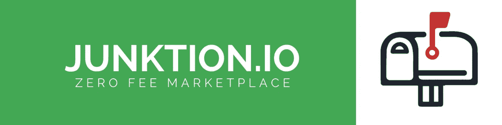
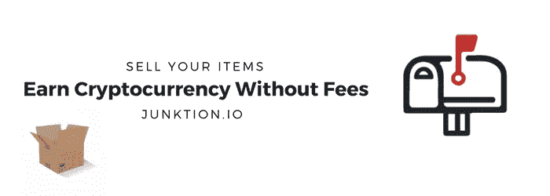
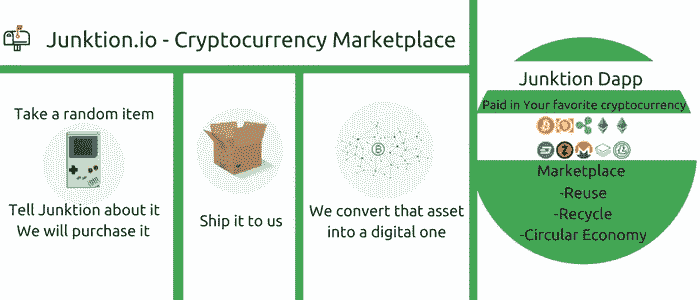
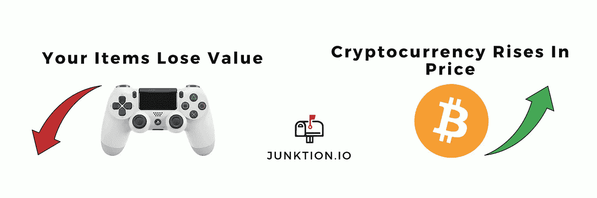
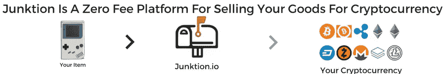
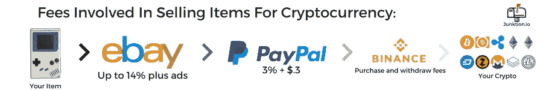

# 易贝的加密货币版本——在线卖家的家园

> 原文：<https://medium.com/hackernoon/the-cryptocurrency-version-of-ebay-homebase-for-online-sellers-a4ccf69b9034>

像易贝一样，Junktion 也肩负着为客户发现“价值和独特选择”的使命。Junktion 正在为你的商品建立一个加密货币市场，易贝卖家会特别喜欢。[加入我们的争论](https://discord.gg/HbC5BNR)告诉我们应该先构建哪些功能，或者回答您的问题。

这篇文章的目的是让潜在的卖家更好地了解我们正在建设什么。简单来说，我们就是加密货币版的易贝。想想类似于易贝的东西，但是更加个性化。我们还为卖家节省了高达 13%的费用。Ebay 卖家现在有了一个不会接管他们业务的渠道

> *废品是实物和数字资产之间的桥梁。*

# 我们正在招募易贝卖家在我们的平台上销售。

我们正在招募那些希望在我们目前正在开发的[易贝平台](https://junktion.io/sell-on-our-marketplace/)上销售和列出他们的项目的人。如果你是某种类型的在线卖家，并在这张表格上注册[，你就有资格获得我们的一些碎代币。现在注册的用户将被视为我们的测试用户。我们将大力推广他们的客户，并尽最大努力确保在我们的平台上取得成功。](https://junktion.io/sell-on-our-marketplace/)

# 我们的愿景

Junktion 是由一位前易贝卖家建立的，他希望建立一个更好的在线市场。对卖家，由卖家。

我们设想一个开放的在线市场，人们可以用他们想要的任何货币，法定货币或加密货币来出售他们的物品。一个你的物品受人喜爱，被视为珍宝的地方，因为你想看到它们进入另一个买卖循环。人们可以不断以旧换新的循环经济。请把你的东西放在可以称之为家的地方。我们最终预见到每一个与区块链技术和 Junktion 有关的项目都在引领潮流。使用我们正在创造的技术，你将能够找到你几年前出售的确切物品。

我们预见一个更加数字化和开放的经济。在外人看来，我们的电子商务市场是 ebay 和 cryptokitties 的结合。我们正在建设的是电子商务的未来。我们的在线市场将拥有区块链丰富的未来特色，这是像易贝和亚马逊这样的在线销售平台做梦也想不到的。我们愿意打造消费者想要的东西，而不是对我们最有利的东西。这就是为什么我们是一个关注用户体验的零费用在线市场。

# 我们如何使用区块链技术

Junktion 是一家利用以太坊区块链技术来实现点对点电子商务市场的公司，该市场将为客户提供最佳的用户体验，因为我们允许我们网站上出售的商品讲述一个故事。网站上出售的每一件商品都有一个独特的故事。你和我可能都拥有 Iphones，但每个人都不一样。同样的品牌和型号，却因为拥有者而独一无二的不同。我们允许用户有能力跟踪他们的项目，他们正式拥有，并在我们的易趣类市场出售。

我们希望在我们的平台上创建 ebay 卖家想要的功能。我们关心你的项目，并希望让卖家成为我们业务中最重要的部分。加入我们不和谐的对话。

我们计划像 dapp 一样在我们的易贝中加入美元，但也希望通过接受以太坊来支持我们正在使用的技术。短时间内，以太坊将是我们的主要货币。我们确实有自己的加密货币，我们会给任何想成为早期采用者的人。早期采用者是认真对待网上销售的人，他们会在我们的易贝 like marketplace 上列出一些或更多的商品。

如果您已经在 Ebay、Amazon 或 Etsy 等平台上销售，并且正在寻找其他销售渠道，请不要犹豫，在我们的市场上销售，甚至是直接向我们销售您的商品的。

# Junktion 对 Ebay

销售的未来无疑是垃圾。像 ebay 这样融入了区块链元素的网站是在线销售的未来。我们正在为那些希望通过他们的在线商店赚更多钱的人建立一个家园，这些商店可能是在像 ebay 这样的网站上。我们正在开发令人难以置信的技术，让用户在双方都有更好的体验。市场中有两个交易者。买方和卖方。易趣在所有交易中都非常重视买家。Junktion 将专注于卖家，并为卖家建立我们的平台。我们想让用户尽快在我们的基础上建立他们的业务。

> 根据美国的说法，经济的支柱是小企业。而不是从他们那里买东西的人。为什么它应该在易贝和亚马逊这样的在线市场上落后。

随着这篇文章的发布，我们试图在一个公开的[垃圾不和谐](https://discord.gg/HbC5BNR)中组织我们的卖家社区，讨论不同的问题、功能，并围绕我们开放的在线市场建立一个社区。填写我们的表格，加入我们的不和谐将是在线卖家在一个更优秀的 ebay dapp 的开发过程中表达自己意见的首选方式。

# 什么是 dapp

易趣就是你所说的网络应用。它是一个用于网络的应用程序。dapp 是一个分散的应用程序。所有这一切意味着它与以太坊区块链交流。

# 一个不同的在线市场

我们计划使用以太坊来让用户追踪他们发送的货物的去向。例如，知道一件你在情感上依恋并出售的物品在另一个主人那里过着另一种美好的生活，直到 5 年后他们把它卖给了另一个人，这将是一件非常美妙的事情。如果您对此功能感兴趣，请在我们网站的底部注册订阅我们的时事通讯。随着开发的进展，我们将更详细地介绍它。

# 定义我们的市场 dapp

我们的市场 dapp 有一个光明的未来，因为我们知道在线市场的支柱是卖家。我们的在线市场将专注于确保在线商店的所有者能够成功。我们想给人们一个平台，去创造一个商店，一个品牌，一种生活。我们希望用户在我们的基础上建立他们的业务，并允许普通人成功地清理，继续前进，并最终出售他们的物品。

# 像易贝这样的网站

像易贝这样的网站不时出现，但事实是它们都没有垃圾邮件的一半潜力。我这样说是因为我们的网站是为你而建的。在网上做生意的人，这些网上市场的卖家。区块链解决了很多物流、资金和自动化方面的问题，这是其他类似易贝的网站所没有的。目前，只有大型组织才能使用区块链电子商务解决方案。在线市场的区块链解决方案将对世界和密码价格产生巨大影响。我们是像易贝一样的区块链网站，我们在这里创新电子商务，改变我们对商品和我们拥有的东西的看法。

# 费用结构

易趣有一个破碎的收费结构，非常有利于所有交易中的买家。如果你想从易贝转移资金来购买密码，你将会支付一大笔费用。它看起来会像这样。

易贝强迫卖方支付不必要的费用。这是 Junktion 将要解决的一个基本问题。Ebay 胁迫其平台用户支付多项费用，而这些费用是他们不需要的，也是应该免费获得的。Junktion 将是一个零费用的平台。人们将要支付的唯一费用是以太坊交易的汽油费。

> *Ebay 向卖家收取少量费用来购买垃圾网站上免费的功能*

# 比特币、以太坊和加密货币市场

比特币市场是一个接受比特币作为支付形式的电子商务网站。我们并没有把比特币作为我们的货币。目前，我们的主要货币是美元和以太币。比特币市场的目标往往是分散交易。这不是我们的目标。我们希望为创业者创造一个免费的市场，在此基础上建立业务。

还有其他一些与区块链和比特币相关的电子商务市场初创公司，它们的优势远不如 Junktion。许多这样的项目旨在分散贸易。这是 Junktion 想要尝试和避免的事情。我们希望尽可能做到合规和用户友好。创建一个免费的在线市场并不需要推翻政府。分散的市场是欺诈、非法活动和诈骗的天堂。我们不想参与其中。我们不是毒贩，也不会有去中心化交易所喜欢的毒品或者其他对象。我们将关注合规性、透明度和用户体验。

*最初发表于*[*junction . io*](https://junktion.io/the-cryptocurrency-version-of-ebay/)*。*