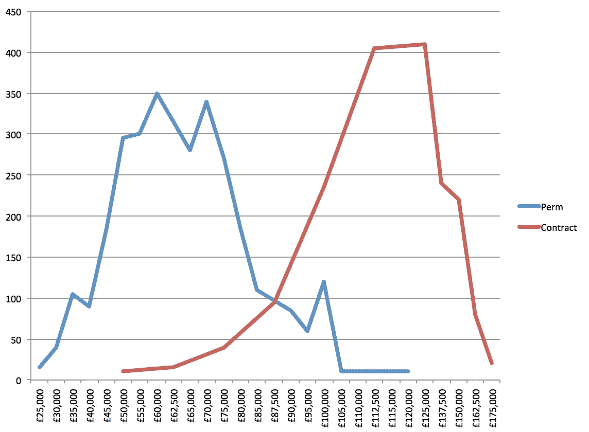

# 首席技术官短缺和管道破裂

> 原文：<https://medium.com/hackernoon/the-cto-drought-and-the-broken-pipeline-71e6bf1c0ebb>

[https://www.flickr.com/photos/pulpolux/3932292651](https://www.flickr.com/photos/pulpolux/3932292651)

## 上周末，我在推特上写道

一开始只是一条一次性的推文，最终却引起了相当大的反响。它甚至吸引了经验丰富的[首席技术官](https://hackernoon.com/tagged/cto)保罗·罗宾逊的[职位。](/@p7r/the-problems-of-the-cto-role-c2a143a1cec7)

正如保罗在文章中强调的，首席技术官有多种形式和规模。奇怪的是，大多数都是非技术性的。然而，我在这里谈论的是技术 CTO，他们可以在一个拥有 50-200 名员工的公司中领导技术。能够管理几个团队、利益相关者并为公司整体的成功做出贡献的人。这些公司通常已经筹集了几轮资金，或者收入丰厚，现在正在寻求增长。

那么问题出在哪里呢？答案在于伦敦开发商市场的双峰薪酬。那到底是什么意思呢？伦敦的开发者角色有两种类型。永久和合同。

永久的，那是传统的用工模式。你一个月领一次工资，有 30 天的假期，如果工作出色，可能还有一点奖金。工资通常在 35000 到 80000 英镑之间，很少会更高。这里有一个问题:没有足够的 permie 开发人员来承担所有这些角色。因此，如果你有急需写作的资金和软件，你需要给自己找一个承包商。

承包商按日计酬。没有假日工资，没有奖金，从法律上讲，承包商是组织之外的。这意味着除了编写软件之外，没有义务履行职责。如果你遵循政府用来定义承包商的 IR35 规则，甚至不需要准时出现。承包商的报酬在某种程度上取决于技能和经验，但往往在每天 400 至 700 英镑的范围内。

现在我们来看一些图表。我已经从[的 IT 工作观察](http://itjobswatch.co.uk/)中提取了伦敦 permie 和 contract React 开发者的数据。我们把日薪换算成年薪，比较一下。

为什么不同？公司倾向于根据他们的内部政策来决定员工的工资。也就是说，他们支付给开发人员的工资不能比支付给其他专业人员的工资高出几倍。公司需要保持平衡，平均分配稀缺资源。否则，会计师会对开着法拉利的开发商感到不安，而他们却不得不挤上拥挤的火车。然而，我们已经确定没有足够的开发人员。为了让投资者和客户满意，软件仍然需要编写，功能仍然需要发布。这就是公司被迫雇佣承包商来完成工作的地方。在合同市场中，价格是由供求关系决定的。如果你想要质量，你需要支付现行价格。

大多数开发人员已经意识到了这种差异。一旦你有了几年的工作经验，你可以简单地递交你的通知，发电子邮件给一个友好的承包商招聘人员。这封邮件会让你每天的总收入从 6 万美元增加到 500 美元(12 万美元)。这相当于 2 倍的增长。对于一封邮件来说还不错。

让我们回到我们的 CTO 荒。要成为一名有效的技术 CTO，你需要比大多数人更了解技术。你需要能够管理利益相关者。你需要让你的员工感到快乐和支持。你也需要为任何意外承担责任。顺便说一句，一次严重的事故可能会让你丢掉工作，并影响你找到另一份工作的能力。这些角色工资多少？在 9 万到 12 万之间。略低于一般承包商，但压力大得多，要求也高得多。

那么，我们如何解决这一困境呢？首先，公司需要开始从整体上考虑他们的开发者管道。第一步:开始雇佣初级员工。

我听到你说什么？你没时间训练大三学生？你曾经雇佣了一个低年级学生，他们很糟糕？

> 认识到初级开发人员不是一个单位。

我经营一所培训初级开发人员的学校。我有一屋子背景、兴趣和能力各不相同的人。一些人仍在习惯于[编程](https://hackernoon.com/tagged/programming)，而另一些人则在勇往直前。他们的一个共同点是他们对学习和成长的热情。正确的支持会让他们成为可靠的开发人员。

那么，雇佣初级员工对你寻求首席技术官有什么帮助呢？

> 您的高级开发人员需要时间和实践来成长为那个角色。

为此，他们应该尽早接触到 CTO 需要解决的问题。不仅仅是技术技能，还有软技能和组织能力。

学习的最好方法之一是教学。没有什么比简明扼要地解释某件事更能暴露你知识中的空白了。

> 领导的功能是产生更多的领导者，而不是更多的追随者
> 
> 拉尔夫·纳德

十年前，我为一家对冲基金工作。我的老板给他的员工布置了同样的三项任务。两个是具体的工作，但一个是不断改进过程，并确保其他团队成员向你学习。简单来说:

> 如果你没有让团队中的其他人和你一样优秀，你就没有做好你的工作。

如果你是 React 方面的专家，而其他人却很难理解状态和道具之间的区别，那么你的工作就是解决这个问题。

如果你想培养下一代技术人才，你需要发展一种导师文化。不仅大三学生学得更快，大四学生也会成长。他们将获得信心和能力来迎接更大的挑战。如果你做对了，也许你的 CTO 就不会承受巨大的压力，因为他们会有一个有能力的团队来支持他们。

这是关于发展你的才能的最好的一点:你的上司会对他们的团队和产品有更大的自主权。他们会发展他们自己的才能，并且会非常不情愿的离开他们。要花更多的钱把它们剥掉需要更多的说服。不仅如此，当你寻找新的首席技术官时，你面前会有一大堆现成的候选人。

开发人员不是一台喝咖啡输出代码的机器。他们有梦想和抱负。你可以在实现这些目标的过程中发挥作用，或者他们可以在其他地方发挥作用。请记住，你比他们更需要他们。

所以，下次有人在你的公司说“我们不雇佣低年级学生”，想想这对你的公司意味着什么。你和其他人一样在争夺同样稀缺和昂贵的开发者。你可以通过努力获得晋升，也可以开始在内部培养自己未来的领导者。

*德米特里·格拉博夫是* [*建造师实验室*](http://constructorlabs.com) *的创始人，他在伦敦经营一个为期 12 周的* [*JavaScript 训练营*](http://www.constructorlabs.com/course) *。下一批将于 5 月 29 日开学，学费为 3000 英镑。* [*申请现在已经打开*](http://constructorlabs.com/admission) *。*