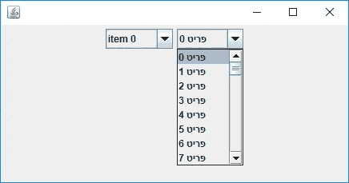
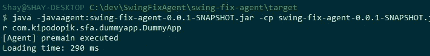

# Java swing 中希伯来语渲染的奇特案例

> 原文：<https://medium.com/hackernoon/the-curious-case-of-hebrew-rendering-in-java-swing-2c656537c98b>

我最近遇到了一个有点深奥的问题:Java Swing 应用程序的渲染性能。等等，什么？2018 年谁用 Swing？嗯，说到桌面应用程序，Swing 仍然有几个优势:它是平台无关的(这是 Java 的一部分特性)，健壮，丰富和强大。当然，它也有缺点，但这不是我们今天的话题…

## 希伯来语(实际上非英语)字符串呈现性能

在我从事的一个项目中，有一个奇怪的问题:渲染一长串希伯来语字符串要花很多时间。我说的是当一个列表被渲染时，几秒钟的 GUI 被冻结。当我用英文(ASCII)字符串替换列表项时，一切都很顺利。

在深入研究了代码之后，看起来问题的根源在 Swing 代码的内部——在 JRE 本身的一个类中。幸运的是，Java 是一种开源语言，所以我能够深入研究 JRE 类并找到这个缓慢渲染问题的原因。

## 如何测量弦

让我们看一个简单的例子:一个 JComboBox，带有一个基于字符串的模型。这是基本的 Swing 组件之一，基本上由一个输入字段和一个下拉列表组成。

A simple test application with two JComboBoxs (the right one is populated with Hebrew strings)

当这个组件呈现在屏幕上时，列表中的字符串应该绘制在屏幕上。在呈现过程的某个时刻，会计算字符串的宽度，以确定列表的维度。有趣的部分来了:ASCII 字符与非 ASCII 字符的处理方式不同。在我们看代码之前，理解为什么 ASCII 和非 ASCII 字符被不同地处理是很重要的:在一个只包含 ASCII 字符的字符串中，我们可以有把握地说字符串的宽度等于构建它的字符的宽度。这句话听起来微不足道，但事实上并不是所有语言都如此，正如在 [Java 文档](https://docs.oracle.com/javase/8/docs/technotes/guides/2d/spec/j2d-fonts.html)中所解释的:

> 字形是一个或多个字符的可视表示。字形的形状、大小和位置取决于它的上下文。根据字体和样式，可以使用许多不同的字形来表示单个字符或字符组合。
> 
> 例如，在手写的草书文本中，特定的字符可以呈现不同的形状，这取决于它与相邻字符的连接方式。"

记住这一点，让我们来看看`FontDesignMetrics`类中一个名为`stringWidth`的方法内部的代码([这里是原始源文件](http://hg.openjdk.java.net/jdk8/jdk8/jdk/raw-file/687fd7c7986d/src/share/classes/sun/font/FontDesignMetrics.java))。顾名思义，该方法获取一个字符串，并在呈现后返回它的宽度(以任意印刷单位):

The original stringWidth method (from the FontDesignMetrics class)

我想特别注意从第 473 行开始的 for 循环(在上图中)。这个循环遍历被测字符串的字符。在 ASCII 字符串的情况下(0x100 等于十进制 256)，宽度聚合为字符宽度的总和。字符宽度通过`getLatinCharWidth`方法获得，该方法使用内部缓存优化性能。

那么非 ASCII 字符呢？如果对`FontUtilities::isNonSimpleChar`(第 477 行)的调用将返回 true(对于希伯来字符来说，确实如此)，那么将计算整个字符串的宽度，并且 for 循环将会中断。这意味着每个字符串必须作为一个整体呈现，以确定其宽度。这正是我们性能问题的原因。

有趣的部分来了。在大多数情况下，我们可以像对待拉丁字符一样对待希伯来字母。换句话说，我们实际上可以说希伯来语字符串的宽度等于其字符的总和。考虑到这一点，我们可以只计算一次每个希伯来字符的宽度，并缓存结果(基本上与拉丁字符得到的处理相同)。

下面是修改后的代码:

The revised stringWidth method

在第 481 行，希伯来字符(值在`0x0590`和`0x05ff`之间的字符)现在被区别对待，使用缓存的值将宽度累加为字符的总和。

## 替换一个 JRE 类。

这在理论上很棒——但现在我们面临另一个问题。`FontDesignMetrics`类驻留在`sun.font`包中，它是 JRE 运行时 jar (rt.jar 文件)的一部分。当 Java 类加载器寻找一个类时，它首先扫描引导类(包括 rt.jar ),如果在那里找到了该类——将使用该类的这个版本，所以我们不能通过将它克隆到我们的[代码库](https://hackernoon.com/tagged/codebase) ( [参见 Java 文档](https://docs.oracle.com/javase/tutorial/ext/basics/load.html))来隐藏原始类。怎么还能用这个类的自定义版本？有许多选项，在[这个有趣的 stackoverflow 线程](https://stackoverflow.com/questions/33631419/replace-a-class-within-the-java-class-library-with-a-custom-version)中也有讨论:

1.  更改源代码并重新构建 JRE 二进制文件。这个选项有很多缺点:首先，这不是一个简单的任务。此外，客户将不得不在他们的机器上安装我们的修订版 JRE，使他们暴露于可能的安全漏洞。此外，还有交易的法律方面(尽管使用 OpenJDK 应该不成问题)。最后——因为单个类中的微小变化而重新构建 JRE 就像用大锤砸坚果一样…
2.  使用`Xboothclasspath/p` JVM 标志将类添加到类路径中。这是一个非标准的标志，由于许可证问题(它“违反了 JRE 二进制代码许可证”，如 [java 命令文档](https://docs.oracle.com/javase/8/docs/technotes/tools/windows/java.html)中所述)，它不打算用于生产。
3.  使用 Java instrumentation API 在运行时替换类文件。我相信这是最优雅的解决方案——所以让我们看看它的实际应用吧！

## 构建 java 代理

Java instrumentation API[允许运行时字节码操作。这个 API 是通过使用 Instrumentation 对象来访问的，该对象是以一种特殊的方式获得的，甚至是在调用 main 方法之前。](https://docs.oracle.com/javase/8/docs/api/java/lang/instrument/package-summary.html)

要获得这个特殊的对象，必须实现一个 Java 代理——一个具有特殊清单属性的 JAR 文件和一个实现`premain`方法的类。顾名思义，这个方法由 JVM 在程序的 main 方法之前调用，并获取一个 Instrumentation 对象的实例作为参数。

代理代码可在[这个位存储库](https://bitbucket.org/ShayArtzi/swingfixagent/)中获得。代理类包含`premain`方法，如清单文件中所示。在这个方法中，我使用了 Instrumentation 实例来注册一个`ClassFileTransformer`实现，它能够在运行时拦截类加载器调用并替换请求的类。当这个代理处于活动状态时，将检查对类加载器的每个调用，如果请求的类是我们想要替换的类，它将返回该类的修改版本。

## 结果

那么…真的有用吗？下面是测试应用程序的加载时间:

*   没有代理注入修改的类 7232 ms
*   有了代理，仅需 290 毫秒！

Test application loading time without the agent — more than 7(!) seconds

Now with the agent — less than 300ms…

## 最后的想法

在大多数情况下，引入对 JRE 类文件的更改可能不是最好的主意，但有时别无选择:Swing 维护并不是语言路线图中的首要任务。

当然，对于这个问题，我们可以采取另一种方法:通过在内存中保存完整的列表模型并在必要时提供列表，简单地不呈现长列表。这解决了渲染性能问题，但增加了代码的复杂性。

不管怎样，我认为从 JRE 和工具 API 的这个小旅程中可以学到很多东西。

这篇文章中的所有代码都可以在[我的 Bitbucket 知识库](https://bitbucket.org/ShayArtzi/swingfixagent)中找到。