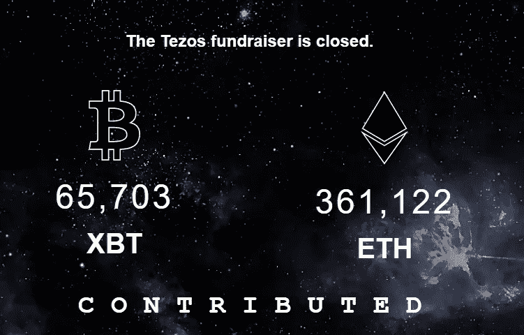
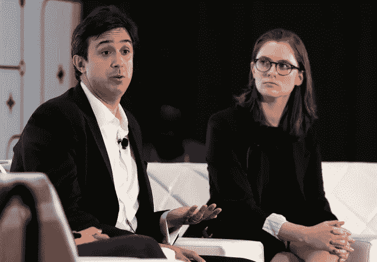
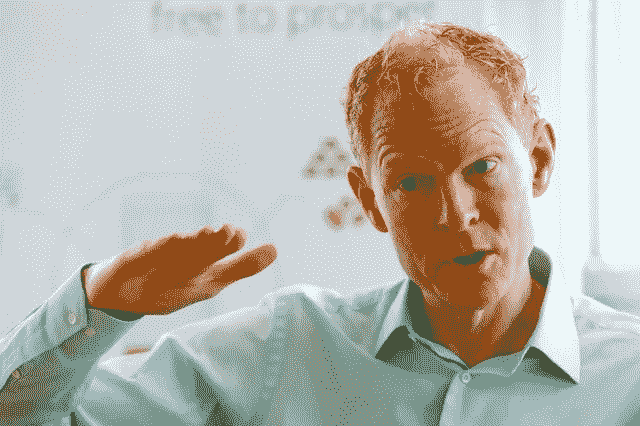
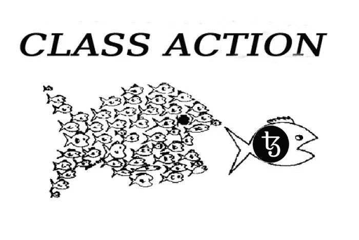
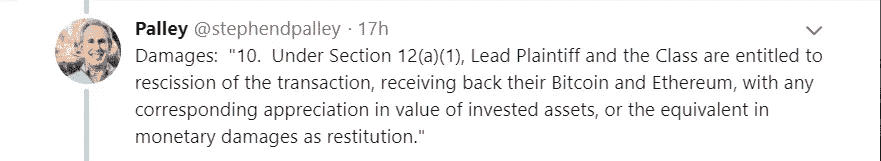

# Tezos 的奇特故事——从 2.32 亿美元的 ICO 到 4 起集体诉讼。

> 原文：<https://medium.com/hackernoon/the-curious-tale-of-tezos-from-a-232-million-ico-to-4-class-action-lawsuits-6f411b7aad7e>

就在 8 个月前，一个名为 Tezos 的区块链项目通过首次发行硬币筹集了 2.32 亿美元。这是有史以来最大的 ICO。创立这个项目的年轻夫妇亚瑟和凯瑟琳·布莱特曼筹集的资金超过了他们最大胆估计的 10 倍。8 个月后，这对夫妇和这个项目面临*起*起集体诉讼。事情怎么会变得如此糟糕？

# **2017 最炒作 ICO**

Tezos 被承诺为一种不会有任何治理问题的加密货币。

这个想法很酷:Tezos 将允许任何开发者对加密货币的代码库进行技术改进。然后，所有 Tezos 持有人将进行投票，如果结果是肯定的，这一改变将被采纳，开发商将获得“Tezzies”奖励。

回报将吸引来自世界各地的开发者。投票系统将确保 Tezos 不会遇到比特币过去几年面临的治理问题。该项目甚至将支持智能合约的部署(就像以太坊一样)，有了蒂姆·德雷珀作为投资者，该项目似乎是合法的。

Tezos raised over 65.000 Bitcoin and 361.000 Ether!

和许多区块链公司一样，布雷特曼夫妇在瑞士建立了一个基金会。该司法管辖区相对的法律确定性和*自由放任的银行监管历史传统上使其成为对区块链公司有吸引力的选择。泰佐斯展示了为什么情况并非总是如此。*

由于以太坊和比特币价格的升值，ICO 期间筹集的资金现在价值超过 5 亿美元，由 Tezos 基金会接收。

然而，布莱特曼夫妇本身并不是这个基金会的一部分。相反，布雷特曼夫妇拥有一家在特拉华州注册的公司，名为动态账本解决方案公司(DLS)。

这个想法是，一旦 ICO 成功，基金会将购买 DLS 及其所有产权。布莱特曼夫妇和他们的投资者将获得所有募集资金的 8.5%，以及所有代币的 10%。换句话说，他们将获得大约 4000 万美元。

Arthur and Kathleen Breitman

# **天堂里的烦恼**

瑞士法律要求基金会及其董事会成员保持独立。由于基金会将从布雷特曼的美国公司购买知识产权，布雷特曼不可能进入基金会的董事会。

因此，他们任命楚格加密谷协会的创始人约翰·格弗斯为董事会主席。这是一切开始走下坡路的地方。

Johann Gevers

由于瑞士基金会没有严格的所有权结构，谁控制了基金会的董事会，谁就控制了基金会本身。因此，泰佐斯筹集的所有资金现在都在盖弗斯和另外两名董事会成员的控制之下:迭戈·庞斯和吉多·施密茨-克鲁马赫。

没过多久，Breitman 夫妇和 Gevers 就闹翻了，这件事通过路透社的一篇文章痛苦地公之于众。

显然，布雷特曼夫妇已经向基金会的另外两名董事会成员发送了一封 46 页的信，呼吁立即解除盖弗斯的职务，并寻求在一个限制基金会责任的新结构中赋予这对夫妇“实质性的角色”。在信中，布雷特曼夫妇指控盖弗斯进行自我交易、自我推销和利益冲突。

此外，这对夫妇还声称，盖弗斯试图向其他两名基金会成员施压，索要价值 150 万美元的奖金，但“谎称奖金只值 30 万美元。”在 Medium 上的一篇名为[‘The way further’](/@arthurb/the-path-forward-eb2e6f63be67)的帖子中，他们重复了对约翰·盖弗斯的指控，并表示他们“一直在与泰佐斯基金会合作解决此事，并主张将他从基金会理事会中除名。”

作为对罚款的回应，盖弗斯否认了所有指控，并回应道:

> “这是企图暗杀人格。这是一长串误导性陈述和彻头彻尾的谎言。[……]另外两名董事会成员正试图发动非法政变。”

很难对所发生的一切进行完整的叙述，因为一些公开声明已经被删除。我想情况从一开始就不是非黑即白的。但有一点是明确的:旨在解决区块链治理问题的加密货币 Tezos 因治理问题而崩溃，这具有一定的讽刺意味。

# 集体诉讼

当然，如果你刚刚在不遵守证券法的情况下筹集了 2.5 亿美元，公开诽谤比赛是你最不想做的事情。

所有这些戏剧性事件的结果是，Tezos 网络的推出被大大推迟,“Tezzie”期货损失了超过 50%的价值。自 Tezos 承诺在“2-4 个月内”推出以来，已经过去了 11 个月。

与此同时，特佐斯的投资者(特佐斯喜欢称他们为“捐赠者”)仍未收到他们的代币。

这肯定会引起法律诉讼，事实上，愤怒的投资者已经对 Dynamic Ledger Solutions，Inc .、Breitmans 和 Tezos 基金会提起了四起集体诉讼。【参见案件编号 3:17-cv-6779-RS；3:17-cv-6829-RS；3:17-cv-6850-RS(全部在加利福尼亚州北部地区)和案件号№6:17-cv-1959-ORL-40-KRS(在佛罗里达州中部地区)】

Class actions against Tezos.

一般的抱怨是:

*   出售未注册证券
*   对资金将如何使用的虚假陈述
*   对网络何时激活的虚假陈述
*   根据州法律指控虚假广告、不公平竞争和欺骗性贸易行为

第一个问题是出售未注册证券，这是每个案例中最重要的方面。在 ICO 期间，Tezos 称这些捐款是“不可退还的捐赠”，而不是投机性投资。然而，就像几乎所有 ICO 的情况一样，我相信 Tezos 将勾选*豪威测试*的方框，并被视为一种证券(投资合同)。

长话短说，布莱特曼一家毫发无伤的可能性很小，因为出售未注册证券是一项严重的金融犯罪。投资者可以要求拿回他们的钱，外加损害赔偿和他们投资的比特币升值。此外，未经豁免出售未注册证券也是联邦和州的罪行。

Stephen Palley, an attorney in the blockchain-space, detailing a section from the compiled class action compliant, filed April 4th.

# **核选项**

布莱特曼夫妇的律师布莱恩·克莱恩表示，这起诉讼“没有法律依据”，这对夫妇“将积极为自己辩护”。

尽管如此，对布莱特曼夫妇来说，最好的行动是确保网络成功启动，并在任何诉讼进入法庭之前分发代币，希望投资者驳回他们的诉讼。

事实上，他们已经表明要尽一切努力确保网络能够启动。为了结束与盖弗斯的公开斗争，他们以核选项相威胁:他们建立了第二个基金会。

布雷特曼夫妇已经准备好[无论如何自己发起 Tezos 网络](https://docs.google.com/document/d/17OxevQ7KCreXP4Owd_pS4_7UjVERgrS8FEv06N2JjaE/edit?usp=sharing)(违反了他们与第一个基金会的合同)——并将 4 年后将归属的代币给第二个基金会。这样，他们将有足够的资金来启动和运行网络，而 Gevers 的基金会将继续坐拥 5 亿美元，只能用于进一步发展网络。

在布莱特曼夫妇和基金会、正在进行的核选择以及支持布莱特曼夫妇的 Tezos 社区之间(非常公开地)来回折腾了半年之后，盖弗斯终于在 2 月份“自愿”辞职。最后，[基金会董事会重组](https://tezosfoundation.ch/news/tezos-board-reorganized/)。

# 前进的道路

直到今天，集体诉讼仍然悬在布雷特曼夫妇的头上。问题还在于谁来支付他们的法律辩护费用。

毕竟，瑞士法律规定，基金会只能为完成其使命而运作，基金会[为布莱特曼夫妇的法律辩护](https://www.reuters.com/article/us-bitcoin-tezos-lawsuits-exclusive/exclusive-tezos-founders-push-for-legal-bailout-from-swiss-foundation-idUSKBN1DV4K0)买单可能是非法的——不管谁控制董事会。为 Breitmans 夫妇的辩护付费是否符合基金会的目标*‘促进 Tezos 协议的发展，支持利用 Tezos 的应用程序的创建，并促进该项目的更广泛目标’？*

整个 Tezos 的戏剧始于选择为其 ICO 合并一个瑞士基金会。就连 MME 律师事务所的卢卡穆勒(Luka Mueller)现在也承认:

*”“瑞士基金会实际上是一种非常古老、僵化、愚蠢的模式(……)它不是为运营而设计的。”*

为了分布式账本技术的未来，我当然希望 Tezos 的案例可以作为一个不做 ICO 的案例。

至于 Tezos，根据基金会两天前发布的路线图，网络和令牌将于今年第三季度推出。就我个人而言，我更好奇诉讼是如何展开的。

## 关于作者:

*Thijs Maas 是一名法学硕士学生，他对分布式账本技术带来的创新浪潮所带来的法律挑战有着浓厚的兴趣。他最近创建了一个网站，作为该主题的信息、见解和学术研究的中心。*