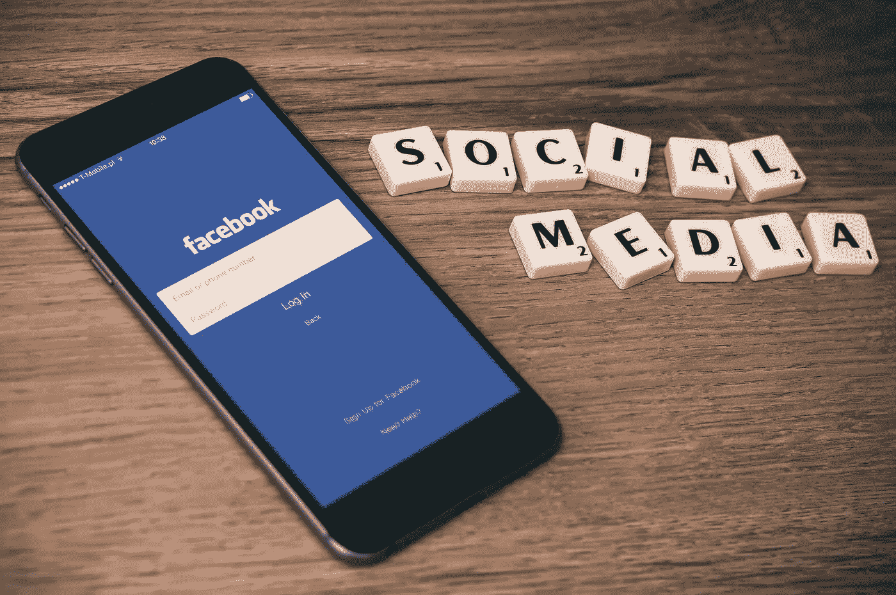
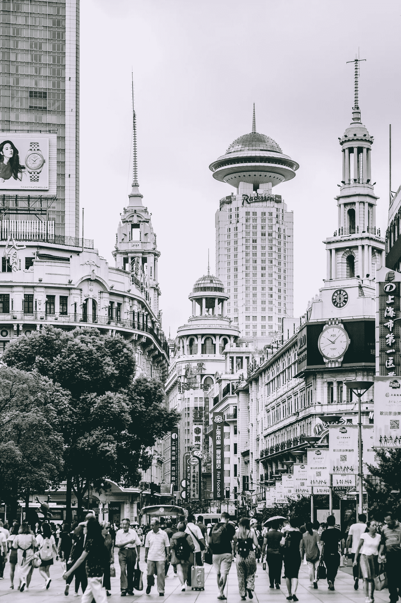

# 大数据的阴暗面

> 原文：<https://medium.com/hackernoon/the-dark-side-of-big-data-dd126ab3dcdb>

## 我们需要阻止的增长趋势

迈尔斯·布里格斯型指示器。大五人格测试。哈利波特分院帽测验。

很有可能，你已经参加或听说过这些测试。更有可能的是，你已经参加了 Buzzfeed 的个性测试，或者是我们脸书新闻订阅的数百万人中的一个。

这些测试提供了将我们的许多想法和行为浓缩到一个框架和风气中的能力，使我们能够更好地了解自己和未来的行为。

更重要的是，它让我们感到有归属感和可理解性。

在大学期间，我们学校相当一部分人喜欢迈尔斯·布里格斯。数百名学生参加了测试，我们互相分享我们的结果。

它提供了一个框架来更好地理解为什么对不同的情况做出不同的解释和反应。

对许多人来说，它帮助我们更好地了解自己。

从那时起，时间在前进，技术也在进步。像[大数据](https://hackernoon.com/tagged/big-data)和人工智能这样的技术让我们能够更好地了解我们周围的世界和彼此。

有了所有关于我们的兴趣、在线互动和购买的详细数据，就有足够多的数据来建立我们更准确的个性和性格模型。

那么，当实体收集和分析这些信息，不仅理解我们，而且影响我们时，会发生什么呢？

Photo by [William Iven](https://unsplash.com/photos/DfMMzzi3rmg?utm_source=unsplash&utm_medium=referral&utm_content=creditCopyText) on [Unsplash](https://unsplash.com/search/photos/facebook?utm_source=unsplash&utm_medium=referral&utm_content=creditCopyText)

## **剑桥分析**

今年 3 月，剑桥分析公司(Cambridge Analytica)成了一个家喻户晓的名字，因其位于脸书的数据搜集业务而臭名昭著。

剑桥分析公司(Cambridge Analytica)使用一款名为“这是你的数字生活”的脸书应用程序，获取了 27 万用户的数据和信息。这款应用的一部分让用户参加个性测试，为用户提供他们对大 5 个性测试的评估，该测试衡量以下水平:

*   开放性:喜欢学习新事物和享受新体验的人通常得分较高。
*   责任心:有高度责任心的人是可靠和及时的。
*   外向的人:外向的人从与他人的互动中获得能量，而内向的人从自身获得能量。
*   宜人性:这些人友好、合作、富有同情心。宜人性低的人可能更疏远。
*   神经质:这个维度与一个人的情绪稳定性和负面情绪的程度有关。

剑桥分析公司(Cambridge Analytica)进行了这项性格评估，并将其与 27 万名用户的脸书信息和数据进行了比较，得出了某些喜欢/兴趣和性格特征之间的相关性。

现在，剑桥分析公司是一家政治咨询公司，所以他们想要更大的影响力，而不仅仅是 270，000 名应用程序用户。他们的应用程序——除了收集 27 万用户的信息和数据——还收集了他们所有脸书朋友的信息和数据。

这让他们接触到了 8100 万用户。剑桥分析公司利用 27 万用户的相关性，为这 8100 万人建立了个性档案。

然后，他们利用这些个人资料为政治广告锁定特定的选民。例如，如果个人有与高度神经质相关的兴趣，他们会看到与恐怖主义或移民有关的广告，这些广告会助长焦虑和恐惧的倾向。

剑桥分析公司利用人们的数据、性格特征和偏好来影响他们的投票行为。下一步是什么？

当这些数据不仅用于影响行为，还用于惩罚不合规者时，会发生什么？

Photo by [Diem Nhi Nguyen](https://unsplash.com/photos/bZCsppbXebA?utm_source=unsplash&utm_medium=referral&utm_content=creditCopyText) on [Unsplash](https://unsplash.com/search/photos/china?utm_source=unsplash&utm_medium=referral&utm_content=creditCopyText)

## **中国的社会信用体系**

[2014 年 6 月，中国国务院发布了《社会信用体系建设规划纲要》。](https://www.wired.co.uk/article/chinese-government-social-credit-score-privacy-invasion)“它详细介绍了中国 13 亿公民诚信衡量标准的开发和推出。

到底什么是社会信用体系？

与美国的 FICO 信用评分类似，中国的社会信用评分收集了过去交易和互动的信息。然后，它根据个人的可信度对其进行排名。这种社会信用评分包括金融信息，如 FICO 评分，但远远超出了这些类型的交易。

为了更好地了解一个人的整体道德品质，芝麻信用公司根据五个标准对人们进行评级:

1.  信用记录——有人按时支付账单吗？
2.  履行能力——一个人能够履行其合同义务吗？
3.  个人特征——一个人的信息(如电话号码或地址)可以验证吗？
4.  行为和偏好——一个人的行为(比如购物偏好和倾向)是否可取？
5.  人际关系——一个人周围是否都是好人，并以适当的方式在网上互动？

建立这些档案和相应的分数需要大量的数据，从你所有的购买，个人信息，在线互动和联系。和剑桥分析公司一样，中国政府计划做的不仅仅是建立和跟踪人们的档案。

The SCS functions to encourage trustworthiness through reward and punishment. For citizens with too low of scores, punishments include [banning from certain schools, jobs, hotels, travel, and dating apps](https://www.brookings.edu/blog/techtank/2018/06/18/chinas-social-credit-system-spreads-to-more-daily-transactions/). Already, [6.15 million citizens have been banned from taking trains and planes](https://www.theguardian.com/world/2018/jun/28/chinas-social-credit-system-could-interfere-in-other-nations-sovereignty) due to low credit scores.

Photo by [Hanny Naibaho](https://unsplash.com/photos/D7InODIWyK4?utm_source=unsplash&utm_medium=referral&utm_content=creditCopyText) on [Unsplash](https://unsplash.com/search/photos/china?utm_source=unsplash&utm_medium=referral&utm_content=creditCopyText)

These types of blacklists pose a problem beyond serving as simply a deterrent. If the punishment system lacks transparency, people may not understand why they are excluded or how to improve their score.

Many of the listed punishments— like banning from travel, jobs, schooling, and dating — prevent individuals better themselves. In effect, a low credit score can block a citizen from economic advancement.

And this block seems intentional, based upon Xi Jinping description of the system’s foundation using the [mantra](https://www.washingtontimes.com/news/2018/mar/16/china-touts-social-credit-system-to-deny-travel-on/):

> “Once untrustworthy, always restricted.”

Without clear guidelines on how to better one’s score, these types of systems can create a sub-class of citizens all connected by the government’s disdain for their behavior.

## **What do we do?**

We, as people, have an innate desire to better understand the world around us. As I learned in undergrad, many of us find value in better understanding ourselves and our peers.

In the age of big data, this innate desire to better understand each other married with the desire for power can result in targeted manipulation and control.

So, how do we combat this growing trend?

Rather than controlling each other, how can we use big data to liberate each other?

How can we use technology to empower rather than oppress?

I do not know the answer, but I know I am not alone in wanting to find it.

Photo by [Avi Richards](https://unsplash.com/photos/Z3ownETsdNQ?utm_source=unsplash&utm_medium=referral&utm_content=creditCopyText) on [Unsplash](https://unsplash.com/search/photos/technology?utm_source=unsplash&utm_medium=referral&utm_content=creditCopyText)