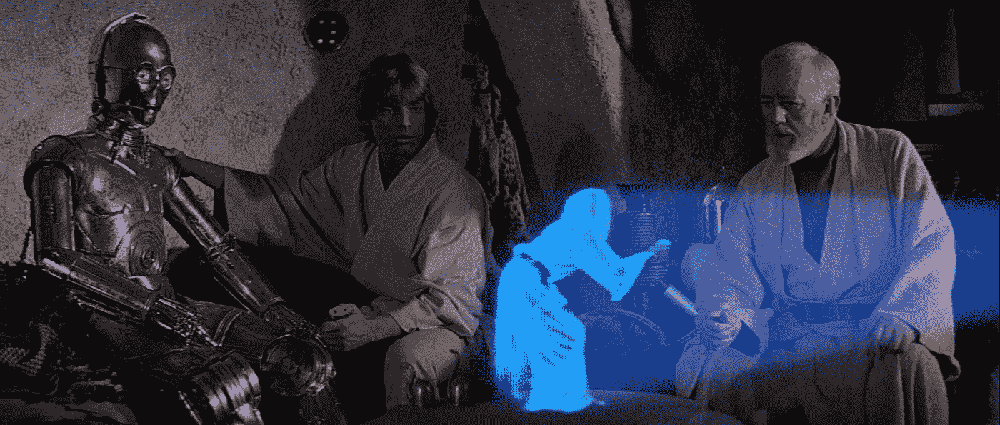

# 区块链的阴暗面

> 原文：<https://medium.com/hackernoon/the-dark-side-of-blockchain-46666adb8061>

Source: [z0h3 on DeviantArt](https://www.deviantart.com/z0h3/art/Dark-side-of-Vader-278062696)

《星球大战》讲述了一个名叫阿纳金·天行者的小孩的引人入胜的故事。阿纳金是传奇中的救世主，他承诺给原力带来平衡，并确保整个银河系的和平。

**(剧透预警)** 
除了他不太对得起炒作。

最终，阿纳金个人的复杂性、缺乏纪律性和缺乏经验最终把他变成了达斯·维德，一个彻头彻尾的邪恶化身。

与[区块链](https://hackernoon.com/tagged/blockchain)有一些相似之处。它通常被宣传为我们这个时代的圣杯。互联网 2.0。我们所有问题的最终答案。技术耶稣。

*很有可能。尽管有各种可能的用途，区块链当然不只是阳光和彩虹。 ***它有自己的缺点。而且他们不止几个。****

*还不知道区块链到底是什么吗？在继续之前，请务必阅读沃森定律的 [*解释部分*](/watson-law/blockchain-all-your-transactions-for-everyone-to-see-except-they-wont-understand-a-thing-573f67ad43a3) *！**

# *技术复杂性*

**

*source: [bavatuesdays](http://cdn-media.hollywood.com/images/l/helpmeobiwankenobi.jpg)*

*从整体上理解区块链和密码学需要高端的技术知识。应用它来提供现实生活中的解决方案是非常困难的。该领域仍处于起步阶段(10 年前比特币的首次实践概念化才被引入)，其复杂性是阻碍其成为主流的主要原因之一。密码领域急需专家。在政府层面，由于公共部门自然倾向于落后于技术进步，这一问题更加突出。

总账的不变性是额外的技术壁垒。鉴于一旦导入，区块链中包含的信息将永久保存，因此制定适当的处理标准至关重要。例如，黑客也可以通过利用网络背后的代码中固有的缺陷来获利。*

# *可量测性*

*区块链在分布式模型上运行，数据同时存储在多台计算机上。每个参与的计算机(节点)保持相同的记录，以确保零停机时间和网络的连续性和不变性。新的数据输入还要经过加入节点的集体批准，这是一个高度重复的过程。当一个块完成时，只有一个节点得到了回报，你可以提出很多工作被“浪费”的论点。这些特征迎合了以下大规模采用区块链的实际障碍。*

1.  ****在区块链储存信息比使用他们的中央对应设备需要更多的计算能力*** 来操作。*
2.  ****区块链网络需要足够的规模才能正常运行。*** 比特币目前每秒能够处理的交易不超过 7 笔。另一方面，VISA 每秒超过 24，000 次，平均每天 1.5 亿次。节点的稀缺性不仅会导致交易变慢，还会在需求增加、供应停滞时增加成本。*
3.  *为了我们的环保朋友——别担心。 ***一旦我们有了一个功能性的生态友好型经济，或者加上其他不同于工作证明的低能耗工作方式，区块链就可以在工业规模上发挥最佳作用。****

*请记住，以上几点只是区块链早期发展的副产品，解决方案很快就会出现！Thaddeus Dryja 和 Joseph Poon 为解决可伸缩性问题而引入的

是[闪电网络](https://www.weusecoins.com/assets/pdf/library/Lightning%20Network%20Whitepaper.pdf)——一个额外的协议层，创建了一个远离区块链的小额支付通道网络，用于更便宜、更快速的交易。照明网络是对比特币可扩展性困境的最显著解决方案，但它的应用绝对不是昙花一现——它的功能正在接受以太坊、莱特币、恒星和许多其他货币的测试。*

*说到存储， [Siacoin](https://sia.tech/) 和 [Storj](https://storj.io/) 是试图利用未充分利用的硬盘来提高效率的两个主要例子。其他倡议，如假人和 GridCoin 甚至更进一步，采用区块链作为一种手段，形成一个互联的全球计算机，以提高世界范围内的计算能力上限。

对生态不友好的工作共识算法证明的替代品也正在出现。今年早些时候，Vitalik Buterin 解决了 Ether 自身的可伸缩性问题，转而采用了更高效的利益相关挖掘协议。*

# *管理*

**

*Source: [wikia](https://vignette.wikia.nocookie.net/starwars/images/4/44/Councilrots.jpg/revision/latest?cb=20090915231817)*

*区块链基于共识的决策既是解决方案，也是问题。它可以剥夺中央主管的权力，但仍然会对集体提供适当响应的能力提出疑问。[2016 以太坊硬分叉](https://www.coindesk.com/ethereum-executes-blockchain-hard-fork-return-dao-investor-funds/)是社区内部的分歧引发了对区块链背后的民主的争议的一个主要例子。*

*在封闭的区块链，治理问题甚至更为突出，因为其性质预示着决策过程本身缺乏透明度和信任。*

*EOS 为基于社区的决策提供了一个有趣的替代方案——使用 21 个块传播器(BP)来处理所有事务。

*等等，什么？我以为区块链这个东西是为了减少集权？！*

你说得有道理。EOS 治理模式确实引起了一些质疑，因为它本质上违背了区块链的本性。如果你对《以太坊杀手》缺点的更多细节感兴趣，一定要看看 [Thijs Maas 关于这个主题的更详细的文章](https://hackernoon.com/everything-they-dont-want-you-to-know-about-eos-the-ethereum-killer-9939c43aa2df)。*

# *隐私和身份*

*区块链可以有多种设计方式。它们可以围绕透明度来揭示政府闭门造车的做法——就像[加拿大向公众开放资金数据](https://cryptonews.com/news/canada-uses-blockchain-to-show-transparency-example-1081.htm)或者它们可以改为私有——就像 Monero 向其用户承诺安全，不可能追踪匿名交易。*

*这使得区块链**被滥用于非法目的。*以前，你通常必须去瑞士才能看到，但现在我们的经济正在数字化，洗钱或逃税都可以在网上进行。**

**在一些网络(如 [Monero](https://getmonero.org/) 、 [ZCash](https://z.cash/) 和 [Dash](https://www.dash.org/) )中，追踪交易的高度困难可能会在国际犯罪背景下产生问题，因为这可能会使犯罪分子通过这些网络各自的令牌转移资金。

利用区块链违反法律最著名的例子通常与比特币有关。 [*丝绸之路*](https://blockonomi.com/history-of-silk-road/) 是一个臭名昭著的黑暗网络市场，比特币被用于非法购买毒品。Arthur Budovsky，自由储备组织的创始人，建立了交易所，清洗了数百万美元。即使在今天，欧洲刑警组织估计仅在欧洲就有大约 50 亿美元的犯罪资金通过加密货币进行洗钱。**

**不过，监管已经慢慢跟上了。如今，大多数交易所都应该遵守严格的反洗钱和 KYC 规则，这使得犯罪分子利用这些平台转换非法资金变得更加困难。随着执法行动不断增加，比特币的非法活动率也在稳步下降。**

# **安全性**

****

**Source : gifimage**

**区块链绝对是安全方面的创新，但它也有自己的软肋。中本聪比特币白皮书中提到的所谓的 [51%攻击](https://bitcoin.org/bitcoin.pdf)可以说是该系统最大的安全漏洞。它使黑客能够用蛮力改变区块链记录，因此要求所有参与者密切关注采矿过程。**

**51%的违规仅被认为是理论上的可能性，其发生率非常低。黑客越来越有创造力。仅在 5 月份，Monacoin、比特币黄金、Verge 和莱特币现金就遭遇了这种攻击。本月早些时候，价值超过 50 万美元的 Zencash 也因一次违规而丢失。**

# **象征性经济**

**要管理一个区块链，你需要围绕它建立一个令牌模型来奖励挖掘节点——通过加密货币。任何特定货币的价值，无论是欧元还是美元，都是基于各自国家的经济表现。这些经济体通常是成熟、稳定和受监管的，以保护参与方。

***代币经济体不成熟、不稳定且缺乏监管，代币的价值不一定体现在其相对于其他(法定)货币的价格上。波动是游戏的名字。每周价格下跌或上涨超过 20%的情况很少见。

你可以一夜之间成为百万富翁。尤其是如果你曾经预先数过几十亿。

另一个问题是 ***柱头周围隐藏着*** 。当我们接近主流采用时，每个人都在赶时髦，投资于他们不一定理解的通常毫无价值的加密项目。由于狡猾的企业家希望从过于乐观的投资者身上赚取高额利润，抽水和抽水计划大量出现。*****

*我们以前见过这种情况——互联网泡沫。

之后又发生了什么？我们看到了科技巨头的崛起——谷歌、雅虎、亚马逊、易贝。泡沫破裂是一种自然的市场反应，本质上是从坏中“挑选”出好的。*

*我在这里想说的是，我们不应该一定害怕即将到来的泡沫。我的意思是，金钱将会大规模流失是必然的，但从全局来看，我们可以看到一个“净化”的、更稳定的环境，在这个环境中，价值而不是营销努力是仲裁者。*

*阿纳金没能达到预期的一个原因是，他把所有的愤怒都压在了心里。区块链本质上是去中心化的——它们并不意味着只属于自己，它们掌握在许多人手中，它们的内容可以被所有相关的人看到。这家伙在胡说些什么？！嗯，我指的是他们的透明度——如果有问题，它就在那里——让每个人都能看到。我们通常会修理我们知道坏了的东西，对吗？*

**

*Source: vulture*

*你对区块链有什么看法？你认为它会改变游戏规则吗？或者这只是一个骗局？在下面的评论区说出你的想法吧！*

**免责声明——我并不反对区块链，事实上恰恰相反，所以这是一个尝试，也触及其缺点，因为我认为尽早解决这些问题是至关重要的。我拥有少量各种加密货币。*

*故事最初是在[沃森法律](https://medium.com/u/cf89a4a610df?source=post_page-----46666adb8061--------------------------------)刊物上发表的。*