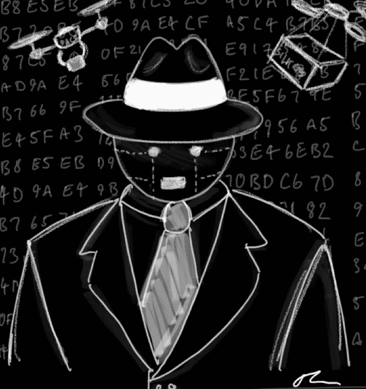

# 链条的阴暗面:区块链病毒和去中心化自治犯罪组织

> 原文：<https://medium.com/hackernoon/the-dark-side-of-the-chain-blockchain-viruses-and-decentralized-autonomous-crime-organizations-6e44bc9a4c54>

当一段匿名代码伤害了人们却无法阻止时，事情会变得多么扭曲？两部电影杰作为我们提供了毁灭性的答案和许多思考的食粮:

*   《奇爱博士》(1965 年)。在这部发生在冷战高潮的斯坦利·库布里克经典电影中，一名美国将军失去理智，下令对苏联实施核打击。飞机在半空中，将在两个小时内投掷炸弹，焦虑的美国政府无法阻止。一旦美国人失去了阻止打击的所有希望，总统就打电话给苏联人警告他们，并提供飞机的位置和目标。可悲的是，苏联大使随后透露，苏联长期以来一直在运行一个计算机化的“末日装置”:一旦**对俄国进行任何**核打击，该装置就会自动引爆一系列高放射性炸弹，这些炸弹将毁灭*地球上的所有*生命。这个装置无法关闭。事实上，它被设计成如果有人试图篡改它就会爆炸
*   **黑镜第三季第三集(2016)** 。[闭嘴跳舞](https://en.wikipedia.org/wiki/Shut_Up_and_Dance_(Black_Mirror))大概是黑镜最让人不安的一集了。根据维基百科的总结:*它讲述了一个十几岁的男孩被一个拥有他手淫视频的神秘黑客勒索犯下离奇犯罪行为的故事。男孩和一名中年男子在一起，这名黑客正以不忠为由勒索他。《闭嘴，跳舞》是黑镜系列的一部惊人之作:黑暗，不舒服，但强烈推荐*

如果是代码，为什么不能是智能合同？有害的程序会被投放到区块链并永远存在吗？闭上眼睛，发挥你的想象力，奔向 2030 年，届时，这个世界可能会成为不受外部监管的代码、数据和物理设备网络的宿主，它们被赋予了将创造者的堕落或不道德发挥到极致的能力。以下是一些可能出现的令人不安的情况:

*   **无法治理的非法市场** - [丝绸之路](https://www.wired.com/2015/04/silk-road-1/)是由比特币驱动的匿名交易的突破。它最大的弱点(也是导致其衰落的原因)是对邮政系统的依赖。在未来，由匿名团体发起并由市场动态支撑的无人机和人的混合网络可能会提供可编程的送货服务。有了这种类型的基础设施，丝绸之路类型的市场可以只使用智能合同来建立。然后，他们可以以一种非常难以阻止或追踪的方式交付整个实物供应链，从用户界面到支付再到履行(甚至是向商家融资)。就像 Bittorrent 给 Napster 插上翅膀一样，这些网络将使类似丝绸之路这样的非法市场得以扩散
*   **勒索**——如今，家庭住址很容易在泄露的数据库中找到。黑客可以写一份智能合同，租赁一架武装无人机或机器人，并将其送到受害者家中。该设备可能会伤害生命或财产，除非受害者扫描二维码，并在短时间内以加密货币的形式向他们汇去一定金额的钱
*   **洗钱** -非法活动的收益可以通过没有 KYC 机制的分散式交易所从一种加密货币转换成另一种加密货币(据我所知，目前大多数分散式交易所都没有 KYC)。隐私硬币(ZCash)直击要害，即使符合 KYC 的要求，也几乎不可能追踪每枚硬币的出处。如果黑客本着本地比特币的精神建立一个无法管理的非法市场(如上所述),并派一架无人机在街角从你那里拿走现金，甚至匿名的现金到加密的交换也成为可能
*   **暗杀市场**——一旦区块链有了足够的身份和实时生物特征数据，我们就可以看到智能合约上暗杀市场的出现。刺客可以投入资金来传达对结果的信心，并着手实施犯罪。一旦公共区块链确认受害者的心脏不再跳动(或者一架视频无人机经过并确认了结果)，一份智能合同将奖励肇事者
*   **不可阻挡的内容网络** -很容易想象抗审查的文件系统(Storj)如何与抗审查的 VPN 系统(Orchid)相结合来制作、托管和消费非法内容(在此插入您最喜欢的非法内容类型)
*   **分散自治犯罪组织(DACO)** - DAO 可以帮助黑客团体“合并”为 DACO，利用 DAO 的自治权力来筹集资金、匿名通信、投票和发起任何数量的恶意计划。从长远来看，成员们将分享这些计划的利润

*Illustration: Thomas Glucksmann*

就像恶意的人工智能一样，区块链病毒和 DACOs 可以夺走自己的生命，只要*有人*受益于它们并能维持它们周围的市场。我们能做些什么来防止区块链经济中病毒和 DACOs 的出现？答案并不简单，但这里有一些想法:

1.  **区块链的内置治理**——泰佐斯等区块链正试图提高人们对治理话题的认识，但当涉及到有争议或恶意的合同时，他们和以太坊都没有通过时间的考验。人工审核和投票是消除已报道的恶意内容的有效方法。随着行业的成熟，区块链“反病毒”和强制性代码审查可能会在以后出现
2.  **分叉**——如果预定的区块链治理没有消除某些不良内容，社区可以将网络硬分叉成更干净的版本(就像以太坊在 [DAO](https://en.wikipedia.org/wiki/The_DAO_(organization)) 攻击后被分叉成 ETC 一样)。然而，叉子对生态系统来说是极其昂贵的。更糟糕的是，只要有人(甚至是 5%的原始生态系统)看到为“区块链病毒”服务的经济利益，这些病毒就能找到运行的基础设施
3.  监管**执行&——上面的例子再次证明，从长远来看，政府和区块链将会发生冲突，区块链的钱是煤矿里的金丝雀。正如丝绸之路的例子所证明的，积极主动的政府是保护我们世界的最终行动者。预防许多(但不是全部)区块链病毒的关键在于控制基础设施，尤其是在物理设备和线上线下信息交换方面。如果各国希望阻止区块链病毒和 DACO 病毒的崛起，它们应该严格控制流向区块链代码的真实世界信息(如生物特征数据、视频或来自银行系统的交易)。他们可能还想控制“加密到法定”的交易(集中交易目前受到银行的困扰，但从长远来看，合规的集中交易可能是政府最好的朋友)。最后，他们应该努力决定通过区块链可以提供什么样的物理基础设施(应该允许人们推出智能合同控制的交付网络，还是智能合同控制的 3D 打印服务？).**
4.  **以攻为守-** [主动网络防御](https://www.cbinsights.com/reports/CB-Insights_Active-Cyber-Defense-Briefing.pdf)是传统网络安全中一种有趣的新兴武器。我们能运行网络代码和设备(无论是否在区块链)来主动检测、反击和误导坏人吗？谁将发起和资助这种网络的运作？

不可阻挡的、开放的、市场驱动的网络愿景会变成噩梦般的无政府状态吗？执法者[是否拥有适合这样一个世界的技术和技能？未来真实世界的战场可能不是关于开着跑车、拥有小玩意或超能力的英雄，而是虚拟猫捉老鼠游戏中的天才程序员。敬请关注。](https://itai.com/2018/01/13/sonarr-an-antivirus-for-online-finance/)

*感谢我的朋友* [*米歇尔·赖*](/@michellelaiy) *、托马斯·格鲁克斯曼* [*本杰明·乔菲*](/@benjaminjoffe) *和伊塔马尔·哈尔甚至他们的周到反馈&投稿*