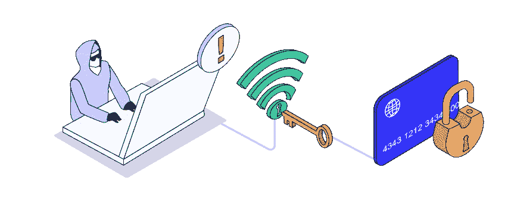
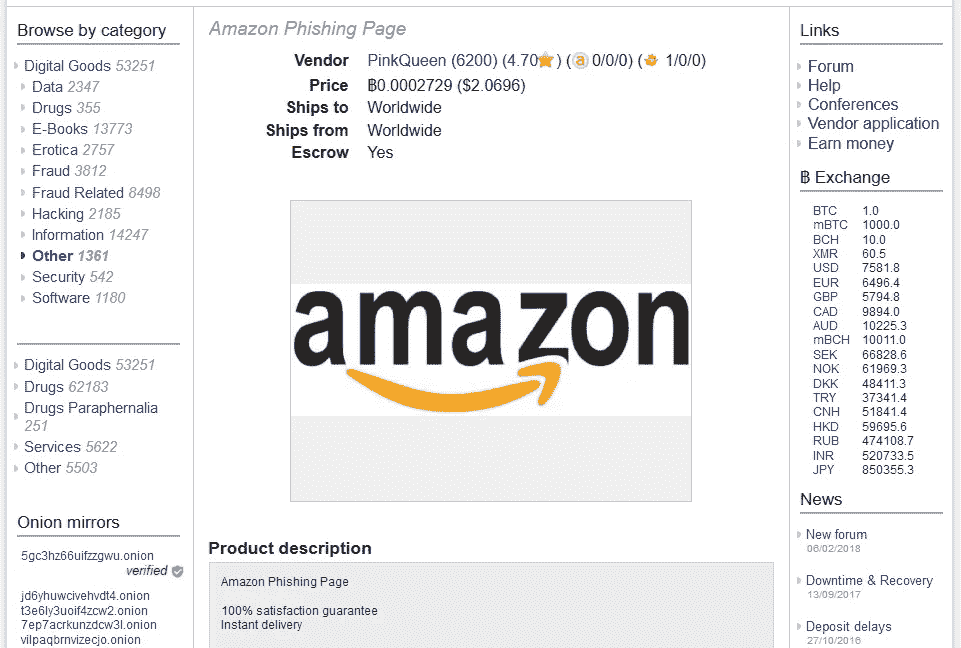
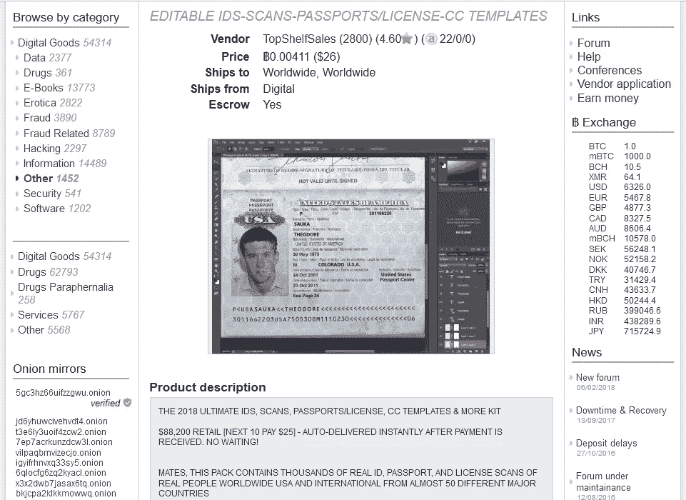

# 黑暗网络正在使网络犯罪大众化

> 原文：<https://medium.com/hackernoon/the-dark-web-is-democratizing-cybercrime-75e951e2454>

Illustration by [top10vpn.com](https://www.top10vpn.com)

在美国，想要成为网络罪犯的人从每年数十亿美元的诈骗损失中分得一杯羹变得比以往任何时候都容易。

你所需要的只是一些比特币、一些自由软件，以及对从你的人类同胞那里偷窃没有道德上的异议。

我对黑暗网络市场定价的最新研究表明，强大的恶意软件、现成的网络钓鱼页面和流行品牌的密码破解程序，以及令人难以置信的一系列其他黑客工具在黑暗市场上仅以每件几美元的价格出售。

这些非法物品可能很便宜，很容易匿名购买，但至少新手诈骗者不知道如何有效地使用它们而不被抓住，对吗？**错了**。

技术诀窍曾经是多年经验的标志和黑帽兄弟会的荣誉徽章，现在可以以低至 99 英镑的价格获得一系列循序渐进的 PDF 指南。

# 这项研究

我的研究团队最近分析了五大暗网市场(Dream 点；华尔街市场；贝卢斯科尼市场；和帝国)创建我们的[黑暗网络市场价格指数](https://www.top10vpn.com/privacy-central/cybersecurity/dark-web-market-price-index-hacking-tools-us-edition/)的最新更新，很明显，这种黑暗经济通过有效地消除所有以前的进入壁垒，使网络犯罪民主化。

Screencap from Dream Market listing

这些加密的网站，只能使用 [Tor 浏览器](https://www.torproject.org/projects/torbrowser.html.en)才能访问，允许犯罪分子匿名出售黑客工具，以及各种其他违禁品，如非法药物、被盗信息和武器。

# 我们发现了什么

## 恶意软件

我们发现市场上销售的一些最强大的商品是平均要价仅为 9.74 美元的**远程访问木马** (RAT)。

这种令人不快的恶意软件允许骗子完全远程控制受害者的计算机。他们不仅可以记录所有的击键和访问私人文件，以实施身份盗窃和欺骗设备所有者，而且偷窥者使用这些老鼠进行网络摄像头间谍活动也令人不安。

我们找到了臭名昭著的“黑暗老鼠”的列表，该老鼠被认为感染了超过 50 万台设备，其创造者因此入狱。该特洛伊木马还允许黑客将受感染的计算机包含在僵尸网络中。

我们还发现了用于 Android 操作系统的 rat，以及用 Python 和 Visual Basic 编写的其他工具。

## 品牌网络钓鱼

随着网络钓鱼成为目前最主要的网络攻击载体，大胆的黑客出售数百个流行品牌的现成恶搞页面也就不足为奇了，从苹果和网飞到沃尔玛和 Dunkin' Donuts，还有《我的世界》和英雄联盟。

这些通常售价约为 2 美元——除了离群值**苹果**,它平均会让你花费 5 美元，这表明他们的客户是身份窃贼寻找“fullz”的目标，或者是使身份盗窃成为可能的全套识别信息。

还有手册告诉你怎么做？只要 2.49 美元。

## 密码破解

想要成为黑客的人甚至不需要费心去学习如何配置他们的密码破解工具来攻击他们的目标站点。

无数站点的现成配置文件也在黑暗的网络市场上激增，每个 2 美元。你所需要的只是一个像 SNIPR 或 Sentry MBA 这样的工具和一些这样的文件，你就可以开始了。

事实上，我们在网上发现了一个巨大的列表，上面列出了使用这些工具获得的有效的 **Spotify** 登录信息。

## 超级便宜的黑客攻击

我们发现的其他零钱黑客工具包括键盘记录器(2.07 美元)、WiFi 黑客软件(3 美元)、蓝牙黑客工具(3.48 美元)和用于榨干比特币钱包的恶意软件(6.07 美元)。

在这个黑暗的经济中，引人入胜、令人担忧的是向**服务模式**的显著转变。竞争是激烈的，一些更便宜的工具可以在 clearnet(普通网站)上买到，所以供应商承诺通过提供客户支持、终身担保和免费指南资源来增加交易的吸引力。我们甚至看到下次购物时提供打折优惠券。

## 端到端网络犯罪解决方案

想要诈骗的人有更多的钱可以开始伪造官方文件，购买平均售价低于 14 美元的模板。

Screencap of fake passport scan template on Dream Market

这些 Photoshop 文件附带了非常详细的指南，指导如何使假身份证扫描看起来尽可能令人信服。买家所要做的就是将个人信息插入到模板中，这些模板涵盖了所有的官方文件，从护照和驾照到公用事业账单和工资单。

再加上通过在黑暗网络市场上购买的黑客工具获得的 fullz，这就是欺诈性申请信贷的全部必要条件。

暗网市场有效地为任何想要学习如何实施身份盗窃和随后的网上欺诈并获得实施工具的人提供了一个端到端的解决方案。

举个例子，如果你想进行欺诈性购买以转售或退款，你甚至可以购买匿名邮政储物柜。当然，这可能会花掉你 150 美元，但这对于安全投放来说是微不足道的。

当然，你可以选择一些指南，告诉你所有你需要知道的关于秘密使用邮政系统的知识(3.35 美元)。

# 那我们该怎么办？

那么这意味着什么呢？我们不能把精灵放回瓶子里。一旦一个市场被关闭，两个新的市场似乎就会涌现出来。据报道，仅在美国，2017 年因欺诈损失的[168 亿美元的诱惑只会随着赌注的增加而变得更大。](https://www.javelinstrategy.com/press-release/identity-fraud-hits-all-time-high-167-million-us-victims-2017-according-new-javelin)

作为消费者，我们必须认真对待保护我们的个人数据。**无知不是借口**。良好的密码卫生，双因素认证，限制我们允许的在线个人和支付信息，使用隐私工具，所有这些都是好东西。

> 我们必须更加注意应用程序和网站对安全性的优先考虑，如果我们不满意，就把我们的业务转移到其他地方。

作为开发人员，我们必须将**安全性置于便利性之上**，并对我们的用户强制执行这些标准，不管他们是否喜欢，理想的情况是将安全性作为我们产品的卖点。

如果这个理想主义的目标还不够令人信服，那么现在还有 GDPR 的幽灵，他的低级罚款高达€1000 万美元或全球营业额的 2%，因为未能将数据保护“通过设计和默认”集成到服务和产品中。

网络安全——以及数字隐私——必须从每个产品开发过程的一开始就考虑进去。

如果我们能够成功地让这些价值观在我们的文化中根深蒂固，那么这些在黑市上廉价出售的工具在除了最熟练的黑客之外的任何人手中都会变得一文不值。