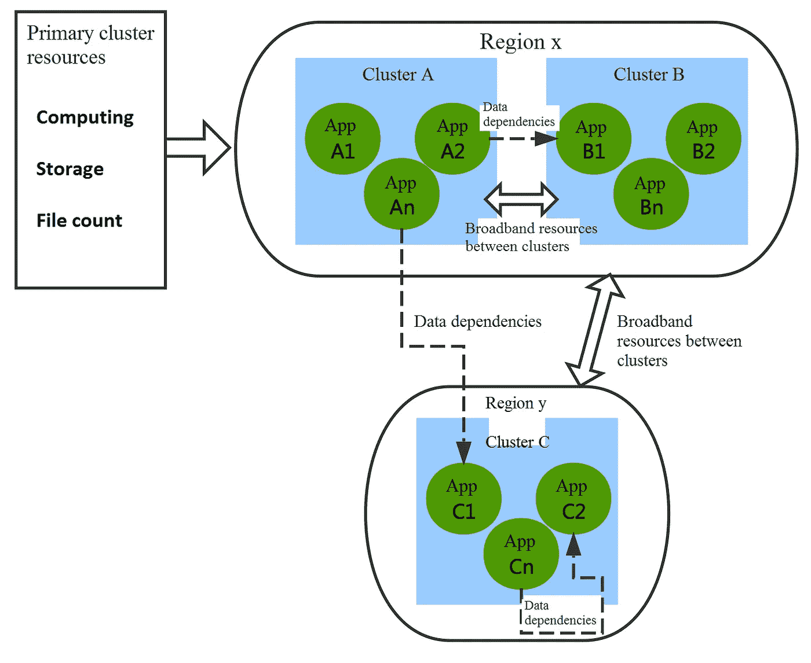
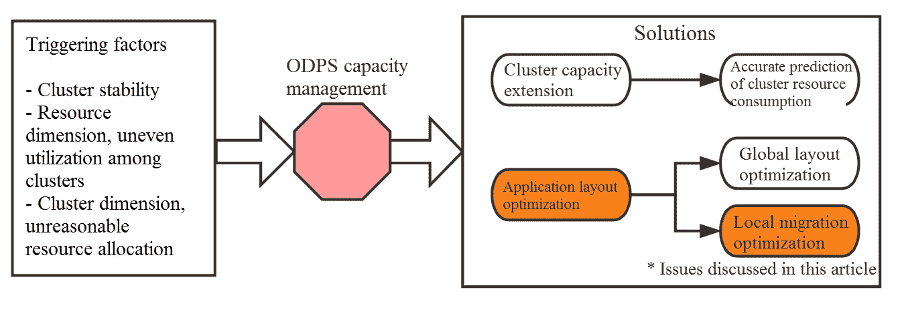
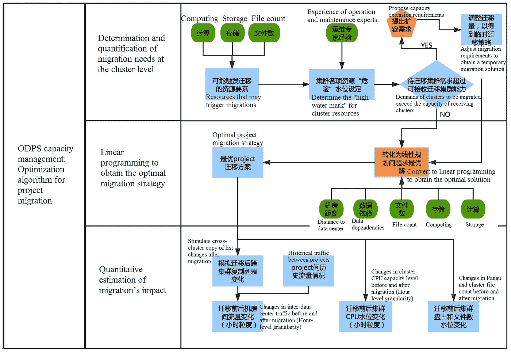
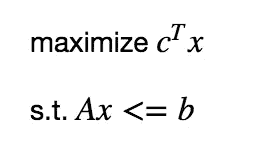
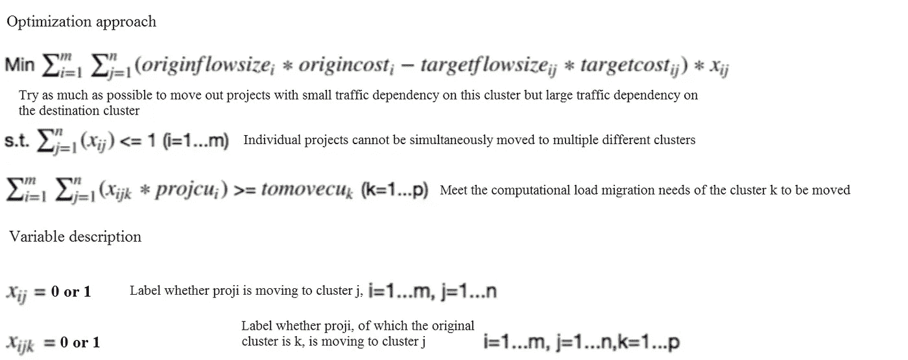
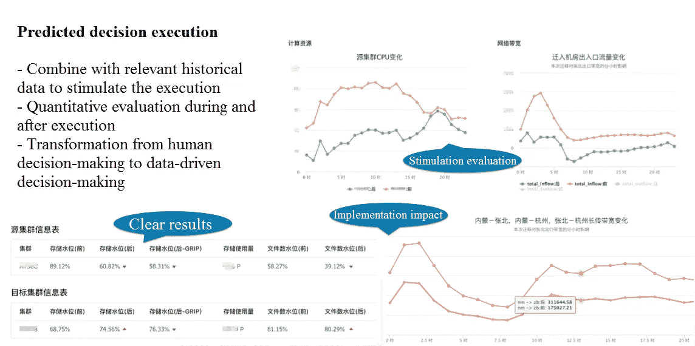

# 数据操作文件 I:项目迁移

> 原文：<https://medium.com/hackernoon/the-dataops-files-i-project-migration-9f206346d338>

*本文是关于* [***阿里巴巴***](/@alitech_2017/aiops-for-big-data-from-alibaba-e147455f71dd) *数据运营的五集迷你系列的第一集。这一部分研究阿里巴巴如何使用项目迁移方法来消除大数据平台 MaxCompute 的运营瓶颈，以及其他优化。*

在大数据世界中，精细的计算平台是处理用户业务目标所呈现的巨大处理需求的必要工具。然而，最近，它们也成为从人工决策向运营和维护中的数据驱动决策演变的努力的焦点，为电子商务巨头阿里巴巴等主要科技公司带来了一系列发展挑战。

MaxCompute 原名 ODPS，作为一个内部开发的大数据平台，在阿里巴巴的技术生态系统中独树一帜，承载着对阿里巴巴集团运营至关重要的大量交易数据。虽然该平台极大地方便了操作和维护专业人员的工作，但是它容易出现限制性能的拥塞，需要团队投入大量精力进行优化。

从逻辑上讲，MaxCompute 被分组为一个统一的大数据池，其中包含透明、相互依赖的 EB 级数据。然而，在物理上，它是一个跨越多个区域的集群组件，这在容量瓶颈方面带来了巨大的挑战，可能会导致上述障碍。

在 MaxCompute 中，集群包含计算、存储、文件数等多维资源。它们还拥有用于集群之间通信的带宽资源，带宽成本根据集群之间的距离而变化。同时，项目在不同维度上的资源消耗不同，计算资源消耗所需的时间段也不同。此外，项目之间存在数据访问依赖性，这会消耗集群之间的带宽资源。随着业务需求的增长，集群的数量和规模也在不断扩大，使得项目之间的依赖关系变得越来越复杂。

根据这些条件，优化是理解并随后解决一系列相互依赖的计算问题的过程。在今天的文章中，我们更深入地研究了这些问题的基础以及阿里巴巴专门为其在 MaxCompute 上的运营采用的迁移方法，有抱负的数据专业人士可以将这些见解应用到自己的工作中。

# 优化基础:两种方法

当群集的任何资源(计算、存储或文件数)达到 MaxCompute 中的瓶颈时，它会影响相应的服务并降低其他资源的利用效率，从而导致容量管理问题。目前对于这个问题有两种主要的解决方案。

第一种方法是通过机器采购来扩展产能，这需要准确预测集群的未来资源消耗和合理的采购预算。

二是跨不同集群的 MaxCompute 项目布局优化，包括全局布局优化和局部迁移策略优化。全局布局优化相当于把所有线上项目拆开，在集群之间重新分配。本地迁移策略优化包括针对容易出现资源瓶颈和稳定性问题的集群提前进行项目调度。由于自动化程度、迁移效率以及围绕项目迁移的实际商业条件的限制，实现全局布局优化存在一定的困难。

迄今为止，阿里巴巴在采购预算和本地项目迁移方面都取得了重大进展。在详细解释如何使用基于数据和算法的解决方案来实现本地项目迁移策略之前，以下部分将介绍以前方法的局限性。

# 经验及其局限性:人类驱动的解决方案

过去，MaxCompute 中的项目迁移工作在很大程度上依赖于阿里巴巴运维人员的经验以及他们对各维度资源“高水位”的敏感度。然而，依靠人类决策存在一些局限性。

首先，由于集群资源跨越多个维度，操作和维护人员很容易忽略及时处理它们的迁移需求，尽管他们花费了大量时间来监控指标。

另一个限制是在线项目数量多，每个项目都有多维属性。由于不同项目中的数据依赖程度不同，很难考虑所有因素并做出最佳的迁移决策。操作和维护人员通常根据服务的类别以粗粒度开发迁移解决方案。

最后，项目的迁移将影响所有级别的 MaxCompute 的整体，在迁移策略完全实施之前，很难准确估计和量化这种影响。为了防止迁移后资源短缺或集群间带宽收缩，迁移计划通常过于谨慎。

## 走向数据驱动的解决方案:数据运营

运维人员贡献的资源调度经验是非常有价值的。尽管如此，大数据平台建设和服务提供商需要像武器一样掌握数据，并有能力在决策中使用数据，以突破仅靠人类洞察力无法解决的瓶颈。

从这个意义上说，数据有助于快速甚至早期检测迁移需求，完善项目迁移优化策略中的解决方案，并提供迁移结果的准确量化评估。

# 优化算法设计:移植蓝图

总体而言，基于数据的瓶颈解决方案包括三个关键步骤。

首先，需要在集群级别确定和量化迁移需求。这决定了需要迁移哪些集群和多少资源，哪些集群将能够接收迁移的项目，以及每个资源有多少容量。

第二，需要线性规划来获得最优的迁移策略。这一步的目标是挑选最合适的项目迁移到最合适的集群。

最后，对迁移影响的定量评估有助于分析其在资源级别和群集带宽消耗方面的后果。由于现实场景非常复杂，并且会引入跨群集复制等问题，因此在获得迁移解决方案后，一些影响因素只能根据新项目的布局通过模拟计算来量化。量化迁移影响的目的是为操作和维护人员提供一个图形、直观的显示，帮助他们判断算法的可行性，这在其初始阶段尤为重要。您也可以键入关键词来在线搜索最适合您的文档的视频。为了使文档看起来专业，Word 提供了互补的页眉、页脚、封面和文本框设计。

## 在群集级别量化迁移需求

MaxCompute 上的每个在线集群都有不同的服务器规模、计算和存储容量以及可扩展性。因此，阿里巴巴基于运维人员的专业知识和集群的历史运行记录，为每个集群的每个资源设置定制的“迁移阈值”和“接收阈值”。

接下来，MaxCompute 的资源显示了明显的高峰使用时段，这些时段被认为有助于量化迁移需求，主要是根据高峰时段的阈值。结合群集资源的总体容量，这可以准确了解具体的迁移和接收数量。

此外，有时需要迁移的集群所呈现的需求超过了接收集群的能力，这表明整个平台需要进一步的能力扩展。然而，由于容量采购需要时间，该算法根据接收容量调整迁移需求，并生成临时迁移解决方案来解决即时在线问题。

## 部署线性规划

在确定了集群级别的迁移需求和接收能力之后，下一步是在要迁移的集群中的许多项目中选择最佳的迁移解决方案。为此，有几个关键点需要考虑。

首先，解决方案必须满足要迁移的群集中计算、存储和文件数量的迁移需求，并且不得超过接收群集中每个相应资源的容量。

其次，与存储和文件计数不同，不同项目的计算资源消耗高度依赖于它们的时间框架。因此，计算资源需要细化到小时级别的粒度。

最后，如前所述，项目之间存在数据访问依赖性，这会消耗集群之间的带宽，集群之间的带宽成本因区域位置而异。在项目迁移中，控制集群之间的带宽消耗非常重要。

上述过程可以表示为约束优化问题，并且约束和目标函数都是线性的。线性规划是解决最优化问题的最著名的方法之一。

典型线性规划的标准形式如下:

在迁移问题中，可以使用决策变量 x 来确定项目是否应该从集群 A 迁移到集群 B，x=0 表示不应该，x=1 表示应该。也就是说，决策变量是“0 或 1”变量，因此这里的线性规划问题实际上对应的是 0/1 整数规划。

在目标函数中，应该考虑数据中心之间的距离(带宽成本)和项目之间的数据依赖性。在约束条件下，对要迁移的集群的资源的迁移需求和接收集群的能力是至关重要的信息。

求解线性规划问题的方法有很多，比如单纯形算法、内点法，还有很多科学计算工具如 matlab、scipycan 等。还有许多优化求解器可以有效地解决大规模线性规划、混合整数规划和其他相关问题，如 Cplex、Gurobi 等。

# 移民的影响:定量估计

项目迁移对集群的影响可以帮助运营商更广泛地直观迁移的效果和影响，可以分为三个部分进行分析。

首先，应该考虑迁移对存储容量级别和文件数量的影响。由于项目中的数据量和文件数量相对稳定，因此很容易确定迁移解决方案对群集存储容量和文件数量的影响。

其次，必须检查它对计算能力水平的影响。一个项目的计算资源消耗与时间有很强的相关性，不同的项目对计算资源的消耗差异很大。迁移列表中每个项目的 CPU 消耗分摊到运行期的每个小时，然后估算迁移后集群的 24 小时 CPU 水平。

最后，需要分析对集群间流量大小的影响。在前面的线性规划中，项目之间的数据相关性被放入优化的目标函数中，而不是约束中。这是因为根据项目之间的数据依赖关系和当时项目的集群布局，每天会在线生成一个基于一些复杂规则的跨集群复制列表，将必须跨集群直接读取的数据转换为集群内部可读的数据。因此，在实际创建迁移策略之前，无法估计在线集群之间的流量。用线性规划求解迁移策略后，需要根据规则和新的项目布局模拟新的跨集群复制列表，然后根据历史在线流量估算迁移带来的数据中心间的流量变化。

# 关键要点

智能迁移系统允许操作和维护专家对每个迁移任务进行准确的定量评估，并提供一种方法来可视化他们根据经验了解的可能方法。有了这样的平台，他们不仅可以看到根据集群的当前容量级别动态计算的迁移解决方案，还可以输入定制的迁移要求和限制，以定制最佳迁移策略。通过并行调度，它们为多个运维工程师的同时操作和计算提供支持。

对于每一个迁移需求，平台都会详细求解并显示结果，包括算法得出的具体最优迁移策略、迁移前后计算和存储集群资源的容量水平的预计变化、迁移前后集群间流量的预计变化、迁移前后跨区域带宽使用的预计变化。

项目迁移优化是一种用于离线大数据服务的技术，使用 DataOps 来推动容量管理和资源分配。在其算法模型中，综合多维资源因素，寻找给定约束条件下的最优迁移策略，并量化迁移的影响。虽然这些工具已经非常强大，但仍然只是反映了早期的发展阶段，阿里巴巴继续投资于优化策略，这些策略使用机器学习和时间序列分析方法来预测集群资源消耗，指导机器采购，并协助提前检测迁移需求，以便尽早采取行动解决问题。

在我们即将发布的文章“数据操作文件 II:资源消耗”中，我们将了解阿里巴巴如何研究未来资源消耗的高级预测模型。

# 阿里巴巴科技

关于阿里巴巴最新技术的第一手深度资料→脸书: [**“阿里巴巴科技”**](http://www.facebook.com/AlibabaTechnology) 。推特: [**【阿里巴巴技术】**](https://twitter.com/AliTech2017) 。