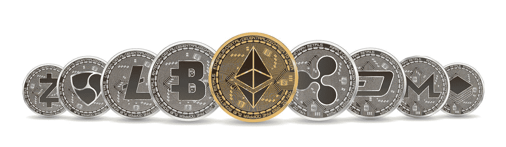

# SAFT 的时代结束了

> 原文：<https://medium.com/hackernoon/the-days-of-saft-are-over-febe31dbb04>

如果你阅读了 SEC 最近的一些公告，并确认 SEC 向参与首次公开募股(ico)的公司、运营商和可能的律师发出了一系列传票，你会同意有些事情需要改变。

SAFT(Simple Agreement for Future Tokens)是在硅谷发明的，后来被库利的前高级合伙人马尔科·桑托里(Marco Santori)采用并改进。SAFT 被定位为一个独特问题的答案:当那些代币还不存在的时候，你如何最好地销售这些代币？ICOs 出售给投资者的大多数公用事业令牌甚至都没有提供服务，这实质上相当于通过发行 ERC-20 令牌来预售服务。对于上下文来说，只需要 2 个小时来编码。

SAFT 背后的想法很简单:发行一种只有简单用途的代币:在交易所交易。然后，该令牌将被承诺的实用令牌所替换，该令牌将用于所提议的服务。事实证明，这种选择是一种安全措施，市场的高层意识到他们需要别的东西。为了拯救 ICOs，SAFT 来了，它在德语中也是一种甜饮料。没那么快。

SAFT 最著名的发行是 Filecoin，它在 CoinList 上向投资者发行了超过 2 亿美元的 SAFT 协议。Filecoin 愿意承认 SAFT 是一种安全，但他们坚持认为最终的象征是一种实用工具。去年 11 月，我写了一篇名为[伟大的 SAFT 魔术](https://howardmarks.com/the-great-saft-magic-trick-baec5da15019)的文章，提醒市场不要因为一只证券——SAFT——会变成一种工具，就这么简单地接受它。

Filecoin 和其他使用 SAFT 的 ico 应该很清楚，他们的未来令牌将是安全令牌。当然，这意味着代币只能在经纪交易商的 ATS 平台上交易，如 tZERO、StartEngine Secondary 和 Templum 等，以及注册交易所。我知道，对于那些希望在所谓的“交易所”用这些代币换取 5X 投资的投资者来说，这是一个令人难过的结果，但这就是游戏的运行方式。违反美国证券交易委员会的规则，看看故事如何结束。

如果最终结果是安全令牌，就没有理由使用 SAFT。一定有更好的办法。进入[利率](https://howardmarks.com/for-icos-startengine-introduces-rate-real-agreement-for-tokens-and-equity-2379e017ee76)，一个代币和股权的真实协议。这个新协议通过发行两个安全令牌完全解决了这个问题。

第一种是股权凭证，可以是普通股，也可以是带股息的优先股。这种代币由公司作为股本发行，放在资本表上。公司股东将对股权代币的授权进行投票，然后董事会将撰写出售这些代币的决议。这解决了公用令牌的许多问题，包括保护投资者的治理和投票权。这类似于给股票增加一个代币。公司也可以发行优先股，其收入份额基于公司的净收入。

第二个令牌最终将用于在区块链上执行建议的服务。该令牌在提供时不需要存在。它可以有条件地承诺，例如“如果和何时令牌可用”，并且它可以被认为是对产品的额外奖励。这一点很重要，因为这意味着整个价值取决于权益令牌，因为尚不清楚实用令牌的价值，甚至不知道它是否会被创造出来。

真正的问题是:第二个令牌是实用令牌还是安全令牌？这取决于许多因素，包括代币是否会进入交易所。如果是，那么它就是一个安全令牌。另一个例子是，如果一个令牌具有由公司发行的无限能力，并且不能在任何地方交易，并且只能用于区块链服务，则它是公用令牌。

这一比率可以解决企业在涉足 ICO 领域时的许多焦虑。它为投资者提供了正确的保护和价值创造，也为早期投资者提供了额外津贴(公用事业代币)。