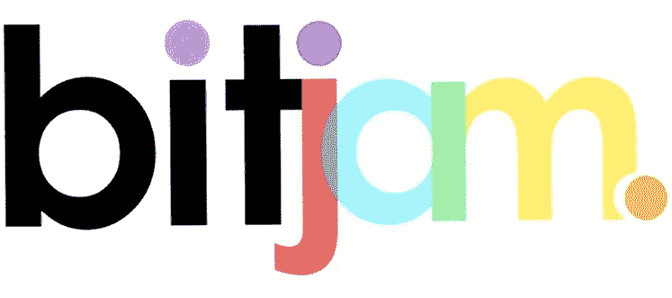

# 交易币(DLSD)——P2P 借贷市场中可能的宝石？

> 原文：<https://medium.com/hackernoon/the-deal-coin-dlsd-a-possible-gem-in-the-p2p-lending-market-fd227a976483>

P2P 贷款作为连续经济衰退的结果应运而生。在之前的经济低迷时期，银行拒绝向个人贷款。因此，P2P 贷款应运而生，允许个人获得贷款或偿还信用卡利息，而无需依赖银行。

P2P 贷款平台是金融行业增长最快的领域之一。根据研究，2024 年 P2P 行业的机会价值将达到 8978.5 亿美元。从 2014 年到 2018 年，CAGR 的年增长率将超过 48.2%。

摩根士丹利预测，到 2020 年，P2P 贷款平台的价值将超过 4900 亿美元。目前，P2P 商业贷款上限为 2120 亿美元。

2013 年，全球 P2P 贷款市场价值 35 亿美元。专家认为，2025 年 P2P 贷款市场的价值将达到 1 万亿美元。

**P2P 借贷简史**

P2P 借贷从 18 世纪就已经存在了。有史以来第一个受欢迎的贷款项目是“爱尔兰贷款基金”。该方案迎合低收入家庭的个人，特别是发展中国家的个人。该计划的创建者认识到，低收入家庭几乎没有抵押贷款的经验，但仍有信誉。爱尔兰贷款基金以零利率向个人借贷小额资金。19 世纪，点对点在欧洲部分地区被广泛接受，直到 20 世纪银行的出现取代了它们。

第一家 P2P 借贷平台于 2005 年开始运营。该平台迎合了英国客户的需求。该平台是一个在线借贷平台。该平台的运作类似于小额信贷银行。点对点贷款不再是给发展中国家的穷人贷款。它是为个人提供一种替代的低息贷款。

2008 年雷曼兄弟破产期间，P2P 贷款开始全面实施。在破产期间，人们努力以合理的利率获得一大笔贷款。P2P 贷款作为一种替代方式出现了。在过去的 10 年里，P2P 已经从一种边缘活动变成了一种主流选择。P2P 向借款人提供低息贷款，即使他们的信用记录很糟糕。投资者也从 P2P 平台中受益，因为他们可以利用不同的税收减免措施。投资者可以获得 8-13%的年回报率。

**加密货币和 P2P 贷款:市场的发展**

加密货币正在塑造金融业。2017 年对于加密货币领域来说是历史性的一年。所有的加密货币都经历了巨大的增长。比特币突破了 14000 美元的里程碑。以太坊增长超过 5000% —成为比特币的主要竞争对手。Ripple 在 2017 年的增长也超过了 4000%。

加密货币的巨大成功可以与 1998 年的网络繁荣相提并论。我们都知道网络公司是如何征服世界并使许多行业发生革命性变化的。加密货币市场让你获得巨大的投资回报。区块链行业彻底改变了银行业，为金融业提供了更好的解决方案。贷款是区块链技术革新的行业之一。

**点对点加密货币**

P2P 贷款改变了人们投资、借贷和存钱的方式。现在，区块链技术正在彻底改变这个行业。参与 P2P 的每个人现在都可以受益于透明度的提高。

加密货币正在改变直接贷款行业。使用比特币的点对点借贷提供了更大的可扩展性、效率、透明度和可访问性。crypto 为贷方提供的最大优势之一是贷款令牌化。区块链使贷款令牌化成为可能，并允许新投资者与其他参与者交易他们的贷款。P2P 贷款正在金融科技行业创造一种新的合作关系、服务和产品。

与发达国家的穷人相比，点对点贷款消除了发展中国家穷人支付的高利率。此外，由于其全球影响力，加密货币贷款为 P2P 投资者提供了独特的优势。加密货币贷款为投资者提供了向任何人贷款的选择，不管这个人在哪里。地理上的多样化降低了经济起伏带来的系统性风险。

**加密货币贷款是如何运作的？**

区块链技术为借款人提供了更便宜、更快捷、更透明的服务。区块链交易廉洁，即时。

由于加密货币不受任何银行控制，加密货币贷款为贷款人和借款人提供了更低的费用。加密货币使点对点借贷对所有参与方都有效。

加密货币还提供了一个全球借贷场景，借款人和贷款人不再需要位于同一个国家。跨境借贷。这对借贷双方都有很多好处。贷款人现在可以在不同的国家分散投资组合，对借款人来说，这意味着他们可以在其他国家寻找更好更便宜的贷款。

事实上，加密货币贷款在没有互联网和稳定银行系统的发展中国家也很重要。加密货币使得在没有银行账户的情况下借入资金成为可能。

**加密证明贷款有什么风险？**

加密货币借贷存在不同的危险。P2P 借贷并不是完全安全的。以下是一些与点对点贷款相关的风险。

**平台安全:**过去遭遇安全漏洞的平台很可能再次遭遇。每个人都知道加密货币网站是黑客的首要目标。

**市场波动:**打算将法定货币转换为比特币，并打算将加密货币转换回法定货币的借款人正在让自己走向失败。类似地，在这些平台上放贷的投资者承担着资产价值贬值到借款人可能选择违约的程度的风险。

**倒闭的 P2P ICO 加密货币贷款平台**

尽管点对点借贷的增长和行业的巨大增长，许多服务已经宣布停止他们的服务。

BITJAM service 在 2018 年早些时候宣布，他们将结束运营，原因有两个:加密货币的波动性和监管机构的压力。

然而，该团队在 ICO 期间成功筹集了 1000 万美元。他们用比特币向借款人发放贷款，整个过程按计划进行。今天，该公司已经关闭了他们的业务。

比特借贷俱乐部于 2016 年停止运营。由于保加利亚监管机构的压力，他们关闭了。该公司在停止运营之前托管了 800 万美元的贷款交易。

Bitconnect 于 2018 年 1 月停止了他们的服务。他们只使用他们的 bit connect 令牌借出资金。在他们停止运营之前，这项服务获得了巨大的发展势头。他们的硬币被评为 coinmarketcap.com 前 25 名硬币之一。比特币预计将达到 2800 万。

自从比特连接关闭后，密件抄送的价值变成了每枚硬币 3 美元。现在，它将从 hitBTC 和 coinexchange.io 中删除。

他们最大的推广人(克雷格·格兰特、罗伊·墨菲和 Crypto Nick)已经在 youtube 上撤下了他们的视频。

专家预测 Davor coin 将成为下一个 bit connect。硬币在 90 天内从他们的 ICO 上涨了大约 90 美元。2018 年 2 月，达沃停止了他们的服务。

LoopX 是另一个有前途的贷款平台。2018 年 2 月，他们被检测出是一个骗局。现在，他们的网站和社交媒体页面都被关闭了。

从这些失败的 ICO 来看，在决定投资 ICO 时，选择一个可靠的平台至关重要。您选择的平台将决定您的投资回报率，并确保您拥有出色的用户体验。否则，你的投资将是一个麻烦。

选择优秀平台的一个标准是 GBX。只投资那些服务在 GBX 上市的平台

**直布罗陀区块链交易所(GBX)**

www.gbx.gi

GBX 是一个代币交易所，自称创造了一个世界领先的代币销售平台。这种交流建立在社区透明和权力下放的原则之上。

GBX 不同于其他加密货币交易所。它是直布罗陀证券交易所(GSX)的子公司，直布罗陀证券交易所是 EU-监管的证券交易所。GSX 于 2014 年发射，但于 2015 年开始运营。他们宣布打算将区块链整合到他们的股票交易生态系统中。如今，他们推出了自己的加密货币交易所。该平台将于 2018 年 4 月发布。

GBX 交易所不同于其他交易所，因为它们创建了一个迎合传统投资者的系统。该交易所的功能类似于任何其他加密货币交易所。然而，他们不打算在交易所上市任何硬币。相反，为了投资者的安全，赞助公司将管理和审查新硬币。

因此，任何在 GBX 平台上市的硬币都是 KYC 已知的实体。他们的主要目标是消除市场上所有的捕鱼硬币，并让借款人在他们的平台上找到经过审查的代币销售。

GBX 团队将负责在将代币列表添加到平台之前对其进行审查和批准。以 GBX 规则为基础的系统得到了保荐公司网络的支持，这些公司是上市过程中不可或缺的一部分。保荐公司通过 GBX 平台指导上市，是任何潜在代币上市的第一联系点，对代币销售申请人进行初步尽职调查和深入分析。

GBX 平台旨在提供精选的数字代币和各种加密货币。在启动期间，该交易所宣布计划将区块链全面纳入其结算和交易系统。因此，交易所将把区块链技术纳入其系统。

它们还具有其他关键特性，如创新的赞助商锁定机制和勤勉的白名单程序。潜在参与者库由反洗钱/KYC 清算潜在参与者组成。该平台被贴上了“加密货币交易的未来”的标签。

GBX 围绕其平台货币 RKT (Rock token)进行解析。Rock token 是 GBX 平台上市、交易和其他交易功能的货币选择。简单地说，岩石令牌负责为 GBX 平台供电。

Rock token 用于支付 GBX 交易所的交易费用。Rock token 用于支付赞助、费用和在交易所上市的费用。该令牌将提供对未来银行服务的访问、安全的线下监管以及对社区发展的投票。

代币还用于为所有者提供折扣、验证每个成员、为联盟成员的贡献提供奖励以及用于支付专业服务。

该公司于 2017 年 11 月向全球推出了摇滚令牌 ICO。GBX 住在直布罗陀，直布罗陀对诈骗非常重视。

GBX 的首席执行官是尼克·考恩。他还是 GSX(直布罗陀证券交易所)的首席执行官。他在资本市场有 35 年的经验，包括 ing 银行和贝尔斯登。该团队的其他成员包括 William Rawley(集团法律顾问)、Philip Young(集团营销总监)和 Adrian Hogg(集团首席财务官)。

据 GBX 网站称，他们已经与普华永道、区块链实验室和动能资本等实力雄厚的公司建立了合作关系。

GBX 有可能结束代币销售的混乱局面。

尽管加密货币发展迅速，但在众多交易所交易的许多加密货币仅致力于其发行。这些服务并没有完全分散。有太多的 ICO 出现在左右两边，既有糟糕的产品，也有不良的意图，背后也没有合适的人。

这引发了人们的思考，为什么加密货币交易所拒绝将基于区块链的资产和智能合约纳入其平台，以实现更好的市场效率和透明度。这是 GBX 正在解决的问题。GBX 希望提供一个总部位于区块链的分散式交易所。该团队期待为密码行业建立信任。

GBX 希望彻底改变所有加密交换的可访问性、安全性和透明度。他们通过公众共识、监管和对即将上市的代币进行严格尽职调查的理念，彻底改变了加密货币行业。

关于 GBX，重要的一点是它将受到政府的监管。直布罗陀政府已经表示大力支持分布式账本技术，并希望使其成为一个值得信赖的平台，供许多人使用。

**选择点对点加密货币借贷平台的其他标准**

加密货币借贷意味着借款人将与平台发展长期关系。加密货币借贷消除了降低的成本和障碍，为投资者提供了一种经济高效的解决方案。

这里是借款人为了不被骗的核心规则。

**远离骗局:**认清事实，投资全靠逻辑。每个人都梦想自己的钱能获得丰厚的投资回报。然而，你必须现实一点。没有一夜成功这回事。投资是一个长期的过程。综上所述，忽略那些承诺在短时间内给你带来巨款的公司。向你承诺一夜暴富的公司是明目张胆的骗局。

**选择值得信赖的平台:**为投资者和贷款者建立有益的平台需要大量的金融行业知识。投资者不能单纯依靠自己的技术知识。他们必须努力工作，专心致志，密切关注细节。

**成功的提供贷款的点对点门户网站**

尽管一些 ico 失败了，但其他加密货币贷款平台却取得了很高的成功。以下是其中的几个例子:

BTCPOP 是一个 P2P 银行平台，它使比特币投资者能够在一个安全的门户网站中为借款人提供比特币贷款。借助区块链技术的力量，BTCPOP 是一个安全的数字门户，可促进交易并提供可靠的风险评估措施。它们是每个投资者的优先选择。难怪这个平台近年来凭借其多种盈利渠道获得了成功。

Nebeus 是一种新的加密货币，它发行一种银行卡，可用于加密货币和法定支付。Nebeus 的目标是为加密货币支付的交换和官方银行执照创建一个平台。另一方面，Nebeus 通过统一的 KYC 程序完成用户认证。成功完成 KYC 程序的申请人已经发放了贷款。Nebeus 在其 ICO 期间筹集了 4000 多万美元

BitBond 是位于柏林和德国的第一个国际平台。这家受监管并获得许可的金融机构为投资者和借款者提供了一种通过区块链技术获得资金的方式。

Micromoney 是另一家类似 humaniq 的公司，向发展中国家的个人提供贷款。该公司开始向东南亚的公司发放贷款。他们在 ICO 期间总共筹集了 1000 万美元。

交易币(DLSD)简介——市场上一颗可能的宝石！

[https://thedealcoin.com/](https://thedealcoin.com/)

Deal Coin 是一个区块链的 P2P 贷款平台，将区块链的技术、透明度和安全性整合到一个平台中。DLSD 是一种金融资产，它将为全球金融部门敲响警钟。

交易币是市场上真正的颠覆者。交易硬币平台结合了团队的现实世界的金融经验和区块链的专业知识。这是一个平台，可以很容易地成为许多投资者的选择，他们希望公平和快速地获得融资，无论他们在世界上的什么地方。

交易硬币是借款人验证、识别和授权其资金的贷款资产。交易硬币保证创造一个全新的金融生态系统。有了交易币，企业将能够在世界任何地方获得资金。融资成本将降低，企业将获得安全、更好、更专业的投资。

DLSD 使用智能法律合同和智能保险在以太坊区块链账本上注册交易，该账本受到还款保护。

交易硬币将世界各地的借款人与专业投资者联系起来。想象一下，一家实体企业能够在几分钟内筹集资金。企业不再需要等待几天或几个月才能获得资金。

Deal Coin 为在英国和其他国家寻找资本的企业充当金融经纪人。他们已经促成了超过 60 亿美元的贷款，并在两年内开发了点对点技术平台，因此在金融界并不缺乏经验。

交易硬币业务的目标是 13.2 万亿美元的全球金融市场。

简单来说，deal coin 通过区块链技术的力量提供 P2P 贷款服务。它开创了金融服务的新时代。为了完成他们的使命，交易币与凯森合作。

[https://www.kession.com/](https://www.kession.com/)

该公司已与英国凯盛资本(Kession Capital)签约，担任其在 GBX 的上市保荐人。凯辛在区块链社区享有盛誉。Kession 是首批获准成为直布罗陀区块链交易所(GBX)上市会员的三家公司之一。

Kession 与 deal Coin 合作，通过各种可能的方式实现他们的愿景。通过与 Kession capital 合作，交易币有可能成为 P2P 贷款的未来。

以下是首席执行官迈克尔·莫里森在 DLSD 发布会上的发言。

“企业很难获得融资。利率因国家而异。企业必须等待数周或数月来为他们的业务筹集资金。更糟糕的是，投资者没有从银行获得足够的储蓄。事实上，目前获得资金的制度是有问题的。

我们渴望用区块链技术解决这个问题。我们的专家与我们合作，加速企业获得融资的过程，提高投资者的回报，降低企业的融资成本，并消除企业的潜在欺诈。"

我们相信，我们是第一家在 GBX 平台上市的分散监管的 P2P 区块链借贷平台。我们已经与区块链的专业公司建立了牢固的伙伴关系”。

我设法通过 LinkedIn 联系到了莫里森先生，他很友好地回答了我向他提出的一些问题。

1.你认为 GBX 和被监管在这样的制度下会对 P2P 借贷市场有什么影响？

“接受 GBX 制度的监管将使我们有别于大多数其他加密 P2P 贷款机构。

*我们的目标是设定最佳实践的最高标准，一旦成功通过申请流程，我们将向投资者再次保证，我们已经通过了对我们的业务、系统和人员的全面尽职调查和合规性检查。*

*我们希望在最高合规水平上运营，我们希望设定新的标准水平，让加密 P2P 贷款市场的其他公司也能以此为目标。*

*因此，简而言之，我们预计 GBX 及其体制下的运作将对投资者、借款人和贷款人产生积极影响。*

随着时间的推移，我们预计其他平台也将遵循最佳实践，为其 P2P 业务提供一个负责任且受监管的环境，因为投资者和借款者需要得到适当的保护。"

2.就代币销售和代币价格的未来波动而言，你认为在 GBX 上市与在较小的交易所上市有什么不同？

*规模较小的交易所流动性较低，价格波动较大。我们正在申请 GBX，为我们的投资者提供更大的流动性，更重要的是，我们希望在一个有时从监管角度看不太受重视的市场中，被视为完全合规和受监管的企业。我们认为，由于流动性、透明度和治理的增加，代币价格将找到一个自然的水平，这将反映对经历了更高标准的代币的需求*。”

各公司 ICO 预售于 2018 年 3 月 26 日开始。众包销售将持续到 2018 年 6 月 10 日 ICO 结束，或者直到最初的令牌块被占用。

他们已经在通过象征性销售筹集资金，这将使投资者有机会提前购买并保留交易硬币。交易投资者将有机会在各种交易所上市交易硬币。交易硬币价格为 0.10 美元，支付方式为比特币、以太币和法定货币。

**交易币**

[https://thedealcoin.com/](https://thedealcoin.com/)

交易硬币解决方案将允许世界各地的投资者通过向以其资产为担保的企业放贷来赚取利息。贷款偿还将基于贷款的法定价值加上利息，因此将避免与加密货币相关的波动性。投资者只能在数据借贷解决方案数据库启动后购买交易令牌。

硬币的高利率意味着投资者可以从借贷中获得稳定和持续的回报。交易硬币并不要求贷款人必须提供 100%的贷款。借款人可以自由支配资金。借款人还必须支付管理社区的相关费用。该流程将确保对交易硬币有固定的需求。

最后，交易币为顾客提供了许多好处。这些好处会让投资变得容易。团队信守承诺，关心投资者。他们将投资者的成功视为自己的成功。他们目前正在开发一款手机应用和支付卡，这样每个人都可以成为投资者，无论他们的社会地位、国籍、年龄或工作如何。投资领域不再有国界。

**结论**

如果你是加密货币的新手，并且没有投资经验，加密 P2P 贷款可能看起来很复杂。但是，对于每个对这个基于旨在改变金融业的技术的金融机会感兴趣的人来说，交易硬币简化了这个过程。

加密货币市场的增长以及点对点借贷市场的发展创造了大量的投资机会。这些数字全年都在增加。毫无疑问，DLSD 是为投资者提供最佳体验的行业之一。

链接:

[https://thedealcoin.com](https://thedealcoin.com/)

https://www.kession.com

[https://gbx.gi](https://gbx.gi/)