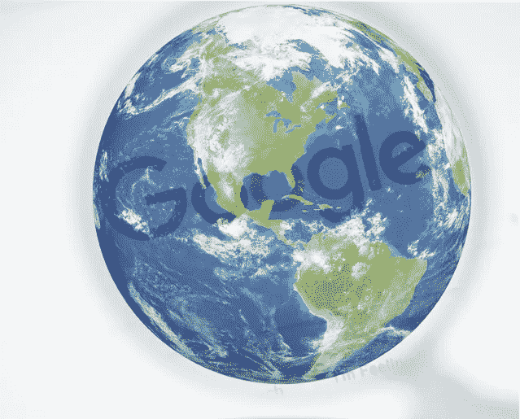
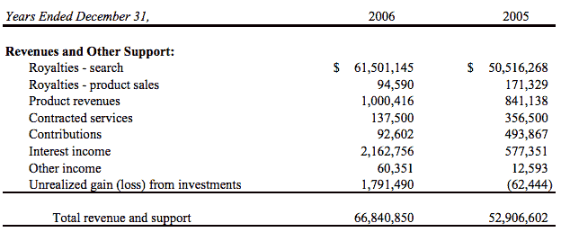
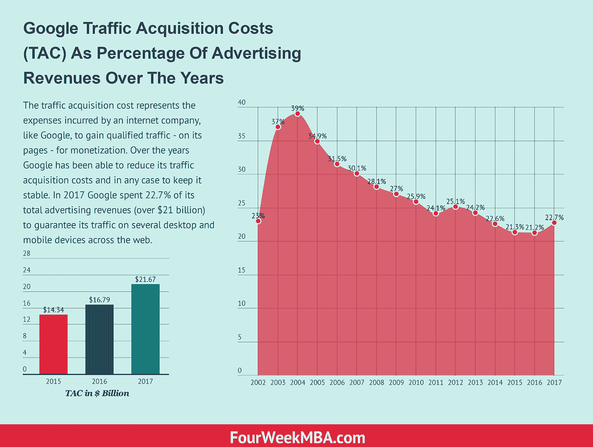

# 让谷歌成为我们今天所知的科技巨头的交易

> 原文：<https://medium.com/hackernoon/the-deals-that-made-google-the-tech-giant-we-know-today-470f07f09381>

当我们想到谷歌时，很容易认为它是过去几十年中最重大的技术成功。然而，谷歌不仅如此。谷歌是过去几十年中最重要的技术、分销和商业成功。事实上，该公司成功征服了网络，仅基于数字广告就创造了超过 1000 亿的年营业额基于出色的分销策略，当时就达成了一笔交易！

考虑到它是[的后来者](https://fourweekmba.com/first-mover-advantage/)，我相信它成功的部分秘密是它设法完成的交易，这使它在未来几年获得了牵引力和流量。正如我在另一篇文章中指出的，[谷歌多年来实施的流量获取成本战略](https://fourweekmba.com/traffic-acquisition-cost/)，让该公司创造了一种[可持续的商业模式](https://fourweekmba.com/what-is-a-business-model/)，这种模式如今仍在赚钱。

因此，值得探究一下使谷歌取得今天成功的一些交易！

# 网景交易:第一笔大交易

> ***加利福尼亚州山景城——2000 年 10 月 4 日****——屡获殊荣的谷歌搜索引擎开发商谷歌公司(Google Inc .)和美国在线公司(NYSE: AOL)的子公司网景通信公司(Netscape Communications)今天宣布，他们已续签了合作伙伴关系，谷歌将继续提供秋季搜索技术，以补充网景公司屡获殊荣的开放目录项目(www.netscape.com)。网景公司还将继续把谷歌作为主要的搜索提供商，作为其广受欢迎的网络搜索计划的一部分，该计划帮助网景公司的用户从网上各种不同的搜索工具中进行选择。*

这就是谷歌当年宣布消息的方式。

交易是关于什么的？

首先，值得一提的是，当时网景是网络上最成功、访问量最大的浏览器。那可能是网景是网络的时期。事实上，浏览器市场的大部分都在它的手中。值得注意的是，谷歌当时已经证明是网景用户的可靠服务，这使得交易更容易达成。因此，产品或服务始终是商业交易成功的关键因素。

正如当时所指出的那样，Netscape 是第一个意识到谷歌尖端搜索技术潜力的公司，我们很高兴继续我们的关系，这强调了我们致力于提供最好的搜索工具来浏览网络。

[美国在线后来收购了网景](https://fourweekmba.com/history-of-google/)。

# 谷歌与 Mozilla 合作继续获得搜索市场份额

谷歌明白，如果它想拥有一个[可持续的商业模式](https://fourweekmba.com/what-is-a-business-model/)，它需要一个持续的流量流，这样它就可以利用其主要资产——搜索结果页面——的流量来赚钱。然而，在 21 世纪初，谷歌还远没有推出其网络浏览器 Chrome，该浏览器将于 2008 年推出。与此同时，如果它想主宰市场，就必须在浏览器市场的所有领域获得交易。

Mozilla 是拼图中的一个关键部分，谷歌为他们做了一笔好交易。当时，6100 万美元的版税收入大部分来自谷歌的交易:

**来源** : [Mozilla 独立审计师报告](https://static.mozilla.com/foundation/documents/mf-2006-audited-financial-statement.pdf)

正如当时在 TechCrunch 上指出的:

> 广受欢迎的 Firefoxweb 浏览器背后的组织 Mozilla 将其与谷歌的搜索协议延长了三年。作为将谷歌设为 Firefox 默认搜索引擎的回报，谷歌向 Mozilla 支付了一大笔钱——2006 年总额约为 5700 万美元，占该公司总收入的 85%。该协议原本将于 2006 年到期，但后来被延长至 2008 年，现在将持续到 2011 年。

保证你的产品或服务的适当分销是一场商战。因此，你需要有一个令人信服的报价。多年来，谷歌一直设法确保这笔交易，这要归功于它的出价，多年来，它的出价构成了 Mozilla 的大部分收入！

# 当微软试图窃取美国在线的交易时，谷歌孤注一掷！

正如我们所看到的，让谷歌成功发行的关键交易之一是网景。然而，网景公司在 1998 年被美国在线以惊人的 42 亿美元收购。回到美国在线是网络上最受欢迎的门户网站的时候。为谷歌效力至关重要。微软明白这一点，并向美国在线提出了一项极具吸引力的交易:

> 几年来，谷歌一直是美国在线的搜索引擎，但竞争对手微软公司试图取代它的位置，如果它放弃谷歌，转而使用 MSN 搜索，它将每年向美国在线提供数亿美元的现金。但周四晚在纽约，谷歌向美国在线母公司时代华纳公司(Time Warner Inc .)首席执行官理查德·d·帕森斯(Richard D. Parsons)提交了一份更有利可图的提案，该提案为美国在线提供了许多与迅速扩张的在线广告支出一同增长的途径。

据《T2 邮报》报道，当时微软和谷歌之间的竞争相当激烈。谷歌重新启动了对微软的收购，达成了一项难以拒绝的交易。

正如《华盛顿邮报》*所指出的，根据协议，谷歌将在五年内保持 AOL 服务上的搜索引擎，而谷歌将在搜索引擎上给 AOL 数百万美元的免费广告，以推广其网站网络。*

此外，AOL 还将获得谷歌在线横幅广告的独家销售权。AOL 将保留这些广告销售收入的 20 %,而 Google 将获得 80%。”

为了让你知道这笔交易有多重要，AOL 当时每月有 2000 万订户和 1.1 亿独立访问者。作为交易的一部分，谷歌还以 10 亿美元收购了该公司 5%的股份。

正如 2006 年[谷歌财务](https://www.sec.gov/Archives/edgar/data/1288776/000119312507044494/d10k.htm)所指出的:

> **我们收入的很大一部分依赖于我们的谷歌网络成员，我们也从与他们的合作中受益。失去这些成员可能会对我们的业务产生不利影响。**

为了理解 AOL 对 Google 分销成功的重要性，在 2004 年、2005 年和 2006 年，美国在线公司(“AOL”)产生的广告和其他收入分别占收入的 12%、9%和 7%，主要是通过我们的 AdSense 计划。

2004 年，仅 AOL 一项交易就占谷歌收入的 10%以上。这种流量也不便宜。事实上，在整个 2003 年至 2006 年，流量获取成本(1.355 亿美元)有所增加，主要是由谷歌 AdSense 项目产生的广告费用推动的。

谷歌需要变得独立，并开始通过浏览器建立分销渠道。虽然它的工具栏在 2000 年就已经可以使用了，但是 Google Chrome 还没有出现。与此同时，谷歌希望获得更多的分销能力，以主导市场！

# 谷歌与曾经强大的 Ask.com 合作

2007 年，谷歌与当时非常流行的搜索引擎 Ask.com 达成了另一项重要交易。正如在 [SEJ](https://www.searchenginejournal.com/askcom-google-sign-35-billion-search-advertising-deal/5951/) 上指出的:

> *昨天，谷歌和 IAC(Ask.com 的母公司)延长了他们的赞助搜索和广告协议，此举在未来 5 年内对 IAC 价值约 35 亿美元。*

# 微软将 AOL 交易偷给了谷歌，但为时已晚

多年来，微软一直试图从谷歌那里获得几笔交易，但都没有成功。最后，在 2016 年，微软设法为其搜索引擎必应与美国在线达成了一项[协议。在这一点上，这笔交易不会对谷歌在搜索市场的统治地位造成任何伤害！](https://adage.com/article/digital/microsoft-aol-sign-10-year-deal-rival-google-s-ad-dominance/299276/)

然而，征服网络分销的战斗还没有结束。

*原载于 2018 年 10 月 23 日*[*fourweekmba.com*](https://fourweekmba.com/google-business-strategy/)*。*