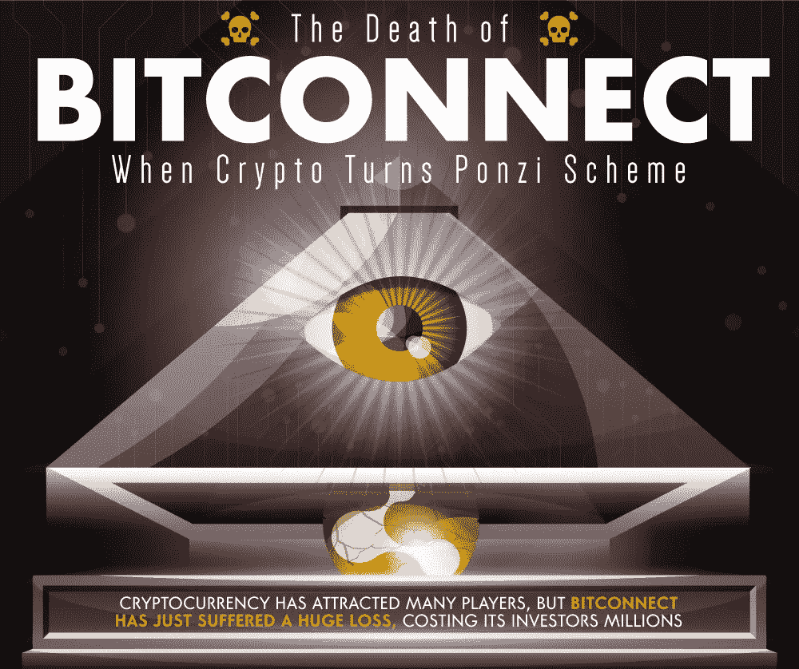
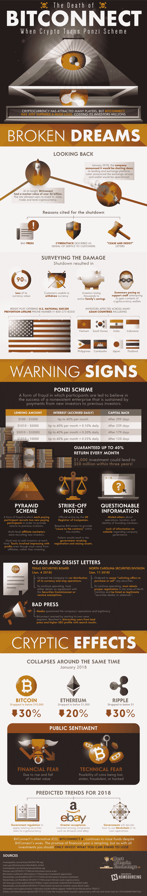

# BitConnect 的死亡

> 原文：<https://medium.com/hackernoon/the-death-of-bitconnect-2a24c23cbafc>

我们总是被教导要谨慎对待我们的投资——即使是在华尔街之外。但是，当某些东西如此吸引人，以至于金钱的符号突然出现在我们的眼前时，我们很容易忘乎所以，忽视危险信号。我们当然是在谈论密码。

加密货币是一种几乎不受监管的买卖商品的方式，在网络上尤其流行。因为它致力于匿名，甚至有人会说是保密，crypto 已经成为这个时代最有影响力的标志之一；隐私和财务自由的象征。

吸引了许多玩家，如比特币和以太坊等知名品牌，还有不同品牌的加密货币，其中一个是 Bitconnect。Bitconnect 遭受了巨大的损失、关闭以及数百万投资者美元的消失，这是一个真正的现代警示故事。在无数的停止和终止信、不良新闻内容、网络攻击，甚至公众恐慌导致这个曾经有吸引力的密码一夜之间崩溃和烧毁后，被贴上了庞氏骗局的标签。

据说，如果听起来好得不像真的，那很可能就是真的。但是以我们世界扩张的速度，这变得越来越难讲了。看看这张关于 BitConnect 之死的信息图，了解更多关于加密的每一个变化的景观，你如何能从中分一杯羹，并使自己免受波动起伏的影响。

