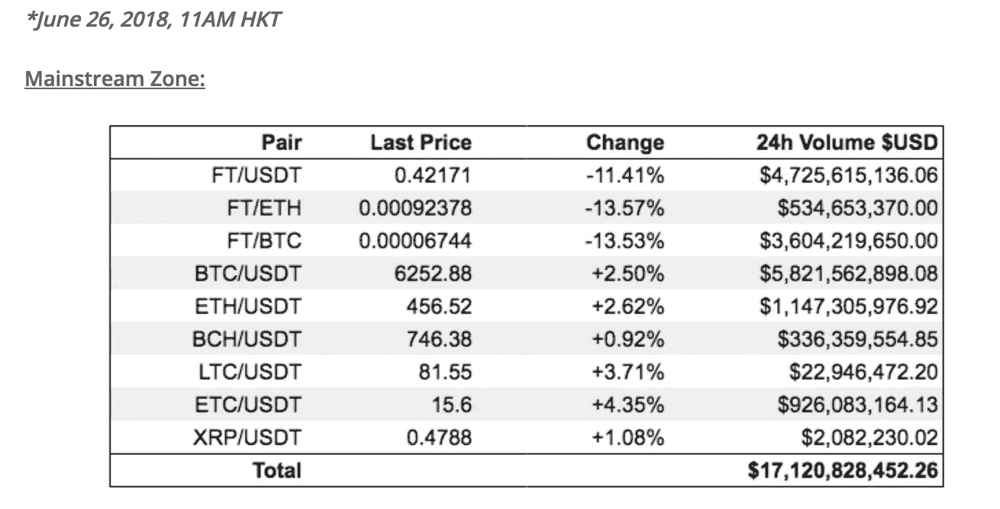
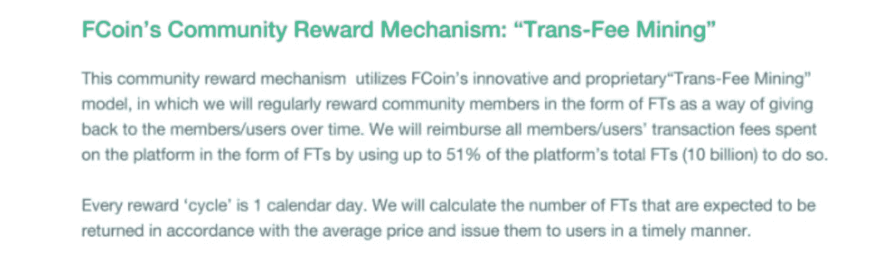
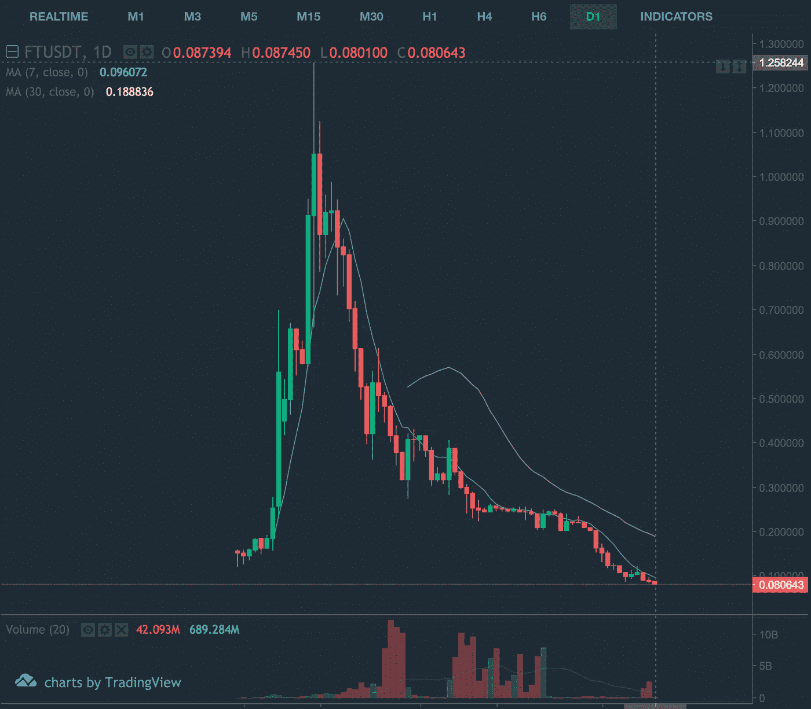
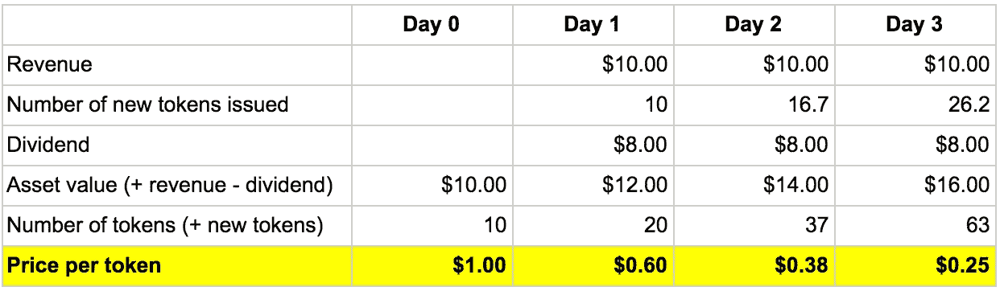
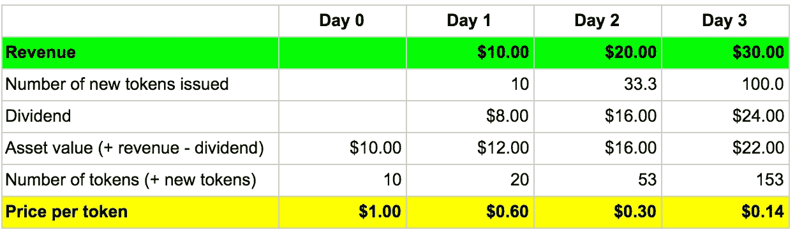
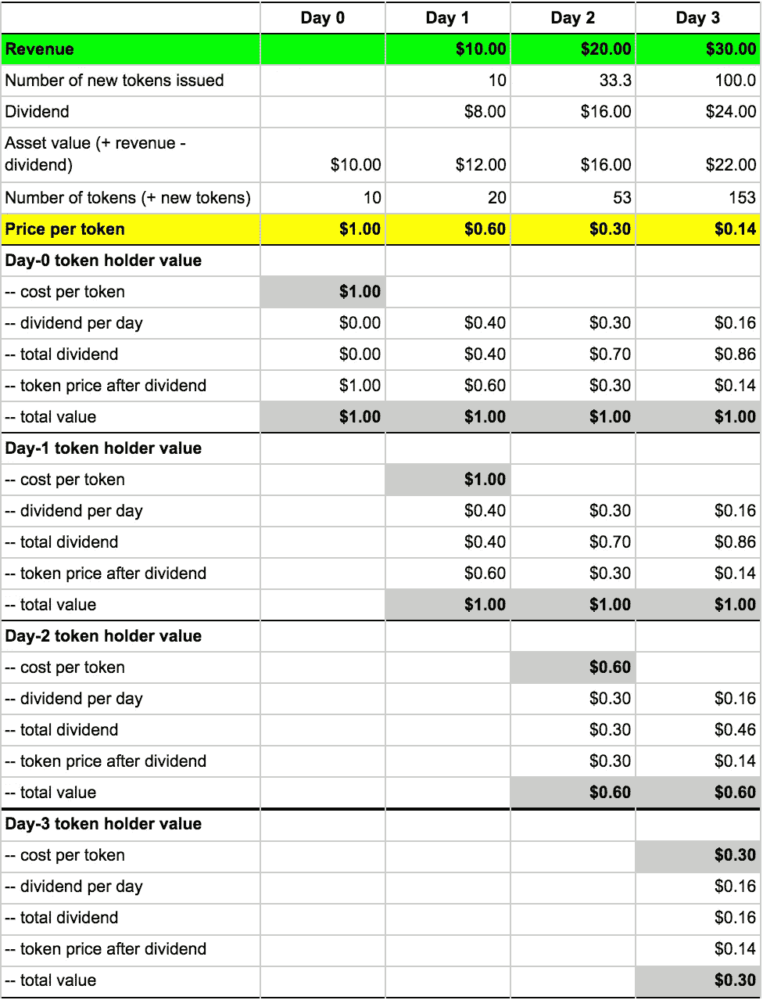
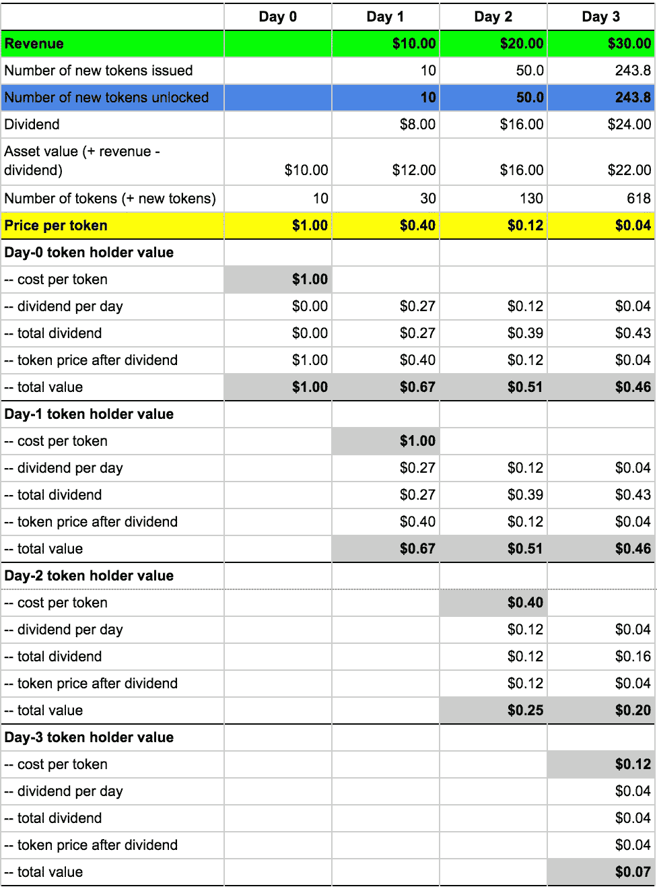

# 辅币之死:糟糕代币设计的故事

> 原文：<https://medium.com/hackernoon/the-death-of-fcoin-a-tale-of-bad-token-design-261d64a8116f>

fco in([https://www.fcoin.com](https://www.fcoin.com/))是一家加密交易所，于 2018 年 5 月开始交易。在美国和欧洲，它可能因[瘫痪以太坊网络](https://www.ccn.com/chinese-exchange-fcoin-accused-of-crippling-ethereum-network-for-cheap-publicity/)而闻名，但在亚洲，尤其是中国，它因其创新的“[转费采矿](https://support.fcoin.com/hc/en-us/articles/360005046194-Additional-Comments-Regarding-FCoin-s-Trans-Fee-Mining-Mechanism)”激励计划而闻名。

FCoin 的“转费挖矿”的表现是如此的轰动，以至于现在几乎每个密码交易所都在争相复制这个激励计划。事实上，在推出该计划后的几周内，FCoin 的 24 小时交易量在 2018 年 6 月 26 日达到了惊人的**170 亿美元。相比之下，前 10 大交易所的 24 小时交易量加起来只有 60 亿美元左右。然而，这种激增并没有持续很长时间。据 CoinMarketCap 报道，FCoin 的 24 小时交易量在 2018 年 8 月 12 日**跌至**0.16 美元。**

FCoin’s 24-hour trading volume on June 26, 2018

是什么导致了 FCoin 的快速涨跌？FCoin 的“转费采矿”激励计划从一开始就备受争议，但是这个激励计划实际上是有效的，而且效果很好，每日交易量的最初激增就证明了这一点。尽管 FCoin 团队在问题开始后试图解决问题时犯了许多错误，但快速下跌实际上是由其令牌经济学设计的根本缺陷造成的。判决还没有完全出来，但是看起来 ***FCoin 会被它糟糕的代币经济学设计杀死！***

代币经济学是一种新工具，以前在互联网或移动领域并不存在，但它在任何代币项目中都扮演着重要角色。如果应用得好，代币经济学可以帮助一个项目创建一个新的业务结构，并瓦解现有的在位者。否则，项目将会崩溃。通过从 FCoin 犯下的错误中学习，其他项目，特别是那些试图复制 FCoin 模型以保持竞争力的加密交易所，将拥有更好的令牌经济学设计，并可以成功地将许多业务转变为一个新时代。

**“转费采矿”——一个伟大的激励设计**

良好的代币经济学设计始于激励设计，因为使用代币作为激励是一种新的破坏性力量。一个好的激励设计需要对项目的业务有深刻的理解。

根据我与交易所人士的交谈，交易所最关心的是每天的交易量。鉴于交易所从交易费用中赚钱，且高交易量也产生高流动性，这不应令人感到意外。为了增加交易量，交易者(买方/卖方)应该受到激励。向交易者提供经济激励的最简单，也可能是唯一的方法是对交易费用进行贴现。

FCoin 的创始人张建是火币的前 CTO，也是交易所业务的老手。FCoin 团队从加密交易业务中获得了洞察力，并相应地设计了激励机制，这并不奇怪。为了激励交易者，FCoin 创建了一种新的创新模式:“转费开采”，FCoin 白皮书对此进行了描述:

FCoin’s Trans-Fee Mining incentive program

这里的动机是什么？“交易费挖掘”模式给交易者创造了一种感觉，即他们实际上是在支付 0 美元的交易费。这种激励设计显然是有效的，从如此短的时间内巨大的交易量激增就可以看出。一些人认为这提供了错误的激励，因为交易者来 FCoin 不是为了进行真正的交易，而是为了挖掘 FT 代币，但 FCoin 方法的反对者忘记了目标是增加每日交易量，任何交易都会增加交易量。

“如果你提供激励，用户就会来”是密码项目的一个潜在真理，它已经一次又一次地上演。与传统的市场营销思想不同，密码世界中的代币激励本身就是一种客户获取工具。FCoin 的“转费挖掘”并不是什么新东西，但它再次证明了这个想法在加密领域很有效。

**80%的收入分配——fco in 的基本令牌设计缺陷**

一个项目一旦有了好的激励设计，还需要正确的代币货币政策，解决代币供给、代币需求、代币流通等问题。这一点至关重要，因为它将影响代币价格，代币价格将影响激励计划的有效性。

在 FCoin 中，令牌供应由交易费挖掘程序生成。每天都有新的代币投入市场，导致代币膨胀。理论上，如果没有代币需求，或者代币需求小于代币供给，代币价格会因代币通货膨胀而下降。白皮书没有从公用事业的角度描述本地令牌需求，事实是很难为交换业务创造公用事业需求。即使您可以强制公用事业需求，如要求项目购买代币作为托管，以使其代币上市，公用事业需求仍将远远小于“交易费开采”代币供应。

FCoin 试图为代币持有者创造持有 FT 代币的激励，从而减少代币的流通。激励措施是将 FCoin 平台收入[的 80%(如交易者支付的交易费和 FCoin 收取的交易费)作为红利分配给 FT 持有人。这里的逻辑是，FT 代币持有者希望获得股息，因此不会出售代币。通过这样做，代币发行量将减少，有可能推高代币价格。](https://support.fcoin.com/hc/en-us/articles/360005096773-Regarding-FCoin-s-Revenue-Distribution-Mechanism)

不幸的是，这种红利方法是 FCoin 代币经济学设计的根本缺陷。它没有推高代币价格，而是导致了 FT 代币价格暴跌。如下图所示，在“转费开采”计划启动后的头两周内，FT 代币价格飙升至约 1.26 美元，此后在过去两个月内降至 0.08 美元，较峰值下跌约 95%。随着 FT 代币价格暴跌，依赖于 FT 代币价格随时间升值的激励计划“转费挖掘”也停止运作，交易量因此迅速下降。

FCoin’s FT Token price history

**无形的力量——为什么 FCoin 的代币价格下跌**

正如 FCoin 所看到的，支付股息不会激励代币持有者持有 FT 代币。这是因为支付股息会导致代币价格下跌，并使市场认为代币正在贬值。因此，代币持有者的理性反应是急于出售代币，并尽可能快地出售，这将导致代币价格更快地下跌。这种恶性循环是由大多数人看不见的市场力量推动的。然而，这并不是什么新鲜事，它背后有一套经济学理论。

一般来说，我们可以把所有的代币分为两类:类货币代币和类资产代币。大多数情况下，在令牌经济学设计期间，这两种类型的令牌不能混合使用。不同类型代币的价格由不同的规则驱动。类似货币的代币的价格是由供求关系决定的。当需求大于供给时，代币价格上涨；当需求小于供给时，价格就会下降。资产类代币的价格由基础资产的价值决定。例如，如果代币代表公司的资产，类似于公司的股票，当公司的资产增值时，价格就会上涨，反之亦然。与有时难以理解和预测的象征性供求不同，公司的资产很容易理解和计算。因此，资产类代币的内在价值和价格很容易计算。随着时间的推移，资产类代币的市场价格将收敛于其基于基础资产价值的内在价格。

通过向 FT 代币持有者支付股息，FCoin 使 FT 代币成为类似资产的代币或资产支持证券(ABS)。推动 ABS 价格的无形力量，在公司股票中有很好的研究和理解，这是另一种 ABS。从公司财务的角度来看，当一家公司支付股息时，该公司的资产价值会下降，因此其股票价格也会下降；当一家公司发行更多的股票而不改变公司的资产价值时(例如，股票分割)，股票价格将会下跌。在 FCoin 的情况下，股息通过 [80%的收入分配](https://support.fcoin.com/hc/en-us/articles/360005096773-Regarding-FCoin-s-Revenue-Distribution-Mechanism)支付，每天通过[转费开采](https://support.fcoin.com/hc/en-us/articles/360005046194-Additional-Comments-Regarding-FCoin-s-Trans-Fee-Mining-Mechanism) **将新代币投入网络**！你能想象如果苹果每天做一次派息和拆股，苹果股票的价格曲线和市场反应吗？！

将这两种力量结合起来，英国《金融时报》的代币价格应该会下跌，而且会快速下跌。为了说明这两种力量对代币价格的影响，让我们基于 FCoin 模型对 FT 代币价格做一个假设性的简单建模。

A hypothetical simple modeling of FT token price based on FCoin model

这里的假设是 1)公司在第 0 天有 10 美元的资产；2)公司在第 0 天有 10 个代币；3)公司每天创造 10 美元的收入。如上表所示，价格在 3 天内下降了 75%。

鉴于“交易费挖掘”旨在激励更多的交易，让我们通过将假设 3)更改为公司在第 1 天产生收入 10 美元，第 2 天 20 美元，第 3 天 30 美元来模拟加速收入的场景。如下表所示，价格下跌更快——3 天内下跌 86%，而不是 75%。这是由更高的收入和更低的代币价格导致的更快的代币通货膨胀造成的。

A hypothetical simple modeling of FT token price with accelerating revenue

对于类似资产的代币，当市场价格高于根据基础资产的内在价值计算的代币价格时，市场迟早会自我修正，代币的市场价格最终会达到代币的内在价格。因此，英国《金融时报》代币价格的暴跌应该被视为正常的，也是意料之中的。

理论上，通过转费开采获得 FT 代币的新 FT 代币持有者不应急于出售其代币。这是因为从公司财务的角度来看，股息和股票分割不会降低股东的价值。如下表所示，即使在派息和代币膨胀后，每天的代币持有者仍持有相同的代币价值，等于接下来几天的代币成本。

Token holder value before and after dividend payout and token inflation

然而， [FCoin 收入分配设计和代币解锁时间表](https://support.fcoin.com/hc/en-us/articles/360005046434)比上面的简单例子更复杂。为了便于理解(并非 100%准确)，基本上，转费开采计划使收入分配市场的象征性通货膨胀翻倍。这是一个可以理解的设计，因为 FCoin 也想为“以前发行的”代币的 49%的代币持有者创造奖励，让他们也持有代币。不幸的是，这种设计改变了现有代币持有者(包括交易者)的经济价值，并为交易者创造了意想不到的动机，以立即出售通过转费开采获得的代币。

Token holder value under FCoin’s revenue distribution design

如上表所示，交易者持有的代币的每枚价值在股息派发后立即下降。这类似于一家公司发行新股来收购被低估的资产，这将稀释现有股东的价值。在密码领域，基本的假设是人们是理性的。知道其通过转费开采获得的 FT 代币将贬值，并且贬值幅度小于他们支付的交易费，理性交易者将在价格下跌前立即出售代币，而不是持有 FT 代币。

FCoin 收入分配设计导致 FT 代币价格下降，并刺激交易者立即出售而不是持有 FT 代币。即使金融交易代币的价格在开始时可能会被抬高，并一直得到支持，但这两种效应产生的市场力量如此强大，以至于它会破坏价格支持努力并使代币价格崩溃。市场对代币价格暴跌的看法会打击新投资者(投机者)的积极性，鼓励现有代币持有者更多、更快地卖出，迫使价格进一步、更快地下跌。一旦理性交易者发现了市场价格方向，如果他们不能立即卖出，他们将无法收回全部交易费用，激励计划不再有效，交易量迅速枯竭。

**代币经济学设计可以成就或毁灭一个有前途的代币项目**

代币经济学是一种新工具，以前在互联网或移动领域并不存在，如果应用得当，它将在分散许多业务和瓦解现有企业方面发挥关键作用。但是代币经济学设计真的很复杂，而且反直觉。一个好的代币经济学设计不仅需要对目标业务领域的深入了解，对激励设计的良好理解，以及创造网络效应的强大分析技能，还需要对博弈论、经济学原理、金融理论和货币政策这些支配市场的无形力量的深刻理解。

FCoin 的崩溃可以通过一种不同的、更好的代币经济学设计来避免。通过关注激励机制和获取有关货币政策的知识，令牌项目的创始人都可以在未来为提高加密项目的质量和成功做出贡献。