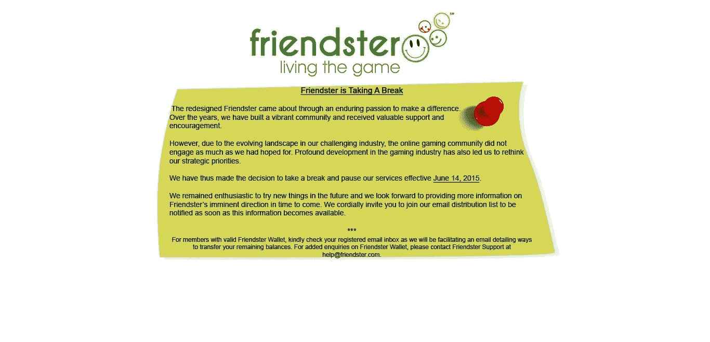

# 成功的虚假意识形态

> 原文：<https://medium.com/hackernoon/the-deceitful-ideology-of-success-e76df26885dc>

许多人不成功是因为他们偶然发现了这个腐败的现代原则？你是其中之一吗？

Photo Credits: [Tina Rataj-Berard](https://unsplash.com/@t_rat_max)

每个人都喜欢看到像马克·扎克伯格、比尔·盖茨、马克·安德森这样的成功人士。

我，我自己倾向于做同样的事情，我不得不说，如果你只是把它们看做一个灵感，这并不坏。

许多有抱负的企业家、商业领袖、梦想家努力追随我们今天的领导者的脚步。

这听起来可能违背直觉，但每个寻求成功的人都需要创造自己的道路。

不同意我说的话？

然后，将它分解成更小的增量:

马克·安德森是第一个创造在线浏览器的人，这削弱了使用电脑的方式。之前没有人计划创造一个网络浏览器，显然，也没有人画出一个模型或者创造出一个原型让安德森依赖。

他变得成功是因为他产生的影响，而不是因为他继续复制别人。

如果你是我的早期读者之一，你可能会想起我在“*成为一名叛逆的企业家*”中的一篇病毒式文章，并可能会问为什么我一直在谈论企业家应该如何创造，但也应该如何模仿和创新。

如果你认为你的[创业](https://hackernoon.com/tagged/startup)有机会影响市场，改变游戏规则，你也可以这么做。

对于这种情况，我想参考 Friendster。一家对社交媒体市场有着巨大影响的公司——在其平台上拥有 4500 多万用户。现在，[脸书](https://hackernoon.com/tagged/facebook)出现了，完全破坏了市场，扩大了市场空间，导致 Friendster 给我们留下了这个通知—

没错。Friendster 就是这样结束的！

在通知中他们惊呼:

> “因此，我们决定从 2015 年 6 月 14 日起暂停服务。”

而我，个人认为他们不会回来了。

脸书是另一个很好的例子，说明他们没有抄袭任何人，现在已经领先市场。

如果你真的渴望复制另一家公司，你最好是真的受到市场消费者的喜爱，并且比任何人都更能创造更多的价值。

*但是，只要理解:*

不是每个人都在同一时间发光发热，也不是每个人都会因为跟随成功人士的脚步而成功。

> 月亮和太阳都在各自的时间发光。

所以，不要拿自己和别人比较，保持积极的心态，不要拖延。

## 谢谢你看我的文章！欢迎在下面留下评论或了解更多关于我的信息！！

## 关于我自己的更多信息:

我 16 岁|程序员|出版公司首席执行官|内容营销人员

*   如果你有兴趣和我一起跟进，请查看我的网站:[https://jdombele.wixsite.com/jayson](https://jdombele.wixsite.com/jayson)
*   如果你对我的 PitchUs 创业感兴趣，请查看下面的链接:【https://jdombele.wixsite.com/pitchus 
*   想要了解政治、商业、科技等方面的新闻吗？【https://documentedpress.wordpress.com/ 

任何问题，业务查询或关注，请随时发送电子邮件给我@:jdapple4357@gmail.com