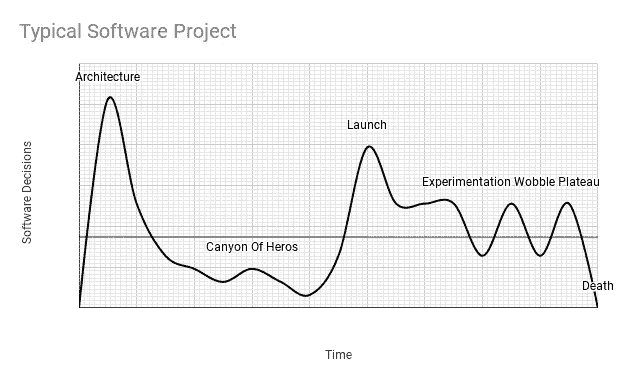
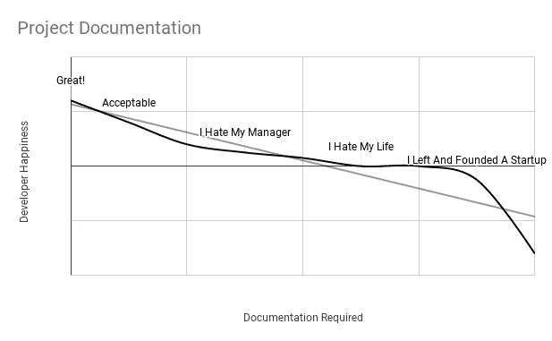
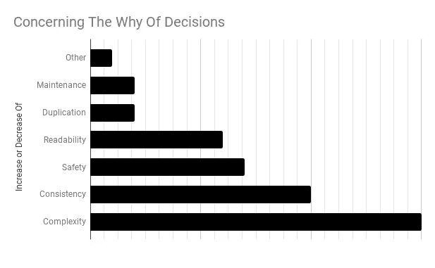

# 决策假设

> 原文：<https://medium.com/hackernoon/the-decision-hypothesis-aa512e0113>

## 神话中的人月暗示了几十年前的软件决策文档

A Qumran Cave Scroll (iStock)

几周前，我重读了小佛瑞德·P·布鲁克斯的《神话人月》( T1 )( MM-M)。这是我多年来在软件开发领域的第三次阅读。

MM-M 是我们年轻工艺中创作卓越的戏剧性作品。我认为这是一种继续隐藏令人愉快的发现的*体质*。任何练习[软件开发](/hackernoon/software-is-unlike-construction-c0284ee4b723)的人读了 MM-M 都会受益，但是，读一遍是不够的！无数次阅读会带来许多快乐和智慧。这项工作强调了持续至今的 45 年的观察结果。

这篇文章将描述 MM-M 中松散的发现，这可能暗示我们如何记录*软件开发决策的*为什么*。它还将分析我们团队不一致部署的一项技术，以捕获软件决策。*

# 第十章:纪录片假设

在《MM-M》中，弗雷德在短短的四页中假设学术劳动应用于实际应用。

> 在一堆文件中，少量的文档成为每个项目团队的关键支点…

弗雷德接着分三个部分简洁地描述了一个计算机产品所需的文档、大学部门所需的文档和软件项目所需的文档。

他以**为什么的话题结束。**

> 首先，把决定写下来是必要的…其次，文档会把决定传达给其他人…最后，…文档提供了…一个数据库和清单。

通过引用，Fred 建立了开发人员应该努力的文档的思想和基础。虽然他可能已经有了目标文档，例如时间表和需求，但是就代码而言，这如何应用于软件项目呢？

# 决策. md

几年前，我们的团队进行了一次讨论，以决定如何传达团队决策的**为什么**的机制。我们想出了一种记录决策的方法。该文档将关注代码方向、构造用法、结构和风格，以解释这些决策的结论。

我们的指导原则是**文档是代码**。如果我们必须文档化，*在版本控制系统*或中尽可能靠近软件工作空间*的地方做。*

然后我们发现了这个帖子；每个[项目都应该有一个由](https://akazlou.com/posts-output/2015-11-09-every-project-should-have-decisions/)[...## LoggingAs a platform team, we have decided to utilize Timber [https://github.com/JakeWharton/timber](https://github.com/JakeWharton/timber)] for all logging calls within the application. This is due to a few reasons. Our biggest gain is the removal of an overbearing **Log** wrapper we had to maintain. We wanted to get rid of its complexity.Some other reasons for utilization of Timber are as follows:***** Automatic tagging.
***** Easy extensibility.
***** Better usability in unit testing....

一旦被采用，我们就遇到了`DECISIONS.md`的及时性问题，因为它需要持续的维护。我们还观察到两个事实。首先，软件开发决策是无情和持久的。它们的强度可以变化，但总是存在。第二，我们很难让开发者拥有像《T2》这样的代码，让它保持及时。

# 许多人都失去了朱利叶斯·韦尔豪森的作品

这篇文章的灵感来自于团队、MM-M、启动和维护的许多项目以及 Aliaksandr 在`DECISIONS.md`上的文章。然而，最终我决定写这篇文章，因为我最近和一位高级开发人员共进午餐。午餐让我明白了一切。

Software decisions vary during a project but prefer to be constant over time.

我们讨论了我们整体回购中的拉式请求趋势，这似乎与`@VisibleForTesting`的特定用途和 react evix`Subject`等其他用途不一致。此外，在为我们的 Kotlin 生产迁移做准备时，团队没有做出一致使用`@Nullable`和`@NonNull`的决定。当然，技术细节是不必要的，这些问题只是一周的味道。

当我们吃饭的时候，许多开发人员基于理想主义的开发哲学贡献和改进我们的代码，但是如果我们朝着相同的方向前进，没有什么哲学是错误的。向 Fred“使眼色”会暗示*零碎的或补充的假设*在代码贡献方面总是完全有效的。

果不其然，我们的午餐得出的结论是，我们必须提出决策，并且这些问题的沟通非常重要。我们要展开一场讨论，一场有数据的辩论，然后更新`DECISIONS.md`文档。否则，随着时间的推移，测试和生产代码的完整性可能会因违反概念完整性而降低。

# Fred 以自我文档总结道

在 MM-M 中，显而易见，Fred 很难处理独立的文档。他支持它的价值，但是思考为什么开发者没有做好。最后，他以某种我认为务实的方式给出了方向。

> 大多数文档都没有给出足够的概述。描述了树木，评论了树皮和树叶，但没有森林的地图。要写一篇有用的散文描述，先退后一步，慢慢来…

关于书面语言与弗雷德最突出的对比如下。

> 英语，或任何其他人类语言，自然不是这种定义的精确工具。因此，手工书写者必须竭尽全力，用自己的语言来达到所需的精确度。

然而，

> 用英语散文，你可以展示结构原则，分阶段或层次描述结构，并给出例子。人们可以很容易地标出例外并强调对比。最重要的是，人们可以解释为什么**。**

**

*Developers do not like to document. Mundane external processes hurt developer happiness. [ 1 ]*

*Fred 终于崩溃了，写了一章关于将文档与代码结合起来。*

> *然而，我们在编程文档方面的实践违背了我们自己的教导。我们通常试图维护一个机器可读形式的程序和一组独立的人类可读文档，包括散文和流程图。*
> 
> *结果事实上证实了我们的教导，即分开文件是愚蠢的。众所周知，程序文档质量很差，维护更差。程序中所做的更改不会及时、准确、不变地出现在文件中。*
> 
> *我认为，解决办法是合并文件，将文档合并到源程序中。这是对正确维护的一个强有力的激励，也是对程序用户来说文档总是方便的一个保证。这样的程序被称为**自文档**。*

*Fred 接近解决方案，但是他没有将代码作为文档来完成后续工作。看起来人类语言和机器语言互相排斥，就像两块磁铁被压在同一个磁极上。当它们靠近时，需要更多的能量来保持连接。*

*四十五年后，*测试是关于规范*的文档。然而，它们也不能解释为什么代码会这样存在。有一个很高的值来保持 *why* 使得系统能够枢转并存活。因此，一些文档在工作空间中有其位置。*

# *代码无法向人类解释原因*

*每个项目都会有大量的软件决策，这些决策需要不同强度的持续关注。建议是*在一个地方连续、仔细地记录*重要的软件开发决策。试试类似`DECISIONS.md`的技巧。*

*这份文件可以通过鼓励新的辩论和将决议集中到高度透明的文件修订上来为团队服务。这个过程将开发者舒适地聚焦在一个中立的真实点上——一个不完美的电子仲裁者。*

**

*Decreasing code **complexity** and increasing code **consistency** appears to be the whys.*

*最后，我们必须解释软件决策的**原因**,因为代码有一种愚蠢的能力来传达它的起源。部落知识、走廊谈话、团队动态变化和消失。版本控制被改变，历史被打破。所有剩下的是许多贡献者在短时间内将这些片段绘制在一起。*

> *决策假设:*
> 
> *在不断的软件决策中，那些复杂性和一致性成为每个软件系统生存的关键支点。决定文件是揭示真相的关键。*

## *参考*

*[ 1 ]丹尼尔·格拉齐奥丁、费边·法格霍尔姆、王晓凤和佩卡·亚伯拉罕森。[关于软件开发者的不快](https://arxiv.org/pdf/1703.04993.pdf)。*

## *作者的笔记*

**在 MM-M 中，第十章:纪录片假设* *聚焦于经理演员。通过结合对第 6 章:传递信息和第 15 章:另一面的思考，Creative liberty 将谈话重新聚焦在软件团队和他们的文档上。**

**Fred 的“文件假说”讨论了预算、组织结构图和时间表等文件。太多的软件工程团队，这些文档被认为是禁忌直接分发给他们。然而，这些文档是* ***数据和决策*** *部分或全部控制所有软件项目的可变输入——时间、范围、开发人员和质量。**

> *[摘自第 3 章:手术团队] …米尔斯在编程转型中的概念“从私人艺术到公共实践”，使所有团队成员都能看到所有的计算机运行，并将所有程序和**数据视为团队财产**，而非私有财产。*

*由于软件开发团队总是受到约束，所以代码一致性、复杂性以及为什么组织以他们的方式构建事物都有相似之处。我们应该质疑为什么驱动软件项目的某些文档是隐藏的，这可能是为了让团队讨论并鼓励不同的变量，以便更好的软件能够蓬勃发展。然而，这不是我最初思考的目标。感谢 [*哈齐姆·萨利赫*](https://medium.com/u/d8a8e3247b67?source=post_page-----aa512e0113--------------------------------) *指出了这一点，并总结说，关于这一迷人的探索，可以写很多书。**

**最后，感谢*[*James Shvarts*](https://medium.com/u/4e5a0d0c55e?source=post_page-----aa512e0113--------------------------------)*的启发。有一样东西永远不会消失，那就是价格过高的三明治店。**