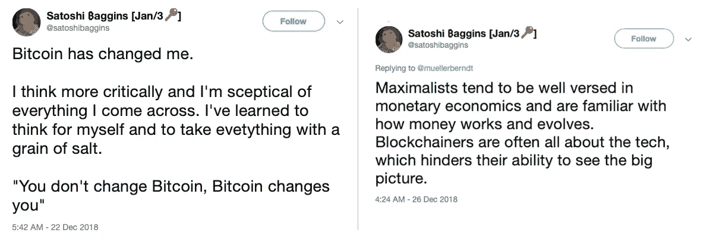
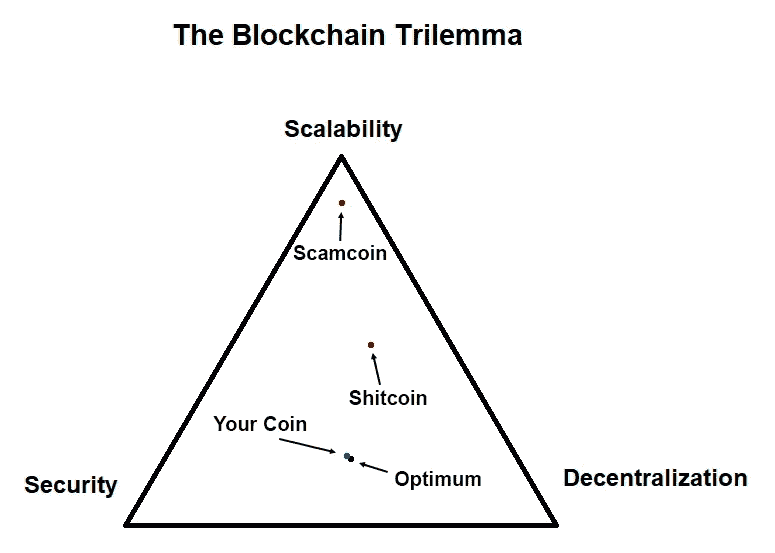
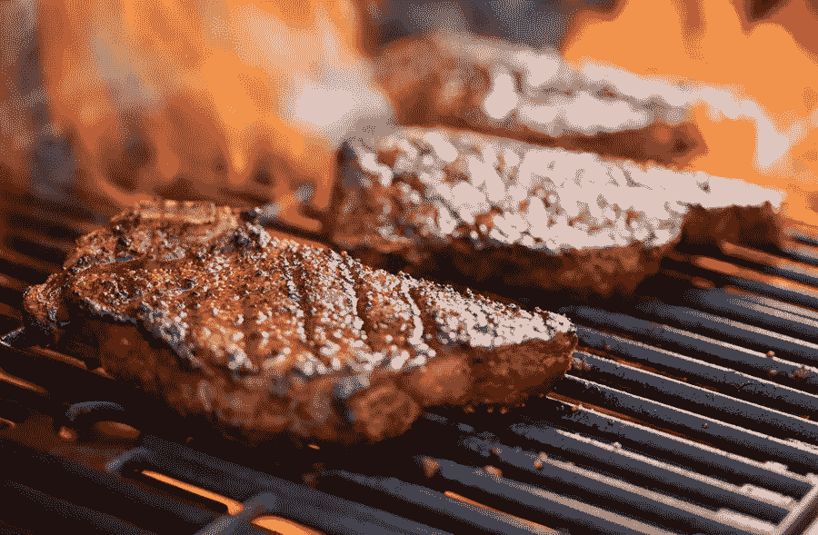
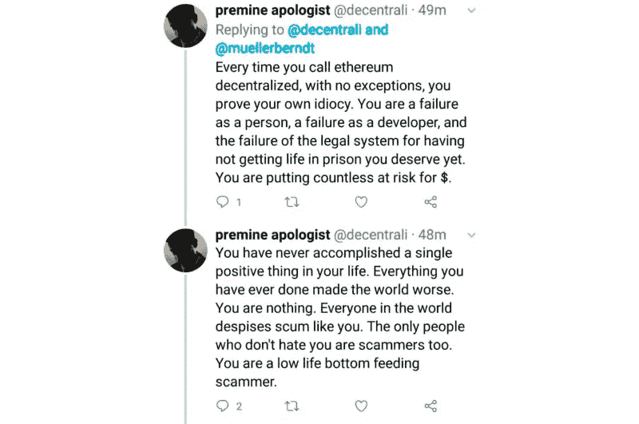

# 成为加密最大列表的权威指南

> 原文：<https://medium.com/hackernoon/the-definitive-guide-to-becoming-a-crypto-maximalist-82b64d02c707>

***最大主义的第一条规则是没有最大主义。*** *你只是一个普通人，基于客观事实，断定只有一种有效的加密货币。* [*当只有一种加密货币可供选择时*](https://hackernoon.com/there-is-no-blockchain-technology-8d70c878b18c) *不存在最大化。*

加密世界最吸引人的一个方面是它的部落主义。没有什么比隶属于一个团体并憎恨其他所有人更令人满足的了。最大化主义者将部落主义推向了新的高度:对他们来说，替代加密货币的想法显然是荒谬的。任何有这种想法的人一定是不诚实的和/或疯狂的，无论如何，作为一个人是完全失败的。其实这样的人按理应该判终身监禁！

如果你是加密货币世界的新手，这个循序渐进的教程将帮助你通过几个简单的步骤开始你的最大化之旅。

The goggles of truth await at the end of your journey.

# Maximalism 入门

由于比特币最大化曾经是唯一可行的选择，直到最近这个领域已经相当拥挤。幸运的是，现在有几种有吸引力的最大化选择。

每种硬币的选择并不那么重要:可以为[十大硬币](https://coinmarketcap.com)中的任何一个建立一个强大的最大化论点(注意，系绳最大化是为铁杆反向投资者保留的)。预先存在的政治偏见或固执己见的朋友可以帮助你更容易地做出选择，但如果你没有任何政治观点和朋友，只需先选择一枚硬币，然后调整你的技术和经济观点。

一旦你决定了一枚硬币，是时候构建一个无懈可击、自我强化的信仰体系了。需要记住的要点是:

*   你是一个理性客观的人，在评估事实后，得出了唯一明显的结论。不同于其他币的洗脑爪牙，*你*不受偏见、操纵和社会影响。你的观点是基于对事实和证据的仔细观察——只是在这种情况下，事实如此明显，否认它们将是疯狂的。
*   你看到了全局。你的加密货币有[赠送你的真理太阳镜](https://www.youtube.com/watch?v=JI8AMRbqY6w)。你巧妙地运用了货币经济学、社会经济学、博弈论和计算机科学，解开了现实世界分布式多主体系统的复杂动态，为公平高效的新世界经济铺平了道路。请记住，其他人可能只是缺乏教育、批判性思维技能或简单的智力来达到这种全面的理解水平。

*   **你的硬币是人民的硬币。你的社区是唯一一个由真实、理性、诚实的人组成的社区。其他硬币有由恶意[团体](https://blockstream.com)或[个人](https://rogerver.com)策划的虚假社区。他们不会回避花费数十亿美元购买追随者和攻击你的网络和社交媒体渠道。你的社区是唯一一个受道德规范约束的社区，而其他人使用书中的每一个技巧。**
*   你的硬币做得很好。例如，如果这是一枚隐私币，那么隐私就是一个非常重要的问题。然而，如果你的硬币不打算在不久的将来添加任何隐私功能，那是因为[链上隐私从根本上来说是不好的](https://www.youtube.com/watch?v=3AzdmfvJk5E)。如果你的共识协议使用利害关系证明，那么采矿就是一个破坏环境的浪费过程。如果它是基于工作证明，能源消耗比安全、不变的全球货币的好处更合理。
*   发生在你的硬币上的所有积极的事情都是有机发生的。如果同样的事情发生在其他硬币上，那就是操纵。当你的硬币价格上涨时，这是由真正买家的需求增加引起的。然而，当其他加密货币的价格上涨时，这是一种人工泵。如果你的加密货币价格下降，那是市场非理性、一致攻击或者聪明的鲸鱼操纵市场买入更多的结果。当其他加密货币的价格下跌时，市场只是对糟糕的基本面做出反应。

*注意，有时目标证明了手段的正当性:考虑到你的*事业服务于更大的利益，通常被视为不道德的事情会变成道德的。例如，使用多数散列率来清除其他链是非常好的，如果你是这样做的人。*

# 构建你的世界观

成功开始最大化过程后，是时候用你的选择来调整你的整体世界观了。这就是事情变得有点技术性的地方。

开始研究的一个好地方是 Reddit:每种加密货币都有一个 subreddit，由 T2 审查，T4 否决不同意见。分布式计算、经济学和博弈论的专家经常光顾这些子主题，他们将为您提供丰富的信息。此外，你的硬币的子圈作为一个安全的空间，将帮助你保持积极的前景，即使在一个疯狂的熊市。

需要了解的一个重要概念是所谓的[区块链三难困境](https://bitcoinist.com/breaking-down-the-scalability-trilemma/):区块链无法同时针对可伸缩性、安全性和去中心化进行优化。因此，无论你的硬币强调什么都是最重要的。

例如，一些 DLT 网络开始时只有少量特权节点，为了支持可伸缩性而牺牲了分散性。如果你的硬币慢但分散，指出分散必须总是最大化，你的硬币将在稍后达到高交易量，而不牺牲分散。

相反，如果你的硬币速度快且可扩展，强调其第二代区块链协议如何在此时此地实现签证级别的交易量，并将很快取代旧硬币及其传统技术。去中心化可以在以后通过增加更多的共识节点来实现。

另一个重要因素是你的硬币将如何改变世界。根据硬币的技术属性选择一个政治目标:

1.  如果硬币是高度分散的，规模保守，有一个紧凑的通货膨胀时间表，成为奥地利学派的信徒。凯恩斯主义者正把世界推向灾难，唯一的出路是为世界精心设计合理的货币。
2.  如果硬币积极扩展以实现高速度和低交易费用，强调*为没有银行账户的人提供银行服务*的重要性。仍然有 20 亿人没有银行账户！你们正在为一个更具金融包容性的未来和一个没有遗留机构的世界而努力。
3.  如果你是智能合约平台的支持者，请指出 1。第二。可以很容易地实现为智能合约。

# 调整你的饮食习惯

为了达到秘密最大化的最终水平，把它编织到你生活的所有其他方面——最重要的是你的饮食。

作为一个比特币最大化主义者，你会发现法定货币和现代食物都是人造的、受控的和通货膨胀的。随之而来的是[你应该成为一个食肉动物](https://www.youtube.com/watch?v=UTXFE9Cz0JI])来进一步挑战主流叙事。请注意，这种饮食与多个链兼容，包括比特币(BTC)和比特币现金(BCH)*。

*注意:这一部分是根据 Twitter 的反馈添加的，不幸的是，我还没有找到其他加密货币的饮食指南。如果你知道什么，请在评论中告诉我。*

# 传播消息

一个让你成为最大主义者思想领袖的好方法是创建一个介绍性的推特风暴。这是通过收集大量支持你观点的论点、论文和引文，并将它们打包成至少 50 条推文的线索来实现的。以下是几个 Tweetstorm 模板，以获取灵感:

*   [反以太坊推特风暴](https://threadreaderapp.com/thread/1078682801954799617.html)
*   [反比特币推特风暴](https://threadreaderapp.com/thread/1078996243425030144.html)

在 Reddit 和 Twitter 上潜伏一段时间后，你可能会开始遇到其他硬币的支持者。在许多情况下，这些“人”(低等人类)只是不诚实，但有时你可能会遇到被骗子误导的人，只是不知道更好。无论如何，要让他们知道自己是多么悲惨的生物。

其他硬币通常由魅力十足的骗子主导，这些骗子专门猎取头脑简单的人。揭露那些骗子的真面目。深究敌人最明显的支持者的过去:果然他们已经[代言了儿童色情](https://www.breitbart.com/tech/2017/11/14/ethereum-cryptocurrency-creator-defends-possession-of-child-porn-claims-it-can-have-social-benefits/)，[变成了反基督](/@WhalePanda/roger-ver-from-bitcoin-jesus-to-bitcoin-antichrist-69fc7a17c622)，甚至被[暂时禁止在维基百科上发表](https://www.reddit.com/r/btc/comments/74se80/wikipedia_admins_gregory_maxwell_of_blockstream/)。将你的发现一丝不苟地记录在 Reddit 帖子中，每月转发一次，让新人了解最新情况。

可悲的事实是，大多数其他硬币的追随者在各方面都是彻头彻尾的失败者。因此，你最好阻止他们，而不是参与讨论。历史会在适当的时候纠正他们。确保存档他们声称的截屏，一旦你的硬币是唯一剩下的，让你的胜利更加甜蜜。

# 更多指南和市场分析

*   [价值存储摊牌:比特币 vs. Cryptokitties](https://blog.goodaudience.com/showdown-of-stores-of-value-bitcoin-vs-cryptokitties-8df80f4045e7)
*   [如何成为推特上的加密货币思想领袖](/coinmonks/how-to-become-a-cryptocurrency-thought-leader-on-twitter-f10ac1c26488)
*   [为什么区块链不会涅槃](https://blog.goodaudience.com/blockchain-bah-2afda19f7f1)