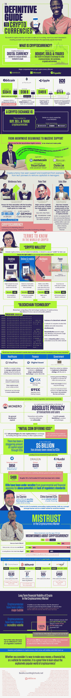

# 加密货币的权威指南

> 原文：<https://medium.com/hackernoon/the-definitive-guide-to-cryptocurrency-8b0e6a4edf21>

不，比特币不是一个包含所有加密货币的通用术语——实际上有几十种不同的加密货币，每种都有自己特定的名称。加密货币正在成为一个家喻户晓的词，但大多数人仍然没有完全理解它是什么，如何购买它，或者用它来做什么。这比买股票或把钱换成外币要混乱得多。

为了购买加密货币，你必须首先选择一个交易所。你需要选择一个你住的地方可以买到的，卖你想买的货币的，交易费用合适的。币安、GDax 和北海巨妖是目前最受欢迎的交易所，但是还有很多可供选择的。

一旦你购买了加密货币，你需要弄清楚如何最好地储存它，这意味着知道你会用它做什么。有一些著名的大公司接受某种形式的加密货币进行支付，所以如果你打算用你的加密货币买东西，你需要把它放在一个热钱包里。如果你没有用它购物，你需要把它放在一个冷的钱包里以确保安全——这可以防止它被在线访问和被盗。

从这份[加密货币权威指南](http://www.bestaccountingschools.net/guide-to-cryptocurrencies/)中了解更多关于加密货币的信息！

