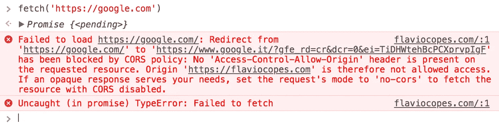
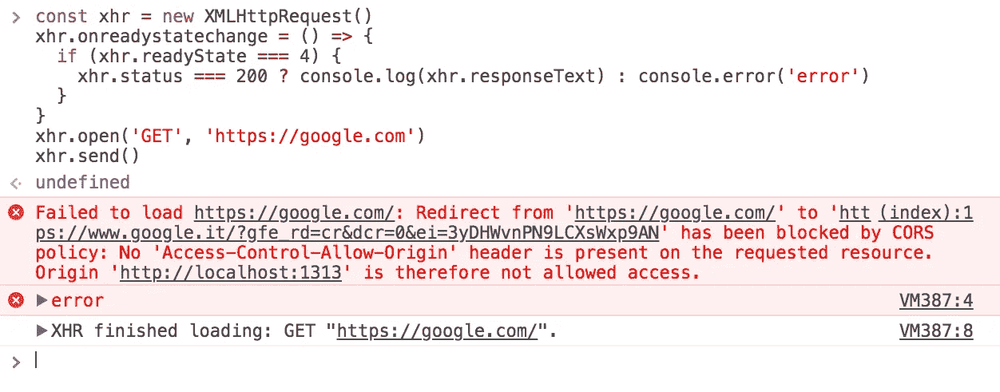
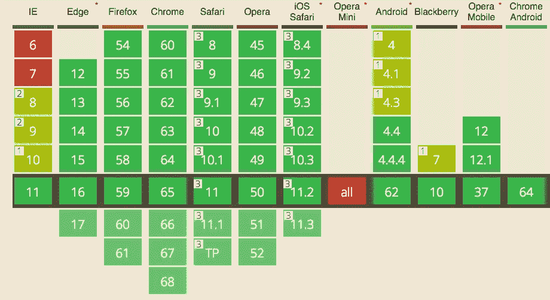
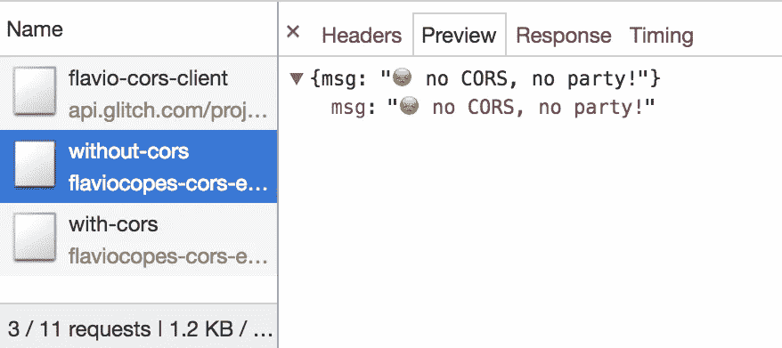
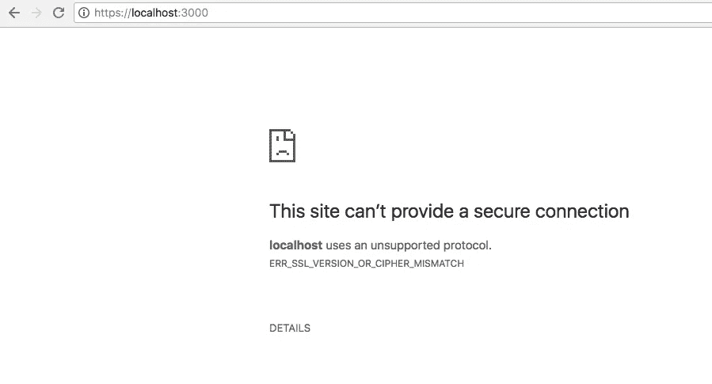
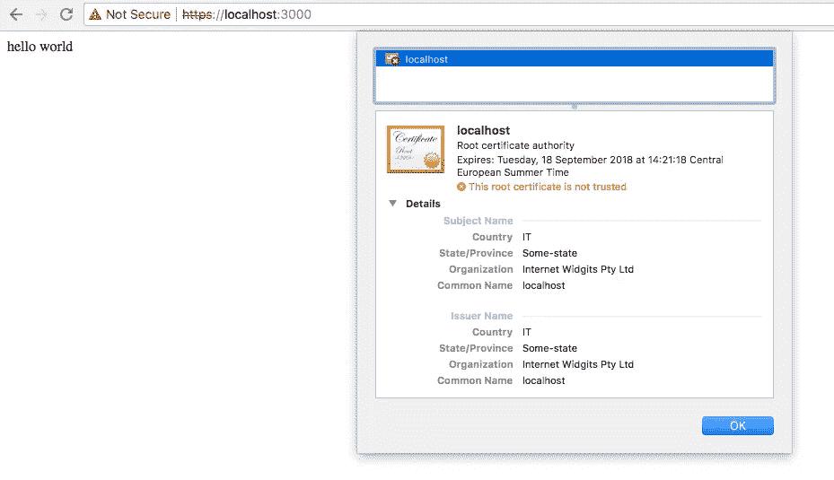

# Express 的权威指南，Node.js Web 应用程序框架

> 原文：<https://medium.com/hackernoon/the-definitive-guide-to-express-the-node-js-web-application-framework-649352e2ae87>


你可以获得这个页面的 [PDF、ePub 和 Mobi](https://flaviocopes.com/page/express-handbook) 版本，以便于参考，或者在你的 Kindle 或平板电脑上阅读。

## 目录

*   [安装](/p/649352e2ae87#cf65)
*   [你好世界](/p/649352e2ae87#3c1b)
*   [通过理解 Hello World 代码](/p/649352e2ae87#e2ea)学习 Express 的基础知识
*   [请求参数](/p/649352e2ae87#12e8)
*   [如何检索得到查询字符串参数](/p/649352e2ae87#abc5)
*   [如何检索帖子查询字符串参数](/p/649352e2ae87#901a)
*   [发送响应](/p/649352e2ae87#3f9c)
*   [如何服务 JSON 数据](/p/649352e2ae87#cb86)
*   [管理 cookie](/p/649352e2ae87#74db)
*   [使用 HTTP 头](/p/649352e2ae87#6ba1)
*   [重定向](/p/649352e2ae87#5fc3)
*   [路由](/p/649352e2ae87#32e3)
*   [CORS](/p/649352e2ae87#243c)
*   [模板](/p/649352e2ae87#a525)
*   [帕格简介](/p/649352e2ae87#98bb)
*   [中间件](/p/649352e2ae87#af6b)
*   [服务静态文件](/p/649352e2ae87#3603)
*   [发送文件](/p/649352e2ae87#9942)
*   [会话](/p/649352e2ae87#e5a4)
*   [验证输入](/p/649352e2ae87#2c7d)
*   [消毒输入](/p/649352e2ae87#f1c1)
*   [处理表单](/p/649352e2ae87#7fa4)
*   [以表格形式上传文件](/p/649352e2ae87#fb32)
*   [如何为 Node.js 创建自签名 HTTPS 证书以在本地测试应用](/p/649352e2ae87#f32a)
*   [设置让我们为 Express 加密](/p/649352e2ae87#c2d0)

Node.js 是一个构建网络服务和应用程序的神奇工具。

Express 在其功能的基础上构建，提供易于使用的功能，满足 Web 服务器用例的需求。

它是开源的，免费的，易于扩展，性能非常好，并且有很多很多预构建的包，你可以直接放入并使用，来执行各种事情。

## 装置

你可以用 npm 将 Express 安装到任何项目中:

```
npm install express --save
```

或[纱](https://flaviocopes.com/yarn/):

```
yarn add express
```

这两个命令也可以在一个空目录下工作，从头开始你的项目，尽管`npm`根本不创建一个`package.json`文件，Yarn 创建一个基本文件。

如果你要从头开始一个新项目，只需运行`npm init`或`yarn init`即可。

## 你好世界

我们准备创建我们的第一个 Express Web 服务器。

下面是一些代码:

```
const express = require('express')
const app = express()app.get('/', (req, res) => res.send('Hello World!'))
app.listen(3000, () => console.log('Server ready'))
```

将它保存到项目根文件夹中的一个`index.js`文件中，并使用

```
node index.js
```

您可以在本地主机上打开到端口 3000 的浏览器，您应该会看到`Hello World!`消息。

## 通过理解 Hello World 代码学习 Express 的基础知识

这 4 行代码在幕后做了很多工作。

首先，我们将`express`包导入到`express`值中。

我们通过调用应用程序的`app()`方法来实例化它。

一旦我们有了应用程序对象，我们告诉它使用`get()`方法监听`/`路径上的 GET 请求。

每个 HTTP **动词**都有一个方法:`get()`、`post()`、`put()`、`delete()`、`patch()`:

```
app.get('/', (req, res) => { /* */ })
app.post('/', (req, res) => { /* */ })
app.put('/', (req, res) => { /* */ })
app.delete('/', (req, res) => { /* */ })
app.patch('/', (req, res) => { /* */ })
```

那些方法接受一个回调函数，当一个请求开始时调用这个函数，我们需要处理它。

我们传入一个箭头函数:

```
(req, res) => res.send('Hello World!')
```

在这个回调中，Express 向我们发送了两个对象，我们称之为`req`和`res`，它们分别代表请求和响应对象。

请求是 HTTP 请求。它可以给我们关于它的所有信息，包括请求参数、请求头、请求体等等。

Response 是我们将发送给客户端的 HTTP 响应对象。

我们在回调中做的是发送“Hello World！”字符串发送到客户端，使用`Response.send()`方法。

该方法将该字符串设置为主体，并关闭连接。

示例的最后一行实际上启动了服务器，并告诉它监听端口`3000`。我们传递一个回调函数，当服务器准备好接受新的请求时调用这个函数。

# 请求参数

我提到了请求对象如何保存所有 HTTP 请求信息。

这些是您可能会用到的主要属性:

*   **。app** 保存了对 Express app 对象的引用
*   **。baseUrl** 应用程序响应的基本路径
*   **。主体**包含请求主体中提交的数据(在您可以访问它之前，必须手动解析和填充)
*   **。cookie**包含请求发送的 cookie(需要`cookie-parser`中间件)
*   **。主机名**服务器主机名
*   **。ip** 服务器 ip
*   **。方法**使用的 HTTP 方法
*   **。params** 路线命名参数
*   **。路径**URL 路径
*   **。协议**请求协议
*   **。query** 包含请求中使用的所有查询字符串的对象
*   **。安全**如果请求是安全的，则为真(使用 HTTPS)
*   **。signedCookies** 包含请求发送的签名 cookies(需要`cookie-parser`中间件)
*   **。如果请求是一个 [XMLHttpRequest](https://flaviocopes.com/xhr/) 则为真**

## 如何检索 GET 查询字符串参数

查询字符串是 URL 路径后面的部分，以感叹号`?`开头。

示例:

```
?name=flavio
```

使用`&`可以添加多个查询参数:

```
?name=flavio&age=35
```

如何在 Express 中获得这些查询字符串值？

Express 为我们填充了`Request.query`对象，这让事情变得非常简单:

```
const express = require('express')
const app = express()app.get('/', (req, res) => {
  console.log(req.query)
})app.listen(8080)
```

该对象为每个查询参数填充了一个属性。

如果没有查询参数，它就是一个空对象。

这使得使用 for…in 循环对其进行迭代变得很容易:

```
for (const key in req.query) {
  console.log(key, req.query[key])
}
```

这将打印查询属性键和值。

您也可以访问单个属性:

```
req.query.name //flavio
req.query.age //35
```

## 如何检索后查询字符串参数

POST 查询参数由 HTTP 客户端发送，例如通过表单发送，或者在执行 POST 请求发送数据时发送。

你如何访问这些数据？

如果使用`Content-Type: application/json`将数据作为 JSON 发送，您将使用`express.json()`中间件:

```
const express = require('express')
const app = express()app.use(express.json())
```

如果使用`Content-Type: application/x-www-form-urlencoded`将数据作为 JSON 发送，您将使用`express.urlencoded()`中间件:

```
const express = require('express')
const app = express()app.use(express.urlencoded())
```

在这两种情况下，您都可以通过从`Request.body`引用来访问数据:

```
app.post('/form', (req, res) => {
  const name = req.body.name
})
```

> *注意:旧的 Express 版本需要使用* `*body-parser*` *模块来处理 POST 数据。从 Express 4.16(2017 年 9 月发布)及以后的版本开始就不再是这样了。*

# 发送响应

在 Hello World 示例中，我们使用了`Response.send()`方法发送一个简单的字符串作为响应，并关闭连接:

```
(req, res) => res.send('Hello World!')
```

如果你传入一个字符串，它将把`Content-Type`头设置为`text/html`。

如果传入一个对象或数组，它会设置`application/json` `Content-Type`头，并将该参数解析为 JSON。

`send()`自动设置`Content-Length` HTTP 响应头。

`send()`也会自动关闭连接。

## 使用 end()发送空响应

发送响应的另一种方法是使用`Response.end()`方法，没有任何正文:

```
res.end()
```

## 设置 HTTP 响应状态

使用`Response.status()`:

```
res.status(404).end()
```

或者

```
res.status(404).send('File not found')
```

`sendStatus()`是快捷方式:

```
res.sendStatus(200)
// === res.status(200).send('OK')res.sendStatus(403)
// === res.status(403).send('Forbidden')res.sendStatus(404)
// === res.status(404).send('Not Found')res.sendStatus(500)
// === res.status(500).send('Internal Server Error')
```

# 如何服务 JSON 数据

当您在 Express 中监听某个路由上的连接时，回调函数将在每个[网络](https://hackernoon.com/tagged/network)调用中使用请求对象实例和响应对象实例来调用。

示例:

```
app.get('/', (req, res) => res.send('Hello World!'))
```

这里我们使用了`Response.send()`方法，它接受任何字符串。

您可以通过使用`Response.json()`将 JSON 发送到客户端，这是一个有用的方法。

它接受一个对象或数组，并在发送之前将其转换为 JSON:

```
res.json({ username: 'Flavio' })
```

# 管理 cookies

## 如何使用“Response.cookie()”方法来操作您的 cookie

使用`Response.cookie()`方法来操作您的 cookies。

示例:

```
res.cookie('username', 'Flavio')
```

该方法接受包含各种选项的第三个参数:

```
res.cookie('username', 'Flavio', { domain: '.flaviocopes.com', path: '/administrator', secure: true })res.cookie('username', 'Flavio', { expires: new Date(Date.now() + 900000), httpOnly: true })
```

您可以设置的最有用的参数是:

`domain`[cookie 域名](http://localhost:1313/cookies/#set-a-cookie-domain)

`expires`设置 [cookie 有效期](http://localhost:1313/cookies/#set-a-cookie-expiration-date)。如果缺少或为 0，则 cookie 是会话 cookie

`httpOnly`将 cookie 设置为只能由 web 服务器访问。参见 [HttpOnly](https://flaviocopes.com/cookies/#httponly)

`maxAge`设置相对于当前时间的到期时间，单位为毫秒

`path`[cookie 路径](https://flaviocopes.com/cookies/#set-a-cookie-path)。默认为/

`secure`只标志着[曲奇 HTTPS](https://flaviocopes.com/cookies/#secure)

`signed`设置要签名的 cookie

`[SameSite](https://flaviocopes.com/cookies/#samesite)`的`sameSite`值

cookie 可以通过以下方式清除

```
res.clearCookie('username')
```

# 使用 HTTP 头

## 从请求中访问 HTTP 头值

您可以使用`Request.headers`属性访问所有 HTTP 头:

```
app.get('/', (req, res) => {
  console.log(req.headers)
})
```

使用`Request.header()`方法访问一个单独的请求头值:

```
app.get('/', (req, res) => {
  req.header('User-Agent')
})
```

## 更改响应的任何 HTTP 头值

您可以使用`Response.set()`更改任何 HTTP 头值:

```
res.set('Content-Type', 'text/html')
```

但是，内容类型标题有一个快捷方式:

```
res.type('.html')
// => 'text/html'res.type('html')
// => 'text/html'res.type('json')
// => 'application/json'res.type('application/json')
// => 'application/json'res.type('png')
// => image/png:
```

# 重新寄送

重定向在 Web 开发中很常见。您可以使用`Response.redirect()`方法创建一个重定向:

```
res.redirect('/go-there')
```

这创建了一个 302 重定向。

301 重定向以这种方式进行:

```
res.redirect(301, '/go-there')
```

您可以指定绝对路径(`/go-there`)、绝对 url ( `https://anothersite.com`)、相对路径(`go-there`)或使用`..`返回上一级:

```
res.redirect('../go-there')
res.redirect('..')
```

您还可以使用以下方法重定向回 Referer HTTP 头值(如果未设置，默认为`/`)

```
res.redirect('back')
```

# 按指定路线发送

路由是确定调用 URL 时应该发生什么，或者应用程序的哪些部分应该处理特定的传入请求的过程。

在 Hello World 示例中，我们使用了以下代码

```
app.get('/', (req, res) => { /* */ })
```

这创建了一个路由，它将使用 HTTP GET 方法访问根域 URL `/`映射到我们想要提供的响应。

## 命名参数

如果我们想监听自定义请求，也许我们想创建一个接受字符串并返回大写的服务，我们不希望参数作为查询字符串发送，而是作为 URL 的一部分。我们使用命名参数:

```
app.get('/uppercase/:theValue', (req, res) => res.send(req.params.theValue.toUpperCase()))
```

如果我们向`/uppercase/test`发送一个请求，我们将在响应体中得到`TEST`。

您可以在同一个 URL 中使用多个命名参数，它们都将存储在`req.params`中。

## 使用正则表达式匹配路径

您可以使用[正则表达式](https://flaviocopes.com/javascript-regular-expressions/)用一条语句匹配多个路径:

```
app.get(/post/, (req, res) => { /* */ })
```

会匹配`/post`、`/post/first`、`/thepost`、`/posting/something`，以此类推。

# 克-奥二氏分级量表

在浏览器中运行的 JavaScript 应用程序通常只能访问为其服务的同一个域(源)上的 HTTP 资源。

加载图像或脚本/样式总是有效的，但是对另一个服务器的 XHR 和获取调用将会失败，除非那个服务器实现了允许该连接的方法。

这种方式叫做 CORS，**跨产地资源共享**。

此外，使用`@font-face`加载 Web 字体默认具有同源策略，以及其他不太流行的东西(如 WebGL 纹理和画布 API 中加载的`drawImage`资源)。

需要 CORS 的一个非常重要的东西是最近在现代浏览器中引入的 ES 模块。

如果您没有在服务器上设置允许服务第三方来源的 CORS 策略**，请求将会失败。**

获取示例:



XHR 的例子:



在以下情况下，跨来源资源会失败:

*   到不同的**域**
*   到不同的**子域**
*   去不同的**港口**
*   到不同的**协议**

它是为了您的安全，防止恶意用户利用网络平台。

但是，如果您同时控制服务器和客户机，您就有充分的理由允许它们相互通信。

怎么会？

这取决于您的服务器端堆栈。

# 浏览器支持

相当不错(基本上都是除了 IE <10):



## Example with Express

If you are using Node.js and Express as a framework, use the [CORS 中间件包](https://github.com/expressjs/cors))。

下面是 Express Node.js 服务器的一个简单实现:

```
const express = require('express')
const app = express()app.get('/without-cors', (req, res, next) => {
  res.json({ msg: '😞 no CORS, no party!' })
})const server = app.listen(3000, () => {
  console.log('Listening on port %s', server.address().port)
})
```

如果您点击`/without-cors`从不同的来源获取请求，这将引发 CORS 问题。

你需要做的就是要求上面链接的`cors`包，并把它作为中间件函数传递给端点请求处理器:

```
const express = require('express')
const cors = require('cors')
const app = express()app.get('/with-cors', cors(), (req, res, next) => {
  res.json({ msg: 'WHOAH with CORS it works! 🔝 🎉' })
})/* the rest of the app */
```

我举了一个简单的故障例子。这里是客户端正在工作，这里是它的代码:[https://glitch.com/edit/#!/flavio-cors-client](https://glitch.com/edit/#!/flavio-cors-client)。

这是 Node.js 快递服务器:[https://glitch.com/edit/#!/flaviocopes-cors-example-express](https://glitch.com/edit/#!/flaviocopes-cors-example-express)

请注意由于未正确处理 CORS 标题而失败的请求是如何被接收的，正如您在[网络](https://hackernoon.com/tagged/network)面板中看到的，在这里您可以找到服务器发送的消息:



## 仅允许特定的来源

然而，这个例子有一个问题:任何请求都会被服务器接受为跨来源的。

正如您在网络面板中看到的，通过的请求有一个响应头`access-control-allow-origin: *`:


您需要将服务器配置为只允许一个源提供服务，并阻止所有其他源。

使用同一个`cors`节点库，您可以这样做:

```
const cors = require('cors')const corsOptions = {
  origin: 'https://yourdomain.com'
}app.get('/products/:id', cors(corsOptions), (req, res, next) => {
  //...
})
```

你还可以提供更多服务:

```
const whitelist = ['http://example1.com', 'http://example2.com']
const corsOptions = {
  origin: function(origin, callback) {
    if (whitelist.indexOf(origin) !== -1) {
      callback(null, true)
    } else {
      callback(new Error('Not allowed by CORS'))
    }
  }
}
```

## 起飞前的

有些请求是以“简单”的方式处理的。所有的`GET`请求都属于这个组。

同样*一些*T3 和`HEAD`请求也是如此。

`POST`如果请求满足使用内容类型的要求，它们也属于该组

*   `application/x-www-form-urlencoded`
*   `multipart/form-data`
*   `text/plain`

所有其他请求都必须经过一个称为预检的预先批准阶段。浏览器通过发出一个`OPTIONS`请求来决定它是否有权限执行一个动作。

预检请求包含几个标题，服务器将使用这些标题来检查权限(忽略不相关的字段):

```
OPTIONS /the/resource/you/request
Access-Control-Request-Method: POST
Access-Control-Request-Headers: origin, x-requested-with, accept
Origin: [https://your-origin.com](https://your-origin.com)
```

服务器将像这样响应(不相关的字段省略):

```
HTTP/1.1 200 OK
Access-Control-Allow-Origin: https://your-origin.com
Access-Control-Allow-Methods: POST, GET, OPTIONS, DELETE
```

我们检查了 POST，但是服务器告诉我们，我们还可以为该特定资源发出其他 HTTP 请求类型。

按照上面的 Node.js Express 示例，服务器还必须处理 OPTIONS 请求:

```
var express = require('express')
var cors = require('cors')
var app = express()//allow OPTIONS on just one resource
app.options('/the/resource/you/request', cors())//allow OPTIONS on all resources
app.options('*', cors())
```

# 模板

Express 能够处理服务器端模板引擎。

模板引擎允许我们向视图添加数据，并动态生成 HTML。

Express 使用 Jade 作为默认值。Jade 是老版本的 Pug，具体是 Pug 1.0。

> *2016 年该项目发布版本 2 时，由于商标问题，名称从 Jade 改为 Pug。你仍然可以使用 Jade，也就是 Pug 1.0，但是将来，最好使用 Pug 2.0*

虽然 Jade 的最后一个版本已经 3 年了(撰写本文时，2018 年夏天)，但出于向后兼容的原因，它仍然是 Express 中的默认版本。

在任何新项目中，你应该使用 Pug 或者你选择的其他引擎。帕格的官方网站是[https://pugjs.org/](https://pugjs.org/)。

你可以使用许多不同的模板引擎，包括哈巴狗，车把，小胡子，EJS 和更多。

# 使用泥料

要使用 Pug，我们必须首先安装它:

```
npm install pug
```

而在初始化 Express app 的时候，我们需要设置它:

```
const express = require('express')
const app = express()
app.set('view engine', 'pug')
```

我们现在可以开始在`.pug`文件中编写模板了。

创建“关于”视图:

```
app.get('/about', (req, res) => {
  res.render('about')
})
```

和`views/about.pug`中的模板:

```
p Hello from Flavio
```

该模板将创建一个内容为`Hello from Flavio`的`p`标签。

您可以使用以下公式对变量进行插值

```
app.get('/about', (req, res) => {
  res.render('about', { name: 'Flavio' })
})p Hello from #{name}
```

这是一个关于 Pug 的简短介绍，在 Express 中使用它。查看 [Pug 指南](https://flaviocopes.com/pug)了解更多关于如何使用 Pug 的信息。

如果您习惯于使用 HTML 和插值变量的模板引擎，比如把手(下面将描述)，您可能会遇到问题，尤其是当您需要将现有的 HTML 转换为 Pug 时。这个从 HTML 到 Jade 的在线转换器(非常相似，但和 Pug 有点不同)会有很大的帮助:[https://jsonformatter.org/html-to-jade](https://jsonformatter.org/html-to-jade)

## 使用车把

让我们试着用车把代替哈巴狗。

你可以用`npm install hbs`安装它。

在`views/`文件夹中放一个`about.hbs`模板文件:

```
Hello from {{name}}
```

然后使用这个快速配置在`/about`上提供服务:

```
const express = require('express')
const app = express()
const hbs = require('hbs')app.set('view engine', 'hbs')
app.set('views', path.join(__dirname, 'views'))app.get('/about', (req, res) => {
  res.render('about', { name: 'Flavio' })
})app.listen(3000, () => console.log('Server ready'))
```

您还可以使用`[express-react-views](https://github.com/reactjs/express-react-views)`包**呈现 React 应用服务器端**。

从`npm install express-react-views react react-dom`开始。

现在，我们不需要`hbs`，而是需要`express-react-views`并将其用作引擎，使用`jsx`文件:

```
const express = require('express')
const app = express()app.set('view engine', 'jsx')
app.engine('jsx', require('express-react-views').createEngine())app.get('/about', (req, res) => {
  res.render('about', { name: 'Flavio' })
})app.listen(3000, () => console.log('Server ready'))
```

只需将一个`about.jsx`文件放入`views/`中，调用`/about`应该会显示一个“Hello from Flavio”字符串:

```
const React = require('react')class HelloMessage extends React.Component {
  render() {
    return <div>Hello from {this.props.name}</div>
  }
}module.exports = HelloMessage
```

# 帕格简介

帕格是什么？它是服务器端 Node.js 应用程序的模板引擎。

Express 能够处理服务器端模板引擎。模板引擎允许我们向视图添加数据，并动态生成 HTML。

帕格是旧事物的新名称。是*翡翠 2.0* 。

由于 2016 年的商标问题，该项目发布了版本 2，名称从 Jade 改为 Pug。你仍然可以使用 Jade，也就是 Pug 1.0，但是将来，最好使用 Pug 2.0

> *亦见* [*玉石与哈巴狗的区别*](https://pugjs.org/api/migration-v2.html)

Express 使用 Jade 作为默认值。Jade 是老版本的 Pug，具体是 Pug 1.0。

虽然 Jade 的最后一个版本已经 3 年了(撰写本文时，2018 年夏天)，但出于向后兼容的原因，它仍然是 Express 中的默认版本。

在任何新项目中，你应该使用 Pug 或者你选择的其他引擎。帕格的官方网站是[https://pugjs.org/](https://pugjs.org/)。

## 帕格看起来怎么样

```
p Hello from Flavio
```

这个模板将创建一个内容为`Hello from Flavio`的`p`标签。

如你所见，帕格很特别。它将标记名作为一行中的第一件事，剩下的就是放入其中的内容。

如果您习惯于使用 HTML 和插值变量的模板引擎，比如把手(下面将描述)，您可能会遇到问题，尤其是当您需要将现有的 HTML 转换为 Pug 时。这个从 HTML 到 Jade 的在线转换器(与 Pug 非常相似，但有一点不同)将会有很大的帮助:[https://jsonformatter.org/html-to-jade](https://jsonformatter.org/html-to-jade)

## 安装泥巴

安装 Pug 就像运行`npm install`一样简单:

```
npm install pug
```

## 将 Pug 设置为 Express 中的模板引擎

而在初始化 Express app 的时候，我们需要设置它:

```
const express = require('express')
const app = express()
app.set('view engine', 'pug')
app.set('views', path.join(__dirname, 'views'))
```

## 你的第一个 Pug 模板

创建“关于”视图:

```
app.get('/about', (req, res) => {
  res.render('about')
})
```

而`views/about.pug`中的模板:

```
p Hello from Flavio
```

这个模板将创建一个内容为`Hello from Flavio`的`p`标签。

## Pug 中的插值变量

您可以使用以下方法对变量进行插值

```
app.get('/about', (req, res) => {
  res.render('about', { name: 'Flavio' })
})p Hello from #{name}
```

## 插值函数返回值

您可以使用以下方法对函数返回值进行插值

```
app.get('/about', (req, res) => {
  res.render('about', { getName: () => 'Flavio' })
})p Hello from #{getName()}
```

## 向元素添加 id 和类属性

```
p#title
p.title
```

## 设置文档类型

```
doctype html
```

## 元标签

```
html
  head
    meta(charset='utf-8')
    meta(http-equiv='X-UA-Compatible', content='IE=edge')
    meta(name='description', content='Some description')
    meta(name='viewport', content='width=device-width, initial-scale=1')
```

## 添加脚本和样式

```
html
  head
    script(src="script.js")
    script(src='//ajax.googleapis.com/ajax/libs/jquery/1.10.2/jquery.min.js') link(rel='stylesheet', href='css/main.css')
```

## 内嵌脚本

```
script alert('test')script
  (function(b,o,i,l,e,r){b.GoogleAnalyticsObject=l;b[l]||(b[l]=
  function(){(b[l].q=b[l].q||[]).push(arguments)});b[l].l=+new Date;
  e=o.createElement(i);r=o.getElementsByTagName(i)[0];
  e.src='//www.google-analytics.com/analytics.js';
  r.parentNode.insertBefore(e,r)}(window,document,'script','ga'));
  ga('create','UA-XXXXX-X');ga('send','pageview');
```

## 环

```
ul
  each color in ['Red', 'Yellow', 'Blue']
    li= colorul
  each color, index in ['Red', 'Yellow', 'Blue']
    li= 'Color number ' + index + ': ' + color
```

## 条件式

```
if name
  h2 Hello from #{name}
else
  h2 Hello
```

else-if 也适用:

```
if name
  h2 Hello from #{name}
else if anotherName
  h2 Hello from #{anotherName}
else
  h2 Hello
```

## 设置变量

您可以在 Pug 模板中设置变量:

```
- var name = 'Flavio'
- var age = 35
- var roger = { name: 'Roger' }
- var dogs = ['Roger', 'Syd']
```

## 递增变量

您可以使用`++`增加数值变量:

```
age++
```

## 将变量分配给元素值

```
p= namespan.age= age
```

## 迭代变量

可以用`for`或者`each`。没有区别。

```
for dog in dogs
    li= dogul
  each dog in dogs
    li= dog
```

您可以使用`.length`来获得物品的数量:

```
p There are #{values.length}
```

`while`是另一种循环:

```
- var n = 0;ul
  while n <= 5
    li= n++
```

## 包括其他 Pug 文件

在 Pug 文件中，您可以包含其他 Pug 文件:

```
include otherfile.pug
```

## 定义块

一个组织良好的模板系统将定义一个基础模板，然后所有其他模板从它扩展。

模板的一部分可以通过使用块来扩展:

```
html
  head
    script(src="script.js")
    script(src='//ajax.googleapis.com/ajax/libs/jquery/1.10.2/jquery.min.js') link(rel='stylesheet', href='css/main.css')
    block head
  body
    block body
      h1 Home page
      p welcome
```

在这种情况下，一个块`body`具有一些内容，而`head`没有。`head`是用来给标题添加额外的内容，而`body`的内容会被其他页面覆盖。

## 扩展基本模板

一个模板可以通过使用`extends`关键字来扩展一个基础模板:

```
extends home.pug
```

完成后，您需要重新定义块。模板的所有内容必须放入块中，否则引擎不知道将它们放在哪里。

示例:

```
extends home.pugblock body
  h1 Another page
  p Hey!
  ul
    li Something
    li Something else
```

您可以重新定义一个或多个块。未重新定义的模板将保留原始模板内容。

## 评论

Pug 中的注释有两种类型:在结果 HTML 中可见或不可见。

## 看得见的

内嵌:

```
// some comment
```

阻止:

```
//
  some
  comment
```

## 看不见的

内嵌:

```
//- some comment
```

阻止:

```
//-
  some
  comment
```

# 中间件

中间件是一种与路由过程挂钩的功能，根据它想要做的事情，在某个时候执行一些操作。

它通常用于编辑请求或响应对象，或者在请求到达路由处理程序代码之前终止请求。

它被添加到执行堆栈，如下所示:

```
app.use((req, res, next) => { /* */ })
```

这类似于定义一个路由，但是除了请求和响应对象实例之外，我们还有一个对下一个中间件函数*的引用，我们将它赋给了变量`next`。*

我们总是在中间件函数的末尾调用`next()`,将执行传递给下一个处理程序，除非我们想提前结束响应，并将其发送回客户端。

你通常使用预制的中间件，以`npm`包的形式。这里的列出了一个很大的可用列表。

一个例子是`cookie-parser`，它用于将 cookies 解析成`req.cookies`对象。您使用`npm install cookie-parser`安装它，您可以像这样使用它:

```
const express = require('express')
const app = express()
const cookieParser = require('cookie-parser')app.get('/', (req, res) => res.send('Hello World!'))app.use(cookieParser())
app.listen(3000, () => console.log('Server ready'))
```

您还可以将中间件功能设置为仅针对特定路由运行，而不是针对所有路由，方法是将其用作路由定义的第二个参数:

```
const myMiddleware = (req, res, next) => {
  /* ... */
  next()
}app.get('/', myMiddleware, (req, res) => res.send('Hello World!'))
```

如果您需要存储中间件中生成的数据，以便将其传递给后续的中间件功能，或者传递给请求处理器，您可以使用`Request.locals`对象。它会将该数据附加到当前请求:

```
req.locals.name = 'Flavio'
```

# 提供静态文件

在`public`子文件夹中存放图像、CSS 等内容并将其暴露在根级别是很常见的:

```
const express = require('express')
const app = express()app.use(express.static('public'))/* ... */app.listen(3000, () => console.log('Server ready'))
```

如果您在`public/`中有一个`index.html`文件，那么如果您现在点击根域 URL ( `http://localhost:3000`)，它就会被提供

# 发送文件

Express 提供了一种将文件作为附件传输的简便方法:`Response.download()`。

一旦用户点击使用这种方法发送文件的路径，浏览器将提示用户下载。

`Response.download()`方法允许你发送一个附加在请求上的文件，浏览器不会把它显示在页面上，而是把它保存到磁盘上。

```
app.get('/', (req, res) => res.download('./file.pdf'))
```

在应用程序的上下文中:

```
const express = require('express')
const app = express()app.get('/', (req, res) => res.download('./file.pdf'))
app.listen(3000, () => console.log('Server ready'))
```

您可以用自定义文件名设置要发送的文件:

```
res.download('./file.pdf', 'user-facing-filename.pdf')
```

此方法提供了一个回调函数，一旦文件被发送，您可以使用该函数来执行代码:

```
res.download('./file.pdf', 'user-facing-filename.pdf', (err) => {
  if (err) {
    //handle error
    return
  } else {
    //do something
  }
})
```

# 会议

默认情况下，快速请求是连续的，没有请求可以相互链接。没有办法知道这个请求是否来自以前已经执行过请求的客户端。

除非使用某种机制，否则无法识别用户。

这就是会话。

当实现时，你的 API 或网站的每个用户将被分配一个唯一的会话，这允许你存储用户状态。

我们将使用由 Express 团队维护的`express-session`模块。

您可以使用安装它

```
npm install express-session
```

完成后，您可以在您的应用程序中用

```
const session = require('express-session')
```

这是一个中间件，所以你*在快速使用中安装*它

```
const express = require('express')
const session = require('express-session')const app = express()
app.use(session(
  'secret': '343ji43j4n3jn4jk3n'
))
```

完成后，所有对应用程序路由的请求现在都使用会话。

`secret`是唯一必需的参数，但是您可以使用更多的参数。对于您的应用程序，它应该是一个随机唯一的字符串。

会话被附加到请求上，所以您可以在这里使用`req.session`来访问它:

```
app.get('/', (req, res, next) => {
  // req.session
}
```

该对象可用于从会话中获取数据，也可用于设置数据:

```
req.session.name = 'Flavio'
console.log(req.session.name) // 'Flavio'
```

这些数据在存储时被序列化为 JSON，所以使用嵌套对象是安全的。

您可以使用会话将数据传递给稍后执行的中间件，或者在以后的请求中检索数据。

会话数据存储在哪里？这取决于你如何设置`express-session`模块。

它可以将会话数据存储在

*   **内存**，不用于生产
*   像 MySQL 或 Mongo 这样的数据库
*   像 Redis 或 Memcached 这样的内存缓存

> *在*[*https://github.com/expressjs/session*](https://github.com/expressjs/session)中有一个很大的第三个包列表，它们实现了各种不同的兼容缓存存储

所有解决方案都将会话 id 存储在 cookie 中，并将数据保存在服务器端。客户机将在一个 cookie 中接收会话 id，并将它与每个 HTTP 请求一起发送。

我们将引用服务器端来将会话 id 与本地存储的数据关联起来。

内存是默认的，它不需要你进行特殊的设置，这是最简单的事情，但是它仅仅是为了开发的目的。

最好的选择是像 Redis 这样的内存缓存，为此您需要建立自己的基础设施。

另一个在 Express 中管理会话的流行包是`cookie-session`，它有一个很大的不同:它在 cookie 中存储客户端数据。我不建议这样做，因为将数据存储在 cookies 中意味着它存储在客户端，并在用户发出的每个请求中来回发送。它的大小也有限，因为它只能存储 4 千字节的数据。Cookies 也需要被保护，但是默认情况下它们是不安全的，因为安全的 Cookies 在 HTTPS 站点上是可能的，如果你有代理，你需要配置它们。

# 验证输入

假设您有一个接受姓名、电子邮件和年龄参数的 POST 端点:

```
const express = require('express')
const app = express()app.use(express.json())app.post('/form', (req, res) => {
  const name  = req.body.name
  const email = req.body.email
  const age   = req.body.age
})
```

您如何在服务器端验证这些结果以确保

*   名称是至少 3 个字符的字符串。
*   邮件是真邮件？
*   年龄是一个数字，在 0 到 110 之间？

在 Express 中处理来自外部的任何类型的输入的最好方法是使用`[express-validator](https://express-validator.github.io/)` [包](https://express-validator.github.io/):

```
npm install express-validator
```

您需要包中的`check`对象:

```
const { check } = require('express-validator/check')
```

我们传递一组`check()`调用作为`post()`调用的第二个参数。每个`check()`调用都接受参数名作为自变量:

```
app.post('/form', [
  check('name').isLength({ min: 3 }),
  check('email').isEmail(),
  check('age').isNumeric()
], (req, res) => {
  const name  = req.body.name
  const email = req.body.email
  const age   = req.body.age
})
```

注意我用了

*   `isLength()`
*   `isEmail()`
*   `isNumeric()`

这些方法还有很多，都来自 [validator.js](https://github.com/chriso/validator.js#validators) ，包括:

*   `contains()`，检查数值是否包含规定值
*   `equals()`，检查值是否等于规定值
*   `isAlpha()`
*   `isAlphanumeric()`
*   `isAscii()`
*   `isBase64()`
*   `isBoolean()`
*   `isCurrency()`
*   `isDecimal()`
*   `isEmpty()`
*   `isFQDN()`，是全限定域名吗？
*   `isFloat()`
*   `isHash()`
*   `isHexColor()`
*   `isIP()`
*   `isIn()`，检查该值是否在允许值的数组中
*   `isInt()`
*   `isJSON()`
*   `isLatLong()`
*   `isLength()`
*   `isLowercase()`
*   `isMobilePhone()`
*   `isNumeric()`
*   `isPostalCode()`
*   `isURL()`
*   `isUppercase()`
*   `isWhitelisted()`，根据允许字符的白名单检查输入

您可以使用`matches()`根据正则表达式验证输入。

可以使用以下工具检查日期

*   `isAfter()`，检查输入的日期是否在您传递的日期之后
*   `isBefore()`，检查输入的日期是否在您传递的日期之前
*   `isISO8601()`
*   `isRFC3339()`

关于如何使用这些验证器的确切细节，请参考[https://github.com/chriso/validator.js#validators](https://github.com/chriso/validator.js#validators)。

所有这些检查都可以通过管道进行组合:

```
check('name')
  .isAlpha()
  .isLength({ min: 10 })
```

如果有任何错误，服务器会自动发送响应来传达错误。例如，如果电子邮件无效，将返回以下内容:

```
{
  "errors": [{
    "location": "body",
    "msg": "Invalid value",
    "param": "email"
  }]
}
```

可以使用`withMessage()`为您执行的每个检查覆盖该默认错误:

```
check('name')
  .isAlpha()
  .withMessage('Must be only alphabetical chars')
  .isLength({ min: 10 })
  .withMessage('Must be at least 10 chars long')
```

如果你想写你自己的特殊的，定制的验证器呢？您可以使用`custom`验证器。

在回调函数中，您可以通过抛出异常或返回拒绝的承诺来拒绝验证:

```
app.post('/form', [
  check('name').isLength({ min: 3 }),
  check('email').custom(email => {
    if (alreadyHaveEmail(email)) {
      throw new Error('Email already registered')
    }
  }),
  check('age').isNumeric()
], (req, res) => {
  const name  = req.body.name
  const email = req.body.email
  const age   = req.body.age
})
```

自定义验证程序:

```
check('email').custom(email => {
  if (alreadyHaveEmail(email)) {
    throw new Error('Email already registered')
  }
})
```

可以改写为

```
check('email').custom(email => {
  if (alreadyHaveEmail(email)) {
    return Promise.reject('Email already registered')
  }
})
```

# 净化输入

您已经看到了如何验证来自外部世界的输入到您的 Express 应用程序。

当你运行一个面向公众的服务器时，你很快就会明白一件事:永远不要相信输入。

即使您清理并确保人们不能使用客户端代码输入奇怪的东西，您仍然会受到人们使用工具(甚至只是浏览器开发工具)直接向您的端点发布的影响。

或者机器人尝试人类已知的各种可能的利用方式。

你需要做的是净化你的输入。

您已经用来验证输入的`[express-validator](https://express-validator.github.io/)` [包](https://express-validator.github.io/)也可以方便地用来执行清理。

假设您有一个接受姓名、电子邮件和年龄参数的 POST 端点:

```
const express = require('express')
const app = express()app.use(express.json())app.post('/form', (req, res) => {
  const name  = req.body.name
  const email = req.body.email
  const age   = req.body.age
})
```

您可以使用以下方法验证它:

```
const express = require('express')
const app = express()app.use(express.json())app.post('/form', [
  check('name').isLength({ min: 3 }),
  check('email').isEmail(),
  check('age').isNumeric()
], (req, res) => {
  const name  = req.body.name
  const email = req.body.email
  const age   = req.body.age
})
```

您可以通过在验证方法之后管道化清理方法来添加清理:

```
app.post('/form', [
  check('name').isLength({ min: 3 }).trim().escape(),
  check('email').isEmail().normalizeEmail(),
  check('age').isNumeric().trim().escape()
], (req, res) => {
  //...
})
```

这里我使用的方法是:

*   `trim()`修剪字符串开头和结尾的字符(默认为空白)
*   `escape()`用对应的 HTML 实体替换`<`、`>`、`&`、`'`、`"`和`/`
*   `normalizeEmail()`规范电子邮件地址。接受多个小写电子邮件地址或子地址选项(如`flavio+newsletters@gmail.com`)

其他消毒方法:

*   `blacklist()`删除出现在黑名单中的角色
*   `whitelist()`删除未出现在白名单中的字符
*   `unescape()`用`<`、`>`、`&`、`'`、`"`和`/`替换 HTML 编码的实体
*   `ltrim()`类似 trim()，但只修剪字符串开头的字符
*   `rtrim()`类似 trim()，但只修剪字符串末尾的字符
*   `stripLow()`删除通常不可见的 ASCII 控制字符

强制转换为一种格式:

*   `toBoolean()`将输入字符串转换成布尔值。除“0”、“false”和“”之外的所有内容都返回 true。在严格模式下，只有' 1 '和' true '返回 true
*   `toDate()`将输入字符串转换为日期，如果输入不是日期，则为 null
*   `toFloat()`将输入字符串转换为浮点数，如果输入不是浮点数，则转换为 NaN
*   `toInt()`将输入字符串转换为整数，如果输入不是整数，则转换为 NaN

与自定义验证器一样，您可以创建一个自定义杀毒器。

在回调函数中，您只需返回净化后的值:

```
const sanitizeValue = value => {
  //sanitize...
}app.post('/form', [
  check('value').customSanitizer(value => {
    return sanitizeValue(value)
  }),
], (req, res) => {
  const value  = req.body.value
})
```

# 处理表单

这是一个 HTML 表单的示例:

```
<form method="POST" action="/submit-form">
  <input type="text" name="username" />
  <input type="submit" />
</form>
```

当用户按下提交按钮时，浏览器会自动向页面同一原点的`/submit-form` URL 发出一个`POST`请求，发送包含的数据，编码为`application/x-www-form-urlencoded`。在这种情况下，表单数据包含`username`输入字段值。

表单也可以使用`GET`方法发送数据，但是您将构建的绝大多数表单都将使用`POST`。

表单数据将在 POST 请求正文中发送。

要提取它，您将使用 Express 提供的`express.urlencoded()`中间件:

```
const express = require('express')
const app = express()app.use(express.urlencoded())
```

现在您需要在`/submit-form`路线上创建一个`POST`端点，任何数据都可以在`Request.body`上获得:

```
app.post('/submit-form', (req, res) => {
  const username = req.body.username
  //...
  res.end()
})
```

不要忘记在使用数据之前使用`express-validator`对其进行验证。

# 表单中的文件上传

这是一个允许用户上传文件的 HTML 表单示例:

```
<form method="POST" action="/submit-form">
  <input type="file" name="document" />
  <input type="submit" />
</form>
```

当用户按下提交按钮时，浏览器会自动向页面同一原点的`/submit-form` URL 发出`POST`请求，发送其中包含的数据，不是像普通形式那样编码为`application/x-www-form-urlencoded`，而是编码为`multipart/form-data`。

在服务器端，处理多部分数据可能很棘手并且容易出错，所以我们将使用一个名为**强大的**的实用程序库。这里是 GitHub repo ，它有超过 4000 颗星星，维护得很好。

您可以使用以下方式安装它:

```
npm install formidable
```

然后在 Node.js 文件中包含它:

```
const express = require('express')
const app = express()
const formidable = require('formidable')
```

现在，在`/submit-form`路线的`POST`端点，我们使用`formidable.IncomingFrom()`实例化一个新的强大表单:

```
app.post('/submit-form', (req, res) => {
  new formidable.IncomingFrom()
})
```

这样做之后，我们需要解析表单。我们可以通过提供一个回调来同步完成，这意味着所有的文件都被处理，一旦完成，它就使它们可用:

```
app.post('/submit-form', (req, res) => {
  new formidable.IncomingFrom().parse(req, (err, fields, files) => {
    if (err) {
      console.error('Error', err)
      throw err
    }
    console.log('Fields', fields)
    console.log('Files', files)
    files.map(file => {
      console.log(file)
    })
  })
})
```

或者您可以使用事件而不是回调，在解析每个文件时得到通知，以及其他事件，如结束处理、接收非文件字段或发生错误:

```
app.post('/submit-form', (req, res) => {
  new formidable.IncomingFrom().parse(req)
    .on('field', (name, field) => {
      console.log('Field', name, field)
    })
    .on('file', (name, file) => {
      console.log('Uploaded file', name, file)
    })
    .on('aborted', () => {
      console.error('Request aborted by the user')
    })
    .on('error', (err) => {
      console.error('Error', err)
      throw err
    })
    .on('end', () => {
      res.end()
    })
})
```

无论你选择哪种方式，你都会得到一个或多个令人生畏的东西。文件对象，它为您提供关于上传文件的信息。以下是您可以调用的一些方法:

*   `file.size`，文件大小以字节为单位
*   `file.path`，该文件写入的路径
*   `file.name`，文件的名称
*   `file.type`，文件的 MIME 类型

该路径默认为临时文件夹，如果您收听`fileBegin`事件，可以修改该路径:

```
app.post('/submit-form', (req, res) => {
  new formidable.IncomingFrom().parse(req)
    .on('fileBegin', (name, file) => {
      form.on('fileBegin', (name, file) => {
        file.path = __dirname + '/uploads/' + file.name
      })
    })
    .on('file', (name, file) => {
      console.log('Uploaded file', name, file)
    })
    //...
})
```

# 如何为 Node.js 创建自签名 HTTPS 证书以在本地测试应用程序

为了能够从本地主机为 HTTPS 上的站点提供服务，您需要创建一个自签名证书。

自签名证书足以建立安全的 HTTPS 连接，尽管浏览器会抱怨该证书是自签名的，因此不可信。这对于开发来说非常好。

要创建证书，您的系统上必须安装有 **OpenSSL** 。

您可能已经安装了它，只需在您的终端中键入`openssl`进行测试。

如果没有，在 Mac 上你可以使用`brew install openssl`安装它，如果你使用[自制软件](https://brew.sh/)。否则在 Google 上搜索“如何在上安装 openssl”。

一旦安装了 OpenSSL，运行以下命令:

```
openssl req -nodes -new -x509 -keyout server.key -out server.cert
```

它会问你几个问题。首先是国名:

```
Generating a 1024 bit RSA private key
...........++++++
.........++++++
writing new private key to 'server.key'
-----
You are about to be asked to enter information that will be incorporated into your certificate request.
What you are about to enter is what is called a Distinguished Name or a DN.
There are quite a few fields but you can leave some blank
For some fields there will be a default value,
If you enter '.', the field will be left blank.
-----
Country Name (2 letter code) [AU]:
```

然后是您所在的州或省:

```
State or Province Name (full name) [Some-State]:
```

您的城市:

```
Locality Name (eg, city) []:
```

您的组织名称:

```
Organization Name (eg, company) [Internet Widgits Pty Ltd]:
Organizational Unit Name (eg, section) []:
```

你可以把这些都留空。

请记住将此设置为`localhost`:

```
Common Name (e.g. server FQDN or YOUR name) []: localhost
```

要添加您的电子邮件地址:

```
Email Address []:
```

就是这样！现在，在运行该命令的文件夹中有两个文件:

*   `server.cert`是自签名证书文件
*   `server.key`是证书的私钥

建立 HTTPS 连接需要这两个文件，根据您设置服务器的方式，使用它们的过程会有所不同。

这些文件需要放在应用程序可以到达的地方，然后您需要配置服务器来使用它们。

这是一个使用`https`核心模块和 Express 的示例:

```
const https = require('https')
const app = express()app.get('/', (req, res) => {
  res.send('Hello HTTPS!')
})https.createServer({}, app).listen(3000, () => {
  console.log('Listening...')
})
```

在不添加证书的情况下，如果我连接到`https://localhost:3000`，浏览器将显示以下内容:



证书准备就绪后:

```
const fs = require('fs')//...https.createServer({
  key: fs.readFileSync('server.key'),
  cert: fs.readFileSync('server.cert')
}, app).listen(3000, () => {
  console.log('Listening...')
})
```

Chrome 会告诉我们证书无效，因为它是自签名的，并会要求我们确认继续，但 HTTPS 连接将工作:



# 设置让我们为 Express 加密

如果您在自己的 VPS 上运行 Node.js 应用程序，您需要设法获得 SSL 证书。

今天，这样做的标准是使用 [Let's Encrypt](https://letsencrypt.org/) 和 [Certbot](https://certbot.eff.org/) ，这是一个来自 [EFF](https://www.eff.org/) 的工具，又名电子前沿基金会，这是一个领先的非营利组织，专注于数字世界中的隐私、言论自由和一般公民自由。

我们将遵循以下步骤:

*   安装证书机器人
*   使用 Certbot 生成 SSL 证书
*   允许 Express 提供静态文件
*   确认域
*   获得证书
*   设置续订

## 安装证书机器人

这些说明假设您使用的是 Ubuntu、Debian 或任何其他使用`apt-get`的 Linux 发行版:

```
sudo add-apt repository ppa:certbot/certbot
sudo apt-get update
sudo apt-get install certbot
```

您也可以在 Mac 上安装 Certbot 来测试:

```
brew install certbot
```

但是你需要把它链接到一个真实的域名上，这样它才会有用。

## 使用 Certbot 生成 SSL 证书

现在 Certbot 已经安装好了，您可以调用它来生成证书。您必须以 root 用户身份运行:

```
certbot certonly --manual
```

或者打电话给须藤

```
sudo certbot certonly --manual
```

安装程序会询问您网站的域名。

这是详细的过程。

它要求电子邮件

```
➜ sudo certbot certonly --manual
Password: XXXXXXXXXXXXXXXXXX
Saving debug log to /var/log/letsencrypt/letsencrypt.log
Plugins selected: Authenticator manual, Installer None
Enter email address (used for urgent renewal and security notices) (Enter 'c' to
cancel): flavio@flaviocopes.com
```

它要求接受 ToS:

```
Please read the Terms of Service at
https://letsencrypt.org/documents/LE-SA-v1.2-November-15-2017.pdf. You must
agree in order to register with the ACME server at
https://acme-v02.api.letsencrypt.org/directory(A)gree/(C)ancel: A
```

它要求共享电子邮件地址

```
Would you be willing to share your email address with the Electronic Frontier
Foundation, a founding partner of the Let's Encrypt project and the non-profit
organization that develops Certbot? We'd like to send you email about our work
encrypting the web, EFF news, campaigns, and ways to support digital freedom.
- - - - - - - - - - - - - - - - - - - - - - - - - - - - - - - - - - - - - - - -
(Y)es/(N)o: Y
```

最后，我们可以输入希望使用 SSL 证书的域:

```
Please enter in your domain name(s) (comma and/or space separated)  (Enter 'c'
to cancel): copesflavio.com
```

它会询问您是否可以登录您的 IP:

```
Obtaining a new certificate
Performing the following challenges:
http-01 challenge for copesflavio.com- - - - - - - - - - - - - - - - - - - - - - - - - - - - - - - - - - - - - - - -
NOTE: The IP of this machine will be publicly logged as having requested this
certificate. If you're running certbot in manual mode on a machine that is not
your server, please ensure you're okay with that.Are you OK with your IP being logged?
- - - - - - - - - - - - - - - - - - - - - - - - - - - - - - - - - - - - - - - -
(Y)es/(N)o: y
```

最后，我们进入验证阶段！

```
- - - - - - - - - - - - - - - - - - - - - - - - - - - - - - - - - - - - - - - -
Create a file containing just this data:TS_oZ2-ji23jrio3j2irj3iroj_U51u1o0x7rrDY2E.1DzOo_voCOsrpddP_2kpoek2opeko2pke-UAPb21sW1cAnd make it available on your web server at this URL:http://copesflavio.com/.well-known/acme-challenge/TS_oZ2-ji23jrio3j2irj3iroj_U51u1o0x7rrDY2E
```

现在让我们离开 Certbot 几分钟。

我们需要通过在`.well-known/acme-challenge/`文件夹中创建一个名为`TS_oZ2-ji23jrio3j2irj3iroj_U51u1o0x7rrDY2E`的文件来验证我们拥有这个域名。注意了！我刚刚粘贴的奇怪字符串每次都会改变。

您需要创建文件夹和文件，因为默认情况下它们不存在。

在这个文件中，您需要放置 Certbot 打印的内容:

```
TS_oZ2-ji23jrio3j2irj3iroj_U51u1o0x7rrDY2E.1DzOo_voCOsrpddP_2kpoek2opeko2pke-UAPb21sW1c
```

至于文件名，这个字符串在每次运行 Certbot 时都是唯一的。

## 允许 Express 提供静态文件

为了从 Express 提供该文件，您需要启用静态文件服务。您可以创建一个`static`文件夹，并在其中添加`.well-known`子文件夹，然后像这样配置 Express:

```
const express = require('express')
const app = express()//...app.use(express.static(__dirname + '/static', { dotfiles: 'allow' } ))//...
```

`dotfiles`选项是强制的，否则`.well-known`是一个点文件，因为它以一个点开始，不会被显示。这是一种安全措施，因为点文件可能包含敏感信息，默认情况下最好保留这些信息。

## 确认域

现在运行应用程序，确保可以从公共互联网访问该文件，并返回到 Certbot(它仍在运行),按 ENTER 键继续运行脚本。

## 获得证书

就是这样！如果一切顺利，Certbot 创建了证书和私钥，并将其放在您计算机上的一个文件夹中(当然，它会告诉您是哪个文件夹)。

现在将路径复制/粘贴到您的应用程序中，开始使用它们来满足您的请求:

```
const fs = require('fs')
const https = require('https')
const app = express()app.get('/', (req, res) => {
  res.send('Hello HTTPS!')
})https.createServer({
  key: fs.readFileSync('/etc/letsencrypt/path/to/key.pem'),
  cert: fs.readFileSync('/etc/letsencrypt/path/to/cert.pem'),
  ca: fs.readFileSync('/etc/letsencrypt/path/to/chain.pem')
}, app).listen(443, () => {
  console.log('Listening...')
})
```

注意，我让这个服务器监听端口 443，所以您需要用 root 权限运行它。

此外，服务器只在 HTTPS 运行，因为我使用了`https.createServer()`。您还可以通过运行以下命令来运行 HTTP 服务器:

```
http.createServer(app).listen(80, () => {
  console.log('Listening...')
})https.createServer({
  key: fs.readFileSync('/etc/letsencrypt/path/to/key.pem'),
  cert: fs.readFileSync('/etc/letsencrypt/path/to/cert.pem'),
  ca: fs.readFileSync('/etc/letsencrypt/path/to/chain.pem')
}, app).listen(443, () => {
  console.log('Listening...')
})
```

## 设置续订

SSL 证书不会在 90 天内有效。你需要建立一个自动续费系统。

怎么会？使用 cron 作业。

cron 作业是每隔一段时间运行任务的一种方式。它可以是每周、每分钟、每月。

在我们的例子中，我们将按照 Certbot 文档中的建议，每天运行两次更新脚本。

首先找出`certbot`在你的系统上的绝对路径。我在 macOS 上使用`type certbot`来获得它，在我的情况下是`/usr/local/bin/certbot`。

下面是我们需要运行的脚本:

`certbot renew`

这是 cron 作业条目:

```
0 */12 * * * root /usr/local/bin/certbot renew >/dev/null 2>&1
```

这意味着每天每 12 小时运行一次:00:00 和 12:00。

> *提示:我使用*[*https://crontab-generator.org/*](https://crontab-generator.org/)生成了这一行

使用以下命令将该脚本添加到 crontab 中:

```
env EDITOR=pico crontab -e
```

这将打开`pico`编辑器(您可以选择您喜欢的编辑器)。输入该行，保存，cron 作业就安装好了。

完成后，您可以使用以下命令查看活动的 cron 作业列表

```
crontab -l
```

# 包扎

如果你能走到这一步，那太棒了！我希望本文对 Express 的介绍能够让您快速了解这个非常棒的 Node.js 库。请记住，你可以获得该页面的 [PDF、ePub 和 Mobi](https://flaviocopes.com/page/express-handbook) 版本，以便于参考，或者在 Kindle 或平板电脑上阅读。