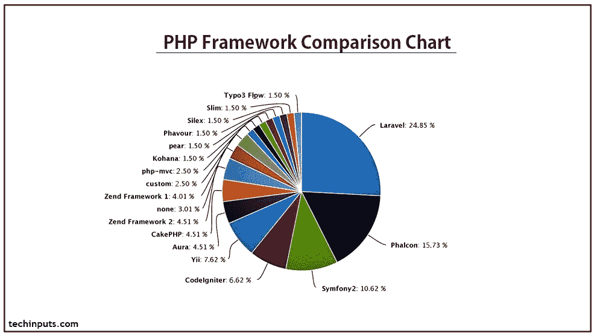
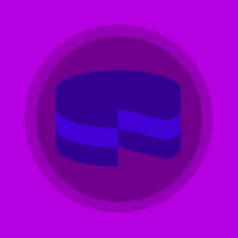
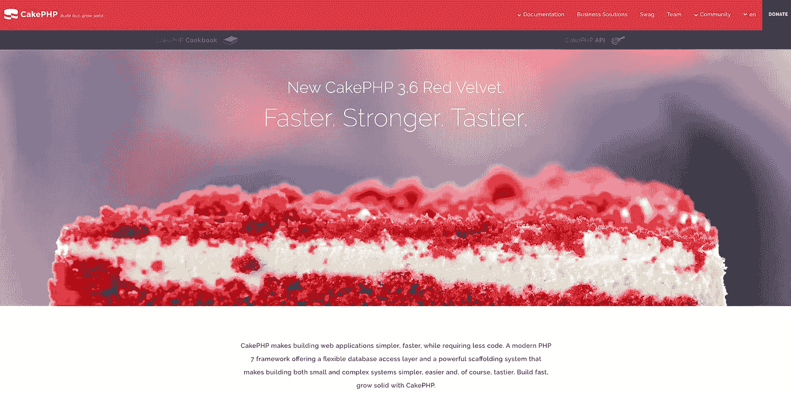
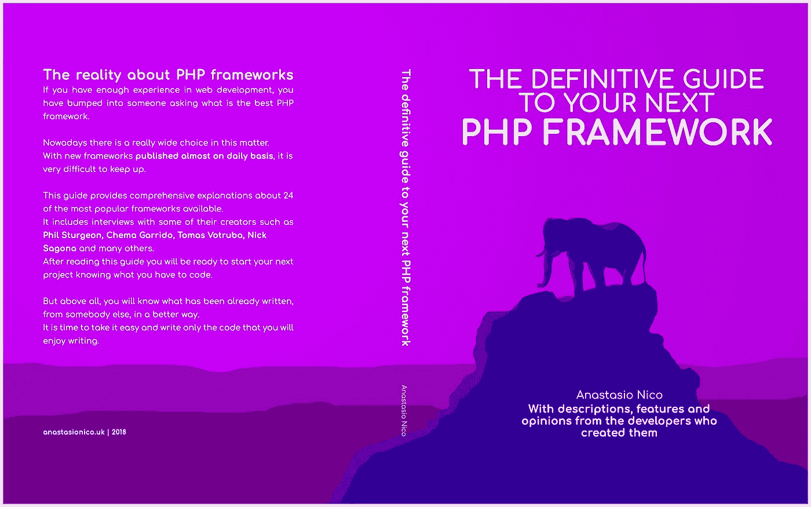

# 下一个 PHP 框架的权威指南第 1 部分

> 原文：<https://medium.com/hackernoon/the-definitive-guide-to-your-next-php-framework-part-1-5741a36d955a>

# 前言

想象一下，如果您可以在终端上键入一个简单的命令，您会看到新的 web 应用程序所需的一半代码已经写好了。

这就是学习如何使用 [PHP](https://hackernoon.com/tagged/php) 框架的力量！

下面我列出了 24 个最好的 PHP 开发框架，它们会给你足够的知识，让你的工作变得更简单更快捷。

我们开始吧！

写代码很有趣，

编写可读的代码更令人着迷。

你什么时候能两者兼顾？

这时你可以编程几个小时，仍然感觉精神饱满，就像一天中的第一杯咖啡开始发挥作用一样。

我有样东西会让你有这种感觉。

# 介绍

什么是[框架](https://hackernoon.com/tagged/framework)？

让我们从头开始，什么是框架？

把“框架”这个词打散，我们得到的是“框架”和“工作”。

一个框架；想一想房子的框架，这是一种结构，其他一切都围绕着它建造，任何工作都取决于它的形状。我可以说相框也是如此，它定义了结构，任何插入的照片都必须符合相框的大小。

框架只是一个预定义的框架，你可以在其中工作。这是一个提供基本功能的软件，通过它可以使用您的代码进行扩展。使用这些功能的优点是它们是标准化的和可重用的。

假装你已经花了半个小时试图找到解决问题的方法。通过使用标准化的服务，很有可能有人在你之前就遇到了你的问题。

这意味着在网络上有一个可能的解决方案。

这就是为什么 Stackoverflow 有超过 100 万的用户，以及另外 100 万个标记为 PHP 的问题。

# 为什么要使用框架？

要回答这个问题，我需要更深入地了解框架的功能。

你做的每个项目通常都是从相同的过程开始的。

如果你像我一样，你的笔记本电脑旁边有一张清单，一支铅笔随时准备好开始开发过程的任何行动。

如果你没有这样的东西，它很可能会错过一些重要的东西，而这些东西需要在以后被包含进去。

框架让你从这些任务中解放出来，专注于开发过程而不是准备阶段。

当你可以花更多的时间做你喜欢做的事情时，为什么还要担心设置授权、会话、编写代码来保护你免受跨站点请求伪造攻击等等。

更不用说你会节省时间找到这些代码准备使用，我们都知道时间就是金钱。

自从第一个框架问世以来，正在实现的特性列表已经增加到一个更大的程度。

框架创建者现在已经有了多年的经验。

这使得他们对其进行了改进，并使用了更多最新的安全标准，正如我在上面所展示的那样。

不仅如此，许多 PHP 框架可以通过 Composer 安装。在其他一些情况下，您甚至可以从 git 存储库中下载目录，它就可以使用了。

将 Composer 设置为需要第三方包和资源，这是扩展您的项目并使它们更具可伸缩性的好方法。

他们大多数人使用的代码是 PHP 面向对象原则。

它们会在后台自动创建类和对象(您再也不用担心包含文件了)。

他们还遵循 MVC 模式，通过将代码划分为模型视图和控制器，PHP 框架使代码更容易处理，并增加了项目的可伸缩性。

大多数 PHP 框架的另一个共同特征是处理请求的方式。

其中一些的路由系统实际上是一件艺术品。

它允许重定向和更好的搜索引擎优化管理创建搜索引擎优化友好的网址。

# 什么时候应该使用 PHP 框架？

要回答这个问题，你需要问自己一些关于你想要构建的项目的问题。

它的需求是什么？

你选择的框架涵盖了那些需求吗？

你有足够的框架技能来完成你需要做的事情吗？

当使用一个框架时，你需要意识到这个框架可能很重，即使你还没有开始。

因此，如果你只是想在下次去杂货店时从手机上建立一个待办事项列表，或者在数字屏幕上列出你的技能的简单文件夹页面，你可能不需要所有这些内置的东西。

它们将成为问题并降低性能，而不是解决方案。

PHP 框架在很多情况下是有用的，但并不总是必要的。如果创建您的应用程序很容易，并且没有太多的功能，那么正确的选择可能是自己动手。

# 什么时候不该用？

使用 PHP 框架并不总是轻而易举的事情。

作为一名 web 开发人员，有几个缺点需要了解。

框架是一个外部组件。它是由某个人或某个团队用自己的思维模式和目标编写的。

有时候，这些目标并没有朝着你的项目所需要的方向发展。

PHP 的创始人拉斯马斯·勒德尔夫曾数次反对它们，指出了它们使用中出现的所有问题。

如前所述，框架的性能比你自己写的代码要慢。

这是因为它们有很多功能需要尽可能取悦大多数开发者。

这意味着框架通过提供通用的解决方案来解决不同的问题。

你可能只需要放入几个 PHP 函数，相反，你会发现自己有很多永远不会用到的实现，这会减慢项目的执行速度。

# 谁应该使用框架？

我们已经谈到了“何时”，现在是解释“谁”的时候了。

为此，我要讲一点我的故事。

一开始，当我能够流利地编写 HTML 时，我就开始学习 JavaScript。

不到 2 周，我已经放弃了它，大部分时间都在用 jQuery 写作。jQuery 是一个允许使用简单得多的语法编写 JavaScript 代码的库。

它更简单，更快，而且有很多教程和插件。

过了一会儿，我需要退一步，买一本关于 JavaScript 的书，因为有几个 JavaScript 框架开始发布了。

有 Angular、VueJs 和 React，每天都有很多不使用 jQuery 而是使用普通 Js 的新东西出现。

我学到的教训是，只要你需要，就要坚持基础。PHP 框架经常使用新手不理解的原则、设计模式、单元测试、容器、迁移等等。

你不必是一个专家，但你必须是一个有经验的 PHP 开发人员。

当你觉得你准备好了，你需要预定一些时间来学习你选择的任何框架。

其中一些真的很容易，而对于其他人来说，有一个非常陡峭的学习曲线。

不要放弃！最初几个小时没有任何意义，这很正常。

只要完成教程，在网上搜索解释，一切都会很快恢复。

现在您已经理解了使用框架的基本概念，您已经准备好深入研究每一个概念了。

在分析了你的应用程序或者你要建立的网站需要解决的问题之后，你一定要阅读下一章，这一点很重要。

前言说够了，我们开始吧！

# 阿加维

Agavi 主要由 David Zulke 开发，但有 20 个其他贡献者参与了 60 多个版本的开发。

Agavi 是一个 PHP 框架，在 2006 年到 2009 年间发挥了最大的作用。

这是一个快速和精简的产品，旨在 PHP 5 环境下工作。

主要的焦点是少数几个功能，给你作为开发者的自由来塑造你喜欢的项目。

它可以通过 Composer 安装，也可以从 GitHub 下载存储库。

这个框架可以用于几乎所有的项目，但是建议在长期项目中使用，有大量的代码库。

它可以通过 HTTP 协议、SOAP 和类似。

如果你想调整一个旧项目，或者你只是想尝试一下过去的微风，Agavi 仍然在其网站上提供了大量的信息和教程以及 API 文档、常见问题和博客帖子。

我在写作时采访过 David，他仍然对这个框架充满热情。

他声称，Agavi 仍然有它的用户，尽管他认为他们中的大多数人已经随着时间的推移对它进行了大量的修改，或者采用了它的一些核心概念，这些概念总体上已经非常成熟，并将它们移植到一些定制的解决方案中，例如下面的 Symfony。

他现在在 Heroku 维护 PHP 语言支持，所以他不再真正使用框架或编写大型 PHP 应用程序，而是确保他的客户能够做到这一点！。

[官网](http://www.agavi.org/)
[GitHub 资源库](https://github.com/agavi/agavi)

# CakePHP

CakePHP 可能是最重要的 PHP 框架之一。

这个项目始于 2005 年 4 月，由波兰开发者 Michal Tatarynowicz 发起，他首先在麻省理工学院的许可下发布了这个项目，并将它命名为 Cake。

同年年底，CakePHP 被其他一些程序员接管，最终创建了 Cake 软件基金会，并于 2006 年 5 月发布了 1.0 版本。

在 2018 年，经过这么多年，它仍然被认为是最好的之一，并且在使用量方面排名前 5。它以多种方式追溯了 Ruby on Rails 的特点，还使用了多种设计模式、MVC 原则、活动记录和约定优于配置的范例。

我想继续讨论这个范例，并解释它的威力。

作为开发人员，在您了解了一些约定规则(比如以某种方式调用一个类，或者以“_id”结束一个表的外部字段的名称)之后，框架的后端会自己创建所有内容。

这意味着 Cake PHP 可以通过使用数据库中提供的名称，在几秒钟内轻松创建一个完整的 C.R.U.D .系统和关系。

我相信，如果你想提升你的技能，尝试一个简单的框架，这是你需要开始的。

它有几个特性在开始时可能是潜在的，但毕竟，这是一个相当容易的学习曲线。

社区、GitHub 上的 7000 多颗星和 3000 多条叉、加上论坛、官方和非官方文件都给予了大量支持。

最近一段时间，CakePHP 的人们一如既往地努力工作，为官方称为 Red Velvet 的唱片发布了最后一个 3.5 版本。

今年，他们还在田纳西州纳什维尔安排了一次会议。

因此，如果你在美国，或者你想更多地了解这个框架，并进行一次愉快的旅行，什么是更好的场合？

[官网](https://cakephp.org/)
[GitHub 资源库](https://github.com/cakephp)

# 未完待续…

这篇博客文章是 Kindle 书籍“下一个 PHP 框架的权威指南”的第 1 部分，共 3 部分

以下部分将在接下来的几周或

单击以下链接下载完整版本:

[下一个 PHP 框架的权威指南](https://www.amazon.co.uk/dp/B07G1YDL1L)

# 现在轮到你了

我希望你喜欢我的框架比较。

现在我想听听你的意见:

你的第一个 PHP 框架是什么？

你要试试上面列出的这些吗？

请留言告诉我。

[anastasionico.uk](http://anastasionico.uk)