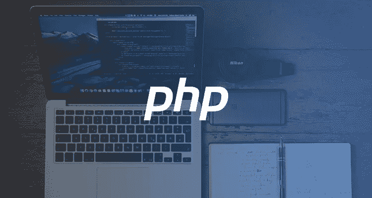

# 2018 年 PHP 测试开发者指南

> 原文：<https://medium.com/hackernoon/the-developers-guide-to-php-testing-in-2018-ebcc1f6e9a42>

## 由工程师[**顺便提一下:**](https://medium.com/u/d8be98cdccce#和 Perl 的尊重，PHP 似乎一直是一种事后的想法。现在，几乎每个专业的静态代码分析服务都支持 PHP。

 这篇文章最初出现在[博客](http://bit.ly/2MeFqJq)上。Hacker Noon 的每周赞助商 Codacy ，自动对每一个提交和拉取请求进行质量标准和代码审查，这样你就可以在每两周的 sprint 中提前两天发货。[使用 code HACKERNOON 享受八五折优惠。](http://bit.ly/codacyhackernoonblogpostjune)