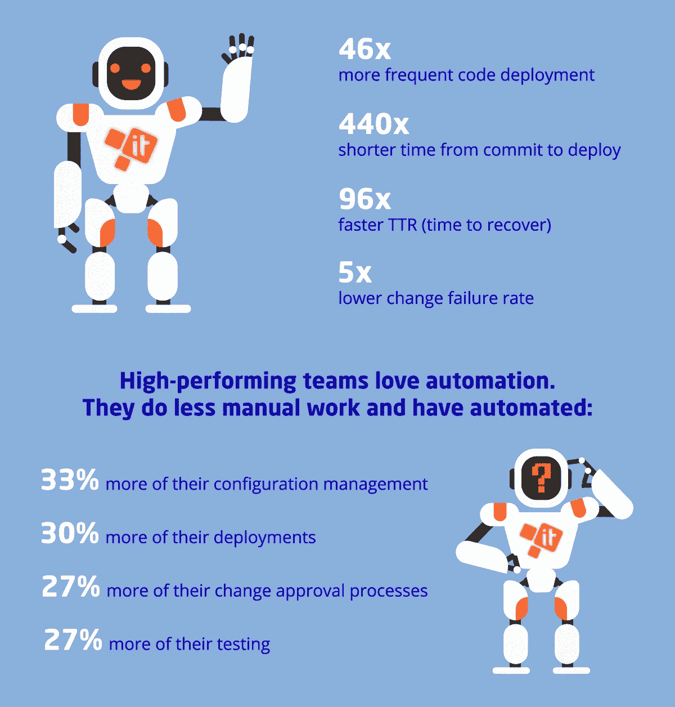
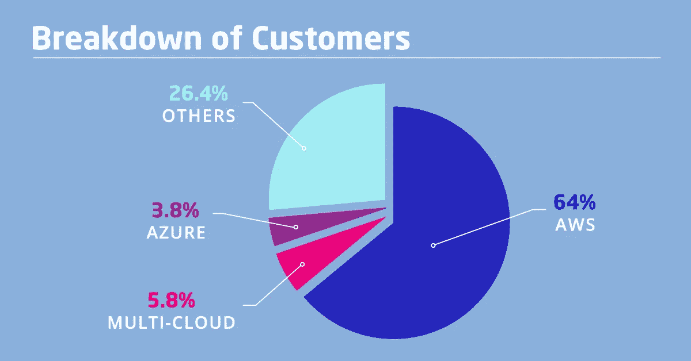
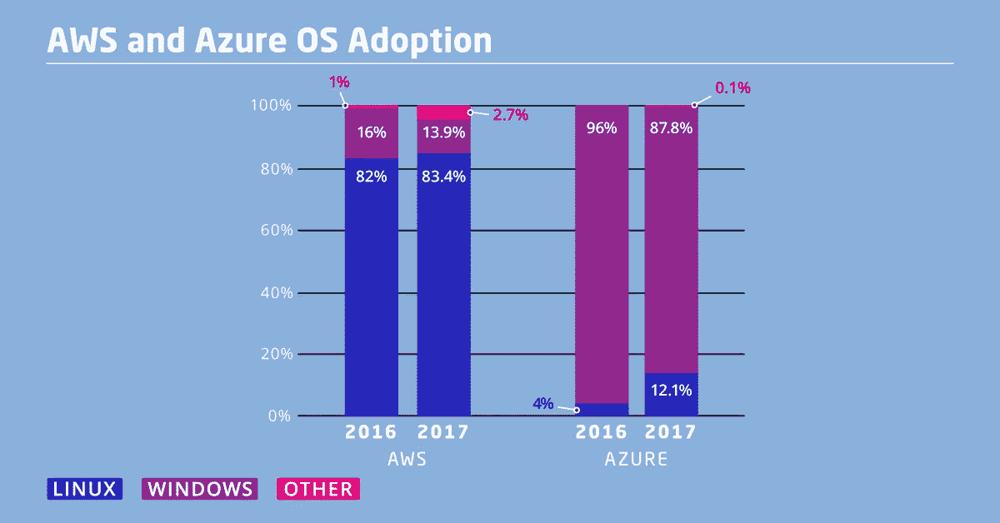
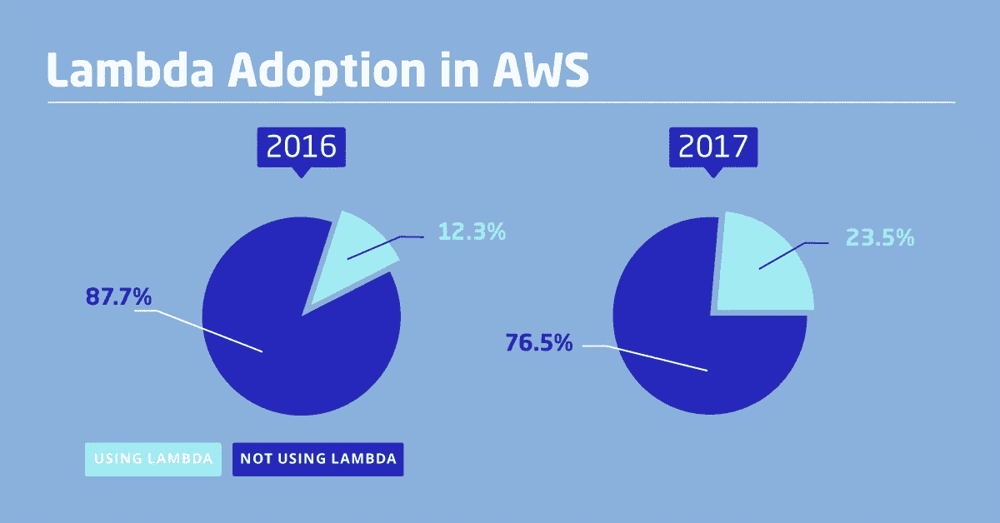
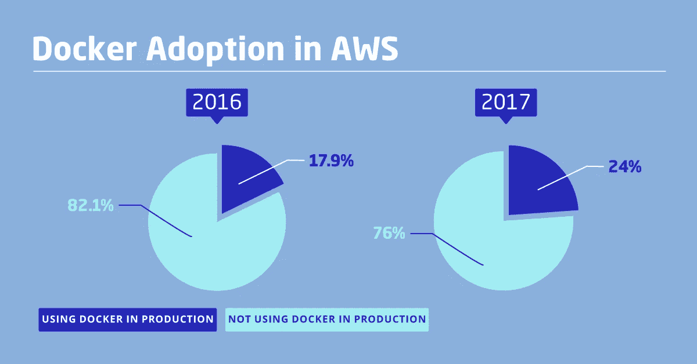
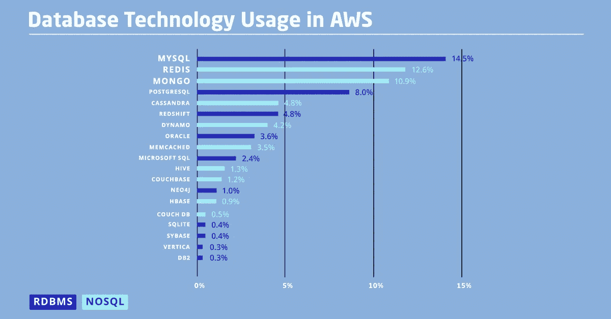
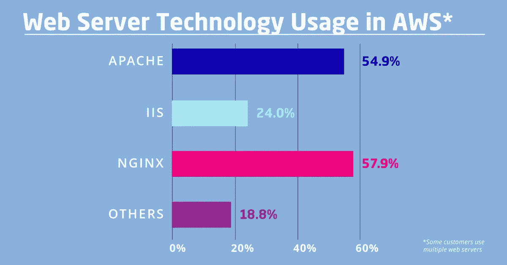
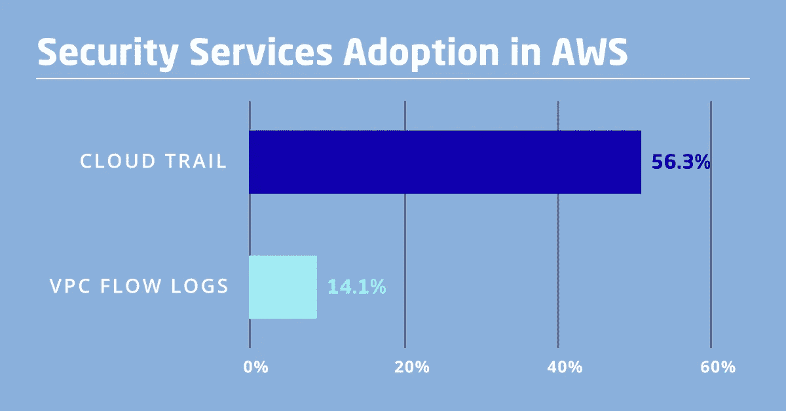

# DevOps 收养:对事态的清晰看法

> 原文：<https://medium.com/hackernoon/the-devops-adoption-a-clear-view-on-the-state-of-affairs-262289476abd>

DevOps 的采用始于近 8 年前，到 2018 年，这一运动已经相当普遍。然而，许多羽翼未丰的初创公司和大型企业仍然害怕过渡到 DevOps。

这是由于创业企业家和企业高管的思维方式。他们的主要想法通常是:“如果有效，就没有必要花精力/金钱去改进它”。通过这种方式，企业继续坚持旧的和可信的方式，比如让他们的关键任务系统在他们建筑物内的服务器上运行，并在开发、QA 和运营部门之间划分任务、技能和工具。

对于初创公司来说，这意味着优先考虑服务可用性和用户体验的连续性，而不是新功能实现的频率。这样做是为了避免风险，确保稳定的产品性能，最大限度地减少服务停机的可能性。

# DevOps 采用情况:结果很好，但是还有很多工作要做

根据来自 Puppet 的最新 [2017 年 DevOps 状态报告](https://puppet.com/resources/whitepaper/state-of-devops-report)的调查结果，DevOps 软件交付方法可以应对所有这些挑战并提供多种优势。

以下是该报告中一些最有趣的见解和成果:

*   采用 DevOps 方法的公司吹嘘说**的代码部署频率提高了 46 倍**，这意味着下一批代码可以在几小时内交付到生产环境中，而不是几周。
*   选择遵循 IaC、CI 和 CD 的 DevOps 原则可确保**从提交到发布**的时间缩短 440 倍，因此代码构建、测试和部署到生产不到一个小时。结果是上述频繁的部署。
*   许多企业担心频繁的部署可能会导致代码测试不够勤奋和严重的错误，这将导致严重的服务中断，并会降低用户的印象。恰恰相反，拥有用于深入代码测试的自动化测试管道和不可变的版本化基础设施会阻止或最小化这种情况。如果出现任何故障，这实际上会导致 TTR(恢复时间)加快 96 倍**，更不用说这些**故障发生的频率降低 5 倍**(根据 [Puppet](https://puppet.com/resources/whitepaper/state-of-devops-report) 的说法，现在大约只有 **7%** 的代码推送会导致问题，而不是 **35%** (平均而言)**
*   当 DevOps 转型得到从最高管理层到所有管理人员以及基层人员的全力支持时，该计划带来的成果会比预期快两倍。超过 **65%** 的受访者表示，在他们的组织中实施 [DevOps 文化](https://itsvit.com/blog/devops-culture-huge-step-mankind/)有助于实现所有设定的目标。然而，大约有 50%的受访者表示，缺乏一个有魅力和鼓舞人心的领导者导致了 DevOps 计划的停滞和失败。
*   近 **27%** 的企业已经完成了 DevOps 的实施或正在进行中，41% 的受访者表示这是未来几年的优先任务。
*   自动化占据了大量的 DevOps 服务，因为它允许简化大量的日常任务，释放资源用于创造性和创新性工作。例如，自动化代码交付可以节省:
    –由于使用像 [Codeception](https://itsvit.com/blog/our-it-tricks/provision-codeception-testing-environments-10-minutes/) 这样的工具来构建自动化单元测试，大约 **27%** 的资源和用于**测试**的时间；
    -由于[与 GCP 和 Kubernetes](https://itsvit.com/blog/building-deployment-pipelines-gcp-kubernetes/) 建立自动化部署管道，至少 **30%** 的资源和时间用于**代码部署**；
    –超过**审批和工作流程**的 **27%** ，以避免不必要的瓶颈和管理开销；
    -由于使用 [Kubernetes 容器管理工具](https://itsvit.com/blog/kubernetes-management-choose-start/)或 [Terraform 配置编排平台](https://itsvit.com/blog/what-is-terraform-and-why-it-rocks/)、Ansible、Salt、Chef 或 Puppet 等解决方案，大约有 **33%的资源和时间用于**配置管理**。**

# 工具可以很棒，但是 DevOps 文化是最重要的

正如 Atlassian(领先的协作软件提供商)在他们的 [DevOps 采用报告](https://www.atlassian.com/blog/devops/devops-culture-and-adoption-trends)中所述， **41%** 的 IT 专家在某种程度上熟悉 DevOps 即服务，而 **59%** 仍然不知道它的好处。也就是说，这 41%的公司比他们的竞争对手有相当大的优势…

**参与 Atlassian 调查的 90%的 IT 专家已经体验到了 DevOps 过渡的积极成果。然而， **70%** 的这些专家表示，他们不断增加的责任压力可能会导致倦怠。**

为什么这样因为消除任务孤岛并教会开发和运营部门的成员使用彼此的工具实际上并不是在组织中构建高效开发运维工作流的方法。上述报告提到了几个重要问题:

*   **80%** 的受访者表示，在新成立的 DevOps 团队中，只有**有限的知识共享**和交叉学习实践。当分享某些知识的需求确实出现时，它通常是以文件的静态形式提供的，而不是在交互式聊天、小组或维基中。仅有 **17%** 的受访者对**能够公开获取所有所需信息**以及渴望合作和解决问题感到自豪。
*   虽然每个企业都部署了一些[监控和记录工具](https://itsvit.com/blog/5-parts-svit-logging-monitoring-toolkit/)，但只有 **64%** 的受访者报告说已经部署了**主动监控和智能警报**系统。这意味着只有公司的⅔能够足够快地减轻负面事件并消除问题的根本原因，而不是处理诸如客户因服务不可用而沮丧之类的后果。你知道，一盎司的治疗抵得上一加仑的治疗。
*   几乎所有受访者都表示，他们的公司已经实现了测试自动化，或者正在实施自动化连续交付管道。尽管如此，将近 42%的**表示**在将代码推向生产后，他们仍然需要手动热修复小错误**。这意味着 CI/CD 计划还不够成熟，新代码还没有经过真实生产环境的严格测试和工作量测试。**
*   **灾难管理仍远非完美，因为近 **50%** 的受访者不得不承认他们的**方法、流程和响应因发生的不同类型事件而异**。因此，一半的 DevOps 工程师仍然依赖手动灭火，并等待经理的指示，而不是遵循明确定义的指导方针。**

# **AWS 和 Azure DevOps 相关统计数据的简要总结**

**Sumologic 发布了一份关于 2017 年云状况的年终[报告。](https://www.sumologic.com/wp-content/uploads/modern-app-report-2017.pdf)**

****

**该报告由 1500 多名 Sumologic 用户的回答组成，其中 **64%** 使用 AWS， **3.8%** 使用 Azure，其余分布在其他云服务提供商(CSP)或使用[多云策略](https://itsvit.com/blog/digital-transformation-multi-cloud-strategy/)。以下是该文件的要点:**

*   ****80%** 的 AWS 用户使用 Linux 操作系统。Azure 上的 Linux 操作系统用户数量从 2016 年的 **4%** 增加到 2017 年的 **12%** 的三倍**

****

*   **AWS Lambda 的采用率增长了近 **200%** (从 2016 年的 12%增长到 2017 年的 23%)**

****

*   **2017 年，24% 的 AWS 用户使用 Docker(比 2016 年的 18%有所增长)**

****

*   **NoSQL 数据库现在比传统的关系数据库更受欢迎。其实 Redis，MongoDB，Cassandra ( **28.3%** )刚刚超过了 MySQL，PostgreSQL，RedShift ( **27.3%** )。这两组数据库占 AWS 上使用的所有数据库的 55.6%，Oracle 和 Microsoft SQL 明显落后。**

****

*   **NGINX 和 Apache 作为 web 服务器领先，IIS 落后了。**

****

*   ****安全性**是云过渡的首要原因，然而将近 **50%** 的 AWS 客户**从未使用过**内置的 AWS CloudTrail 服务。用于监控 VPC 自动气象站流量的 VPC 流量日志工具也很少使用，只有 **14.1%的受访者确认他们采用了这些工具。****

****

# **关于 DevOps 采用状态的最终想法**

**上述报告中的统计数据清楚地表明，采用 DevOps 的公司在他们的软件交付实践中看到了显著的改进，并且能够实现他们预期的业务目标。然而，文化传统更难打破，除非进行真正的合作和知识共享，否则会出现某些挑战。**

**当然，克服这些挑战只是时间问题。然而，这意味着即使是目前尚未开始过渡到 DevOps 的公司也仍然可以取得成功，并获得超过其行业中其他市场参与者的竞争优势。他们只是应该全心全意地接受 DevOps 的采用，高效地分配他们的资源，并构建更好、更简化和自动化的工作流。如果您是打算开始其 DevOps 之旅的公司之一，并且需要一些指导— [给我们一点提示](https://itsvit.com/contacts/)，我们总是很乐意帮助您！**

**这个故事最初发表在我的[公司的博客](https://itsvit.com/blog/2017-in-review-state-of-devops-adoption/)上。**