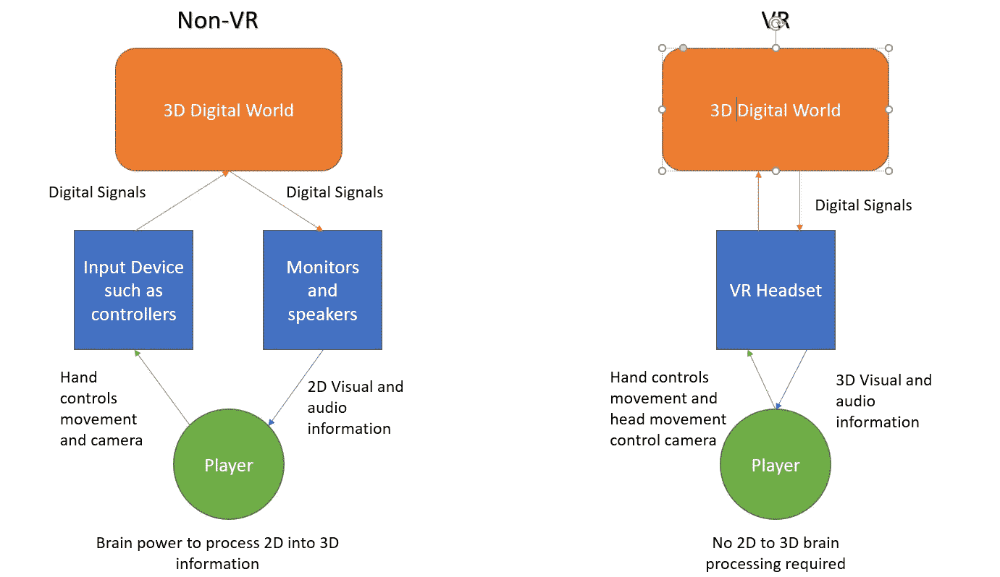
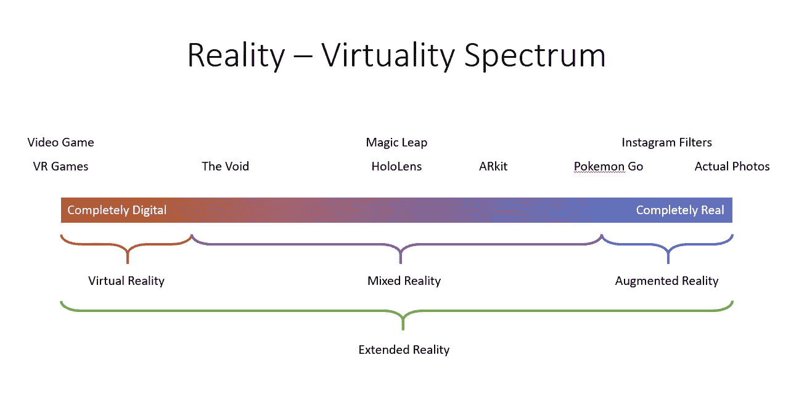
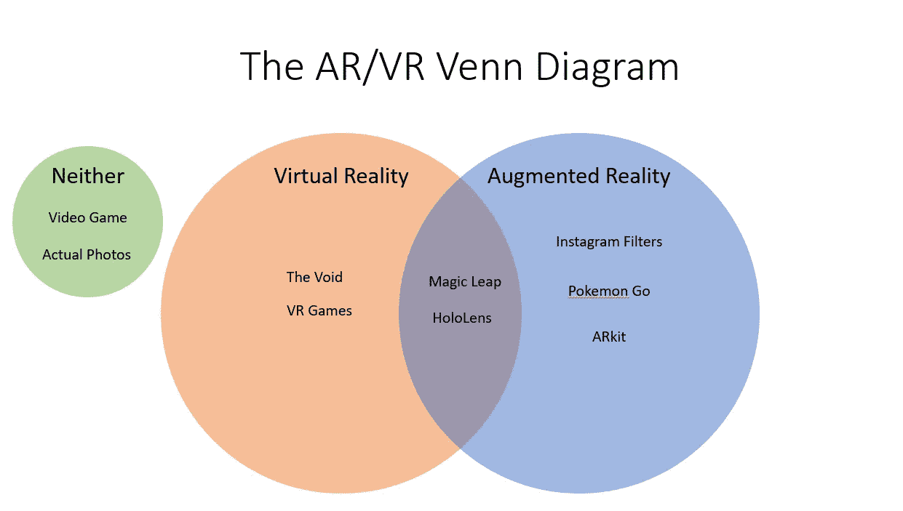

# AR、VR、MR、XR 的区别以及如何区分

> 原文：<https://medium.com/hackernoon/the-difference-between-ar-vr-mr-xr-and-how-to-tell-them-apart-45d76e7fd50>

在进入 AR/VR 行业后的过去几年里，我多次被问到这个问题。虽然我已经尽了最大努力简化事情来回答这个问题，但要真正把事情弄清楚还需要更多的解释。这也是我在这篇文章中尝试去做的。

# 什么是虚拟现实？

首先，我们来看看什么是[虚拟现实](https://hackernoon.com/tagged/virtual-reality) (VR)以及它所服务的目标和角色。虚拟现实一直是一个主要是科幻小说的想法，从电影《T2》、《黑客帝国》、《T4》到书籍《T5》、《冰雪奇缘》和动漫《T8》、《剑术在线》。然而，虚拟现实的存在时间比大多数人意识到的要长，甚至比一些让这个概念流行起来的电影和书籍还要早。然而，在这篇文章中，我不会深入探究它的历史，而是将重点放在现代虚拟现实(后 Oculus)上。

虚拟现实的最终目标是真正的沉浸感——一种身临其境的感觉。毫不奇怪，正是视频游戏行业首先要求虚拟现实技术，并催生了现代虚拟现实技术。玩家希望进入他们已经花费了大量时间的数字世界，并希望找到一种更接近故事和动作的方式。

Gamers playing video games

目前，大多数视频游戏都是使用像操纵杆或键盘和鼠标这样的输入设备来玩的。游戏中的动作通过监视器、声音、控制器振动等传达给玩家。这意味着玩家想要做的任何动作都必须首先转化为一个中间步骤，这打破了沉浸感。在虚拟现实中，玩家直接使用他们的头、手控制游戏，并通过虚拟现实耳机接收视觉和听觉信息。VR 头戴式耳机提供了比大多数显示器更大的视野。这意味着玩家可以直接控制和反馈数字世界的互动。动作更加直观直接。

虚拟现实的价值是一种更直观的与数字世界互动的方式，以及更深入的数字体验。虚拟现实的内容早已存在，只是最近现代虚拟现实才出现。 **VR 是硬件创新**。VR 堪比鼠标键盘的发明。总之，**虚拟现实是一种输入和输出设备，提供直观控制和更深层次的数字体验沉浸感。**

这也有助于看虚拟现实的应用。虽然虚拟现实可以在许多情况下使用，但它并不总是最好的解决方案。 **VR 最适合用来讲故事和传达体验。**比如在偏远地区(或不存在的地方)旅游、培训体验(否则会很昂贵或很难做到),如操作重型设备，或幻想体验(想象一下虚拟世界的数字旅游)。在评估 VR 是否是正确的解决方案时，问问自己额外的沉浸感和更好的用户体验是否会为最终用户创造额外的价值。在 Babylon VR，这就是我们帮助客户探索基于网络的虚拟现实技术的用例。

为了让虚拟现实走得更远，该行业需要开发更好的方式来与数字世界互动，并使用户体验更加身临其境。该耳机将需要更高的分辨率，更低的运动到光子的延迟(或更普遍的称为更少的延迟)和更大的视野。在设计方面，设计师必须弄清楚如何创造更好的用户体验，以及什么是最好的应用程序。因为虚拟现实将彻底改变我们与数字世界的互动方式，就像鼠标改变了我们与计算机的互动方式一样。

# 什么是增强现实？

接下来，我们将了解增强现实或简称为 AR。甚至在 Pokemon Go 流行起来之前，AR 就已经使用了多年。事实上，脸书在照片上标记你的朋友的能力，Instagram 面部过滤器，都是 AR 应用的例子。与将用户带入数字世界的 VR 不同，增强现实用于将数字信息带入现实世界。

Snap chat effects

当苹果发布他们的 ARkit 时，事情变得有点复杂。ARkit 不仅仅是在相机上覆盖一幅数字图像，它还会自动检测地面并计算虚拟物体周围的照明。这为 AR 带来了更高的标准，因为它包含了复杂的计算机视觉算法。此外，我们现在在谷歌镜头和三星 Bixby 上也有类似的事情，它使用计算机视觉和机器学习来直接从你的相机提供数字信息。

在上面覆盖信息的技术已经非常丰富，并且已经存在多年了，但是 AR 的关键区别在于它可以从现实世界中提取多少信息。因此， **AR 是一种软件创新**。它严重依赖于机器学习和计算机视觉，而不是硬件。所需的硬件几十年前就已经有了(只需要一个摄像头和一个显示器)。**增强现实是软件从现实世界的视觉信息中提取数据的能力。**

AR 的最终目标是在用户需要时向他们提供上下文信息。AR 的应用包括突出交通标志并在驾驶时提供 GPS 信息，在购买前可视化您房间中的产品，在对损坏的洗碗机进行故障排除时提供上下文帮助等。在确定 AR 体验是否是正确的解决方案时，询问您是否希望从环境中收集数据，并在此基础上提供更多信息。

为了进一步发展 AR，需要在软件方面进行更多的开发。更先进的机器学习来识别对象，并为相机视觉提供语义。以及使用已经可用的照相机更好地识别物体。只要有摄像头，有显示器，有足够的处理能力，不管硬件如何都可以使用 AR。

# 什么是混合现实和扩展现实？

混合现实(MR)和扩展现实(XR)是比 AR 和 VR 更抽象的概念。因为它们不是技术本身，而是这些技术的组合。一般的理解是，MR 介于 AR 和 VR 之间，XR 是一个包括 AR、VR 和 MR 的过度涵盖的术语。然而，这只会让一切变得混乱，并给一切增加不相关的复杂性。网络上最常用的解释之一是通过使用[现实-虚拟光谱](https://en.wikipedia.org/wiki/Reality%E2%80%93virtuality_continuum)

The Reality-virtuality spectrum is a common graph used to explain things, but it is misleading and confusing

有几件事使它变得令人困惑。首先，ARkit 在这个分类中会被算作混合现实，而它被称为“AR”套件。同样，虚空也是如此，它将自己标榜为虚拟现实体验。另外，这种分类使得 VR 和 AR 互相排斥，事实并非如此。因此，为了更好地解释，最好使用文氏图:

虽然我们仍然可以使用 MR 和 XR 标签，但这并没有增加多少价值，只会增加更多的混乱。(对于你们这些进入集合论的人，可以用 AR∩VR 和 AR∪VR)。**需要注意的重要一点是，AR 和 VR 可以共存。**综上所述，如果体验需要特殊的硬件来观看(比如耳机)，那就是 VR。如果它使用计算机视觉来读取真实世界的信息，那它就是 AR。如果它既涉及扫描环境以获取数据，又涉及通过耳机进行显示以获得更深的沉浸感，那么它就是 AR 和 VR。

最终，这两种技术将变得不可分割。因为 AR 和 VR 都旨在增强人类体验。想象一下，在未来，你将在一辆电动无人驾驶汽车上使用耳机来帮助你导航回家和查看电子邮件，然后将其转换为 VR 模式，在自己舒适的客厅中享受身临其境的网飞体验。

我希望这能让人们更好地了解 AR 和 VR。如果你需要更深入的解释，请告诉我，我会添加进去。