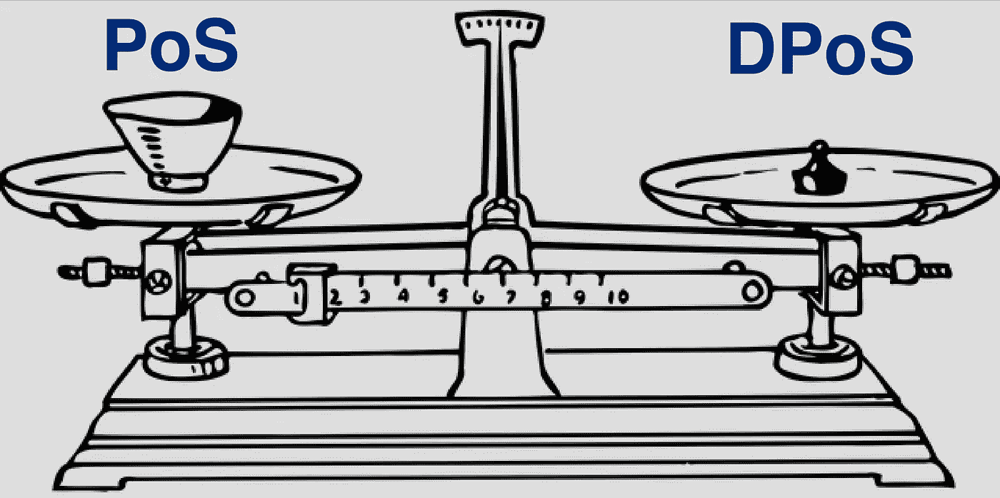
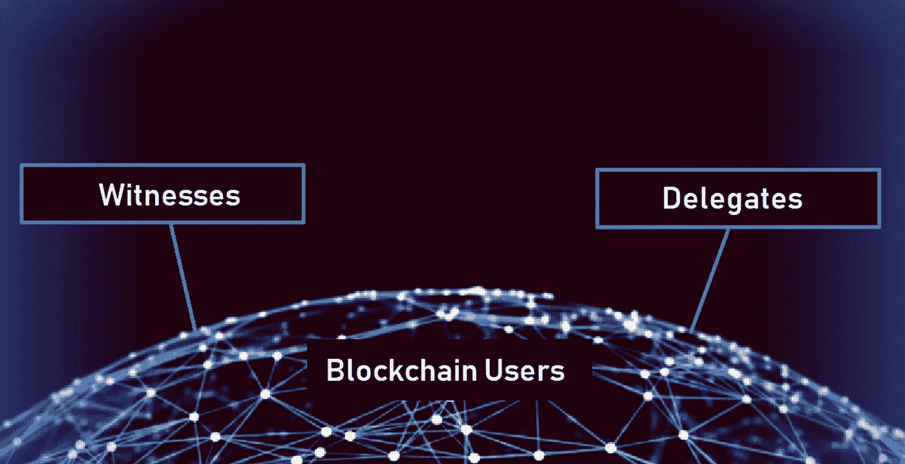
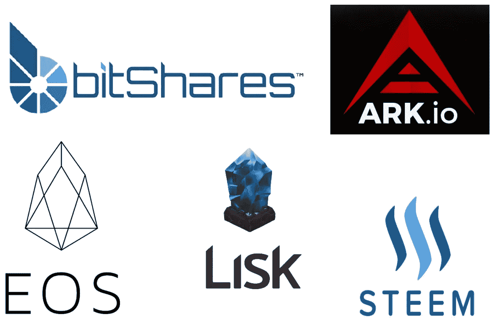

# 传统的和委托的利害关系证明之间的区别

> 原文：<https://medium.com/hackernoon/the-difference-between-traditional-and-delegated-proof-of-stake-36a3e3f25f7d>

随着利益一致证明机制的流行(通常取代工作一致证明机制)，区块链开发者对传统的利益一致证明机制进行了创新，产生了委托利益一致证明机制。这篇文章将分析传统的利害关系证明和委托的利害关系共识机制之间的区别。

**传统的股权证明**

In traditional Proof of Stake consensus a user must put some cryptocurrency at stake in order to become validator.

一个[利益证明](https://hackernoon.com/what-is-proof-of-stake-8e0433018256)系统要求用户投入一定数量的加密货币单位以验证交易。新区块的创建者是随机选择的，取决于用户的财富和赌注的硬币。在标桩证明系统中，区块是“伪造”或“铸造”的，而不是开采的。在该系统中验证交易和创建新区块的用户是“伪造者”。

在大多数虚拟货币中，数字货币单位是在货币发行时创建的，其数量是固定的。因此，伪造者不是收到加密货币单位作为奖励，而是收到交易费。在少数情况下，新的货币单位可以通过增加硬币供应量来创造，并用于奖励伪造者。

为了验证交易和创建区块，伪造者必须首先把他们自己的硬币放在赌注上。把股份想象成一个托管账户:如果一个伪造者认可了一个欺诈交易，他们就失去了他们的股份，以及他们未来作为伪造者参与的权利。因此，伪造者被鼓励只验证正确的交易。

股份证明系统不提供在加密货币的初始创建阶段分发硬币的方法。因此，使用这种系统的加密货币要么从 ICO 开始并出售其预先开采的硬币，要么从工作证明系统开始，稍后切换。

大多数为验证交易和创建新区块支付交易费奖励的赌注证明硬币设定了目标利率，用户可以期望从赌注硬币中赚取。对于伪造者创造新硬币的加密货币，这一比率也成为货币供应量随时间膨胀的最大比率。

目前运行股份证明系统的密码有 BlackCoin、Lisk、Nxt 和 Peercoin 等。

**委托股权证明**

Blockchains running the Delegated Proof of Stake consensus have a select group of witnesses as well as a governing body.

区块链工程师 Daniel Larimer 创建了[授权股权证明](https://hackernoon.com/what-is-delegated-proof-of-stake-897a2f0558f9) (DPoS)系统。dpo 寻求通过加速交易和块创建，同时不损害区块链核心的分散激励结构。DPoS 是共识机制发展的下一步。它建立在原始的利益一致机制的基础上，大大提高了速度和可扩展性。

在传统的[赌注共识机制](https://hackernoon.com/what-is-proof-of-stake-8e0433018256)中，用户可以将他们的硬币投入赌注，从而获得验证交易、伪造区块和获得相关奖励的权利。DPoS 是利益相关者共识证明的变体，旨在更有效地达成共识。

**投票**

在 DPoS 系统中，用户“投票”选择“见证人”(他们信任的验证交易的其他用户)，顶级见证人(收集了最多投票)获得验证交易的权利。用户甚至可以将他们的投票权委托给其他用户，他们相信这些用户可以代表他们为证人投票。

选票根据每个选民的股份大小进行权衡。用户不需要很大的赌注就可以进入最高级别的证人。相反，来自具有较大利害关系的用户的投票可以导致具有相对较小利害关系的用户被提升到证人的顶层。

**见证人**

顶层证人的人数被限制在某一数目。这些见证人负责验证交易和创建区块，并作为回报获得相关费用。

虽然顶层中的见证可以阻止特定的事务被包括在即将到来的块中，但是它们不能改变任何事务的细节。因此，他们相当于工作证明系统中的矿工。

投票是一个连续的过程，顶层中的每个见证人总是有被获得更多选票并因此被认为更可信的用户替换的风险。随着区块链的成长，成为或保持顶级见证人的竞争越来越激烈。用户还可以投票罢免失去信任的顶级证人。

对于顶级证人来说，收入和名誉损失的威胁是反对恶意行为的主要动机。

**代表们**

DPoS 系统中的用户也为一组“代表”(负责维护网络的受信任方)投票。代表监督整个区块链协议的治理和性能，但在交易验证和块生产中不发挥作用。

例如，代表可以提议更改块的大小，或者验证块的见证人应获得的报酬。一旦代表们提出这样的改变，区块链的用户就投票决定是否采纳。

Blockchains running the DPoS consensus mechanism.

包括 Lisk、EOS、Steem、BitShares 和 Ark 在内的区块链已经采用了 DPoS 共识机制。

**利益证明和 dpo 之间的差异汇总**

1.区块创建:在赌注系统的证明中，新区块的创建者以伪随机方式选择，取决于用户的赌注硬币。在 DPoS 系统中，用户投票选举若干证人。最高级别的见证人(通常为 20 人)因验证交易和创建区块而获得奖励。由于验证事务和创建块的用户数量显著减少，DPoS 的速度要快得多；因此，DPoS 更具可扩展性。

2.治理:股权证明系统将区块链规则和参数编程到了 genesis 块中。因此，任何改变都意味着协议中的分叉。另一方面，DPoS 系统有一个选举产生的代表小组，他们积极管理区块链，并可以对协议提出更改，但这些更改必须得到用户的批准才能生效。

DPoS 旨在创造更好的激励机制和快速、可扩展、更分散、更高效的共识机制。

—

[沙安雷](http://www.shaanray.com/)

请关注 [Lansaar Research](https://medium.com/lansaar) 关于媒体的报道，了解最新的新兴技术和新的商业模式。