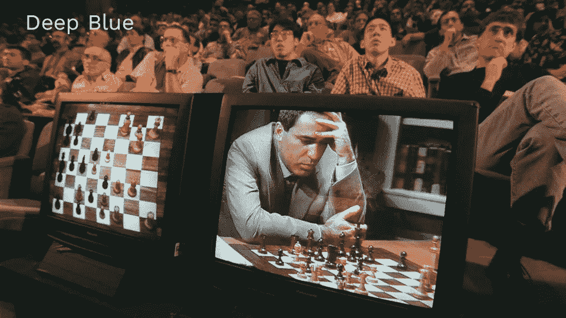
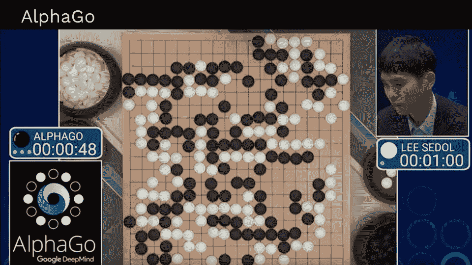
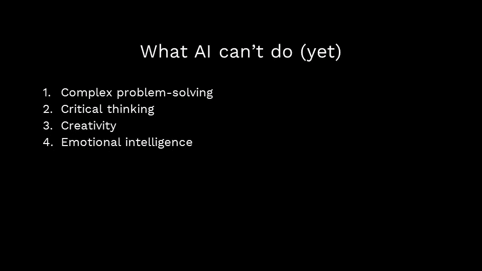
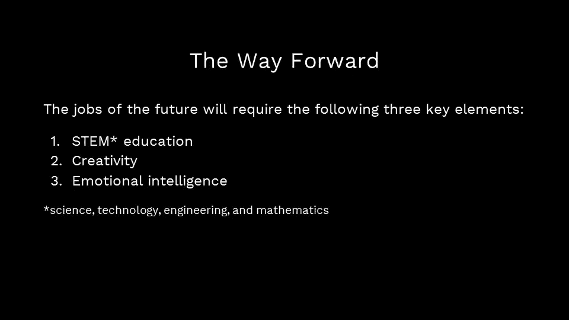
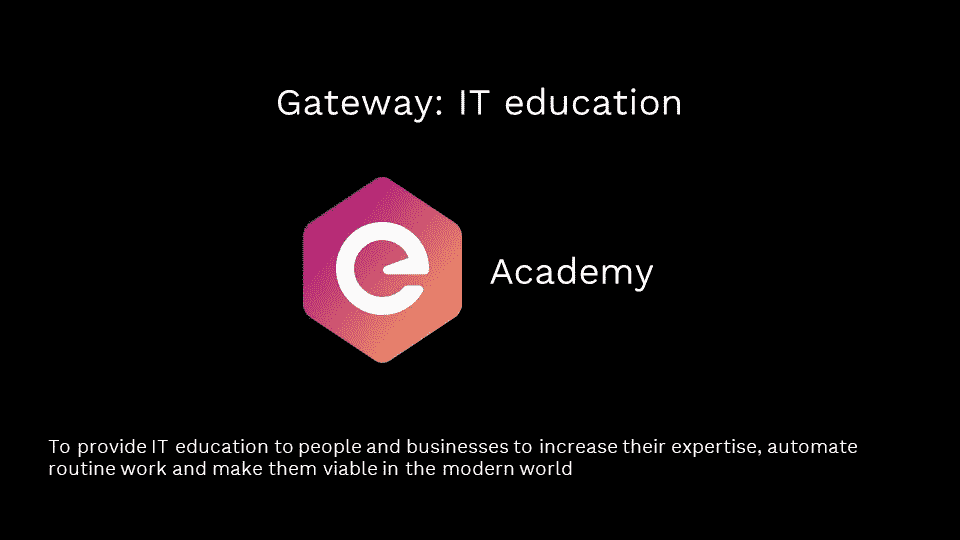

# 生活的数字化转型以及如何适应它

> 原文：<https://medium.com/hackernoon/the-digital-transformation-of-life-and-how-to-adapt-to-it-56df20bc6472>

当前所有关于人工智能和自动化的讨论都让人联想到《杰森一家》或更邪恶的 HAL 9000。人工智能的现实要平凡得多。

几乎我们所有人每天都在使用某种形式的人工智能，自动化已经成为我们工作场所的核心部分，以至于大多数人几乎没有注意到它。

技术已经成为日常生活的一部分，以至于我们往往忽略了我们使用它的频率。你有没有让 Siri 在今天早上帮你设置闹钟，在谷歌上查找一些东西，使用优步去办公室，或者让 Spotify 挑选你今天的播放列表？也许 Alexa 提醒了你你快没什么东西了。恭喜你，你已经在用 AI 了。与人工智能互动的可能方式不胜枚举。

那只是面向消费者的人工智能。大多数企业已经使用[机器学习](https://hackernoon.com/tagged/machine-learning)或人工智能来改善物流，进行预测甚至与客户互动。到目前为止，还没有出现过 Siri 像 HAL 一样失控的情况。那么，所有的炒作都是为了什么，AI 到底是什么？

# 当计算机思考时

简单地说，[人工智能](https://hackernoon.com/tagged/artificial-intelligence)就是计算机自己进行某种形式的思考或决策。如果你曾经尝试过编程，你会发现计算机是极其愚蠢和呆板的。在编程中，你的意思没有回旋的余地，只有你明确告诉计算机去做的事情。只要你计划使用计算机来完成完全可预测的任务，这是没问题的。对于不完全可预测的 99.9%的生命来说，教会计算机思考是合理的。

早在 20 世纪 50 年代，计算机科学家就开始尝试机器学习的想法，通过机器学习，计算机可以“学习”并提高效率。这在 80 年代真正开始起步，因为计算机收集了更多数据，机器学习算法可以用来做出更好的预测。这些来自 80 年代的机器学习算法今天仍在使用；发生变化的是数据可用性的增加和计算机处理能力的巨大提高。

如果我们曾经有过人工智能霸主，他们可能会把 1996 年 2 月 10 日作为他们成年的标志。这是国际象棋冠军第一次输给电脑。卡斯帕罗夫仍然为人类感到骄傲，并回来赢得了比赛。尽管如此，不祥之兆很明显。第二年，IBM 的[深蓝](https://en.wikipedia.org/wiki/Deep_Blue_(chess_computer))在一场比赛中击败了卡斯帕罗夫。人性 0，AI 1。

虽然人类在国际象棋上输给了计算机，但传统的围棋似乎是无懈可击的。它远比国际象棋复杂，需要一定的创造力。这些假设被证明是没有根据的。谷歌的 [AlphaGo](https://en.wikipedia.org/wiki/AlphaGo) 在 2017 年击败了世界最佳围棋选手。人性 0，AI 2。

围棋和国际象棋都有有限但巨大的可能游戏位置，所有关于棋盘的信息对每个玩家都是公开的。当然，无限注德州扑克将是一个不同的故事，因为决策必须基于有限的信息，理论上有无限的结果。此外，延长游戏需要虚张声势和其他人类特有的品质。一些世界上最优秀的人类扑克玩家在 2017 年的单挑比赛中输给了 [Libratus](https://en.wikipedia.org/wiki/Libratus) 。人性 0，AI 3。

学习能力是人工智能取得这些胜利的原因。实际上，这意味着计算机可以像人类一样被训练来执行复杂和高要求的任务。假设你有足够的处理能力、数据和时间，计算机可以学会在许多任务上超越人类。

# 人工智能和自动化

一台可以在扑克游戏中打败你的计算机看起来可能只不过是一个客厅里的把戏，但是学习玩扑克的相同技术也可以学习做人类执行的许多工作。对于雇主来说，这显然是一个福音。自动化是可靠的，生产日常精确的工作，不需要休息时间，并且在适当的规模下比人工更便宜。

自动化的范围是惊人的。麦肯锡估计大约 [50%的美国工作容易被自动化。风险最大的工作包括任何处理数据和重复性动作的工作:办公室和行政支持、食物准备、销售和运输。甚至有一个方便的网站可以让你知道你的工作是否会被机器人取代。](https://www.mckinsey.com/featured-insights/digital-disruption/harnessing-automation-for-a-future-that-works)

# AI 还不能全部做到(还不行！)

虽然这很诱人，但前进的道路不是成为一个破坏服务器而不是织机的现代勒德分子。相反，未来的经济将重视人类特有的技能。尽管人工智能很强大，但仍有一些领域技术没有取得很大进展:

*   复杂问题解决
*   批判性思维
*   创造力
*   情商

我们在人工智能领域的革命需要伴随着教育领域的革命。STEM(科学、技术、工程和数学)应该成为我们学校系统的核心，而不是培训人们进入容易自动化的职业。

从斯蒂芬·霍金到 Snoop Dog 等形形色色的公众人物一直在呼吁大家学习编程。除了教授批判性思维、创造力和情商之外，针对所有人的强大 STEM 教育是如何准备一支劳动力队伍来处理更高层次的任务，而人工智能则照顾我们更世俗的需求。

# 不要慌；准备

只要你不断学习未来相关的技能，就没有必要将人工智能视为威胁。正如这个世界在没有点灯人和保龄球馆排瓶员的情况下继续运转一样，下一轮自动化也会让我们过得很好。事实上，技术创造就业机会；想象一下，试图告诉 100 年前的人，成千上万的人将会成为软件开发人员！

STEM 的未来一片光明。T2 劳工部估计，STEM 工人的平均收入是全国平均水平的两倍，而且 STEM 工作比其他领域的工作增长更快。技术正在创造全新的领域，如机器人技术、无人机工程和数据分析。正如经济学家发现[电子商务创造了更多高薪工作岗位](https://www.nytimes.com/2017/07/10/business/dealbook/e-commerce-jobs-retailing.html)而不是‘取代’实体商店的收银员一样，人工智能和自动化正在为未来更多高质量的工作铺平道路。

这就是为什么在我的公司 eTeam，我总是采取提供尽可能多的培训的方法。我们甚至创建了 eTeam 学院，鼓励在基辅提供相关技术的课程并培训新一代开发人员。类似的编码训练营正在世界各地兴起。接受挑战和学习未来的技能比以往任何时候都更容易也更重要。因此，与其害怕人工智能，不如让我们拥抱人工智能为我们带来的机遇。

基于我在基辅[未来工作](https://fow18.com/)上的演讲。

最初发布在 [eTeam 的博客](https://eteam.io/blog/digital-transformation/)上。