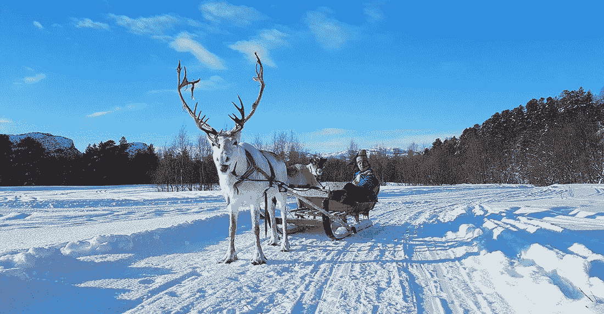
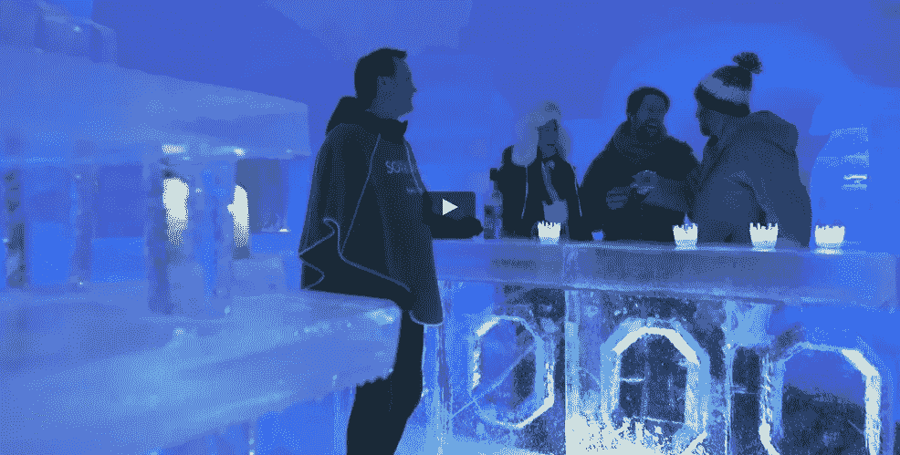

# 杰夫·贝索斯，在冰屋酒店放松

> 原文：<https://medium.com/hackernoon/the-donald-rages-bezos-stays-cool-ede4e8721c33>

你可能认为过去的几周对杰夫·贝索斯来说很艰难。亚马逊受到推特用户的围攻，该公司的股票在推特的猛烈攻击下反复下跌和上涨。

贝佐斯旗下的《华盛顿邮报》(Washington Post)——T2(Washington)，也受到了疯狂的、不合语法的攻击。然后是竞争对手提出的强烈抗议，关于 [AWS](https://hackernoon.com/tagged/aws) 获得[庞大的单一来源“绝地”政府合同](https://www.cnbc.com/2018/04/06/aws-not-close-to-winning-jedi-government-cloud-deal.html)的可能性，这将使其在利润丰厚的云领域进一步领先。

你可能会想，如果你是杰夫·贝索斯，所有这些事情甚至更多，会让你和你的副手们挤在会议室里，制定新的计划，重新配置，制定战略，担心，随风摇摆。

你就错了。当市场大起大落时，当剑桥分析公司丑闻开始肆虐时，当马克·扎克伯格无精打采地走向国会山炎热的座椅时，杰夫·贝索斯保持冷静。

字面上。

根据当地消息，他当时在挪威。阿尔塔，北极光之城，是他的湾流 650ER 在风景如画、白雪皑皑的当地机场拍摄的地方。

[http://Norway today . info/news/worlds-Richmond-man-visiting-alta/](http://norwaytoday.info/news/worlds-richest-man-visiting-alta/)

它是世界上第二最北的城市，以其岩石雕刻而闻名。

接受采访的挪威官员中，没有一个人愿意公开谈论此事，只是说贝佐斯住在世界上最北的冰酒店，即所谓的冰屋酒店(Igloo Hotel)，每年都用新鲜的冰重建。

[https://vimeo.com/188020851](https://vimeo.com/188020851)

Sorrisniva 提供在其他地方很少能找到的便利设施:冰酒吧，用冰杯提供饮料，以及精彩的亚北极活动，如狗和驯鹿雪橇、雪地摩托旅行、冰上钓鱼。

当然是滑雪，还有壮观的北极光。此外，对于有人类学头脑的人来说，还介绍了萨米文化和萨米人的生活方式。

冰旅馆的房间，温度从来不会超过冰点，配有“舒适的”驯鹿皮和极端的睡袋。你只能预订到四月，因为那是冰开始融化的时候。因此，即使他想这么做，贝佐斯也不能真的推迟行程，不管特朗普会不会发脾气。

[https://www . Facebook . com/Sorrisniva/videos/1744180468974047/](https://www.facebook.com/Sorrisniva/videos/1744180468974047/)

贝佐斯的商业动机没有被披露。因为不像有些人，他周围没有漏洞。

抱歉唐。如果你认为你的长篇大论会激怒贝佐斯，我想你看错牌了。从一个亿万富翁到另一个亿万富翁，也许你能得到一些放松的建议。