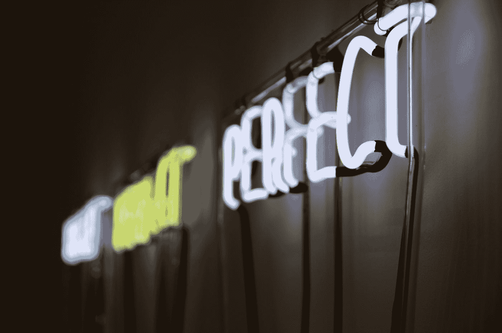

# 克服拖延症和完美主义并真正完成任务的最好方法是什么？

> 原文：<https://medium.com/hackernoon/the-downside-of-perfectionism-c445fbc63cb9>

Photo by [Jonathan Hoxmark](https://unsplash.com/@hoxmark?utm_source=medium&utm_medium=referral) on [Unsplash](https://unsplash.com?utm_source=medium&utm_medium=referral)

我认为拖延和完美主义是相关但略有不同的挑战。

我来分享几个关于完美主义的想法。

大卫·卡达维最近的一个播客引起了我的兴趣。我记得那集的名字叫《只管发货》。要点如下。

Kadavy 在一般意义上使用“艺术”一词来指你创造的任何原创作品。

那可能是像绘画或雕塑一样的艺术。或者，它可以是内容写作、财务分析、网站设计、代码或实物产品。

> 只是运送它

***刚出货*** 类似于 MVP 概念(最小可行产品)但不完全相同。

有了 MVP，你就知道 ***的事情*** 是一个正在进行的工作，你会根据反馈迭代或者抛弃它。

在“随遇而安”的心态下，事情做完了，你就要开始下一件事情了。

假设你是一名艺术家，刚刚完成一幅画，你把它卖了。你是不是打算一个月后再回去涂上几笔焦土就称之为 2.0 版？

号码

这就是《只是发货》与 MVP 的不同之处。

阿达维的前提是，产生杰作需要大量的工作。但是，你不可能在一件作品上花上几千个小时来获得杰作。

我知道也有例外。我刚刚想起马尔科姆·格拉德威尔的一个故事，他记录了莱昂纳德·科恩的歌曲《哈利路亚》花了多长时间才完成(年)。我将暂时忽略这一点。

总有例外。

让我们来谈谈支持“只运 It”思想的例子。

来自 Kadavy 的播客:

> “只有通过完成大量的工作，你才能缩小差距，你的工作才会和你的抱负一样好。”~ **伊拉·格拉斯*(美国生活的主持人)***
> 
> “产生一个有影响力或成功的想法的几率是产生的想法总数的正函数。”~ **西蒙顿院长(加州大学戴维斯分校教授，著有几本关于创造力和天才的书)**

***莎士比亚*** 发表了 38 部戏剧和 154 首十四行诗。你能说出多少个？

巴赫创作了 3 首伟大的作品，但他写了 1000 多首。

毕加索 ，据估计他创作了超过 50，000 件艺术品(绘画、雕塑、陶瓷、素描等)。显然，这些并不都是杰作。

这对你和你创作的作品有何影响？

你也许不能称之为艺术——但我们都在创造一些东西。

我们创造的东西具有某种独创性——是我们的一部分。

你创造的越多，你的手艺就越好。

所以——当你设定你的优先事项并努力尽可能多产的时候——考虑一下如果你在细节上过于强迫症，也许你需要**把它运出去。**

继续努力工作——不要放慢速度——不要放弃！

爱德华