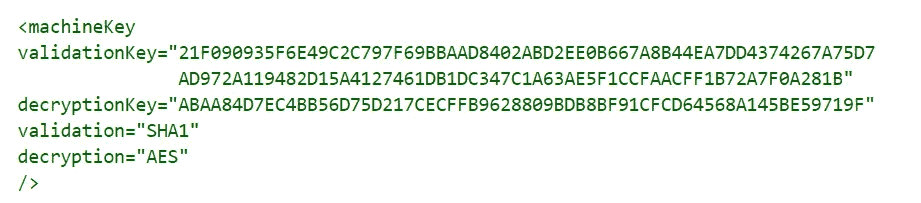
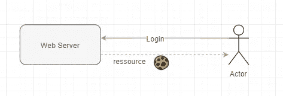
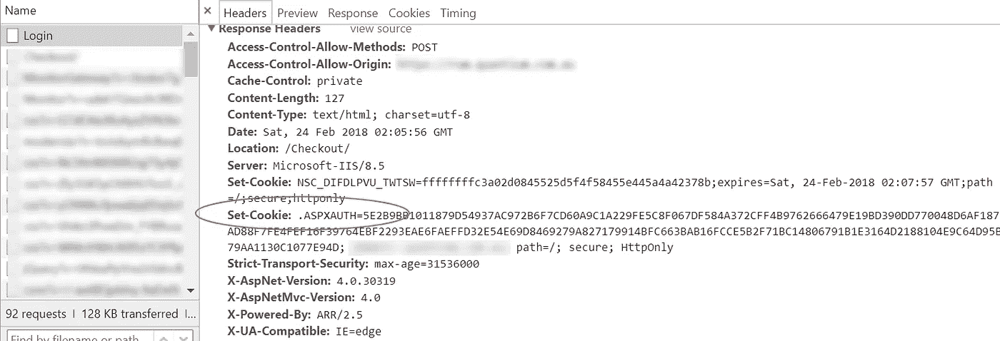
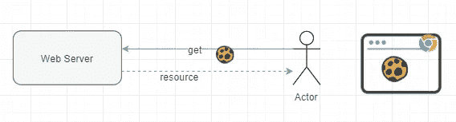
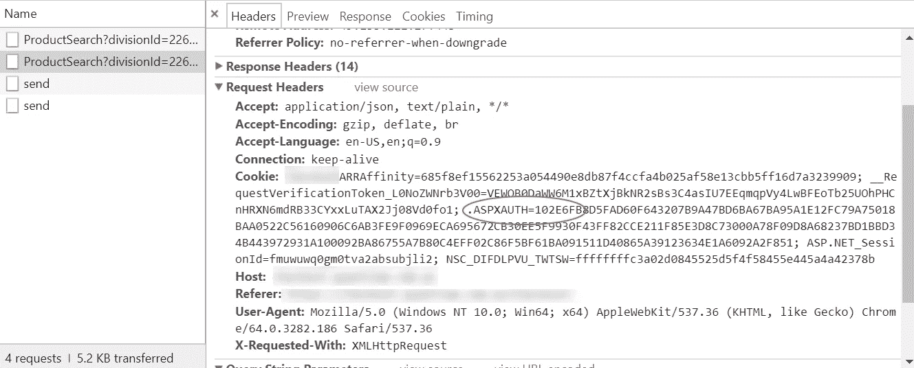
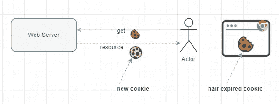
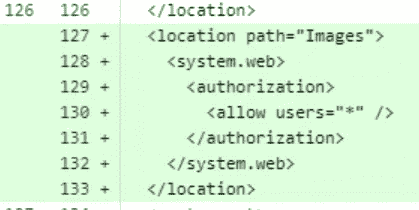
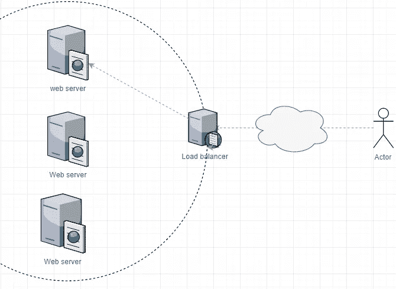

# 戏剧性的模仿:一个开发者的恐怖故事

> 原文：<https://medium.com/hackernoon/the-dramatic-impersonation-a-developer-horror-tale-c794b1ab5c20>

每个职业团体都有其神秘的恐怖故事…

我要讲的故事是一个资深开发人员在一个沉闷的冬天傍晚告诉实习生的故事，寒冷的霓虹灯在一个空旷的空间投下阴影。更严重的是，这种软件闹剧很容易让你的公司名誉扫地，让你丢掉饭碗。

一切都始于一个良好的老 ASP.Net 一样的项目，使用防弹开箱即用的形式认证。密码存储在网络隔离数据库中，始终谨慎实施最佳安全实践，登录页面是精心手工制作的，认证流程可抵御定时攻击，网站由安全专家定期测试。坚如磐石我们告诉你！

嗯，这种情况一直持续到今天早上正常发布补丁的时候，有报道称用户在浏览应用程序时使用了错误的身份。身份交换，什么？这就像你在浏览你的脸书页面时，点击一个随机的通知图标后，你最终会冒充你前任的资料，访问他们所有的帖子，图片，即时聊天，一切！！那真的很糟糕，不是吗？很难想象还有比这更糟糕的事情…不可能？这种事绝不会发生，你一直这样告诉自己。嗯，那是绝对可能的，甚至超级容易复制，怎么复制？我们开始吃吧，好吗？

# 美味的老饼干

在深入研究这个用例的更多细节之前，让我们重新介绍一下网络安全的支柱之一。授权。饼干。

虽然给出的所有例子都来自微软的 stem，但是所有的原则在不同的现代框架中都是一样的，我相信我们可以用不同的栈很容易地模拟这个用例。

授权。cookie 是与用户身份相关的一些属性的字典，这些属性在服务器端使用私钥(在配置文件中设置的机器密钥)进行加密



然后在 HTTP 响应头中传递给客户端。

一般来说。cookie 在登录流成功后被附加到 HTTP 响应中，然后被存储在客户端浏览器中的特定域中。



这个令牌在一段给定的时间内(通常是可配置的)保持有效，并在 HTTP 头中与每个请求一起传递。



这个 cookie 由 web 应用程序解密，web 应用程序检查它的有效性并访问封装的信息(通常是一些关于身份的信息)，然后执行所有的授权过滤。

当 cookie 过期时，web 服务器自然会拒绝该请求。大多数网站都实现了某种 cookie 滑动过期技术，如果用户保持活动状态，就会重新发布一个新的 cookie。

如果在 ASP.Net 进行配置，一旦初始 cookie 过期一半，就会发布一个新的 cookie。



# 致命的拉动式请求

让我们假设您的 web 应用程序包含一些静态内容——图像、用户文档、营销材料——这些内容以前是可以公开访问的，由于一些业务原因，我们的开发伙伴被要求将这些内容仅限于经过身份验证的用户。

在 ASP.Net/IIS 中有许多方法可以实现这一点，一种方法是删除 ASP.Net URL 授权 HTTP 模块中的前提条件

```
<add name="UrlAuthorization" type="System.Web.Security.UrlAuthorizationModule" preCondition="managedHandler" />
```

[https://docs . Microsoft . com/en-us/IIS/manage/configuring-security/understanding-IIS-URL-authorization](https://docs.microsoft.com/en-us/iis/manage/configuring-security/understanding-iis-url-authorization)

并明确告诉 ASP.Net 将静态内容限制为唯一经过身份验证的用户



从这一点开始，对 Images 文件夹中的资源的每个请求都将通过标准的 HTTP 授权管道…包括 cookie 设置过程。

# 刺客反向代理

那又怎样？你是对的，在这个阶段，在静态内容之上拥有授权层并不是一场闹剧，也不符合业务需求。

当然，这还不是一场大屠杀，但我们越来越接近了…最后一击将来自最后一块拼图…我们的负载平衡器



让我们假设我们的负载平衡器/反向代理被适当地配置来解释我们的 HTTP 响应的缓存控制头，并为我们的客户机提供适当的缓存资源。

这是一种非常常见的行为，可以通过减少 DMZ 中的流量来提高应用程序的性能。

缓存控制属性有 3 种主要模式:

*   public:给定 URL 处的资源允许被缓存并提供给所有用户
*   private:给定 URL 处的资源按用户进行缓存
*   无缓存:资源将一直从 web 服务器获取

我们的静态内容是静态的，自然有资格被缓存，我们已经设置了我们的应用程序为静态资源放置正确的头。

IIS 可以通过多种方式将 cache-control 标头放在 HTTP 响应上。

[https://docs . Microsoft . com/en-us/IIS/configuration/system . web server/static content/client cache](https://docs.microsoft.com/en-us/iis/configuration/system.webserver/staticcontent/clientcache)

请注意，HTTP 缓存不仅仅发生在 web 服务器/负载平衡器级别，客户端的浏览器同样会解释缓存标签，并且仅在必要时获取资源。

更多关于 HTTP 缓存的信息请见[这篇优秀的文章](https://developers.google.com/web/fundamentals/performance/optimizing-content-efficiency/http-caching)

# 《致命一击》

现在，我们已经为大规模灾难准备好了一切，我们只需要等待正确的配置，这是不可避免的:

1.  经过身份验证的用户 Bob 在应用程序中导航
2.  在某个阶段，Bob 发送一个获取特定静态资源 **A** 的请求。他的半过期 cookie 通常放在他的 HTTP 头中
3.  web 服务器识别出 cookie 必须被更新，并将新的 cookie 附加到响应中
4.  让我们假设反向代理在缓存中不再有静态资源，因为已经设置了常规的缓存过期时间，所以它将保存 HTTP 响应，以备另一个客户端(包括 Bob 的 cookie)使用
5.  另一个用户 Alice 同样在应用程序中导航，她已经收到了静态资源 **A** 以及它的缓存属性(缓存控制、ETag 等等)。Alice 的浏览器可能暂时不会请求资源 A，但是…
6.  几分钟后，Alice 请求包含资源 A 的页面，请求到达反向代理，反向代理返回缓存的响应和 Bob 的 cookie。
7.  Alice 的浏览器接收新的 cookie，如果它的到期时间比 Alice 的更晚，那么它将为该域全局更新 cookie。
8.  从现在开始，Alice 向应用程序发出的每个请求都将有效地返回 Bob 的数据。
9.  Alice 抓取了应用程序的截图，优雅地提供了 Bob 的敏感信息，并将所有内容发布到了互联网上……准备好与您的老板共度一个不那么有趣的时刻吧。

# 每个人最后都会死？

我发誓在这篇文章的编辑过程中没有一个开发者受到伤害！

虽然大部分是虚构的，但这篇文章概述了现代软件体系结构中复杂的事物。孤立地看，不同的层可能会根据它们的规格表现，但是放在一起，如果您看不到系统的全貌，也不了解您正在使用的框架的关键概念，您可能会最终构建一个脚手架来吊死自己。

这当然很难，而且构建应用程序(主要是面向 web 公众的服务)会变得很棘手，因为其中有许多不同的活动部分。

虽然这个例子很极端，但我希望它能告诉我们，事情的发展会多么迅速地摧毁最好的设计。这超越了好的或坏的团队，最佳实践或定制的东西，坏的事情会发生，我们将始终谦虚地面对这一点。