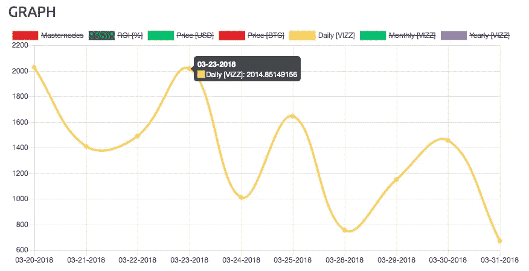
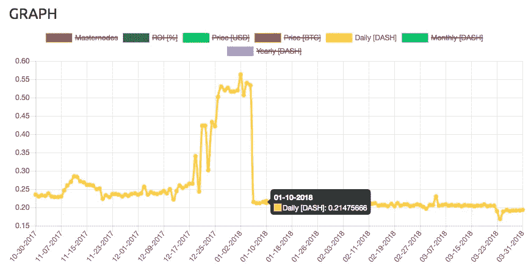

# 在加密货币中，被动收入的梦想依然存在

> 原文：<https://medium.com/hackernoon/the-dream-of-passive-income-is-alive-in-cryptocurrency-5c06861d6f6>

每个人都想拥有它——那种每天早上醒来发现银行账户里的钱比前一天晚上还多的感觉。

我的一位导师告诉我，当你跨过被动收入超过基本生活成本的门槛时，就会发生重大的精神转变。从那以后，我一直专注于这个想法。

# 输入主节点

我将跳过整个加密货币初学者课程，因为这不是本文的内容。

主节点是 24/7 运行的服务器，有区块链的完整副本和锁定作为抵押品的特定数量的硬币。这为网络提供了额外的功能，如私人发送、即时发送和投票。

作为回报，你可以和矿工或赌注者一起获得一部分奖金。

听起来很神奇，但是社区里的人对 masternodes 是什么感觉呢？

主节点的概念是由 Dash 首先提出的。

如果你拥有 1，000 Dash(今天的价格超过 300，000 美元)并推出 masternode，那么你每月将获得约 6 Dash(目前约为 1，800 美元)，年投资回报率为 7.12%。

这是在熊市中。Dash 每股价值超过 1000 美元，这意味着支付额可能是现在的 3 倍。

Masternodes 越来越受欢迎，许多其他实施该系统的硬币提供了更高的收益，而初始投资却少得多。

# 寻找主节点硬币

查看 https://masternodes.online/，你可以找到像 VIZZTOP(＄VIZZ)这样的其他项目，masternode 的成本为 160 美元，年投资回报率为 3164.23%——这意味着如果这种情况持续下去，你的硬币将在 12 天内翻一番。

只是它没有跟上——像这样的收益是不可靠的，正如你从下面 VIZZ 主节点持有者的奖励减少中看到的那样。

Daily VIZZ rewards. (source: [https://masternodes.online/currencies/VIZZ/](https://masternodes.online/currencies/VIZZ/))

在 11 天内，它从 2000 下降到 700(下降了 65%)。)

投资回报率和可持续性之间有一个平衡。存在时间更长的硬币提供了可预测的回报，以及一个项目会让你在未来几年继续获得这些回报的信心。

作为参考，下面是 Dash。

Daily DASH rewards. (source: [https://masternodes.online/currencies/DASH/](https://masternodes.online/currencies/DASH/))

它的回报更加稳定，你可以相信它会比许多未知的、高得惊人的投资回报率的硬币存在得更久。

去 https://masternodes.online/的[看一看，对那里有什么做一些研究。像推特](https://masternodes.online/)上的[15 分钟后，我的 masternode 启动并运行，我现在正式收到了第一笔奖励。](https://medium.com/u/5cca37b76d7b#support 频道。我的问题在不到一分钟的时间内得到了回答，其中一位版主还向我提供了个人支持。

<p id=)[https://masternodes.online/](https://masternodes.online/)显示了他们列出的所有硬币上托管的 102，914 个主节点。

如果 GIN 为 10%的市场提供 masternode 主机，那么每月花费在 GIN 上的费用就是 123，496.80 美元。任何使用 GIN 的服务为其他硬币托管 masternode 的人也可能会考虑购买自己的 GIN masternode，以使用他们赚取的奖励支付所有托管费用，从而使价值增加。

我没问题。

# 结论

令人兴奋的是，我终于可以置身事外，并通过我的第一个 masternode 获得一些被动收入。

GIN 是一个容易开始的地方，我计划在奖励累积后再举办几次。同时，我会研究下一个。

有什么建议吗？为什么呢？

*在 Twitter 上找到我，在那里我几乎什么都不发，阅读量惊人:*[*https://twitter.com/earnenough/*](https://twitter.com/earnenough/)