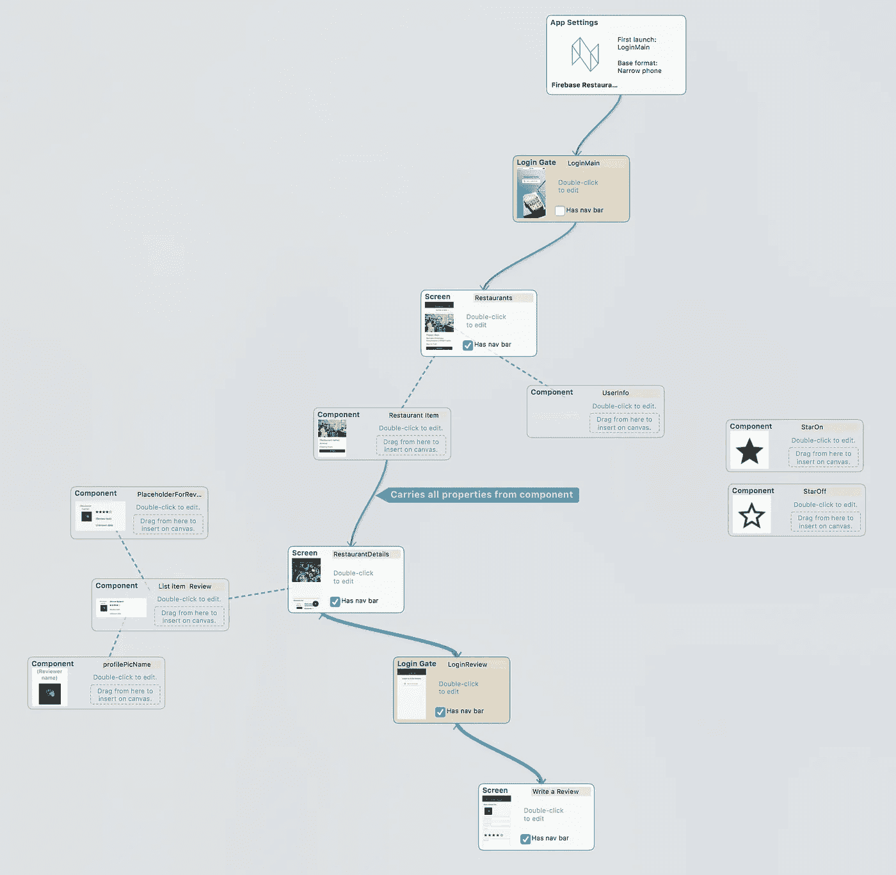

# 最简单的方法(到目前为止！)来构建一个真正的 React + Firebase web app

> 原文：<https://medium.com/hackernoon/the-easiest-way-by-far-to-build-a-real-react-firebase-web-app-5dc6fa6f1b61>


React 和 Firebase 都是已经存在了一段时间的技术。2018 年出现了一些令人兴奋的新发展，以一种比单个部分的总和更大的方式将两者结合在一起-就像它们已经很棒了一样！

本文将向您展示如何结合这两者构建一个实时的、高度可伸缩的 web 应用程序。这里有一个结果的现场演示，一个最小的“本地 Yelp 克隆”，可以让你使用谷歌登录:
[餐馆指南](https://neonto.cloud/u/restaurantsdemofirebase2021)写评论

你不需要写一行代码就能到达那个点，但是 React (JavaScript/JSX)代码会在那里等着你去修改和扩展。

在深入细节之前，让我们回顾一下我们正在谈论的内容:

**React** 是脸书创造的 JavaScript 前端技术。你可以认为 React 提供了 web 中缺少的关键部分，因为 HTML 描述的是文档，而不是应用程序 ui。React 是一种简单的方法来定义 UI 的结构以及它如何随着数据的变化而更新。React 范型最初是为 web 应用开发的，它非常成功，后来被应用于许多其他目标:移动应用有 *React Native* ，虚拟现实有 *ReactVR* 等等。在本次讨论中，我们将重点关注 React for web。

Firebase 是谷歌的一个服务集合，用于创建移动和网络应用的后端。Firebase 最初是一家独立的初创公司，后来被谷歌收购，此后一直与谷歌的全球云基础设施集成在一起。Firebase 的核心是数据库，但它也提供了应用程序所需的所有其他服务:有身份验证、文件存储和在服务器上运行代码的云功能。

最初的 Firebase 产品被称为实时数据库。在谷歌收购后，Firebase 一直在创建下一代数据库产品，现在它可以作为**云 Firestore** 使用。(截至 2018 年 4 月，该服务仍处于测试阶段，但已经非常可靠。)

这篇文章是关于云 Firestore 的新热点，而不是“旧的”Firebase 数据库。这一点很重要，因为即使在 Firebase 网站上，人们也很容易对产品感到困惑。

云 Firestore 的口号是*“在全球范围内存储和同步应用程序数据】*。它很快，是实时的，它由 Google 的自动扩展基础设施支持，它有一个很好的管理用户界面，可以很容易地管理您的数据，而不必记住神奇的 SQL 咒语。这是真正的下一代应用数据库。

唯一的问题是定价。Firebase 有很好的免费和每月 25 美元两个等级，但除此之外，它是按流量计费的:你要根据用户的读写量付费。如果你的服务变得非常受欢迎会发生什么？许多人会认为这是一个好问题——但不管怎样，谷歌平台的可扩展性意味着，如果使用量激增，你不必突然重新设计整个后端。这也是您应该考虑的成本降低和风险管理因素。(如果您仍然担心，请通读这篇文章:在最后，我们有一些关于如何管理 Firebase 定价风险的额外想法。)

# React 工作室❤云 Firestore

简而言之，云 Firestore 有很多值得喜欢的地方。但是为一个全新的数据库开发应用程序需要很长的学习曲线。如果你同时还试图学习现代的 React 实践，这可能会相当令人生畏。

进入 **React 工作室**。由 Neonto 创建，它是一个免费的应用程序，连接了 UI 设计和开发的世界。您可以引入实时数据，使用[我们的传输插件](https://hackernoon.com/transform-your-sketch-based-design-system-into-real-code-using-react-studio-35b89e67ce79)从 Sketch 等工具导入设计，添加响应和交互，并构建完整的应用流程。只需点击一下，你就能在一个全功能的 React app 结构中获得干净的代码(使用脸书的 [*Create-React-App*](https://github.com/facebook/create-react-app) 支架)。

这就是 React Studio 成为 React 编程的优秀学习工具的原因。您可以配置一个完全正常工作的应用程序，在 GUI 中进行更改，并查看它如何影响输出代码。当您想更深入地研究时，没有什么能阻止您跳入文本编辑器，疯狂地使用导出的代码。由于集成的 Git 分支支持，React Studio 可以用于创建和管理 UI，即使您正在同一源代码树中手工处理代码。(我们很快会有一篇关于工作流的文章！)

## 获取 React Studio

你可以在[https://reactstudio.com](https://reactstudio.com)免费获得 React Studio

目前它只适用于 Mac。(如果你需要 Windows 版本，可以作为定制企业版的一部分——联系*sales@neonto.com*。我们非常乐意进行定制，但请注意，我们不能为 Windows 进行定制开发，除非您承诺在长期维护合同中提供至少 10 个席位。)

## 获取 Firebase 插件

React Studio 有一个高级插件系统，可以让你在后端之间切换，就像在 GUI 中加载另一个插件一样简单。

在最新的 React Studio 1.5 版本中，我们添加了一个插件来连接 Firebase Cloud Firestore。你可以在插件商店找到它——点击工具栏上的按钮。尽管该插件在商店积分中有一个象征性的价格，但在安装 React Studio 后，您可以获得免费积分，因此 Firebase 插件不会花您任何钱。

当从商店安装插件时，会询问您是否要打开一个示例项目。选择该选项，因为我们将在本教程中使用示例项目。(如果您不小心错过了，不要担心:示例项目保存在您的 Documents 文件夹中。)

# 规划我们的旅程:餐厅演示应用程序中有什么

正如开始提到的，我们要建立的是一个“本地 Yelp 克隆”，就像这样:
[餐馆指南](https://neonto.cloud/u/restaurantsdemo)

当您从 React Studio 插件商店下载 Firebase 插件时，您会得到一个与这个餐馆指南演示完全相同的示例项目。(如果您还没有插件，请参见上面的步骤。)此时，您应该已经打开了该项目。请注意，它缺少 Firebase 设置—您需要提供自己的数据库信息来使应用程序工作。我们很快会把它作为第一步。

以下是我们应用程序中用户可见功能的总结:

*   **登录屏幕。**使用 Google 登录进行身份验证(登录)。您只需登录即可撰写评论，因此也可以选择不登录就继续。
*   **主屏幕。**餐厅列表。列表是响应性的(在狭窄的移动屏幕上切换到更少的列)。每个餐厅项目都包含一个“详细信息”按钮，可以带您进入它自己的屏幕。
*   **餐厅详情屏幕。**显示餐厅的详细信息和关于该地点的评论列表。在右下角，有一个带+号的浮动操作按钮，可以让你添加评论。
*   **写评论屏。**一个简单的表单，包含以下数据:您的用户图片(来自您的 Google 登录)、您的姓名和电子邮件(也来自登录)、标题、使用 1 到 5 颗星的评分以及评论文本本身。

这些是我们“本地 Yelp 克隆”的核心用户可见功能。然而，在设计时，我们需要考虑更多的特性。在 React Studio 中查看项目地图很有帮助，因为它揭示了实际上促成 UX 设计的所有部分:



我们看到了上面列出的用户可见特性中没有提到的一些东西:

*   实际上有两个“登录门”模块:一个在开始处，另一个就在写审查屏幕之前。这一个在让用户继续之前检查用户是否登录。如果登录已经可用，登录入口会自动转到下一个屏幕，所以我们可能没有看到。
*   在右边，有两个星形的顶级组件，空的和填充的版本。这些用于写检查屏幕。我们在那里使用评级插件，它可以选择从外部组件获取它的视觉外观。将这些放在顶层，可以让我们更好地了解项目中的定制 UI。
*   主屏幕使用一个名为 *UserInfo* 的组件。这将在屏幕的右上角提供登录信息。

# 设置数据库

让我们开始吧。您可以在[产品网站](https://firebase.google.com/products/firestore/)创建一个免费的云商店账户。当你建立了一个账户，进入 [Firebase 控制台](https://console.firebase.google.com/)，为你的餐馆演示应用程序创建一个项目。

选择您的新项目，并前往数据库。确保使用顶部的按钮(在白色“数据库”大标题旁边)选择了*“Cloud Firestore(Beta)”*。

在云 Firestore 中，所有数据都存储在“文档”中，就像传统数据库中的表行一样。每个文档必须属于一个集合，而这个集合又很像传统数据库中的一个表。

点击“添加收藏”并创建一个名为“餐馆”的收藏:


点击“下一步”。现在要求您为这个新集合定义第一个文档。这一步非常重要，因为它决定了您的应用程序将在此集合中存储的数据类型。(这大致相当于在传统的 SQL 数据库中创建表模式，如果您熟悉这个世界的话。区别在于 Firebase 集合不强制模式:除了您在这里为第一个文档提供的字段之外，每个文档还可以包含其他字段。)


为了描述一家餐馆，我们需要一些字段:

*   *餐馆地址*
*   *餐厅封面图片*
*   *餐厅描述*
*   *餐厅邮件*
*   *餐厅名称*
*   *餐馆老板*
*   餐馆电话
*   *餐馆*

为简单起见，对所有类型使用“string”。关于如何在初始文档中填写这些字段的示例，请参见上面的屏幕截图。

(您不必使用相同的名称——例如，您可能更喜欢去掉“restaurant”前缀——但是如果您更改字段名称，您将需要更新 React Studio 文档，以便在数据链接的任何地方使用匹配的属性名称。此外，在你这样做之前，请看下面的解释，为什么前缀在那里。)

一旦你有了第一家餐馆，做同样的事情来评论。创建名为“评论”的新收藏:


…并使用这些字段填写第一个文档，再次使用“字符串”类型:

*   *餐馆 ID*
*   *回顾日期*
*   *复习*
*   *复习课文*


对于餐馆，在所有字段中添加“餐馆”前缀似乎是多余的。但是在这里，我们看到了这种命名方式的优点，因为其中一个字段被命名为“restaurantID”，而不是“review something”。这让我们很容易地浏览字段，并注意到有一个对另一个集合的外部引用**。**

我们的“本地 Yelp 克隆”数据模型非常简单。这两个集合完全显而易见，除了一个“restaurantID”引用将评论与餐馆联系起来。

集合和文档都获得自动生成的对象 id——由数字和字母组成的长字符串，如 *x3LBcxO4JwXc2。*这些对象 id 是唯一的，可用于定位您的云 Firestore 数据库中的任何数据。

为了做一个总是“属于”特定餐馆的评论，我们需要做的就是创建“restaurantID”字段。我们的客户端应用程序(React Studio 中的应用程序)将负责确保用户创建的任何新评论都将在“restaurantID”字段中包含有效的文档 id。如果集合中的某些评论没有该字段的值，这不会破坏任何东西——这些评论只是不会显示在任何地方，因为客户端应用程序总是使用**查询**请求由特定餐馆过滤的评论。我们将在后面看到 React 工作室是如何工作的。

# 设置数据库访问权限

默认情况下，您的收藏对外界是不可见的。对于餐馆应用程序，我们希望用户既能查看数据，又能通过客户端应用程序添加新的项目。

仍在数据库下，转到“规则”页面:


如上所示，输入以下安全性规则:

```
service cloud.firestore {
  match /databases/{database}/documents {
    match /{document=**} {
      allow read, write;
    }
  }
}
```

规则语言相当容易理解。我们告诉它匹配数据库中任何地方的所有文档，并允许读写。这可以让你很快开始，但是你不应该永远这样。您应该只在需要的时候授予访问权限，而不是对所有内容开放读和写。例如，只有“评论”集合实际上需要写访问权限，因为我们不允许用户在演示应用程序的初始版本中添加餐馆。

阅读 [Firebase 安全规则指南](https://firebase.google.com/docs/firestore/security/get-started?authuser=0)，并确保您了解客户端应用程序可以读写的内容。保护数据库是设计应用程序的关键部分。

# 设置 Firebase 身份验证

为了让登录生效，我们需要启用 Firebase 身份验证。进入“身份验证”选项卡，选择“登录方法”页面:


现在只启用 Google 登录。(你可以打开其他的，但它们有各种各样的怪癖:有些像 Twitter 和脸书需要从服务提供商那里获得 API 密钥，而其他像电子邮件和电话并不提供我们在演示中使用的所有数据，如用户头像图片。为了让事情更简单，我们先用谷歌。)

# 将 Firebase 连接到 React Studio 项目

现在我们已经完成了 Firebase 的配置，可以进入 React Studio 了。

我们需要做的第一件事是将 React Studio 项目链接到您的新云 Firestore 数据库。单击“项目概述”旁边的齿轮图标，打开项目设置。然后点击“将 Firebase 添加到您的 web 应用程序”，如下所示:


Firebase 会给你看一段 HTML+JavaScript 代码。它包含我们需要复制到 React Studio 中的配置:


尽管 React Studio 并不需要这种由

在 React Studio 中，打开数据选项卡，然后点击“数据插件设置…”

在左边你会看到这个项目中所有数据插件的列表。虽然列表显示了所有可能的类型，如 Google Sheets 和 Generic JSON，但它们是空的——唯一的项目在 Firebase (Cloud Firestore)下，它被命名为“firebase-restaurantguide”。点击那个。然后点击“Firebase config (JSON)”下面的文本区域，将您的 Firebase 配置粘贴到那里，如下所示:


单击“关闭”关闭数据插件设置表。

然后单击“餐馆”选项卡查看数据表，并单击“从服务中重新加载数据”按钮。您应该会在 React Studio 中看到您的 Firebase 餐厅数据。(如果你得到一个关于索引的错误消息，不要担心，这很容易修复——参见下面的章节*如何将索引添加到你的 Firebase 集合*。)对评论执行相同的操作:打开工作表并单击“从服务中重新加载数据”。

就是这样！您的数据库已连接，我们已通过在 React Studio 中加载数据来验证连接。您现在已经准备好尝试客户端应用程序的感受了。

单击 React Studio 工具栏中的“在 Web 浏览器中打开”。它首先将客户端应用程序的副本导出为 React 项目，然后运行本地 web 服务器(位于 URL *localhost:3000* )并在默认的 web 浏览器中打开该站点。导出完成后，您应该会看到浏览器打开了一份餐馆指南应用程序，但显示的是您之前在 Firebase 控制台中输入的数据。

一切都应该开箱即用。您可以使用任意数量的 Google 帐户登录，并在数据库中配置的单个餐馆下发布评论。(当用户登录时，他们的信息会被添加到 Firebase 控制台>身份验证中的用户列表中。这是查看谁在使用你的应用程序的便捷方式。)

# Firebase 集合如何链接到 React Studio 数据表

有两个重要的概念将 Cloud Firestore 与 React Studio 联系起来。第一个是**数据表**，它就像是你的 Firebase 系列的“视图”。第二个是 React 的**属性**，它将链接到 Firebase 文档中的字段。

我们先来看看数据手册是如何配置的。您可以在 React Studio 中创建任意数量的数据表，但通常它们会与您的云 Firestore 集合非常匹配。在数据选项卡中，单击“餐馆”。这将显示一个名为餐馆的数据表:


数据表的内容从 Firebase 加载，但它不是自动的，您必须手动触发它。(这是为了在设计时保持一致性。)单击“从服务中重新加载数据”，您应该会看到来自 Firebase *餐馆*集合的数据出现。

右下角是一些有趣的设置。*集合 id* 是与该数据表相关联的集合的名称。*查询*是一个自由字段，您可以在其中输入以[云火店查询格式](https://firebase.google.com/docs/firestore/query-data/queries?authuser=0)编写的查询。

这些查询实际上是使用云 Firestore API 的 JavaScript 方法调用。你可以用一个点将这些方法链接起来，如 Cloud Firestore 的例子所示(见上面的链接)。对于餐馆表，我们有两个链接在一起的查询方法:首先是 *orderBy()* ，然后是 *limit()* 。orderBy()调用只是确保数据按餐馆名称的字母顺序返回。然而，limit()调用还有更特殊的地方。它的值是:

```
limit($slot('ds_numberOfRestaurants'))
```

*$slot* 是 React Studio 中可用于查询的特殊模板表单。它允许您在运行时查找数据槽的值。数据槽是可以在 React Studio 中定义和修改的顶级变量(可以在“槽”下的数据选项卡中找到它们)。

在这种情况下，limit()查询的值是从名为 *ds_numberOfRestaurants* 的数据槽中读取的。我们想让用户选择在主屏幕上列出多少家餐馆。如果你看演示应用程序，你可以在右上角看到这个选项。因此，当用户在 UI 中选择一个值时，它被保存在一个数据槽中。因为餐馆数据表有一个引用数据槽的查询，每当数据槽值更新时，它将被重新加载。所有监视数据槽和从 Firebase 重新加载数据的机制都是自动为您生成的——您需要做的只是在查询中使用 *$slot* 语法，其余的由 React Studio 负责。

接下来看看评论数据手册。这里有一个稍微复杂一点的查询:


我们再次看到一个 *orderBy()* 方法调用，但在此之前还有一个类似于下面的 *where()* 方法:

```
where("restaurantID", "==", "$slot('ds_selectedRestaurantId')")
```

where()查询方法至关重要，因为它让我们从集合中过滤出我们想要的信息。在这种情况下，我们只需要 reviews 中的 *restaurantId* 字段的值等于 React Studio 中的*ds _ selectedRestaurantId*数据槽的值。如上所述，在查询中使用 *$slot* 语法保证了每当数据槽的值被更新时数据表将被刷新。实际上，当用户单击特定餐馆的“details”按钮时，该餐馆的 id 被保存在数据槽中，然后更新数据表。

很简单，对吧？让我们看看它实际上是怎么做的。但是首先要绕一个弯路来修复丢失的索引，这是处理云 Firestore 查询时的常见情况。

# 如何向 Firebase 集合添加索引


向数据表添加查询方法时，您可能会看到如下所示的错误消息。这表明 Cloud Firestore 需要有一个**复合索引**才能进行查询。

幸运的是，Firebase 开发人员已经很容易地解决了这个问题。错误消息包含一个指向 Firebase 控制台的链接。

您只需从 React Studio 的错误消息中复制链接，将其粘贴到 web 浏览器中，然后您将看到一个显示必要索引的屏幕:


只需点击“创建索引”，然后返回 React Studio，将数据重新加载到数据表中。

# 餐馆项目组件的属性和交互

转到项目地图选项卡。中间有一个名为“餐馆项目”的组件。双击它以打开它进行编辑。

这个 UI 组件在餐馆列表中重复出现。这个主题太大了，无法在这里涵盖，但要了解更多关于数据、列表和属性是如何关联的，请查看这个详细的指南:
[在 React Studio 中创建列表和使用实时数据](/@reactstudio/list-live-data-and-data-plugin-for-json-c3bd0b626b46)

在画布的左上角，您可以看到一个属性列表，如 *restaurantName* 、 *restaurantAddress* 等。从这些名称开始，细蓝线指向链接到每个属性的 UI 元素。为了使数据链接正确工作，所使用的属性名必须与之前 Firebase *restaurants* 集合中的文档字段相匹配。您可以单击任何元素以在右侧的检查器面板中查看它，然后打开数据选项卡以查看属性是如何链接的。

我们来看看交互是怎么做的。单击画布中的“详细信息”按钮。选择“交互”选项卡，您将看到以下内容:


这里发生了很多事情。点击交互实际上有两个动作——你可以通过“当用户点击”旁边顶部的数字 1/2 来判断。第一个动作是“保存数据”，其目标是一个名为 *ds_selectedRestaurantId* 的数据槽。(请记住，这与 Reviews 数据表查询中使用的数据槽相同。)

保存在数据槽中的值取自组件属性。这部分有些不明显，需要解释。为了获得与当前项目相关的餐馆 id，我们访问名为 *document_key* 的属性，这是如何工作的？

因为我们的数据表来源于 Firebase，这意味着 *document_key* 属性将自动包含 Firebase 文档 id(在本例中是一家餐馆)。

但是“document_key”是什么呢？我们在 Firebase 没有这样的领域。这个值实际上是由 Cloud Firestore 插件提供的，它把文档的 id 放在那里。

长话短说:当在列表中使用一个组件时，您总是可以在 document_key 属性中找到文档的 id。

接下来单击小“2”按钮显示另一个动作:


该操作属于“转到”类型，并链接到*餐厅详细信息*屏幕。动作是链接的，所以当用户点击这个按钮时，首先 *document_key* 的值被保存在数据槽中，然后这个“Go to”动作被执行。

这样，*餐馆详细信息*屏幕总是在*评论*数据表已经只包含与特定餐馆相关的评论的状态下进入。(请记住， *Reviews* 数据表上的查询是实现这一工作的粘合剂。)

这里一个有趣的设置是“从父组件携带属性”。它被设置为值“全部”。这意味着该列表项中的任何属性都将被传递到下一个屏幕。

我们可以打开 *RestaurantDetails* 屏幕，了解它为什么有用:


在画布的左上角，我们再次看到正在使用的属性。一堆标着“由 nav 携带”，比如 *restaurantCoverImage* 、 *restaurantName* 等。这些属性只是从这里的列表项复制过来的。

请注意， *datasheetRow* 属性隐式包含在 carry 中，因此我们的详细信息屏幕可以完全访问 Firebase 文档的内容。这使我们能够访问列表项可能没有使用的任何附加属性。

# Firebase 登录元素

我们之前在配置中粘贴时看到了云 Firestore 数据插件。事实上，当你从 React Studio 插件商店下载 Firebase 包时，这并不是 React Studio 中安装的唯一插件。还有另一个叫做 Firebase Login，您可以在 Login Gate 块中看到它的运行。

双击靠近*写审查*屏幕的登录入口。然后点击“注册 Google”元素，您将看到 Firebase 登录插件的设置显示如下:


这里有一堆设置。您可以选择显示哪些登录按钮，是否将用户信息保存到数据槽中，最后还有一个复选框可以为返回的用户启用自动登录。

Firebase 登录元素与登录入口屏幕类型协同工作。您可以将该元素放在任何登录入口中(从画布右侧的元素列表中拖动它)。该元素将把它的代码生成与登录入口联系起来，所以有一个中心位置(独立于插件),您可以在这里决定当登录成功时会发生什么。

点击屏幕选项卡:


为了让 Firebase 登录正常工作，选择“Web 服务”登录类型，并在“服务”按钮菜单下选择正确的插件是很重要的。

# 一件伟大事情的结束——或者可能是开始

我们覆盖了相当多的领域，但是有很多东西无法在保持这篇文章合理长度的同时放进去。查看以下帖子，了解更多关于 React Studio 的信息:

*   [创建列表和使用实时数据](/@reactstudio/list-live-data-and-data-plugin-for-json-c3bd0b626b46)
*   [设计响应式网页布局](https://hackernoon.com/designing-responsive-web-layouts-in-react-studio-2e1d796704d5)
*   [组件的制作](/@reactstudio/the-makings-of-a-component-42508be8b4dc)
*   [满足设计编译器](/@reactstudio/meet-the-design-compiler-17ae89f985bb)

给你一个临别的想法…如果你担心 Firebase 的定价，考虑一下你刚刚读到的关于 Firebase 插件如何在 React Studio 中工作的内容。概括一下:有一个“Cloud Firestore”web 服务插件，它负责将数据加载到数据表中，并将表单数据发送到数据库，然后还有另一个“Firebase Login”插件，它被放置在登录门户中以提供身份验证 UI。

如果您想用不同的后端替换 Firebase 会怎么样？你所需要做的就是用别的东西替换掉这两个插件。它可以是一家定制后端或其他“后端即服务”类型的公司。无论后端是什么，您都可以将其封装到 React Studio 插件中，因为插件实际上只是 JavaScript 代码生成模板。

如果你想自己看看，从 React Studio 的插件菜单打开插件管理器，然后选择云 Firestore 插件，点击“编辑”。你会在这里看到插件的结构。它都是用 JavaScript 编写的，作为一个包放在文件系统中。为了替换不同的后端，你可以复制一个 Cloud Firestore 插件并替换 codegen 模板。

这就是 React Studio 如何在前端为您提供全新的灵活性。后端特定的选择不再不可撤销地存在于你的代码库中，而是被隔离在插件中。想离开 Firebase 吗？交换插件，点击“导出”，突然你的前端连接到一个不同的服务。手动对代码库进行这种深度修改可能需要大量的工作，并且很容易产生新的错误。

# 阅读更多关于 React Studio 和后端集成的信息

[](/swlh/react-studio-xano-no-code-backend-builder-️-3f537a5d58d4) [## React Studio + Xano 无代码后端构建器= ❤️

### 我们有一些消息，你们所有的应用开发者都会喜欢的！

medium.com](/swlh/react-studio-xano-no-code-backend-builder-️-3f537a5d58d4) [](/@reactstudio/react-studios-firebase-plugin-now-supports-in-queries-c23513c44e86) [## React Studio 的 Firebase 插件现在支持查询！

### Firebase 最近增加了一个长期等待的功能，为云 Firestore 数据库创建“in”查询。这意味着你…

medium.com](/@reactstudio/react-studios-firebase-plugin-now-supports-in-queries-c23513c44e86) [](/@reactstudio/react-studio-️-firebase-50d8add32715) [## React 工作室❤️消防基地

### React Studio 应用程序

medium.com](/@reactstudio/react-studio-️-firebase-50d8add32715) 

*更新 2019 年 1 月 24 日*

我们已经发布了五步 Youtube 视频系列，用于使用 React Studio 和 Firebase Cloud Firestore 后端创建聊天应用程序。从下面找到完整的剧集播放列表。

【https://www.youtube.com/watch?v=1OZFsgHa3fE】T2&list = plkry 47 a9 brlergnlaarv 5 zkf _ 2 edur h6

感谢您的阅读，我们将在 Firebase 和 React Studio 的神奇世界中再见！