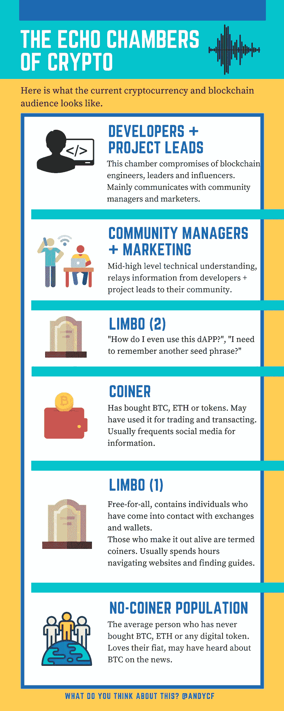

# 密码的回音室。

> 原文：<https://medium.com/hackernoon/the-echo-chambers-of-crypto-205c78e318b7>

## 《密码》受众之间的脱节及其大规模采用的障碍。

Photo by [Levi XU](https://unsplash.com/@xusanfeng?utm_source=medium&utm_medium=referral) on [Unsplash](https://unsplash.com?utm_source=medium&utm_medium=referral)

## 大量采用的嗡嗡声

如果你遇到了[加密货币](https://hackernoon.com/tagged/cryptocurrency)领域，你很可能已经听到个人谈论加密货币大规模采用的重要性。在许多标题为“Y 将被大规模采用的 X 个原因”的文章中，有一个共同的论点，即新的**去中心化、** **透明和不可信的**系统将向普通大众(被视为无创新者)自我推销。

然而，大规模采用的一个争议较少的障碍很简单，即**新加密用户的加入不是自动推进的**。我的意思是，没有创造的人，甚至是经验丰富的创造人，都被期望自己学习太多的新概念(见关于不同的**边缘地带的图表)。**

其中一个主要原因是加密货币空间中“玩家”(图中所示的玩家群体)之间的脱节。

## 伟大的 UI 和 UX 会存在于去中心化的世界吗？

我们都熟悉当前 web 2.0 中的优秀应用、平台和网站。例如，[2+](http://time.com/3834978/babies-use-devices/)年龄组能够轻松拿起设备浏览互联网、玩应用程序或观看视频。

现在，将这与遭遇加密货币的个人的学习曲线经验进行比较。

即使是经验丰富的股票交易者或经常使用数字支付的用户也无法轻松地立即开立外汇账户(验证长度),或者:

*   理解公钥和私钥的重要性(以及了解其区别的重要性—提示；其中一个你不应该分享)。
*   识别他们自己的地址，然后意识到他们的地址是 34 个字符。
*   理解并意识到将资金转移到错误地址的不变性(无论是打字错误还是不兼容的地址——将 BTC 发送到 ETH 地址)。
*   了解交易成本和冻结确认时间(等待时间)。

**这只是购买你使用分散系统的方法。**

那些设计和构建入口点(交易所、场外交易市场、钱包、支付系统……)的人应该努力理解非创造者的观点，并提供出色的 UI*和 UX*以拉平学习曲线。这个学习曲线被描绘在**中间地带(1)** 中，如果解决了这个问题，就有可能弥合非创造者和创造者之间的差距。单单这座桥就足以引发加密货币和区块链“大规模采用”的运动。

但是让我们再深入一点。

一旦个人购买了他们的第一个代币，并在交易、交易和使用软件钱包方面有了一些经验，他们可能会想“下一步去哪里？”。下一步将涵盖去中心化网络中的所有应用、用例以及平台。

此类例子包括[预测](https://medium.com/u/f4d568271227?source=post_page-----205c78e318b7--------------------------------)的预测市场等项目，以及{Set} Protocol 的交易所交易基金*等金融产品，在这些产品中，用户可能开始为当前系统的分散交易对手使用代币。

**学习曲线变得更加陡峭。**

我们现在处于**中间状态 2，**用户面临的概念和问题包括(不特定于上面提到的项目):

*   什么是 dAPP*以及我如何访问 dAPP？
*   安装外部客户端。
*   下载区块链的拷贝。
*   打开新钱包(记住更多 seed*短语)。
*   计算汽油*费用。

(非决定性的，因为其中一些问题连我都避开了)。

当我们认为, **Limbo (1)** 已经是将一个非造币者转变为造币者的主要障碍时，在 **Limbo (2)** 中加入 crypto 的用户变得更加困难。

专注于这些平台和应用的用户界面和 UX 将有助于推动分散化网络的活跃用户，这将需要社区经理和营销人员定期与他们的社区进行反馈，以便更好地指导设计师和开发者的愿景。

在当前的加密货币空间中，顶部和底部都存在回音室。没有铸币者和普通大众得到的指导和信息太少，他们通常求助于给这个系统贴上骗局的标签。与此同时，领导者、开发者和创造者所经历的知识诅咒，使他们不得不创造出迎合小众技术人群、但许多人无法使用的产品。

**如果我们能够弥合顶部和底部之间的差距，我们可能会看到“大规模采用”的火花。**

文章灵感来自阅读[特雷弗·考德威尔](https://medium.com/u/b99672bf26df?source=post_page-----205c78e318b7--------------------------------)的文章。

> “涉足加密货币世界的挑战之一是，你需要了解多少新概念”。

 [## 我买了我的第一个比特币！现在怎么办？

### 在我的上一篇文章中，我回答了我经常从想要购买比特币的家人或朋友那里听到的一些问题

cryptocurrencyhub.io](https://cryptocurrencyhub.io/i-bought-my-first-bitcoin-now-what-fdf7dc9ad150) 

让我知道你对这个观点的看法。如果你喜欢它，请鼓掌和分享。

## 定义(标有*)

用户界面(颜色、视觉设计、布局)

**UX** =用户体验(交互设计、信息架构师、用户研究)

**dAPP** =去中心化的应用(构建在区块链上的应用)。

种子短语(Seed Phrase)=种子短语是一组单词，允许您访问钱包中的资金。

**交易所交易基金(ETF)=** 交易所交易基金是一种可以在证券交易市场上买卖的投资基金。

**Gas =** Gas 是计算费用的方式。