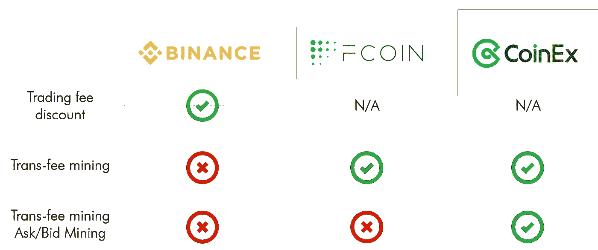
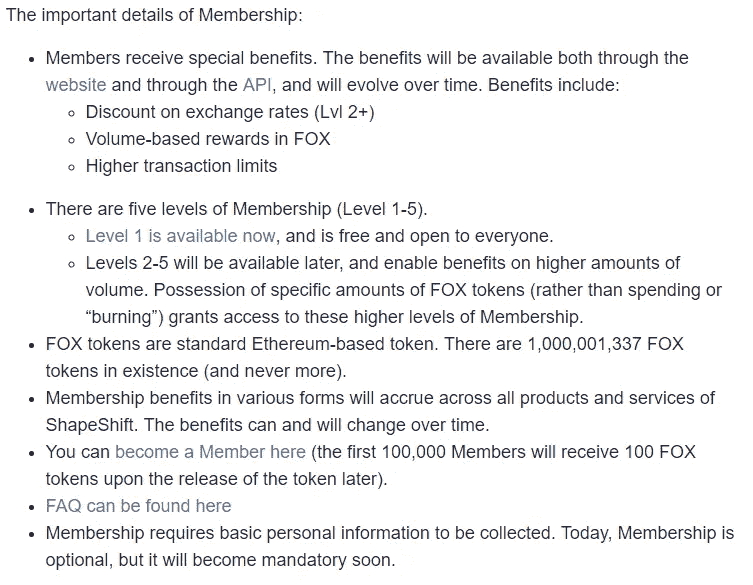

# ShapeShift 会员资格背后的经济因素发生了逆转

> 原文：<https://medium.com/hackernoon/the-economics-behind-shapeshifts-membership-backpedal-bfe524567f71>

最古老的密码交易所之一最终屈服于行业后来者的规则书。

竞争激烈的加密货币交易所业务终于迎来了历史最悠久、当然也是最负盛名的交易所之一不可避免的倒退，这似乎是对去中心化风气的背叛。自从本周早些时候[的博客文章](https://info.shapeshift.io/blog/2018/09/04/introducing-shapeshift-membership/)以来，ShapeShift.io 的首席执行官埃里克·沃尔赫斯(Erik Voorhees)因新的 KYC 会员计划而受到严厉批评，该计划要求该交易所的用户如果想进行更大规模的交易，就必须通过 KYC，并为注册用户提供某些优惠。当 [Andreas Antonopoulos](https://twitter.com/aantonop/status/1037352527682043907) 称 ShapeShift 是一个部署“监视经济学”的“集中实体”时，这个决定变得更加激烈，这是一个与理想的加密交换相反的假设。

业内对这些批评的预期反应是意料之中的— [由于加密空间是一个如此新的行业，法律总是需要一些时间才能跟上快速发展的步伐](https://www.bloomberg.com/news/articles/2018-09-05/crypto-world-rocked-after-long-time-advocate-voorhees-backpedals)。从监管的角度来看，会员计划当然是可以理解的。另一方面，它标志着 ShapeShift 开始进入加密交易所业务的当前行业标准，交易所的后来者曾利用这一标准挤入行业领导者，如币安和火币，以及 FCoin 和 Coinex，其中一些人利用有问题的集中化商业策略来获得用户并改善他们的资产负债表。

因此，本文将探讨现有的交易所会员计划，并讨论潜在的经济模式。

# 会员计划背后的经济学

目前，有许多交易所采用某种形式的会员制计划。在这些程序下，用户首先通过 KYC 程序，然后在交易时获得奖励。

第一个这样的程序是币安使用的，使用币安硬币支付交易费用的用户可以享受一定的折扣。这也是币安硬币背后的真正用途。币安公用事业代币也是迄今为止同行中最成功的交易代币之一，具有相对较低的波动性和较大的交易量。然而，币安硬币的效用有限。

当前交易所中可用的下一种类型的会员计划是币安公用事业令牌的进化版本。在保留其发起人的交易费用收益的同时，该版本采用了一种挖掘功能的形式。这种类型的会员计划中的用户通过在平台上交易来挖掘交换令牌。随着用户在交易所进行的每一笔交易，一定数量的代币——等于交易的交易费——被挖掘。因此，可以说在这样的平台上交易几乎是免费的。用户从他们为平台创造的交易量中获得补偿，他们唯一要承担的风险是他们收到的兑换令牌的波动性。通常，赔偿金会在交易后一天到达。采用这种用户奖励计划的交易所包括一些新的交易所，包括由前火币 CTO 创办的 FCoin 交易所，以及由首席执行官吴的密友创办的 Coinex 交易所。这第二种奖励计划通常被称为**“转费开采”。**

然而，转让费开采项目的**激励流程**并未就此结束。在当前使用转费挖掘的交易所中，交易所代币的持有者从平台获得红利。红利来自一个储备代币池，这个代币池逐渐向社区释放。这种分发方法扩大了持有代币的价值，并鼓励用户保留代币，从而在任何给定时间减少了抛售压力。可以说，这种类型的交换令牌的效用比它的前身更加多样。

然而，第三种类型的用户福利计划最近才出现。这被称为**“要价/出价挖掘”**，其中交换令牌的挖掘发生在用户发出价格订单时。只有最高的订单会得到奖励。交易对的快照是分分钟拍摄的。并且分利政策与转费模型中的一样。

所有三种类型的会员计划的明显好处是进行交易的成本较低，这是具有转费挖掘计划的交易所日交易量显著上升的原因。在一个更极端的例子中，当 FCoin exchange 首次推出其程序时， [**成为世界上交易量最大的加密交易所，日交易量达到 14 亿美元，超过了币安**](https://coingape.com/coinex-becomes-no1-crypto-exchange-with-trading-volume/) **，并在短短 7 天内获得了 30 万用户。**正是因为这个原因，后来开始的交易所都采用某种形式的象征性激励计划来达到类似的效果。

此外，这些交换令牌的一个额外功能是**投票功能**，尽管它实际上最类似于分散式治理结构。正是通过这些令牌来投票决定交换社区是否将列出新令牌。然而，即使这似乎是集中交易所最分散的特征，它仍然是一种“富人变得更富”的模式。

因此，现在当我们看 ShapeShift 的新会员计划时，其背后的经济学是非常清楚的。您可以找到:

1.  **《狐狸的体积奖励(变形怪自己的令牌)》和**
2.  **鼓励持有代币的会员等级，以及**
3.  **汇率折扣**

Taken from ShapeShift.io blog

需要指出的是，与 CoinEx 和 FCoin 不同，ShapeShift.io 似乎没有为它的硬币做 ICO。根据目前可获得的会员计划的详细信息，其令牌似乎只分发给其平台会员。面向社区的分配方法通常比集中代币销售更好，后者只会降低已经集中控制的企业的资产透明度。关于这一点，ShapeShift 值得更多的社区支持。

不管怎样，变形是一项集中的业务。任何假装不是这样的人都只是生活在一个虚幻的分散的乌托邦里。根据现有的监管进展，我认为像这样的会员计划

1.  考虑到来自其他交易所竞争对手的竞争，构思巧妙，并且
2.  以不损害社区利益的方式对商业友好。

*注:以上观点不作为财务建议，本人也不与 ShapeShift.io 有任何既得利益关系，观点纯属本人观点。*

~~~~~~~~~~~~~~~~~~~~~~~~~~~~~~~~~~~~~~~~

我是谁？

我叫张军成，我去美国上了两年大学，具体来说是在肯塔基州，学习计算机科学，于 2017 年退学。现在我完全进入了区块链和加密领域。去年年底，我和我的合作伙伴在区块链创建了一个名为 HN 区块链的社区，现在它是中国最大的区块链社区之一。**请随时查看我们的链接页面:**[https://www.linkedin.com/company/hunan-blockchain-alliance/](https://www.linkedin.com/company/hunan-blockchain-alliance/)

随时联系我在[**Twitter**](https://twitter.com/jc_zhang_)**:****@ JC _ Zhang _**

~~~~~~~~~~~~~~~~~~~~~~~~~~~~~~~~~~~~~~~~

如果你喜欢这篇文章，请点击拍手按钮，越多越好，并推荐给其他人，并检查我以前的故事。谢谢大家！

 [## 使中国成为世界上最大的区块链市场

### 尽管中国是世界上审查最严格的加密货币地区，但它已经产生了各种各样的“大牌”

hackernoon.com](https://hackernoon.com/state-of-decay-and-opportunity-a-constructive-approach-to-blockchain-development-in-china-a83f3513a58f)  [## 为什么加密梦想暂时不起作用。

### 我想写这篇文章已经很久了。有两件事阻碍了我…

hackernoon.com](https://hackernoon.com/why-the-crypto-dream-does-not-work-for-now-f561fc21784)