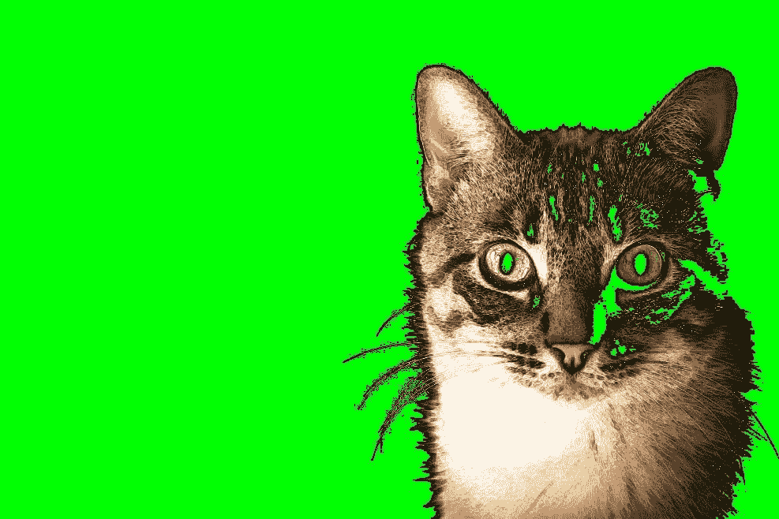

# 隐猫的影响

> 原文：<https://medium.com/hackernoon/the-effect-of-cryptokitties-97a9daaab2ad>

> 由《编年史》(2015 年至今)的联合创始人萨曼莎·拉多奇亚撰写。[原载](https://www.quora.com/Did-this-CryptoKitties-cripple-Ethereum-If-so-what-are-the-possible-outcomes/answer/Samantha-Radocchia)于 [Quora](http://quora.com?ref=hackernoon) 。

最近在 [LinkedIn 上看到有人说](https://www.linkedin.com/feed/update/urn:li:activity:6341033010292490240):

> **“区块链的杀手级应用不是代币，而是私有经济或生态系统的创造。代币只是实现这一目标的手段。”**

他们感到失望的是，以太坊的第一次真正使用集中在代币和帮助公司筹集资金上，而不是创造生态系统。

好吧，也许他们很幸运，因为事实证明第二个杀手级应用是一个与小猫的游戏。

这多少有点道理。互联网和小猫就像面包和黄油一样形影不离。为什么区块链会不一样呢？

它解释了为什么 CryptoKitties 会导致持有者花费数百万美元。这可能看起来很平凡，但实际上这是教育公众和让区块链更容易被主流观众接受的重要一步。

和广泛采用都归结于用例。现在大家都听说过比特币，因为它涉及货币和金融，早期买入的人已经看到了巨额回报。这些收益往往会成为新闻。

但是随着越来越多的用户被吸引到区块链网络——不一定仅仅是因为财务原因——我们需要问:这种涌入将如何影响新兴技术？

## **主流采用率正在上升**

主流采用的用例，如比特币，受到了媒体的广泛关注。

让我们看看比特币:它在感恩节后就达到了 10，000 美元，在假期中超过了 18，000 美元。这并不完全是巧合——它已经得到了大量的媒体报道。大家放假回家，开始讨论这件事。突然间，比特币价格飙升，比特币基地在感恩节假期增加了 10 万用户。

但是区块链现在的目标是吸引那些不仅仅是为了快速赚钱的人。这就是游戏化真正有用的地方。它吸引了更多的人，增加了技术的价值。像 CryptoKitties 这样的游戏正是那种可以着火并让人们继续使用网络的东西。记得 Farmville 吗？

出现的用例越多，区块链就会得到越多的媒体关注。这将导致采用和开发的增加。

## **基于区块链的引擎在这里**

当我在 NYU 攻读硕士学位时，我做了大量的游戏设计和力学研究。我研究过电子游戏的历史，我了解了很多 80 年代和 90 年代早期的情况。

我发现 id Software 的游戏开发人员曾经开发了一个游戏引擎——先是 Wolfenstein 3D，然后是 Doom，然后是 Quake——效果非常好。因此，在接下来的几年里，几乎每个游戏都使用相同的引擎。(参见[雷神之锤发动机家谱](https://upload.wikimedia.org/wikipedia/commons/6/63/Quake_-_family_tree.svg))。

我们基本上在 CryptoKitties 上看到了同样的事情，但是是在区块链的引擎上。它建立在一种叫做 ERC 721 的新代币上，这种代币允许收藏品的交易。该令牌可用于交易因投机而升值的其他物品。可能是从密码猫到棒球卡的任何东西。

在未来的一年里，我们将看到更多基于现有引擎的衍生游戏——类似于早期视频游戏的发展。

## **需要升级**

虽然 CryptoKitties 可能是迈向主流采用的一步，但这款游戏也凸显了一些仍需努力的潜在问题。自游戏发布以来，以太坊上的未决交易增加了 6 倍，占以太坊总流量的 15%以上。有些人担心这种流量削弱了更严重的用例，但从长远来看这是有益的。

为什么？这种交通迫使对基础设施进行更多投资。这是对以太坊和[比特币基地(](https://www.coinbase.com/join/576c994f6bd4be01bd000c3f)或任何基于区块链的主流消费应用程序)的一个警醒，他们需要升级并准备扩大规模。如果交易所不能处理来自 CryptoKitties 的流量，那么当更多的应用成为主流时会发生什么？

即使有这些流量，游戏本身仍有工作要做，以确保底层机制对用户完全隐藏。玩的时候很多方面都给我留下了深刻的印象。但我最终还是感到沮丧，因为它仍然相当复杂，并且没有提供无缝的用户体验。

最终，目标是对用户隐藏所有的过程和额外的步骤。他们将能够像任何其他应用程序一样，一键登录。然后，他们将输入一个卡号，该卡号将加载他们的加密钱包，并从[比特币基地](https://www.coinbase.com/join/576c994f6bd4be01bd000c3f)转移货币来玩游戏。

现在，用户必须在没有帮助的情况下艰难地完成这些步骤。

## **这对未来意味着什么**

所有这些关注和开发的价值实际上是底层技术。加密货币和加密猫只是区块链的用例，但它们的采用对增长至关重要。

我想起了互联网的早期——没有人知道它会变成今天的样子。人们仍在试图找出如何使用它。然后，电子邮件出现了。突然出现了这个极其强大和重要的用例，它改变了人们对互联网的看法。

我记得在我小的时候，我爸爸给我看了我们家的电子邮件，我们都很惊讶。你可以立即给地球另一边的人发送一封电子邮件。这是开创性的。

这就是区块链所在的地方。我们知道这项技术具有不可思议的潜力，但我们无法把握所有的可能性。但是像 CryptoKitties 这样的应用程序正在帮助扩大用户群，并扩展我们对真正可能性的理解。

> 由[编年史(2015 年至今)的联合创始人萨曼莎·拉多奇亚](https://www.quora.com/profile/Samantha-Radocchia)。[最初发表于](https://www.quora.com/Did-this-CryptoKitties-cripple-Ethereum-If-so-what-are-the-possible-outcomes/answer/Samantha-Radocchia) [Quora](http://quora.com?ref=hackernoon) 上的。
> 
> 更多来自 Quora[的趋势科技答案，请访问](https://medium.com/u/3853f85f7d5e?source=post_page-----97a9daaab2ad--------------------------------)[HackerNoon.com/quora](https://hackernoon.com/quora/home)。