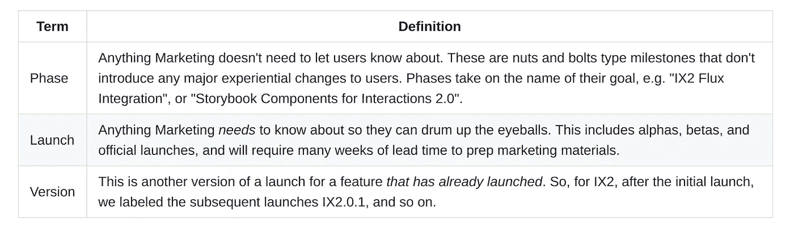

# 有效的技术领导是 100 倍的工程师

> 原文：<https://medium.com/hackernoon/the-effective-tech-lead-is-a-100x-engineer-fe49c0372a63>

抛开夸张的点击诱饵标题不谈，我希望让你相信，有效的技术领导是力量倍增器，是著名的 10x 工程师的独角兽表亲，除了技术领导的力量在于将强大的开发者魔力转移给团队的每个成员。居住在这些技术领导者监护下的幸运工程师们发现他们自己的力量被放大了 10 倍，并被包裹在一个他们从未经历过的支持系统中。

而且，我希望让你相信，这种神奇的 10 倍光环不一定要以牺牲一个人的福祉为代价，除了科技领袖头上的几根白发。这位领导处理掉了所有浪费的“工作”，极大地提高了*重要的工作*的生产率，并将*享受工作生活和谐的选项*还给他们的团队。对于那些拥有有效技术领先优势的人来说，这是一个福音。

> 生活在这些技术领袖指导下的幸运工程师发现他们自己的力量被放大了 10 倍

我是 [Webflow](http://www.webflow.com) 的工程经理。我们相信我们团队的福利直接转化为我们用户的福利，所以我们在我们团队上投入的越多，我们的用户受益就越多。我们相信提供有意义的工作。我们相信漫长而丰富的就业任期——我们将长期从事这项工作。我们相信工作应该与人类的经历愉快地共存——把它想成一种共生关系，而不是寄生关系。

技术领先有助于实现这些信念。因此，我写了一篇[技术线索指南](https://github.com/webflow/leadership/blob/master/tech_lead.md)来支持我们在这个富有挑战性的追求中的线索，并在这里为你提供了一个几乎一字不差的副本。我们希望你也能享受对激情和成功的有意义的追求，在这个世界上，这样的结合经常被贴上崇高和荒谬的标签。

请欣赏我们的技术领先指南(此处为目录版本[的降价](https://github.com/webflow/leadership/blob/master/tech_lead.md))。

# Webflow 技术主管指南

# 欢迎

你好！👋欢迎阅读本文档。很高兴有你。

如果你已经接受了一个技术领导的角色，那么恭喜你，你已经展示了非凡的技术技能和领导才能——确实是罕见的品质！或者，如果你对技术主管的职位感兴趣，并想决定它是否适合你，那么你来对地方了。

承担技术领导者的责任是从普通工程师的日常工作中迈出的一大步。本指南旨在快速帮助您了解

1.  成功的技术领导者的定义
2.  从纯技术角色转变为管理和技术专业知识相结合的角色时的期望，以及如何管理这些期望
3.  缓解共同挑战的战略
4.  立场 Webflow 承担“管理”*(提示:是服务，不是独裁)*

# 技术领先到底是什么？

根据其最基本的定义，技术领导“对项目的成功全权负责，花费 30%的时间编写代码，另外 70%管理项目”。*领导*并非用词不当——你的目的是带领一队有才华的工程师穿过波涛汹涌的水域，指引他们，引导他们远离危险，清除障碍，并让他们做有意义的工作。

这说起来容易做起来难。

一个技术领导者必须拥有和培养无数的技能，但最重要的是*真诚的共鸣*、*清晰的沟通*和*卓越的技术*。这些技能同等重要。技术领导是一个“混合”角色，一只脚在管理上，另一只脚在工程上，并且充当项目期望和开发任务之间的联络人。一个项目的成功落在了技术负责人的肩上，确保他们获得成功所需的支持也落在了 Webflow 的肩上。

## 为什么 Webflow 的管理与众不同。

大多数公司的管理层都受到了指责。它常常与把员工当作“齿轮”联系在一起，让人联想到自大到无以复加的独裁者形象。这不是 Webflow 的工作方式。我们首先将每个团队成员视为人类，其次才是有才华的贡献者。人类需要建立在同情和合作基础上的关系。培育这样的环境是技术领导者的工作，而这样的环境是通过*服务*的态度产生的。

技术负责人的工作是*而不是*进行微观管理，而是成为服务负责人，也就是说他们在那里*支持*他们的团队，为*他们服务*，就好像他们为他们工作*(而不是相反)。他们可能要对项目的成功负责，但是是他们的团队的协作努力使项目取得成果。*

以下是一些帮助你更好地为团队服务的建议:

1.  直接面对项目需求。只要你非常关心你的团队，就不要害怕挑战他们。
2.  当成功发生时，给予你的团队足够的赞扬，给予他们所有的信任——没有他们，成功是不可能的。

# 为什么我想成为一名技术领导者？

你可能*不想*成为技术领导者，这很好。Webflow 旨在为工程师提供许多不同的机会来促进他们的职业发展，包括为高级管理角色提供类似意义的个人贡献者跟踪。技术领导比普通工程师承受着更大的压力，平衡管理团队和贡献代码的需求是一项挑战，尤其是在第一次进入领导角色时(顺便说一下，这是完全正常的)。

也就是说，管理生活会非常有益。你将在食物链的更高层参与决策。你对 Webflow 用户群的影响倍增。你将发展影响力，这将反映在你的绩效评估中，并随后提供更多的职业发展机会。该职位通常被视为“高级”工程师头衔的敲门砖，也是工程经理职位的先决条件。你将指导和帮助其他工程师成长。一些人发现这些额外的挑战令人兴奋，并帮助 T2 将他们推向新的极限。

# 我怎样才能成为技术领导者？

随便问！是的，就是这么简单。在一对一的谈话中，向你的经理表达你有兴趣成为一名技术主管。你的经理的职责是设计一条通向新角色的道路，根据你目前的经验，可能包括在你的下一个项目中指派你担任技术主管，如果没有，那么为你提供发展成为技术主管所需技能的机会。

# 管理团队时，对我的期望是什么？

技术主管的工作包括以下职责(排名不分先后):

1.  与产品经理密切合作，围绕截止日期设定合理的预期，并在项目偏离轨道时*明确*(参见:[帮助！我们进度落后了！](https://github.com/webflow/leadership/blob/master/tech_lead.md#help-we-are-behind-schedule))
2.  将项目分解成易于理解的任务，将这些任务与迭代的可交付成果联系起来，并跟踪这些可交付成果
3.  为他们的团队提供充足的不受干扰的工作时间，以便他们可以经常进入心流状态，并充当他们团队的监护人，防止任何潜在的阻碍和干扰
4.  确保你的团队在任何时候都有充足的工作供应，这样就不会有人“空转轮子”
5.  执行勤奋的代码审查、第一轮 QA，并尽可能贡献代码
6.  在团队成员执行任务时*可用*。(预计会有阻止低头工作的时间窗口，但也预计会有团队可用性的时间窗口)
7.  偶尔和其他部门合作

## 与其他部门合作

产品管理将用户期望与产品特性结合起来。营销使这些特征为世界所知。支持确保 Webflow 实现那些承诺的功能。每一个都是 Webflow 持续成功和发展的关键。工程是这些部门的核心，技术主管是他们之间的联络人。

技术主管负责以两种形式向其他部门传达他们的项目状态:

1.  与其团队召开的每周状态会议，专门的产品经理或支持联络员*也可以参加。(参见:[会议](https://github.com/webflow/leadership/blob/master/tech_lead.md#meetings))无论产品经理或支持联络员是否参与，此会议都是强制性的。
2.  全公司都可以看到的每周“全体人员”报告。(参见:[我如何向所有手下和格子提供状态报告？](https://github.com/webflow/leadership/blob/master/tech_lead.md#how-do-i-provide-status-reports-to-all-hands-and-lattice))

有些项目可能不需要产品经理或支持联络员，在这种情况下，技术主管会向他们的工程经理表达他们团队的状态和需求。有时，营销人员也可能会询问技术负责人何时应该开始宣传某个功能。

**稳定团队(参见:* [*一个技术主管可以管理哪些不同类型的团队？*](https://github.com/webflow/leadership/blob/master/tech_lead.md#what-are-the-different-types-of-teams-a-tech-lead-can-manage) *)将与支持联络员密切合作，专注于修复对用户影响最大的错误。*

## 跟踪任务

一个伟大的技术领导者知道如何将一个项目分解成有意义且容易理解的任务(理解意味着大约三天的时间)。这给他们的团队成员一个项目的整体视图以及一个终点线，并允许技术领导每周给团队成员分配任务。将项目分解成小任务是一个耗时的过程，通常是一项持续的工作，但对于向团队成员提供进度感是至关重要的。它还允许技术负责人创建通向未知的路点，并将这些未知包含在小时间窗口内(参见:[通向未知的任务](https://github.com/webflow/leadership/blob/master/tech_lead.md#task-toward-unknowns))

## 主跟踪问题(MTI)

在项目开始时，或者在项目的持续里程碑开始时，技术主管必须花时间彻底审查项目的规格，并尽最大努力将规格分解为可跟踪的任务，工作范围为 1-5 天(外部代码审查/ QA)，最佳时间线为 3 天。然后，这些任务应该被分组为里程碑。每个里程碑都是一个有截止日期的*可交付成果*。(参见:[里程碑](https://github.com/webflow/leadership/blob/master/tech_lead.md#milestones-aka-deliverables))

> 专业建议:考虑让你的团队帮助你将里程碑分解成任务。如果你的团队成员拥有你不具备的领域知识，这有时是唯一的选择。在有意义的地方委派，但一定要审查*所有任务，并*验证*它们的范围和/或假设。*

Webflow 目前的做法是为每个任务创建 GitHub 问题，然后在“主跟踪问题”中进行跟踪。MTI 应该在问题的标题和 GitHub 的标签部分收到一个`[Master Tracking Issue]`标签。

MTI 是 GitHub 问题的集中和清晰的视图，它列出了里程碑、它们的预计交付日期(参见:[里程碑](https://github.com/webflow/leadership/blob/master/tech_lead.md#milestones-aka-deliverables))以及它们的相关任务

1.  可以轻松分配给您的团队成员，他们将负责创建一个 PR 来解决问题
2.  显示任务的 GitHub 问题编号*和*将关闭问题的 PR，以及问题的标题。这通常最好用表格的形式来完成。
3.  提供每个里程碑的预计完成日期，以及这些里程碑的每个问题的状态(参见:[在 MTI](https://github.com/webflow/leadership/blob/master/tech_lead.md#displaying-progress-in-the-mti) 中显示进度)

## 任务

每个问题(或 1-5 天的任务)必须清楚地指向问题所针对的规范部分*和*Webflow 代码库的相关区域(如果存在)。我们发现每个任务最好

1.  清楚地指向问题所针对的原始规范，以及任何有助于工程师完成任务的*视觉*内容，包括来自规范或 Webflow 本身的截图/截屏
2.  列出 TODOs 的最佳猜测，帮助工程师围绕他们必须解决的问题建立一个心智模型

下面是一个任务模板。这应该位于 GitHub 问题中，并且应该收到与 MTI 中跟踪的标题相同的标题。

## 这很难

制造主跟踪问题会让你觉得花了太多时间，并且会让你质疑你是否在执行最有效的工作。相信我们:it *是*的关键，MTI 越清晰，项目成功的可能性就越大。根据项目的规模，可能需要一周或更长时间。😱挺好的。为此做好计划。让它发生。你的团队会感谢你的。帮助你的团队感受到有意义的进步是至关重要的(参见:[我如何让我的团队保持动力？](https://github.com/webflow/leadership/blob/master/tech_lead.md#how-do-i-keep-my-team-motivated))。

> *专业提示:在开始 MTI 之前，在说明书旁边打开一个文档，并写下一个任务列表，会很有帮助。当你有了一个坚实的任务大脑，打开一个问题，写一个基本的描述并突出规格领域，然后*然后*进入代码库找到问题的指向。*

## 在 MTI 中显示进度

您可以将 MTI 视为一个仪表板，显示与里程碑相关的每个问题的进度。这依次显示了*整个*里程碑的状态，以及随后的*整个*可交付成果的状态。例如，这里有一个 MTI 如何发展的例子:

以上给了项目经理(或任何相关人员)一个快速评估项目进展的方法。例如，可以看到 BETA 里程碑大约完成了 75%,由于任务被分成大约 1-5 天的增量，很容易判断里程碑是否正在进行`off-track`(参见:[帮助！我们进度落后了！](https://github.com/webflow/leadership/blob/master/tech_lead.md#help-we-are-behind-schedule))。

由技术负责人维护上述 MTI 的状态，尽管他们可能希望将每个行项目状态的更新委托给负责完成该问题的团队成员。为每项任务显示的重要元素有

*   它的里程碑和日期
*   它的问题
*   它的拉动请求
*   简短的描述
*   它的进步

> *专业提示:如果一个 MTI 太长太笨重，可以把它们分成几个独立的 MTI。*

## 里程碑(又称交付成果)

技术负责人必须让他们的产品经理(或工程经理，如果没有指定产品经理)了解他们跟踪里程碑的进展情况，并提供每周全体员工更新(参见:[如何向全体员工和网格提供状态报告？](https://github.com/webflow/leadership/blob/master/tech_lead.md#how-do-i-provide-status-reports-to-all-hands-and-lattice))。这些里程碑及其各自的任务由技术主管确定，并由产品经理、工程经理或其他人确认。

一个“里程碑”是

*   一个主要的可交付成果，通常有六周的时间表(参见:[项目需要多长时间？](https://github.com/webflow/leadership/blob/master/tech_lead.md#how-long-should-projects-take))
*   负责推动一系列任务/问题，并在*所有*任务/问题都已推向生产时完成
*   根据交付物的类型命名，例如阶段、发布、版本(参见:[里程碑类型](https://github.com/webflow/leadership/blob/master/tech_lead.md#types-of-milestones))
*   指定截止日期

大型项目的计划结构应该只包含两个层次:里程碑->任务。里程碑本身将在一个功能的范围内，例如富内容编辑器或交互 2.0，这可能需要几个月(或几年)才能完成。里程碑是连续交付工作的“大块”,通常是按顺序完成的。一个团队很少并行处理里程碑，除非它们高度相关，尽管从一个里程碑转移到另一个里程碑时会有一些重叠。

> *专家提示:对范围的增加要非常小心。范围蔓延是真实的。当范围改变时，总是使用里程碑的日期作为受影响的因素，并清楚地传达新范围的影响。*

有关里程碑计时的更多信息，请参见:[项目需要多长时间？](https://github.com/webflow/leadership/blob/master/tech_lead.md#how-long-should-projects-take)

## 里程碑的类型

里程碑是*主要的*可交付成果，并且在*功能上*彼此相同，尽管它们可以在*语义上*分成阶段、发布和版本。重要的是不要过多地考虑这些差异，但是相应地为产品经理和营销人员命名会有所帮助。

## 向未知挑战

里程碑的截止日期很难估计，但 Webflow 要求技术负责人尽最大努力为它们设定一个*现实的*日期。这种约束起初看起来似乎是限制性的，但是我们更多地把截止日期作为焦点(有缓解策略)，而不是不可移动的*死*-线(参见:[救命！我们进度落后了！](https://github.com/webflow/leadership/blob/master/tech_lead.md#help-we-are-behind-schedule))。

与其依赖里程碑的模糊不清的终点线，不如“向未知挑战”。我们的特性倾向于打造新的行业领域，这是 JavaScript 世界从未见过的，所以通常不可能对即将到来的工作有水晶球般的看法。当然，其中一些会很清楚，但是总会有一部分会让最好的技术领导挠头说“嗯，我不知道这要花多长时间。”清除阴霾。通过将未知分解成旨在尽快发现未知的小任务来缩短预测。

确定任务的优先顺序时要坚定不移。当更多信息出现时，转向。让你的项目经理知道你的团队目前正在做哪些工作。将这些未知数叠加起来，就可以发现*实际的*里程碑截止日期。

> *专家提示:有时新的任务源于发现最初的 MTI 中没有列出的未知。如果新任务对于完成里程碑是绝对必要的，那么包含新任务是很好的。如果他们更改了里程碑的截止日期，请务必通知您的经理。*

## 会议

技术主管应每周组织一次约 30 分钟的项目会议，最好是在一周开始时和当天早些时候，会议议程如下:

将团队范围的会议限制在一周一次。在空闲通话或代码配对会话中跳跃不应该被视为“会议”,应该在需要时自由使用。

## 每周状态

每个工程师都被要求相应地每天向#status-frontend 或#status-backend 报告他们的`on-track` / `off-track`状态，并由技术负责人每天确认这些状态(一种松散的“反应”)👍永远是美好的)。这让每个工程师对他们每周的任务负责，如果一个任务失控`off-track`或超过 5 天，它允许技术领导介入。

> 专业提示:帮助你的团队成员一次专注于一到三个并发任务。超过这一点就很难跟踪，所以主动提出帮助减少或合并他们的任务，并找出是什么导致了碎片。

## 敏捷？项目经理？

你可能想知道，“这种项目管理方式背后的方法论在哪里？”。它可能类似于敏捷，有两周的预测和每周的“Scrum”式会议，但是它缺少烧毁图表和 Scrum 大师。虽然我们热爱敏捷哲学，致力于快速行动，并在可能的情况下进行调整，但 Webflow 并不支持特定的方法。这是目前对我们有效的方法，我们会随时重新评估它。👍

# 技术主管可以管理哪些不同类型的团队？

Webflow 将其有才华的工程师安排到*行动*和*永久*团队，由一名技术负责人负责。

## 我应该期待多大规模的团队？

团队规模各不相同(他们甚至可以是一个人的联盟)，但一般的规则是一个团队将包括三名成员，包括技术负责人。与两个致力于解决相同问题的人管理关系相对容易，但一旦有人被要求管理第三、第四或第五种关系，交流潜力的排列就会急剧增长。这不仅与技术主管的关系有关，还与团队成员之间的沟通方式有关。更大的团队*可以*工作，但是三的规则似乎是一个很好的起点。

这并不是说一个*团队*必须只有*三个*成员。一个行动团队可能包含七名成员，其中包括一名技术负责人，他可以将团队分成两组(每组三人)，并让每组专注于特性总体范围内的并行任务。然后由技术领导为每个小组创建一个团队领导，并让他们对自己小组的工作负责。请记住，每个小组都应关注*功能*效率，并相互协作解决*问题*，以减少并行处理单个资源时通常会遇到的阻塞延迟。

前面提到的团队结构可以由后端*和前端*工程师组成。Webflow 希望模糊这些工程学科之间的界限，以及非工程学科，例如设计师。组建跨学科团队是特性效率的最终目标；你是否追求它取决于你和你的项目的需求。

## 团队效率和组织

设计团队有两种方式。一种是“功能”效率，它有利于那些合作解决密切相关问题的团队；另一种是“资源”效率，它有利于从事完全不相关的并行任务的个人。两者各有所长，但我们要求技术领导尽可能优化*功能*效率。更多信息见[流量与资源效率](https://www.jrothman.com/mpd/agile/2015/09/resource-efficiency-vs-flow-efficiency-part-1-seeing-your-system/)。[在本文中，我们用“特性”代替了“流程”，因为很容易将流程与“流程状态”混为一谈]

> *专业提示:并行化需要明确定义的范围。如果你领导的项目是在设计规格*上迭代，而*迭代开发正在进行，那么最好只针对*特性*效率进行优化。*

# 救命啊！我们进度落后了！

很酷。真的。去喝杯咖啡，或者晒晒太阳，当你的内心反射出平静池塘一样的光泽时，回到你的办公桌前(见:[我怎样才能保持“居中”？](https://github.com/webflow/leadership/blob/master/tech_lead.md#how-can-i-stay-centered))。

几乎每个项目都会遇到一些威胁其交付日期的未知因素。与其拼命避免这一点，不如试着*期待*这一点。您需要将它纳入您的评估中(参见:[我如何才能做出更好的评估？](https://github.com/webflow/leadership/blob/master/tech_lead.md#how-can-i-make-better-estimates))。认识到这是绝对正常的，并从所有技术领导者经历的团结中得到安慰。这就是好的*和好的*与好的*的区别。*

我们把错过最后期限等同于心痛的内疚。这是士气杀手。士气是你的团队最宝贵的资源。相反，最好将“延迟”理解为“推迟的进展”，并如此表述。Webflow 了解软件开发是艰难的，所以我们已经准备了一些技巧来帮助你将错过的最后期限框定为进度。

## 浅谈项目管理

在我们深入研究*返工/延期/放弃*期限模型之前，有两个关键的项目管理概念将帮助您理解*我们为什么*遵循它。

首先，需要强调的是*将交付成果与固定日期联系起来*。没有明确的目标，很难衡量进展。我们必须衡量某件事的进展，即使那件事只是猜测。进步是动力的命脉。

第二，你可以利用四个杠杆来帮助项目恢复。它们如下

这四个杠杆可以随着项目的发展而改变。它们是有效的项目经理推理的工具。也就是说，Webflow 生产最高质量的产品，不会为了时间、资源或范围而牺牲质量，所以我们只有这三个可用的杠杆，我们将在下一节中详细阐述。

> 专业提示:技术领导的角色通常是工程师试图满足企业底线需求的第一次尝试。他们的决定必须以这样的问题为框架:“这如何让公司保持健康？”如果你很少或没有商业头脑，可以看看乔希·考夫曼的《个人 MBA》*。这是现代商业实践中的一个极好的速成班，当你考虑 Webflow 的需求和你的团队的需求时，它将帮助你做出更好的决策。*

## 返工/延期/放弃(延期进度的缓解策略)

当面临截止日期的威胁时，你有三种选择，应该与你的产品经理讨论。以下是按照考虑因素的顺序排列的:

*   返工可交付物
*   推迟截止日期
*   放弃项目

## 修订

返工包括问两个问题:

1.  我们可以在项目中增加资源来满足截止日期吗？
2.  我们能改变可交付物的范围来满足截止日期吗？

在评估如何减少错过的截止日期时，首先要考虑你的资源和范围。首先询问更多的资源是否有助于解决问题，尽管通常情况下*并非如此*除非项目一开始就人手不足。添加后期资源[甚至可以将截止日期推得更远](https://en.wikipedia.org/wiki/The_Mythical_Man-Month)！所以，你的下一个工具是缩小范围。

> *专业提示:当试图在截止日期前完成任务的同时仍能提供商业价值时，缩小范围通常是首选。一个项目需要更多资源来赶上最后期限的可能性大概在 10%左右。90%的时间缩小范围。*

缩小范围通常是可行的。作为充满激情的软件开发人员，我们往往贪多嚼不烂。这是一个机会，你可以用刀叉将交付品切成一口大小的小块，并有更现实的期望，你也可以将这些期望传达给其他关键利益相关者。

## 推迟

如果范围无法缩小，并且增加资源不是一个选项，那么下一个*最佳*选项是*将截止日期推后*。是的，你没听错。是到最后期限的时候了。"那么，如果最后期限可以被随意改变，那它还有什么意义呢？"嗯，我们尽最大努力避免改变最后期限，但有时会发生，这完全没关系。当我们试图达到一个不切实际的最后期限时，会有太多的风险，其中包括团队精疲力竭、产品质量差、士气低落等等。

这里重要的想法是*不要忘记交货日期*。这才是最重要的。当错过的截止日期不变(咳咳),项目向未知倾斜时，项目将陷入困境。这是*比移动截止日期更糟糕的*，所以移动它！

## 放弃

最后也是最罕见的选择是完全放弃这个项目。如果你(或其他利益相关者)发现可交付成果会对公司产生负面影响，请考虑这一点。废弃它！专注于*高效的*工作，而不是*高效的*工作。

## 可选的第四个策略:密切关注

还有第四种选择，当错过最后期限的威胁只不过是你内心的一种微妙的不安时，那就是*密切关注*。当你的直觉告诉你有什么不对劲时，要特别注意。提前解决问题很重要，这应该是你先发制人的时刻。让你的经理知道这一点。

> *专家提示:让你和其他人的生活更轻松的关键是掌握管理期望的艺术。只要你保持坦诚和诚实，少承诺多兑现是明智的。总是陈述什么是真实的。宣布对错过最后期限或失去关键资源的担忧。宣布比预期提前完成工作。像你对未知事物持怀疑态度一样真实。*

# 我如何做出更好的估计？

在撰写本文时，还没有人发现预测软件开发时间表的神奇的八球估计方法。有些人可能试图卖给你蛇油，告诉你不是这样，有些人可能会说这是完全不可能的。最好接受软件评估很少是准确的，并从那里开始工作。这是敏捷哲学的核心:迭代和发现，然后交付和改进。这是发现的艺术，而不是传递的艺术。Webflow 遵循一个迭代过程(参见:[管理团队时对我的期望是什么？](https://github.com/webflow/leadership/blob/master/tech_lead.md#whats-expected-of-me-when-managing-a-team))正如其他章节所概述的那样，因此估计很重要，但不如发现未知重要。也就是说，这里有一些帮助评估任务的策略:

## Pad 对意外情况的估计

发展很少按计划展开。不要给出精确的估计，而是给出你对给定任务的最佳猜测，然后乘以 4，尤其是 T21，如果这个任务涉及发现未知的话。这听起来可能很疯狂——有时确实如此；经验有助于技术领导者完善这个等式——但这是一个很好的起点，为卑鄙的未知留下了空间。

## 将未知的任务相加

一旦你创建了你的主跟踪问题(见:[当管理一个团队时，我的期望是什么？](https://github.com/webflow/leadership/blob/master/tech_lead.md#whats-expected-of-me-when-managing-a-team))，你可以大致了解一下这个项目可能需要多长时间。一定要确定哪些任务与*发现*(发现未知)相关，哪些有更具体的定义。一旦你完成了所有的发现任务，你会对截止日期的准确性有一个*更好的感觉。*

## 80/20 法则

人们很容易忽略耗时的细微差别，这些细微差别会减缓项目最后 20%的进度。当你从整体上看待你的项目时，使用 80/20 法则将它分解，并考虑到项目的最后 20%可能占整个时间表的另外 80%。这有许多原因，但是最后的 20%通常是对可交付成果的润色，复杂的特性需要对每个*特性和边缘情况进行润色，这在项目接近结束时会变得复杂。*

这对你意味着什么？只需将项目中的 80%点视为中途标记。这将使期望与 nuance 规定的额外努力保持一致。

## 永远不要忘记问答

当你估计最后期限时，为*代码完成*设定一个日期，这样 QA 可以有时间发现任何 bug 或 UX 问题。您的估计必须考虑这个额外的阶段，并考虑 QA 的当前工作量。

## 冷却:交付后修复错误

交付时，在开始新的里程碑之前，计划留出一些时间来修复任何直接的错误。时间的长短可以根据交付物的复杂性而变化，一周通常是一个很好的窗口。这是一个在进入下一组任务之前给你的团队一些停工时间的机会，并且它给你一个机会来收紧下一个里程碑的 MTI。

# 项目需要多长时间？

虽然一个特性的范围可能需要几个月的工作，但是它的版本化的*里程碑*应该以六周的时间表为目标，包括 QA，所以每个里程碑都是大约四周*代码完成*。这使得营销部门能够评估一套*经过验证的*功能，可以说是将它们收入囊中，并根据市场趋势将它们排队等待发布。一开始，将一个大的功能分解成六周的时间表似乎很有挑战性，但是我们这样做有几个重要的原因:

1.  考虑更小的范围和时间表要容易得多
2.  如果项目的商业价值被证明是微薄的，它允许项目转向
3.  它允许三人一组移动得更快

一个为期六个月的项目的主要里程碑可能是这样的:

1.  Alpha 发布(6 周)
2.  测试版发布(6 周)
3.  功能发布 1.0 版(6 周)
4.  功能发布 1.0.1 版(6 周)🏁

# 我是否应该从特征分支中分支出来？

不是。*

不要从`feature-branches`分支。技术领导应该致力于让他们的团队将他们的`feature-branches`直接提交给`dev`，而不是提交给另一个与`dev`保持同步的`feature-branch`。长寿命的`feature-branches`经常引入代码依赖和其他编程模式，这些模式需要精心挑选和其他*难以与其他分支*保持同步的问题。相反，技术负责人应该将他们的项目放在一个*特征标志*后面，并不断将其与`dev`合并。

总而言之，Webflow 有两个主要的分支:

1.  `dev`
2.  `master`

还有一个`feature-branch`

1.  可能分支来自:`dev`
2.  必须合并回:`dev`

## 功能标志

我们鼓励我们所有的工程师每天推送代码(如果可能的话)，为了防止一个新功能踩到我们用户的脚趾，我们建议技术主管将这些新功能放在一个可以用快捷助手切换的“功能标志”后面。

> **好的，*可能会有*一个长寿分支被其他分支提交的情况。所谓“可能”，我们指的是可能有 1%的时间，我们必须重构基础设施中关键的、广泛使用的部分。所以，基本上从来没有。😊如果需要这样一个分支机构，请将您的意图告知*整个*团队、您的产品经理和您的工程经理。您可能会对工作如何被组织成更小的、不断合并的分支感到惊讶。*

# 如何才能保持“居中”？

保持“居中”意味着你首先要照顾好自己，找到一个“快乐”的地方来解决问题。生活就是做尽可能多的有意义的工作，就像做尽可能多的有意义的人类活动一样。这意味着你需要从日常工作中抽出一点时间，参加一些能让你保持精神饱满和注意力集中的活动。看书对你有帮助吗？狂看网飞吗？做运动？新鲜空气？找到一个让你在工作和生活中保持专注的常规，不要害怕向你的经理表达这些需求，不要害怕为它们腾出时间，即使这感觉像是在降低你的生产力。

如果你不居中，你的团队就不会居中。以身作则。

# 我如何保持有条理？

新的技术领导感到不知所措，如果他们不这样做，那么他们可能没有履行他们的工作。😅(好吧，好吧，我们中的一些人可能能够从容应对这个角色，但对大多数人来说这是不舒服的)。减轻过多压力的关键是学习时间管理的艺术。这可以通过多种方式形成，最终取决于你自己的喜好。如果你从未读过关于时间管理的书，我们建议你从大卫·艾伦的《把事情做完》开始。这是学习如何将你头脑中不和谐的噪音转移到别处的很好的第一步。如果他的方法对你不起作用，寻求另一种方法，并在你成功时与他人分享。

# 我应该期望编码多少？

这取决于项目，但是一个好的估计是你会用 30%的时间编码(如果不是更少的话)，用 30%的时间*评审*编码(如果不是更多的话)，用你剩余的时间为你的团队服务。

## 代码审查

因为你最终要对可交付物的质量负责，所以你需要审核并签署每一份 PR。这对大型团队来说非常耗时，所以鼓励你的团队评审彼此的*代码是有好处的。也就是说，期望执行*大量的*代码审查，并把它们视为指导初级团队成员的机会，并与高级团队成员一起，让你掌握自己的技能。*

# 我如何向所有的手和格子提供状态报告？

太平洋标准时间每周四上午 11 点(撰写本文时)，Webflow 会召开一次“全体会议”，管理团队在会上传达 Webflow 所有正在进行的项目的状态以及大公司的目标和计划。技术负责人有责任在本次会议之前向 Webflow 项目跟踪者 Google 文档*提供其项目的进度更新。本文档在 Slack 的#全手频道分享。更新的模板位于 Google 文档的末尾。请照此办理。模板中的项目有*

1.  TDLR，或者一个关于项目状态的简短介绍。
2.  里程碑在轨/非在轨，您可以提供每个活动里程碑的轨道更新、其进度百分比以及与上周相比的百分比变化(这些都是猜测值)。同时列出团队接下来两周要完成的任务以及他们的预期交付日期。
3.  关键决策，您可以提及导致时间表变更、范围变更以及任何与支持/营销或资源变更相关的重大决策。
4.  风险、未知因素和阻碍因素，其中您提到了自上周以来出现的任何风险、未知因素或阻碍因素。

## 格子木架

Webflow 使用 Lattice 来帮助跟踪更高级别的公司目标。除了您每周的全体员工更新，我们还会要求您更新分配给您的任何网格目标。如果您没有帐户，请联系您的工程经理寻求帮助。

# 我如何激励我的团队？

产生一种进步感，给创造性地解决问题足够的空间，而不是规定如何解决，这比金钱或任何胡萝卜加大棒更能激励人们。我们是天生的有动机的生物，具有简单的启发性:如果你把现实的目标、实现目标的工具以及为什么我们应该这样做的目的感摆在我们面前，我们将移山。

科学给了我们一些关于人类动机的关键见解。本文档中的许多概念都是建立在这些见解之上的，因此您已经采用了一些策略来保持团队的积极性！也就是说，以下是我们流程的一些基本机制。

## 自主、掌握和目标

丹尼尔·平克在他的《T2 驱动力》一书中，打破了人类受外在因素驱动的神话，也就是说，人类受外在因素的驱动，比如金钱、更好的办公室、头衔等等。相反，他发现我们受到内在因素的激励，比如被给予归属感、发展技能的机会，以及按照我们自己的方式发展。这三个内在因素可以归结为自主、掌握和目标，是剖析动机基础的极好起点。

提供这些关键激励因素的部分责任落在了 Webflow 的肩上，但一个聪明的技术领导者也可以利用它们产生巨大的效果。所以，每周问自己这些问题:

1.  我是否给了我的团队足够的空间来用他们自己的方式解决问题？当我应该提供方向和意图的时候，我是在发号施令吗？[自主性]
2.  我是否给我的团队成员安排了能帮助他们成长的正确任务？[精通]
3.  我是否将*为什么*我们正在构建这个功能与*Webflow 想要如何帮助世界保持一致？[目的]*

## 提供反馈

曾在谷歌和苹果担任高管的哈佛毕业生金·斯科特(Kim Scott)在她的书《激进坦诚》(Radical Candor)中总结了如何最好地管理与团队中每个人的关系和期望。事实证明，我们不应该淡化我们的感受和我们对彼此说的话，相反，我们应该以一种个人化和关怀的方式来构建艰难的讨论。这条公理的基本前提是“亲自关心，直接挑战”，这意味着你必须*同情*你的团队，并向他们展示你关心他们的福利，但仍然向他们提供关键的反馈(这可能会伤害)。

通过尽早和经常地提供批评性的反馈，*和*通过展示你有多关心他人，你将在以后的道路上避开灾难性的挑战。此外，这不仅适用于*的负面*反馈，也适用于*的正面*反馈。两者都至关重要。考虑拿起她的书了解更多信息。

> *专家提示:我们*构建*反馈的方式会对反馈的接受程度产生很大影响。不要攻击个人缺点，而是强调导致反馈的*行为*。考虑使用情境、行为、影响模型进行这种框架设计。它是这样工作的:提出行为发生的情况，突出该行为，然后提到影响，例如“在今天的会议中，你多次打断了 Brian，让 Brian 觉得他不能说话，直到会议结束，他提出了获胜的想法。这使得会议比实际需要的时间要长。”如果你想了解更多，这里有一个* [*很棒的指南*](https://www.mindtools.com/pages/article/situation-behavior-impact-feedback.htm) *。*

## 流动

强调每个团队成员都有充分的机会进入心流是很重要的。这本身就足以让大多数人在工作和生活中保持快乐。这是激励和工作效率的一个如此重要的因素，所以我们在这里列出来作为提醒。

# 我的团队中有一名表现不佳的成员。我该怎么办？

你听过一句老话吗，“没有糟糕的员工，只有糟糕的经理。”嗯，大部分是真的。Webflow 雇佣有才华的工程师，所以在你对表现不佳的人做出任何结论之前，请确保你 100%为你的团队服务(参见:[我如何让我的团队保持积极性？](https://github.com/webflow/leadership/blob/master/tech_lead.md#how-do-i-keep-my-team-motivated))。

每个团队成员必须通过大量的机会被充分激励，以产生有意义的进展，自主地，有掌握的空间，并有目的感。提供持续的反馈也是一个重要的因素。

你还必须考虑团队成员的内心工作生活。问“事情怎么样了”没关系。工作之外一切都好吗？”你*应该*经常问这些问题，但切记不要打探。给你的团队成员讨论个人问题的空间，同时记住他们是个人问题。

如果你已经尽了最大努力为你的团队成员营造合适的环境，让他们发挥出最佳水平，而他们仍然没有达到你的期望，那就和你的经理谈谈下一步该怎么做。

# 我如何避免让我的团队筋疲力尽？

如果一个团队不能在截止日期前完成任务，这是一个管理问题，而不是团队的问题。这意味着，在过程中的某个地方，项目没有按计划进行，某个过程没有被纠正。因此，*避免精疲力尽的第一条规则*是“管理好项目和期望”(参见:[帮助！我们进度落后了！](https://github.com/webflow/leadership/blob/master/tech_lead.md#help-we-are-behind-schedule))。

第二条规则:永远不要对你的团队提出比你自己要求更多的要求(也不要要求自己在晚上和周末工作)。其他组织可能会要求他们的团队在遇到困难时延长工作时间。这是一列聚焦于损耗和长期低效的激光子弹列车。Webflow 非常关心它的团队，不仅在专业上，而且在个人方面，所以我们必须尽最大努力*管理好我们的时间*。

## 关键时刻

哦，关键时刻，你已经困扰了最好的球队，你是如此难以避免。

作为一名技术领导者，你总是会碰到一个近在咫尺的最后期限，可能需要付出更多的努力才能在最后一刻完成。我们所说的*稍微*是指你的团队可能需要在他们每周 40 小时的工作时间上再多投入几个小时。是的，没错。我们版本的“嘎吱嘎吱”并不是持续到晚上或周末的疯狂时光。只是一个*几个*。当人们在最佳状态下工作时，他们每天有 2-4 个小时处于心流状态，*他们不可能在没有严重后果的情况下做更多的工作。他们应该已经在最高效率下工作了，要求他们更多会产生严重的收益递减和对他们个人的不利影响，*和*对 Webflow 公司也是如此。*

关键时刻是真实的。关键时刻可能是管理不善的表现。我们必须尽最大努力将这些极度活跃期限制在一年一到两次。

# 推荐书籍

[流](https://www.amazon.com/Flow-Psychology-Experience-Perennial-Classics/dp/0061339202/ref=sr_1_1?ie=UTF8&qid=1513878317&sr=8-1&keywords=flow)

[深度工作](https://www.amazon.com/Deep-Work-Focused-Success-Distracted/dp/1455586692/ref=sr_1_1?ie=UTF8&qid=1515804941&sr=8-1&keywords=deep+work)

[驱动](https://www.amazon.com/Drive-Surprising-Truth-About-Motivates/dp/1594484805/ref=sr_1_1?s=books&ie=UTF8&qid=1513878328&sr=1-1&keywords=drive+daniel+pink)

[领导最后吃饭](https://www.amazon.com/Leaders-Eat-Last-Together-Others/dp/1591848016/ref=sr_1_1?s=books&ie=UTF8&qid=1513878339&sr=1-1&keywords=Leaders+Eat+Last)

[经理之路](https://www.amazon.com/Managers-Path-Leaders-Navigating-Growth/dp/1491973897/ref=sr_1_1?s=books&ie=UTF8&qid=1513878350&sr=1-1&keywords=The+Manager%27s+Path)

[进度原则](https://www.amazon.com/Progress-Principle-Ignite-Engagement-Creativity/dp/142219857X/ref=sr_1_1?s=books&ie=UTF8&qid=1513878365&sr=1-1&keywords=The+Progress+Principle)

[把事情做好](https://www.amazon.com/Getting-Things-Done-Stress-Free-Productivity/dp/0143126563/ref=sr_1_1?s=books&ie=UTF8&qid=1513878379&sr=1-1&keywords=Getting+Things+Done)

[得到肯定](https://www.amazon.com/Getting-Yes-Negotiating-Agreement-Without/dp/0143118757/ref=sr_1_1?s=books&ie=UTF8&qid=1513878391&sr=1-1&keywords=Getting+To+Yes)

[彻底的坦白](https://www.amazon.com/Radical-Candor-Kick-Ass-Without-Humanity/dp/1250103509/ref=sr_1_1?ie=UTF8&qid=1513952244&sr=8-1&keywords=radical+candor)

[在自己内心寻找](https://www.amazon.com/Search-Inside-Yourself-Unexpected-Achieving-ebook/dp/B0070XF474/ref=sr_1_1?s=digital-text&ie=UTF8&qid=1513878403&sr=1-1&keywords=Search+Inside+Yourself)

[现在发现你的优势](https://www.amazon.com/Discover-Your-Strengths-Marcus-Buckingham/dp/0743201140/ref=sr_1_1?ie=UTF8&qid=1513878430&sr=8-1&keywords=Now+Discover+Your+Strengths)

[个人 MBA](https://www.amazon.com/Personal-MBA-Master-Art-Business/dp/1591845572/ref=sr_1_1?s=books&ie=UTF8&qid=1513878441&sr=1-1&keywords=The+Personal+MBA)