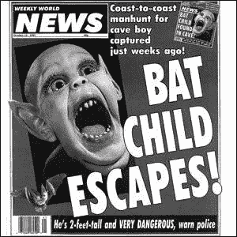

# 传奇交易者的八重路径

> 原文：<https://medium.com/hackernoon/the-eightfold-path-of-the-legendary-trader-11b304db97c2>

像许多交易者一样，我小时候读过 [**市场奇才**](http://amzn.to/2FkHZcn) 。如果你不知道，这是对 20 世纪 80 年代最传奇的交易者的采访。

[**Market Wizards**](http://amzn.to/2FkHZcn)

当我第一次读它的时候，我真的不知道我到底在做什么。我读了，以为我明白了，然后继续前进。

但是我没有得到它。

原因很简单。我没有人生阅历和智慧去理解它。那将需要很多很多年。

几个月前，我拿起我的旧的、卷了角的、高亮的那本书，开始翻阅。我本以为会抓住几个引语，然后继续前进，但很快我发现自己被吸引住了，从头到尾又读了一遍。

**两件事立刻打动了我。**

*   首先，我会突出显示所有错误的内容。
*   第二，我立刻看出这些人是多么相像。

无论他们来自哪里，如何开始，他们都记得职业生涯早期的一次毁灭性的失败。他们一开始都不知道自己在做什么。他们所有人都超越了错误的信念，发展出一种惊人的能力，能够在瞬间适应并改变自己的想法。

他们的风格、政治和性情都大相径庭，但他们的余生都遵循着一条非常相似的道路。

那时我意识到我看到了更大的东西，一个元模式，一个模式的模式。

称之为伟大交易者的旅程。

那么这条路是什么，你怎样才能走下去呢？

让我们仔细看看。

# **第一:开始时毫无头绪**

无论一个人在某件事情上做得多好，他们开始时总是一无所知。也许交易是天生的天赋，但一开始这一点都不重要。每个人都从第一步开始。

没有人一开始就是超级巨星。

Maybe it’s my fault

这个摘自迈克尔·马库斯的巫师摘录是大多数交易者的典型。

> 问:你知道你在做什么吗？你读过关于商品或交易的书吗？
> 
> 没有，没什么。
> 
> 问:你知道合同的规模吗？
> 
> 不，我们没有。
> 
> 问:你知道每次滴答要花你多少钱吗？
> 
> 答:是的。
> 
> 问:显然，这是你唯一知道的事情。
> 
> 答:对。我们的下一笔交易，小麦，也没有成功。在那之后，我们回到了玉米市场，交易进行得更好了；我们花了三天才丢了钱。我们用损失的天数来衡量成功。"

你一遍又一遍地看到同样的故事。有人听说他们如何在市场上快速致富。他们的朋友告诉他们，或者他们读到一个关于华尔街之王或新加冕的加密富豪的故事，他们跳起来希望赚快钱，他们的眼睛充满了星星。

即使他们知道一些基本规则，比如设置好止损点，选择不会让他们血本无归的仓位大小，他们也几乎总是忽略这些规则。

保罗·都铎·琼斯是一个超级激进、精力充沛的交易者，他讲述了一个可怕的早期交易故事，当时他一时冲动买了“猛男”棉花，使他非常脆弱。其他场内交易者立刻知道了他的错误，他也知道了。棉花市场的巨鲸几乎立刻开始向他倾销，价格猛跌，他被套牢了。

他学到了“永远不要在市场上扮演男子汉”的惨痛教训，因为他在一次交易中就损失了 70%的资金。

每个人都认为自己比市场聪明。即使他们读到了精英中的精英这一由来已久的规则，他们也在想“这些不适用于我，我与众不同。”

这就把我们带到了第二步。

# 第二:犯和其他人一样的错误

你认为你不会犯其他人都会犯的错误吗？

你不是。但是不要担心，你在一个好公司里。

没有人可以幸免。

新交易者不可避免地不明白为什么规则会保护他们，即使他们知道规则。也许在他们一无所知的阶段之后，他们会读几本书，或者在 Twitter 上听一些聪明的交易者说话，或者参加一个课程。

问题是他们并不真正理解他们所读到的和听到的。他们还不能处理它，因为他们没有经验看到其中的智慧，即使他们在智力水平上部分理解它。知识是不能被动传承的。它必须通过个人经历来获得。

而当你不懂规则的时候，会发生什么？

你搞砸了。

这些规则是什么？

1)不要过度交易。

2)保持你的仓位较小。

3)设置止损。

4)不要仓促做决定。

5)不要情绪过高或过低。

这些只是每个交易者最终会明白的一些重要的智慧。

最终。

艰难的方式。

开始时，每个人都只是掩饰它们。

传奇外汇交易员布鲁士·高富拿讲述了一个关于快速决策的经典故事。科夫纳最初是通过对冲合约价差赚钱的。他会做多一份合约，做空另一份合约，以降低风险，但随着大豆价格在 20 世纪 70 年代飙升至新高，他的经纪人沉浸在兴奋之中，称他贪婪无度:

> “大豆要上月球了……你做空 11 月份的合约是个傻瓜。让我帮你解除 11 月份的空头头寸，当接下来几天市场涨停时，你会赚更多的钱。”

他同意了。涨停是市场上的断路器。如果价格过高或过低，合约就会被锁定，没有人可以交易。你被困住了。涨停意味着你在尽可能多的赚钱。跌停？你可能损失了最多的钱，更糟糕的是，你被套牢了，无法卖出。

科夫纳完美地描述了每一个早期市场学徒感受到的疯狂快感:

> “那是一个疯狂的时刻。十五分钟后，我的经纪人给我回电话，他听起来很紧张。
> 
> 我不知道该怎么告诉你，但是市场跌停了！我不知道我能不能把你弄出来。我休克了。我冲他大喊让他救我出去。"

完全靠运气，当市场上涨超过跌停板几分钟时，他设法退出了，但在此之前他吃了一大笔亏。

之后，科夫纳谈到了当每个交易者做了可怕的交易，被市场生吞活剥时，他们会感到恶心。

> “我赢了大约 4.5 万美元。一天结束时，我的账户上有了 22000 美元。”

这就把我们带到了交易者启蒙之旅的下一步。

# 第三:承受巨大的损失

每个交易者最终都会经历灾难性的，令人心碎的损失。许多优秀的交易者不止一次彻底破产。最初的大投机者杰西·利弗莫尔损失了很多财富。

科夫纳告诉我们在市场上损失大笔资金的痛苦。

> “我陷入了情感休克。我无法相信我有多愚蠢——尽管我已经研究市场很多年了，但我对市场的理解却是如此之差。我的胃不舒服，好几天没吃东西了。我以为我已经毁了自己的交易员生涯。”

迈克尔·马库斯讲述了一个类似的灾难性糖贸易的故事。

> 问:当你平仓时，你在交易中损失了多少？
> 
> 答:我失去了自己的 3 万美元，加上我母亲借给我的 2 万美元中的 1.2 万美元。这是我在孤注一掷中得到的教训。"

每个交易者都有这样的故事。对我来说是尼奥。我在牛市后期进入，下了大注。我只知道它会飞向月球，几天后我飞得很高，我的钱几乎翻了一倍。

然后[帝国反击](https://hackernoon.com/the-empire-strikes-back-with-a-coordinated-war-on-crypto-bdd84fd2f854)。

中国开始威胁大型交易所。似乎每个周末都有一个全新的故事攻击 crypto，一个大银行家说它毫无价值或疯狂，中国打击，或另一个国家寻求禁止交易。

没过多久，市场就恐慌了。

当时没有比中国硬币更糟糕的硬币了。那正是尼奥，彻头彻尾的红色中国人。

我看着我的胜利在两天内蒸发，我只是呆住了。我慌了。我喜欢这枚硬币和这个项目，我认为它会转过来，所以我只是坚持，因为它一直在下降。

最后，我损失了投入的 68%。

我恶心死了。我几天都睡不着，吃不下。健身没有帮助。做按摩没用。酒精没有帮助。重击它没有帮助。无济于事。

只有一件事能解决它。下一步。

# **第四步:反思并变得更强**

一旦你最终经历了灵魂粉碎的损失，不久你就会意识到这绝对是你交易生涯中最好的经历。

如果你聪明且专注，你会开始审视自己做错的每一件事。你仔细检查一遍。你质疑你所有的信仰和想法。你不再愿意只看事物的表面价值。你想知道什么有用，什么没用，所以你终于认真起来。

保罗·都铎·琼斯记得反思他的巨大损失，变得如此沮丧，他想退出。但是他突然想到:

> “就在那时，我说，‘笨蛋先生，为什么要在一次交易中孤注一掷呢？为什么不让你的生活追求快乐而不是痛苦呢？
> 
> 那是我第一次决定我必须学习纪律和资金管理。对我来说，这是一次宣泄的经历，我走到了边缘，质疑自己作为交易者的能力，并决定不退出。我决心回来战斗。"

**真正的损失等于真正的智慧。**

没有这种损失，任何课程对你来说都没有意义。你会认为自己与众不同，规则对你不适用。

但是他们有。它们适用于每个人。没有例外。

# **第五步:艰难地学习古老的课程**

是什么样的人类思维让我们以艰难的方式学习所有的课程？我们阅读了历代的伟大智慧，却很快忽略了它。

Be like water, my friend.

也许这就是生活的意义？我们都必须经历同样的挣扎，犯我们自己的错误，一次又一次地经历这个伟大的故事。

在我失去尼奥之后，我反思我做错的每一件事，它就像一颗钻石子弹击中了我的双眼。我意识到当我受到攻击时，我不知道如何做决定。我就像车灯前的小鹿一样僵住了。我知道市场已经转向，尼奥正在下跌，我应该退出，但我不能扣动扳机。

从内心来说，我无法接受这种损失。我拒绝承认。我是一个很好的交易者，很谨慎，或者至少我认为我是，但是现在我面对一个新的现实。

我没有自己想象的那么好。而我无法接受眼前的现实。我不能把它抛在脑后继续前进。

早在它花掉我一大笔钱之前，我就应该卖掉那堆尼奥垃圾。相反，我把那个失败者一路赶到地狱，而不是减少我的损失。

> 正如都铎·琼斯所说，“失败者就是失败者。”

人们喜欢抓住失败者不放。他们喜欢疼痛。哦，他们不承认，但他们承认。痛苦是戏剧。人们喜欢戏剧。

要么是这样，要么是他们认为市场只是一时失去了理智。这个项目是个好项目。事情会有转机的。

除了更多的时候，他们不会回头，或者他们回头太晚，因为你坚持了太久，你无法弥补损失。

而且黄金好不好公司好不好项目好不重要。有时候，这对市场来说毫无意义，它就这样崩溃了。装上炸弹，牛仔把它骑到底总是一场灾难。

尼奥教会了我最重要的一课。

更重要的是我现在*明白了*的教训:

**“减少你的损失，让你的赢家跑。”**

# **步骤六:资金管理**

古代的智慧真的可以归结为两个字:**理财**。

减少损失是每个人都必须学习的重要原则之一。仅仅交易市场是不够的，你必须知道很多时候你会犯错。这意味着你必须不惜一切代价保护你的钱。

那只是基本概率。

> 保罗·都铎·琼斯说:“我总是想着赔钱，而不是赚钱……我精神崩溃了。如果达到这个数字，无论如何我都会退出。”

资金管理可以归结为几个关键原则:

1)保持你的头寸规模较小，以最小化风险

2)无情地削减你的损失。

3)始终使用止损。

4)不要使用过多的杠杆

5)当你开始亏损时，开始较小的交易。

6)当你走霉运时，抛开一切，休息一下。

7)如果你交易失败，立即退出，因为你以后还可以回来。

所有这些原则协同工作来保护你的钱。

[Don’t throw good money after bad](http://amzn.to/2oOhRwg)

就在几天前，当我在一波强劲的连胜之后，在杠杆头寸上有点过重时，我又一次艰难地认识到了这一点。

回想起来，这个错误显而易见。

起初让我迷惑的是，我在设置止损点时变得很熟练。我的一个技巧是设置一个远高于或低于触发点的限价止损价格，这样它总是被填满。我从来没有止损没有兑现，我从来没有被清算。我不会被平仓，因为我使用的杠杆刚好够产生影响，但不足以让市场只需移动几个百分点就能杀死我。

我做了交易，设置了止损点，然后上床睡觉。

当我早上醒来登记的时候，我发现我下降了 29%。我的站从未触发。我没有被清算，因为我没有过度杠杆化，但这无关紧要。

我的胃不舒服。

**那么我做了什么？**

**二号，狠狠地砍输了。**

几分钟后，我为自己感到难过，并认为我应该坚持下去，因为它可能会回来，我闭上了那个愚蠢的声音，并出售。我立即减少了损失。我接受了，继续前进。

那是我再次明白所有的原则都是协同工作的时候。

如果头寸规模更小，总损失也会更小。但是因为我没有使用太多的杠杆，所以我没有被清算，所以我仍然受到很好的保护。

低杠杆、小仓位和止损都是一体的。有时，这些风险管理工具中的一个让你失败了，其他的会帮助你。就像安全带和安全气囊一样。

有时安全带是不够的，但是安全气囊可以保护你。

# **第七步:停止跟随他人**

说我不跟踪其他交易者或新闻可能有点奇怪，但我再也不跟踪他们中的任何一个了。我可能偶尔会看一眼我真正尊敬的交易者的图表，看看它是否符合我的市场感觉，但这种情况非常罕见。我可能还会找一个我很了解的交易者，他长期以来都很成功。

然后我就做我想做的事。

You can go your own way.

**最终你还是要追随自己的光芒。**

你必须变得如此优秀，以至于你相信自己的分析高于一切。当你犯了一个错误，你需要知道你有足够的能力找出错误所在，并在下次改正它。

如果你想成为一名优秀的交易者，你会的。就这么简单。

埃德·塞科塔是《巫师》杂志中描述的最好的交易者之一。他说最好的是:

> **“令人高兴的是，当大自然给了我们真正燃烧的欲望时，她也给了我们满足这些欲望的方法。”**

如果你有强烈的交易和获胜的欲望，你会找到方法，一旦你涉足其中，你就不需要跟随任何人。

我有自己的交易者学校，但我给他们的主要教训很简单。向我学习，然后继续前进。成为自己的主人。不要一辈子坐在大师的脚下。

至于消息？只有毒药。尽快关掉它。

我强烈建议每个人禁食一个月。禁用手机订阅源中任何与新闻相关的内容。取消关注脸书的所有人。不要看推特流。在你工作的时候使用网站拦截器，并且经常使用。

我向你保证，你不会错过任何东西。如果有非常非常大的事情发生，你会听说，因为人们会谈论它。如果它没有大到让每个人都挂在嘴边，那它就不值得听。

我保证还有一件事。你会在心理上、情感上和精神上健康一个数量级。你的焦虑会减少，你的困惑和恐惧也会减少。

你很可能会无限期地快速传播新闻。我知道我做到了。

我不在乎谷歌新闻，也不在乎互联网上某个随机的人根据占星术和希望认为明天会去月球的硬币。我最后一次关注新闻可能是在中国危机期间。如果让我从头再来一遍，这次我一个字也不会读。我确实偶尔会阅读一本我喜欢的杂志，它有着强烈、一致的新闻报道，但即使是这样，我也越来越少看了，可能是一个月一次或几个月一次，主要是因为有一个故事我想深入阅读。

当你对新闻放弃的时候，你会有很好的伙伴。

> Ed Seykota 说“最终我对趋势交易变得更有信心，也更能忽略消息。我对这种方法变得更加适应了。”

我没有见过一个好的交易者是新闻迷，即使一般的交易者是绝望的新闻迷。他们想要市场上涨或下跌的理由。他们无法面对这是随机的混乱和十亿情感怪物的推/拉。

因此，作家们想出了一个很好的理由来解释为什么市场会有所变动。利率变了。贸易战迫在眉睫。大豆严重短缺。其中一些可能是因素，但在 99%的情况下，真的不可能有效地利用这些新闻。另外 1%的时间是这样，但那又怎样？为了得到那个真的值得看 99%的白噪音吗？

更糟糕的是，新闻是关于冲突和悲剧的。是关于痛苦和苦难的。是关于*额外*普通事件。

但是你看得越多，你就越觉得那些不寻常的事件是正常的事件。

瘟疫每天都在发生。每隔几秒钟就有人在街角被枪杀。你们镇上每十分钟就有一个婴儿被屠杀。

如果你出生在精神病院，每个人都在尖叫，你会认为这很正常。

这不正常。

你听到的是统计异常值，它只会扭曲和扰乱你的思维。

这消息是毒药。

咬你的手臂，吸出毒液，然后永远吐出来。

# **第八步:发展自己的风格**

如果你做到了这一步，你已经到了精通交易之旅的最后一步。

那是什么？

开发自己的系统。

我以前学过功夫。我注意到大多数人都痴迷于血统。谁是在五百年间一脉相承地教导他们的大师的大师？系统变了吗？是否完美直接的传承下来了？

我很快意识到这种想法完全是疯狂的。系统当然改变了。每一位大师都从自己的生活经历中学到了新的经验，并将其添加到系统中。如果他没有，他就不是主人。事实上，如果他只是复印老师教给他的东西并传给你，他可能会糟糕透了。

我也发现自己在想传奇武术家中的第一人。如果你追溯得足够远，最终你会找到启动这个系统的人。这带来了一个不可避免的问题:

谁教他们的？

答案显而易见。

没人。

他们自学。

这就是精英中的精英在所有领域所做的事情。他们不明白。他们创造。

以前的功夫大师们并不只是从别人那里学习，然后把它重新灌输给别人。他们把学到的东西拿来修改和改进。他们研究自然和他们自己。他们观察蛇和鸟的运动，试图揭示这些动物力量的秘密。他们想像蛇一样快速移动，像老虎一样出击。他们通过观察周围的世界获得了他们需要的一切。

你必须成为主人。当你到达那里时，你会发现没有人发腰带。你将是你旅途中的最终裁判。

这意味着最终你需要发展一种完全适合你自己的个性，你自己的长处和短处的交易风格。如果你只是盲目地跟随别人的选择，当情况变得很糟糕时，你就没有力量继续交易了。那种自信只来自内心。

要做到这一点，你必须深入内心，弄清楚你真正想从这个世界上得到什么。

> 正如埃德·塞科塔所说，“每个人都能从市场中得到他们想要的东西。”

有些人喜欢输。有些人喜欢扮演烈士。有些人喜欢受欢迎。其他人喜欢做反向投资者，和大众打赌。还有一些人喜欢在聚会上显得聪明。但是他们不喜欢赚钱。他们甚至可能认为这是肮脏或邪恶的，他们自我破坏。

无论你有什么弱点，市场都会很乐意满足你。如果你喜欢大赢一场，然后输光又赢回来的兴奋感，你也会有这种感觉。

> 埃德更进一步说:“我认为，如果人们足够深入地审视自己的交易模式，他们会发现，总的来说，包括他们的所有目标，他们真的得到了他们想要的东西，尽管他们可能不理解或不想承认。”

但是最好的交易者确实想赚钱。他们对市场有着深厚的热情，并有强烈的获胜欲望。要做到这一点，他们最终都会通过深刻的反思和超越自己的人性局限，达成共识，成为精英中的精英。

当他们这样做时，他们准备走自己的路，一条孤独的路，但也是一条快乐的路:

Yoda from [The Empire Strikes Back](http://amzn.to/2FTyEWW)

大师之路。

他们不再需要读更多的书，不再需要听任何人的话，不再需要追随任何人的明星。

他们成为自己的指路明灯。

他们的生死由他们自己决定。当他们赢了，他们不会太兴奋。当他们输了，他们不怪任何人，只怪自己。

他们不需要任何外界的认可、赞扬或评判。

那是因为在经历了那么多时间、努力和痛苦之后，他们终于*知道自己在做什么。不是自大。这是一个绝对准确的内在指南针，只有通过奉献、毅力、坚持和激情才能得到发展。*

这是日积月累得来的。很长时间。别的什么都给不了你。

它不能被购买，讨价还价，或欺骗。没有捷径，将来也不会有。

传奇交易者需要的所有赞美和确认都会出现在唯一重要的地方。

他们的银行账户和加密钱包。

###########################################

## 如果你喜欢我的作品，请[访问我的个人主页](https://www.patreon.com/danjeffries),因为那是我与所有粉丝分享特别见解的地方。顶级赞助人可以独家访问传奇的硬币表 Discord，在这里您可以找到:

*   **来自我和其他专业技术分析大师的市场呼声**。
*   进入**币**只能**私聊**。
*   **幕后**看看我和其他专业人士是如何解读市场的。
*   **你还可以独家参加每月一次的虚拟聚会**，在那里我会分享我正在做的一切，让你看看我的幕后工作过程。
*   我会在每一次谈话后都有一个问答环节。问我任何问题，我都会回答。

############################################

你也可以在 [**DecStack 停下来，这是加密货币和分散式应用项目**](http://decstack.com/) 的虚拟合作点，在这里你可以接触多个项目。永远完全免费。只是进来和社交，一起工作，分享代码和想法。通过反馈让你的想法更好。寻找新朋友。见见你的新家人。

############################################

关于我:我是一名作家、工程师和连续创业者。在过去的二十年中，我涉及了从 Linux 到虚拟化和容器的广泛技术。

## 读者们称我的突破性纳米块小说为[、蝎子游戏](http://amzn.to/2gNn04x)、“神经癌的第一次严肃竞争”和“黑色侦探遇上约翰尼记忆术”

##################

## 最后，你可以[加入我的私人脸书小组，Nanopunk Posthuman 刺客](https://www.facebook.com/groups/1736763229929363/)，在这里我们讨论所有的科技、科幻、幻想等等。

############################################

对于我的一些最独家的故事和这个星球上最好的实用硬币研究，请查看[**战略硬币**](http://strategiccoin.com/category/news/) **！**

############################################